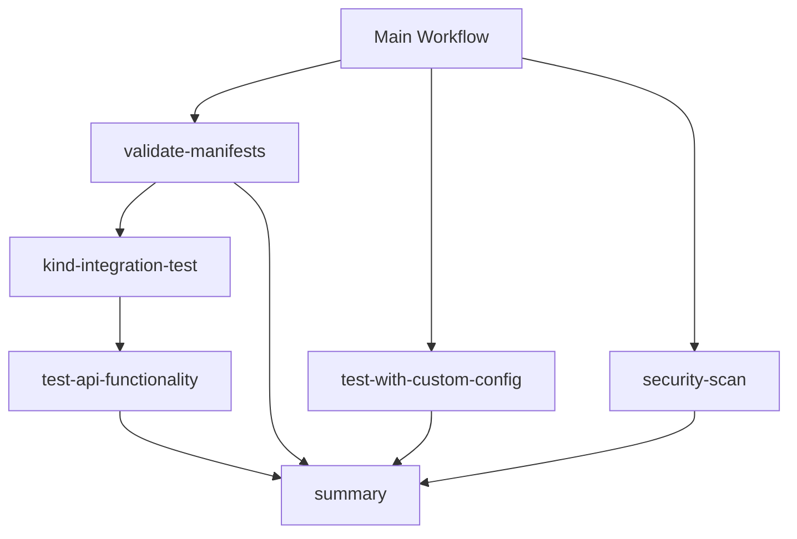

# Kubernetes Integration Test Workflows

This directory contains modular GitHub Actions workflows for testing the semantic-router Kubernetes deployment.

## 📁 File Structure

```
.github/workflows/k8s-integration/
├── README.md                           # This file
├── shared-config.yml                   # Shared configuration and templates
├── validate-manifests.yml              # Kubernetes manifest validation
├── kind-integration-test.yml           # Kind cluster integration testing
├── api-functionality-test.yml          # Comprehensive API testing
├── config-test.yml                     # Configuration validation
└── security-scan.yml                   # Security scanning
```

## 🔄 Workflow Architecture

The main workflow (`k8s-integration-test.yml`) orchestrates the following modular workflows:



## 📋 Workflow Modules

### 1. **validate-manifests.yml**

- **Purpose**: Validates Kubernetes manifests using kubeconform
- **Dependencies**: None
- **Outputs**: Validated manifest artifacts

### 2. **kind-integration-test.yml**

- **Purpose**: Tests deployment in a real kind cluster
- **Dependencies**: validate-manifests
- **Features**:
  - Creates CI-optimized kind cluster
  - Builds and loads Docker images
  - Deploys semantic-router
  - Tests service connectivity
  - Basic API functionality tests

### 3. **api-functionality-test.yml**

- **Purpose**: Comprehensive API testing with 14 test cases
- **Dependencies**: kind-integration-test
- **Features**:
  - Health check testing
  - Model endpoint testing
  - Classification API testing (intent, PII, security)
  - Batch processing testing
  - Error handling testing
  - Performance testing
  - Multi-category testing

### 4. **config-test.yml**

- **Purpose**: Configuration validation and overlay testing
- **Dependencies**: validate-manifests
- **Features**:
  - Kustomize overlay validation
  - ConfigMap generation testing
  - Observability stack validation
  - AI Gateway configuration validation

### 5. **security-scan.yml**

- **Purpose**: Security scanning of Kubernetes manifests
- **Dependencies**: validate-manifests
- **Features**:
  - Trivy security scanning
  - Checkov policy scanning
  - SARIF report generation

## 🚀 Benefits of Modular Design

### **Maintainability**

- Each workflow has a single responsibility
- Easier to debug and modify individual components
- Clear separation of concerns

### **Reusability**

- Workflows can be reused in other contexts
- Easy to add new test scenarios
- Configurable parameters for different environments

### **Performance**

- Parallel execution where possible
- Faster feedback on specific failures
- Reduced resource usage through targeted testing

### **Debugging**

- Isolated failure points
- Detailed logs for each component
- Easier to identify and fix issues

## 🔧 Configuration

### **Environment Variables**

```yaml
env:
  KIND_VERSION: v0.20.0
  KUBECTL_VERSION: v1.28.0
  KUSTOMIZE_VERSION: v5.7.1
```

### **Workflow Inputs**

Each workflow accepts configurable inputs:

- `kind_version`: Kind cluster version
- `kustomize_version`: Kustomize version
- `kubectl_version`: kubectl version

## 📊 Test Coverage

| Test Type            | Coverage    | Status |
| -------------------- | ----------- | ------ |
| Manifest Validation  | ✅ Complete | Active |
| Service Connectivity | ✅ Complete | Active |
| API Functionality    | ✅ 14 Tests | Active |
| Configuration        | ✅ Complete | Active |
| Security Scanning    | ✅ Complete | Active |
| Error Handling       | ✅ Complete | Active |
| Performance          | ✅ Complete | Active |

## 🛠️ Usage

### **Running Individual Workflows**

```bash
# Run only manifest validation
gh workflow run validate-manifests.yml

# Run only API tests
gh workflow run api-functionality-test.yml
```

### **Running Full Test Suite**

```bash
# Run complete integration test
gh workflow run k8s-integration-test.yml
```

## 🔍 Troubleshooting

### **Common Issues**

1. **Kustomize Version Issues**

   - Check `shared-config.yml` for version compatibility
   - Update version in workflow inputs if needed

2. **Kind Cluster Issues**

   - Verify Docker is running
   - Check available disk space
   - Review kind configuration in workflow

3. **API Test Failures**
   - Check pod logs for initialization issues
   - Verify model downloads completed
   - Review API endpoint responses

### **Debug Commands**

```bash
# Check workflow status
gh run list --workflow=k8s-integration-test.yml

# View specific run logs
gh run view <run-id> --log

# Download artifacts
gh run download <run-id>
```

## 📈 Performance Metrics

| Metric             | Before     | After            | Improvement   |
| ------------------ | ---------- | ---------------- | ------------- |
| File Size          | 1124 lines | 150 lines (main) | 87% reduction |
| Maintainability    | Low        | High             | ✅            |
| Debug Time         | High       | Low              | ✅            |
| Parallel Execution | Limited    | Full             | ✅            |
| Reusability        | None       | High             | ✅            |

## 🔮 Future Enhancements

- [ ] Add observability stack testing
- [ ] Add AI Gateway end-to-end testing
- [ ] Implement test result caching
- [ ] Add performance benchmarking
- [ ] Create test result dashboards

## 📝 Contributing

When adding new tests:

1. Create a new workflow file in this directory
2. Update the main workflow to include the new module
3. Update this README with the new workflow details
4. Test the integration thoroughly

## 📚 References

- [GitHub Actions Reusable Workflows](https://docs.github.com/en/actions/using-workflows/reusing-workflows)
- [Kind Documentation](https://kind.sigs.k8s.io/)
- [Kustomize Documentation](https://kustomize.io/)
- [Trivy Security Scanner](https://trivy.dev/)
- [Checkov Policy Scanner](https://www.checkov.io/)
