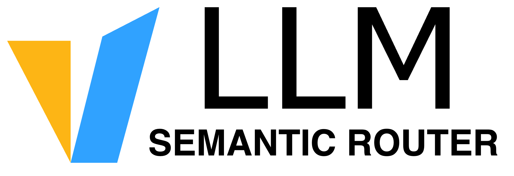

<div align="center">



<p><strong>Make Your Mixture-of-Models Programmable.</strong></p>

<p>
  <a href="https://vllm-sr.ai">Documentation</a> |
  <a href="https://app.vllm-sr.ai/playground">Playground</a> |
  <a href="https://vllm-sr.ai/blog/">Blog</a> |
  <a href="https://vllm-sr.ai/publications/">Publications</a> |
  <a href="https://huggingface.co/LLM-Semantic-Router">Hugging Face</a> |
  <a href="https://vllm-dev.slack.com/archives/C09CTGF8KCN">Slack</a>
</p>

<a href="https://trendshift.io/repositories/15581?utm_source=repository-badge&utm_medium=badge&utm_campaign=badge-repository-15581" target="_blank" rel="noopener noreferrer">
  
</a>
<a href="https://trendshift.io/repositories/15581?utm_source=trendshift-badge&utm_medium=badge&utm_campaign=badge-trendshift-15581" target="_blank" rel="noopener noreferrer">
  
</a>

[](https://github.com/vllm-project/semantic-router/actions/workflows/main.yml)


[](https://deepwiki.com/vllm-project/semantic-router)

</div>

---

## About

vLLM Semantic Router is a programmable routing layer for building Mixture-of-Models systems across heterogeneous LLM infrastructure. It evaluates request signals, user preferences, and application policies to select—or compose—the right model path for each request.

Use it to improve quality, cost, latency, privacy, and safety without hard-coding routing logic into applications.

| Dimension | Fragmented today | With vLLM SR |
| --- | --- | --- |
| **Models** | Models specialize in different work. | Compose personalized model paths. |
| **Compute** | GPUs, accelerators, edge, and cloud coexist. | Route across heterogeneous compute. |
| **Location** | Inference spans edge, private, and cloud. | Keep data within its boundaries. |
| **Preference** | "Best" changes by user and workload. | Make every preference executable. |

[Explore how it works →](https://vllm-sr.ai/docs/intro/)

## Supported Providers

The built-in catalog covers hosted APIs, gateways, and self-hosted runtimes. See the live list on the [Models page](https://vllm-sr.ai/models).

<table>
  <tr>
    <td align="center" width="12%"><br/><sub>OpenAI</sub></td>
    <td align="center" width="12%"><br/><sub>Azure OpenAI</sub></td>
    <td align="center" width="12%"><br/><sub>Anthropic</sub></td>
    <td align="center" width="12%"><br/><sub>Google Gemini</sub></td>
    <td align="center" width="12%"><br/><sub>Vertex AI</sub></td>
    <td align="center" width="12%"><br/><sub>Amazon Bedrock</sub></td>
    <td align="center" width="12%"><br/><sub>Microsoft Foundry</sub></td>
    <td align="center" width="12%"><br/><sub>Meta</sub></td>
  </tr>
  <tr>
    <td align="center"><br/><sub>Mistral AI</sub></td>
    <td align="center"><br/><sub>Cohere</sub></td>
    <td align="center"><br/><sub>DeepSeek</sub></td>
    <td align="center"><br/><sub>xAI</sub></td>
    <td align="center"><br/><sub>Moonshot AI</sub></td>
    <td align="center"><br/><sub>MiniMax</sub></td>
    <td align="center"><br/><sub>Z.ai</sub></td>
    <td align="center"><br/><sub>DashScope</sub></td>
  </tr>
  <tr>
    <td align="center"><br/><sub>Volcengine Ark</sub></td>
    <td align="center"><br/><sub>Xiaomi MiMo</sub></td>
    <td align="center"><br/><sub>Upstage</sub></td>
    <td align="center"><br/><sub>StepFun</sub></td>
    <td align="center"><br/><sub>Baidu Qianfan</sub></td>
    <td align="center"><br/><sub>Baidu AI Studio</sub></td>
    <td align="center"><br/><sub>Groq</sub></td>
    <td align="center"><br/><sub>Together AI</sub></td>
  </tr>
  <tr>
    <td align="center"><br/><sub>Fireworks AI</sub></td>
    <td align="center"><br/><sub>OpenRouter</sub></td>
    <td align="center"><br/><sub>Vercel AI Gateway</sub></td>
    <td align="center"><br/><sub>Hugging Face</sub></td>
    <td align="center"><br/><sub>DeepInfra</sub></td>
    <td align="center"><br/><sub>Novita AI</sub></td>
    <td align="center"><br/><sub>Nebius</sub></td>
    <td align="center"><br/><sub>Cerebras</sub></td>
  </tr>
  <tr>
    <td align="center"><br/><sub>SambaNova</sub></td>
    <td align="center"><br/><sub>Perplexity</sub></td>
    <td align="center"><br/><sub>FriendliAI</sub></td>
    <td align="center"><br/><sub>Featherless</sub></td>
    <td align="center"><br/><sub>CometAPI</sub></td>
    <td align="center"><br/><sub>Cloudflare Workers AI</sub></td>
    <td align="center"><br/><sub>NVIDIA NIM</sub></td>
    <td align="center"><br/><sub>Writer</sub></td>
  </tr>
  <tr>
    <td align="center"><br/><sub>Reka AI</sub></td>
    <td align="center"><br/><sub>Sarvam AI</sub></td>
    <td align="center"><br/><sub>Agnes AI</sub></td>
    <td align="center"><br/><sub>Aion Labs</sub></td>
    <td align="center"><br/><sub>Apodex AI</sub></td>
    <td align="center"><br/><sub>Celeris</sub></td>
    <td align="center"><br/><sub>CompactifAI</sub></td>
    <td align="center"><br/><sub>Inception</sub></td>
  </tr>
  <tr>
    <td align="center"><br/><sub>Sakana AI</sub></td>
    <td align="center"><br/><sub>vLLM</sub></td>
    <td align="center"><br/><sub>SGLang</sub></td>
    <td align="center"><br/><sub>AMD ATOM</sub></td>
    <td align="center"><br/><sub>Ollama</sub></td>
    <td align="center"><br/><sub>LM Studio</sub></td>
    <td align="center"><br/><sub>Xinference</sub></td>
    <td align="center"><br/><sub>NVIDIA Triton</sub></td>
  </tr>
  <tr>
    <td align="center"><br/><sub>NVIDIA Riva</sub></td>
    <td align="center"><br/><sub>Lemonade</sub></td>
    <td align="center"><br/><sub>Docker Model Runner</sub></td>
    <td align="center"><br/><sub>OpenAI Compatible</sub></td>
    <td align="center"><br/><sub>Anthropic Compatible</sub></td>
    <td></td>
    <td></td>
    <td></td>
  </tr>
</table>

## Getting Started

### Install

```bash
curl -fsSL https://vllm-sr.ai/install.sh | bash -s -- --channel stable
```

For pip, uv, or agent-driven installation, see the **[Installation Guide](https://vllm-sr.ai/docs/installation/)**.

### Online playground

Try the online playground at <https://app.vllm-sr.ai/playground>.

Credentials:

- Username: `love@vllm-sr.ai`
- Password: `vllm-sr-read`

## Latest News

- [2026/07/21] New Blog: [Beyond a Single Model: Building Mixture-of-Models Systems with vLLM Semantic Router](https://vllm.ai/blog/2026-07-21-vllm-sr-new-chapter-mom)
- [2026/06/29] New Blog: [Micro-Agent: Beat Frontier Models with Collaboration inside Model API](https://vllm.ai/blog/2026-06-29-micro-agent-frontier-models)
- [2026/06/16] New Blog: [Beyond One Model: Fusion in vLLM Semantic Router](https://vllm.ai/blog/2026-06-16-vllm-sr-fusion-api)
- [2026/06/05] v0.3 Released: [vLLM Semantic Router v0.3 Themis: From Signals to Stateful Production Routing](https://vllm.ai/blog/2026-06-05-v0.3-vllm-sr-themis-release)

<details>
<summary>Earlier announcements</summary>

- [2026/03/24] Vision Paper Released: [The Workload-Router-Pool Architecture for LLM Inference Optimization](https://vllm-sr.ai/vision-paper)
- [2026/03/10] v0.2 Released: [vLLM Semantic Router v0.2 Athena Release](https://vllm.ai/blog/v0.2-vllm-sr-athena-release)
- [2026/02/27] White Paper Released: [Signal Driven Decision Routing for Mixture-of-Modality Models](https://vllm-sr.ai/white-paper/)
- [2026/01/05] Iris v0.1 Released: [vLLM Semantic Router v0.1 Iris: The First Major Release](https://blog.vllm.ai/2026/01/05/vllm-sr-iris.html)
- [2025/12/16] Collaboration: [AMD × vLLM Semantic Router: Building the System Intelligence Together](https://blog.vllm.ai/2025/12/16/vllm-sr-amd.html)
- [2025/12/15] New Blog: [Token-Level Truth: Real-Time Hallucination Detection for Production LLMs](https://blog.vllm.ai/2025/12/14/halugate.html)
- [2025/11/19] New Blog: [Signal-Decision Driven Architecture: Reshaping Semantic Routing at Scale](https://blog.vllm.ai/2025/11/19/signal-decision.html)
- [2025/11/03] Paper Published: [Category-Aware Semantic Caching for Heterogeneous LLM Workloads](https://arxiv.org/abs/2510.26835)
- [2025/10/27] New Blog: [Scaling Semantic Routing with Extensible LoRA](https://blog.vllm.ai/2025/10/27/semantic-router-modular.html)
- [2025/10/12] Paper Accepted: [When to Reason: Semantic Router for vLLM](https://arxiv.org/abs/2510.08731)
- [2025/10/08] Collaboration: vLLM Semantic Router with [vLLM Production Stack](https://github.com/vllm-project/production-stack) Team.
- [2025/09/01] Released the project: [vLLM Semantic Router: Next Phase in LLM inference](https://blog.vllm.ai/2025/09/11/semantic-router.html).

</details>

More announcements are available on the **[Blog](https://vllm-sr.ai/blog/)** and **[Publications](https://vllm-sr.ai/publications/)** pages.

## Community

For questions, feedback, or to contribute, please join the [`#semantic-router`](https://vllm-dev.slack.com/archives/C09CTGF8KCN) channel in vLLM Slack.
Track contributors, workgroups, and weekly activity at [community.vllm-sr.ai](https://community.vllm-sr.ai).

### Community Meetings

We host two monthly community meetings across APAC and the Americas:

- **APAC-friendly meeting — second Wednesday of the month**: 9:00-10:00 AM Singapore time (UTC+8; the same local time in Beijing)
  - [Google Meet](https://meet.google.com/sed-jmht-ddm)
  - [Google Calendar Invite](https://calendar.app.google/w3r6mfKf4X4xCMAm9)
- **Americas-friendly meeting — fourth Wednesday of the month**: 8:00-9:00 PM Eastern Time (`America/New_York`) / 5:00-6:00 PM Pacific Time
  - [Google Meet](https://meet.google.com/wvm-vbfy-xzj)
  - [Google Calendar Invite](https://calendar.app.google/xHPHx8xhD1wHQfhH6)

## Contributing

If you want to contribute, start with **[CONTRIBUTING.md](CONTRIBUTING.md)**.

For repository-native development workflow and validation commands, use **[AGENTS.md](AGENTS.md)** as the entrypoint and **[tools/agent/docs/README.md](tools/agent/docs/README.md)** as the canonical index.

## Citation

If you find Semantic Router helpful in your research or projects, please consider citing it:

```
@misc{semanticrouter2025,
  title={vLLM Semantic Router},
  author={vLLM Semantic Router Team},
  year={2025},
  howpublished={\url{https://github.com/vllm-project/semantic-router}},
}
```

## Sponsors

We are grateful to our sponsors who support us:

---

[**AMD**](https://www.amd.com) provides us with GPU resources and [ROCm™](https://www.amd.com/en/products/software/rocm.html) software for training and researching frontier router models, enhancing E2E testing, and building the online models playground.

<div align="center">
<a href="https://www.amd.com">
  
</a>
</div>

---
