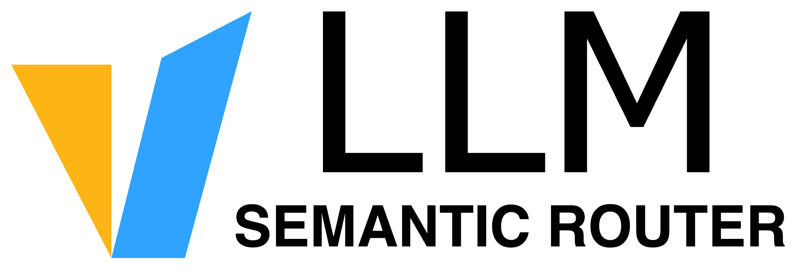
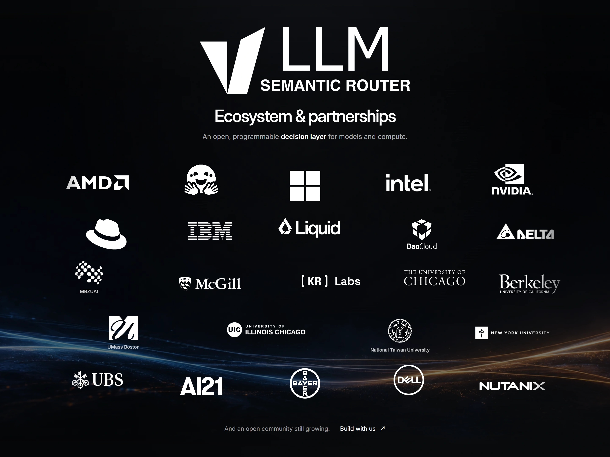

<div align="center">



<p>An open, programmable <strong>decision layer</strong> for models and compute.</p>

<p>
  <a href="https://vllm-sr.ai">Documentation</a> |
  <a href="https://app.vllm-sr.ai/playground">Playground</a> |
  <a href="https://vllm-sr.ai/blog/">Blog</a> |
  <a href="https://vllm-sr.ai/publications/">Publications</a> |
  <a href="https://huggingface.co/vllm-sr">Hugging Face</a> |
  <a href="https://vllm-dev.slack.com/archives/C09CTGF8KCN">Slack</a>
</p>

<a href="https://trendshift.io/repositories/15581?utm_source=trendshift-badge&utm_medium=badge&utm_campaign=badge-trendshift-15581" target="_blank" rel="noopener noreferrer">
  
</a>
<a href="https://huggingface.co/collections/vllm-sr/decision-20">
  
</a>

[](https://github.com/vllm-project/semantic-router/actions/workflows/main.yml)


[](https://deepwiki.com/vllm-project/semantic-router)

</div>

---

## About

**Intelligence beyond any one model.**

Give your agent harness one API for many models. vLLM Semantic Router selects or combines models for each call, guided by your policy.

Your harness keeps the agent loop, tools, and task state. The Router chooses among configured backends across local, private, and cloud compute.

| Dimension | Fragmented today | With vLLM SR |
| --- | --- | --- |
| **Models** | Different models excel at different tasks. | Select or combine models. |
| **Compute** | Hardware varies in speed and capacity. | Choose among configured backends. |
| **Location** | Edge, private, and cloud. | Keep calls within approved locations. |
| **Preference** | Priorities change by task. | Set quality, latency, and cost priorities. |

[Explore how it works →](https://vllm-sr.ai/docs/intro/)

## Getting Started

### Install

```bash
curl -fsSL https://vllm-sr.ai/install.sh | bash -s -- --channel stable
```

For pip, uv, or agent-driven installation, see the **[Installation Guide](https://vllm-sr.ai/docs/installation/)**.

### Connect your agent harness

Point your harness at the Router's inference endpoint. Use a public model ID such as `vllm-sr/auto`.

Follow **[Connect an agent harness](https://vllm-sr.ai/docs/installation/agent-harness/)** for setup and compatibility.

### Online playground

Try the online playground at <https://app.vllm-sr.ai/playground>.

Credentials:

- Username: `love@vllm-sr.ai`
- Password: `vllm-sr-read`

## Latest News

- [2026/10/06] [Decision 2.0](https://huggingface.co/collections/vllm-sr/decision-20) reached #1 on Hugging Face Trending Collections.
- [2026/10/06] [Vela 2.0: Towards Open Foundation Routing Models](https://vllm-sr.ai/blog/vela-2-0-open-foundation-routing-models/)
- [2026/09/24] [vLLM Semantic Router v0.4 Hermes: Many Models, One Improving System](https://vllm-sr.ai/blog/v0.4-vllm-sr-hermes-release/)
- [2026/09/22] [Introducing Decision 1.0: Open Decision Foundation Models](https://vllm-sr.ai/blog/decision-models/)
- [2026/09/18] [Introducing Vela 1.0](https://vllm-sr.ai/blog/vela-models/)
- [2026/08/24] [Find Your Focus: How to Join and Work Together](https://vllm-sr.ai/blog/join-vllm-sr-workgroups/)
- [2026/08/05] [LettuceDetect v2 in Semantic Router: Generative Hallucination Detection as a vLLM Endpoint](https://vllm-sr.ai/blog/lettucedetect-v2-generative-hallucination-detection/)

<details>
<summary>Earlier announcements</summary>

- [2026/07/21] [Beyond a Single Model: Building Mixture-of-Models Systems with vLLM Semantic Router](https://vllm-sr.ai/blog/vllm-sr-new-chapter-mom/)
- [2026/07/09] [Adding Cursor-Style Auto Model Selection to OpenCode with vLLM Semantic Router](https://vllm-sr.ai/blog/opencode-auto-mode/)
- [2026/06/29] [Micro-Agent: Beat Frontier Models with Collaboration inside Model API](https://vllm-sr.ai/blog/micro-agent-frontier-models/)
- [2026/06/16] [Beyond One Model: Fusion in vLLM Semantic Router](https://vllm-sr.ai/blog/vllm-sr-fusion-api/)
- [2026/06/05] [vLLM Semantic Router v0.3 Themis: From Signals to Stateful Production Routing](https://vllm-sr.ai/blog/v0.3-vllm-sr-themis-release/)
- [2026/03/24] Vision Paper Released: [The Workload-Router-Pool Architecture for LLM Inference Optimization](https://vllm-sr.ai/vision-paper)
- [2026/03/10] v0.2 Released: [vLLM Semantic Router v0.2 Athena Release](https://vllm.ai/blog/v0.2-vllm-sr-athena-release)
- [2026/02/27] White Paper Released: [Signal Driven Decision Routing for Mixture-of-Modality Models](https://vllm-sr.ai/white-paper/)
- [2026/01/05] Iris v0.1 Released: [vLLM Semantic Router v0.1 Iris: The First Major Release](https://blog.vllm.ai/2026/01/05/vllm-sr-iris.html)
- [2025/12/16] Collaboration: [AMD × vLLM Semantic Router: Building the System Intelligence Together](https://blog.vllm.ai/2025/12/16/vllm-sr-amd.html)
- [2025/12/15] New Blog: [Token-Level Truth: Real-Time Hallucination Detection for Production LLMs](https://blog.vllm.ai/2025/12/14/halugate.html)
- [2025/11/19] New Blog: [Signal-Decision Driven Architecture: Reshaping Semantic Routing at Scale](https://blog.vllm.ai/2025/11/19/signal-decision.html)
- [2025/11/03] Paper Published: [Category-Aware Semantic Caching for Heterogeneous LLM Workloads](https://arxiv.org/abs/2510.26835)
- [2025/10/27] New Blog: [Scaling Semantic Routing with Extensible LoRA](https://blog.vllm.ai/2025/10/27/semantic-router-modular.html)
- [2025/10/12] Paper Accepted: [When to Reason: Semantic Router for vLLM](https://arxiv.org/abs/2510.08731)
- [2025/10/08] Collaboration: vLLM Semantic Router with [vLLM Production Stack](https://github.com/vllm-project/production-stack) Team.
- [2025/09/01] Released the project: [vLLM Semantic Router: Next Phase in LLM inference](https://blog.vllm.ai/2025/09/11/semantic-router.html).

</details>

More announcements are available on the **[Blog](https://vllm-sr.ai/blog/)** and **[Publications](https://vllm-sr.ai/publications/)** pages.

## Community

For questions, feedback, or to contribute, please join the [`#semantic-router`](https://vllm-dev.slack.com/archives/C09CTGF8KCN) channel in vLLM Slack.
Track contributors, workgroups, and weekly activity at [community.vllm-sr.ai](https://community.vllm-sr.ai).

### Community Meetings

We host two monthly community meetings across APAC and the Americas:

- **APAC-friendly meeting — second Wednesday of the month**: 9:00-10:00 AM Singapore time (UTC+8; the same local time in Beijing)
  - [Google Meet](https://meet.google.com/sed-jmht-ddm)
  - [Google Calendar Invite](https://calendar.app.google/w3r6mfKf4X4xCMAm9)
- **Americas-friendly meeting — fourth Wednesday of the month**: 8:00-9:00 PM Eastern Time (`America/New_York`) / 5:00-6:00 PM Pacific Time
  - [Google Meet](https://meet.google.com/wvm-vbfy-xzj)
  - [Google Calendar Invite](https://calendar.app.google/xHPHx8xhD1wHQfhH6)

## Contributing

If you want to contribute, start with **[CONTRIBUTING.md](CONTRIBUTING.md)**.

For repository-native development workflow and validation commands, use **[AGENTS.md](AGENTS.md)** as the entrypoint and **[tools/agent/docs/README.md](tools/agent/docs/README.md)** as the canonical index.

## Citation

If you find Semantic Router helpful in your research or projects, please consider citing it:

```
@misc{semanticrouter2025,
  title={vLLM Semantic Router},
  author={vLLM Semantic Router Team},
  year={2025},
  howpublished={\url{https://github.com/vllm-project/semantic-router}},
}
```

## Ecosystem & partnerships

An open ecosystem spanning research, infrastructure, and enterprise adoption.

<div align="center">
  <a href="https://vllm-sr.ai/#ecosystem">
    
  </a>
</div>
