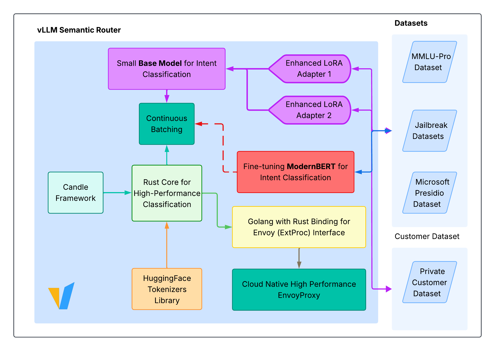

<div align="center">


[](https://vllm-semantic-router.com)
[](https://huggingface.co/LLM-Semantic-Router)
[](LICENSE)
[](https://crates.io/crates/candle-semantic-router)


**📚 [Complete Documentation](https://vllm-semantic-router.com) | 🚀 [Quick Start](https://vllm-semantic-router.com/docs/installation) | 📣 [Blog](https://vllm-semantic-router.com/blog/) | 📖 [Publications](https://vllm-semantic-router.com/publications/)**

</div>

---

*Latest News* 🔥

- [2025/10/21] We announced the [2025 Q4 Roadmap: Journey to Iris](https://vllm-semantic-router.com/blog/q4-roadmap-iris) 📅.
- [2025/10/16] We established the [vLLM Semantic Router Youtube Channel](https://www.youtube.com/@vLLMSemanticRouter) ✨.
- [2025/10/15] We announced the [vLLM Semantic Router Dashboard](https://www.youtube.com/watch?v=E2IirN8PsFw) 🚀.
- [2025/10/12] Our paper [When to Reason: Semantic Router for vLLM](https://arxiv.org/abs/2510.08731) accepted by NeurIPS 2025 MLForSys 🧠.
- [2025/10/08] We announced the integration with [vLLM Production Stack](https://github.com/vllm-project/production-stack) Team 👋.
- [2025/10/01] We supported to deploy on [Kubernetes](https://vllm-semantic-router.com/docs/installation/kubernetes/) 🌊.
- [2025/09/15] We reached 1000 stars on GitHub! 🔥
- [2025/09/01] We released the project officially: [vLLM Semantic Router: Next Phase in LLM inference](https://blog.vllm.ai/2025/09/11/semantic-router.html) 🚀.

<!-- <details>
<summary>Previous News 🔥</summary>

- 

</details> -->

---

## Innovations ✨



### Intelligent Routing 🧠

#### Auto-Reasoning and Auto-Selection of Models

An **Mixture-of-Models** (MoM) router that intelligently directs OpenAI API requests to the most suitable models from a defined pool based on **Semantic Understanding** of the request's intent (Complexity, Task, Tools).

This is achieved using BERT classification. Conceptually similar to Mixture-of-Experts (MoE) which lives *within* a model, this system selects the best *entire model* for the nature of the task.

As such, the overall inference accuracy is improved by using a pool of models that are better suited for different types of tasks:


The screenshot below shows the LLM Router dashboard in Grafana.


The router is implemented in two ways:

- Golang (with Rust FFI based on the [candle](https://github.com/huggingface/candle) rust ML framework)
- Python
Benchmarking will be conducted to determine the best implementation.

#### Auto-Selection of Tools

Select the tools to use based on the prompt, avoiding the use of tools that are not relevant to the prompt so as to reduce the number of prompt tokens and improve tool selection accuracy by the LLM.

#### Category-Specific System Prompts

Automatically inject specialized system prompts based on query classification, ensuring optimal model behavior for different domains (math, coding, business, etc.) without manual prompt engineering.

### Enterprise Security 🔒

#### PII detection

Detect PII in the prompt, avoiding sending PII to the LLM so as to protect the privacy of the user.

#### Prompt guard

Detect if the prompt is a jailbreak prompt, avoiding sending jailbreak prompts to the LLM so as to prevent the LLM from misbehaving. Can be configured globally or at the category level for fine-grained security control.

### Similarity Caching ⚡️

Cache the semantic representation of the prompt so as to reduce the number of prompt tokens and improve the overall inference latency.

### Distributed Tracing 🔍

Comprehensive observability with OpenTelemetry distributed tracing provides fine-grained visibility into the request processing pipeline.

### vLLM Semantic Router Dashboard 💬

Watch the quick demo of the dashboard below:

<div align="center">
<a href="https://www.youtube.com/watch?v=E2IirN8PsFw">
  
</a>
</div>

## Quick Start 🚀

Get up and running in seconds with our interactive setup script:

```bash
bash ./scripts/quickstart.sh
```

This command will:

- 🔍 Check all prerequisites automatically
- 📦 Install HuggingFace CLI if needed
- 📥 Download all required AI models (~1.5GB)
- 🐳 Start all Docker services
- ⏳ Wait for services to become healthy
- 🌐 Show you all the endpoints and next steps

For detailed installation and configuration instructions, see the [Complete Documentation](https://vllm-semantic-router.com/docs/installation/).

## Documentation 📖

For comprehensive documentation including detailed setup instructions, architecture guides, and API references, visit:

**👉 [Complete Documentation at Read the Docs](https://vllm-semantic-router.com/)**

The documentation includes:

- **[Installation Guide](https://vllm-semantic-router.com/docs/installation/)** - Complete setup instructions
- **[System Architecture](https://vllm-semantic-router.com/docs/overview/architecture/system-architecture/)** - Technical deep dive
- **[Model Training](https://vllm-semantic-router.com/docs/training/training-overview/)** - How classification models work
- **[API Reference](https://vllm-semantic-router.com/docs/api/router/)** - Complete API documentation
- **[Dashboard](https://vllm-semantic-router.com/docs/overview/dashboard)** - vLLM Semantic Router Dashboard
- **[Distributed Tracing](https://vllm-semantic-router.com/docs/tutorials/observability/distributed-tracing/)** - Observability and debugging guide

## Community 👋

For questions, feedback, or to contribute, please join `#semantic-router` channel in vLLM Slack.

### Community Meetings 📅

We host bi-weekly community meetings to sync up with contributors across different time zones:

- **First Tuesday of the month**: 9:00-10:00 AM EST (accommodates US EST and Asia Pacific contributors)
  - **Zoom Link**: [https://nyu.zoom.us/j/95065349917](https://nyu.zoom.us/j/95065349917)
  - **Calendar Invite**: [https://calendar.app.google/EeP6xDgCpxte6d1eA](https://calendar.app.google/EeP6xDgCpxte6d1eA)
- **Third Tuesday of the month**: 1:00-2:00 PM EST (accommodates US EST and California contributors)
  - **Zoom Link**: [https://nyu.zoom.us/j/98861585086](https://nyu.zoom.us/j/98861585086)
  - **Calendar Invite**: [https://calendar.app.google/oYsmt1Pu46o4gFuP8](https://calendar.app.google/oYsmt1Pu46o4gFuP8)

Join us to discuss the latest developments, share ideas, and collaborate on the project!

## Citation

If you find Semantic Router helpful in your research or projects, please consider citing it:

```
@misc{semanticrouter2025,
  title={vLLM Semantic Router},
  author={vLLM Semantic Router Team},
  year={2025},
  howpublished={\url{https://github.com/vllm-project/semantic-router}},
}
```

## Star History 🔥

We opened the project at Aug 31, 2025. We love open source  and collaboration ❤️

[](https://www.star-history.com/#vllm-project/semantic-router&Date)
