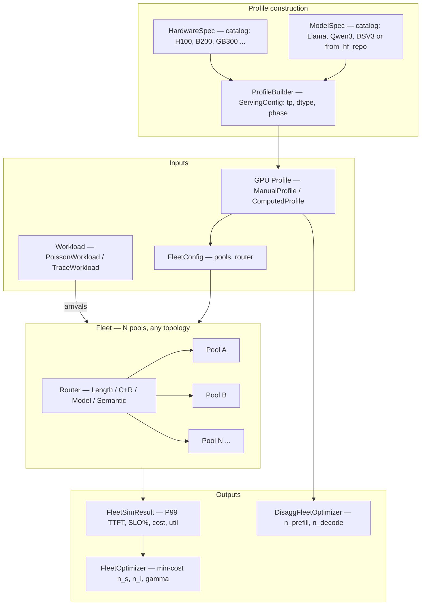
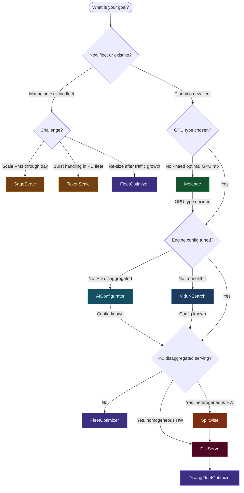

# inference-fleet-sim

A **fleet-level LLM inference simulator** for capacity planning, SLO validation,
and what-if analysis across heterogeneous GPU configurations and request-routing
algorithms.

## Overview

Most LLM serving tools focus on a single engine.  `inference-fleet-sim` zooms
out to the whole fleet: multiple GPU pools, heterogeneous hardware, routing
policies, and a cost optimizer that finds the minimum-GPU configuration that
meets your P99 TTFT SLO.

Core capabilities:

- **Fleet sizing** — Erlang-C / Kimura analytical sweep + discrete-event
  simulation (DES) verification finds the minimum-cost `(n_short, n_long, γ)`
  in seconds.
- **Disaggregated sizing** — separate prefill and decode worker pools with
  empirical throughput-degradation factors.
- **Physics-informed GPU profiles** — `ProfileBuilder` derives iteration
  latency and KV-cache budget from `HardwareSpec × ModelSpec` using a
  roofline model and silicon-measured MoE kernel tables; no hand-tuning needed.
- **N-pool DES** — event-driven simulation of any fleet topology: homogeneous,
  length-partitioned, multi-model, semantic-routed, or arbitrary JSON config.
- **Workload replay** — Poisson + empirical CDF generation, or replay of
  real production traces (Azure, LMSYS, agent-heavy).
- **HuggingFace model import** — load any model's architecture directly from
  its `config.json` on disk or from the HuggingFace Hub.

---

## Installation

```bash
git clone https://github.com/vllm-project/semantic-router
cd semantic-router/bench/fleet-simulator
pip install -e .
```

Requirements: Python ≥ 3.10, NumPy ≥ 1.24, SciPy ≥ 1.11.

---

## Quick Start

### Size a fleet in one command

```bash
python run_sim.py optimize \
    --cdf data/azure_cdf.json \
    --lam 200 --slo 500 --b-short 6144 \
    --verify-top 3 --n-sim-req 30000
```

Output:

```
Best config:  n_s=49  n_l=13  γ=1.30
P99 TTFT:     analytical 412ms  →  DES-verified 441ms  ✓ SLO 500ms
Cost:         $136.2/hr  ($1.19M/yr)
vs homogeneous 62×A100:  $137.1/hr  (0.7% saving)
```

### Profile a GPU + model from specs

```python
from fleet_sim import H100_SXM, LLAMA_3_1_70B
from fleet_sim.gpu_profiles import ProfileBuilder, ServingConfig

profile = ProfileBuilder().build(
    H100_SXM,
    LLAMA_3_1_70B,
    ServingConfig(tp=8, dtype_bytes=2, mean_ctx_tokens=2048),
)
print(profile.summary())
# H100-SXM | meta-llama/Meta-Llama-3.1-70B | TP8 FP16
#   W (base iter latency) : 6.72 ms
#   H (per-seq overhead)  : 0.031 ms/seq
#   KV-cache blocks       : 12,274
#   Cost                  : $32.16/hr (8 × $4.02)
```

### Import a model from HuggingFace

```python
from fleet_sim.models.spec import ModelSpec

# From a local config.json
spec = ModelSpec.from_hf_config("/path/to/config.json")

# From the HuggingFace Hub (downloads config.json via urllib, no extra deps)
spec = ModelSpec.from_hf_repo("Qwen/Qwen3-8B")
spec = ModelSpec.from_hf_repo("meta-llama/Meta-Llama-3.1-70B", token="hf_...")
```

---

## Use Cases

### 1. How many GPUs do I need?

```bash
python run_sim.py optimize \
    --cdf data/azure_cdf.json \
    --lam 300 --slo 500 --b-short 6144
```

Returns the minimum-cost `(n_short, n_long, γ)` fleet whose DES-verified P99
TTFT stays under `--slo` milliseconds at `--lam` req/s.

### 2. Will my current fleet survive a 2× traffic spike?

```bash
python run_sim.py whatif \
    --cdf data/azure_cdf.json \
    --lam-range 100 200 300 500 1000 \
    --slo 500 --b-short 6144
```

Sweeps arrival rates and shows at which point the current fleet breaches SLO.

### 2b. Should we switch from A100 to H100 (or use cheaper A10G)?

```bash
python run_sim.py whatif \
    --cdf data/azure_cdf.json \
    --lam-range 50 100 200 500 \
    --slo 500 --b-short 4096 --long-max-ctx 8192 \
    --gpu-compare a100 h100 a10g
```

Prints a side-by-side table (GPU count, $/yr, P99 TTFT, SLO pass/fail) for
every GPU type at every arrival rate, followed by cost-ratio and GPU-count-ratio
rows vs the first (baseline) type.

### 3. Length-partitioned vs homogeneous — is splitting worth it?

Run `optimize` with `--b-short 65536` (effectively homogeneous) and compare
cost to a split configuration.  The length-partitioned fleet typically saves
15–30% by routing short requests to cheaper or smaller-VRAM GPUs.

### 4. Mixed GPU types: cheap short pool + premium long pool

```bash
# A10G for short requests (cheap), H100 for long-context requests (fast prefill)
python run_sim.py optimize \
    --cdf data/azure_cdf.json \
    --lam 100 --slo 500 --b-short 4096 \
    --gpu-short a10g --gpu-long h100 --long-max-ctx 8192
```

### 5. Multi-model fleet: 70B + 8B + CodeLlama

```bash
python run_sim.py simulate-fleet examples/multi_model_fleet.json \
    --lam 200 --slo 500 --n-req 20000
```

`multi_model_fleet.json` defines each pool's GPU type, count, and workload CDF.

### 6. Semantic routing: size each model pool independently

```bash
# 70% of 200 req/s on cheap GPUs (small model)
python run_sim.py optimize --cdf data/lmsys_cdf.json \
    --lam 140 --slo 500 --b-short 65536 --gpu-short a10g --gpu-long a10g

# 30% on full-size GPUs (large model)
python run_sim.py optimize --cdf data/azure_cdf.json \
    --lam 60 --slo 500 --b-short 65536 --gpu-short a100 --gpu-long a100
```

### 8. Grid demand-response — safe power curtailment depth

```bash
# How much power can I shed without an SLO breach?
python run_sim.py grid-flex \
    --cdf data/azure_cdf.json \
    --lam 300 --n-gpus 30 --gpu h100 --slo 200
```

Sweeps power-reduction percentages (0–50%) and reports, for each level,
the resulting per-GPU batch cap (`n_max`), power draw, and P99 TTFT.
The maximum safe flex depth — largest curtailment that still meets the SLO —
is highlighted at the bottom.  Based on the GPU-to-Grid (G2G) batch-size
control mechanism (Hassan et al., arXiv:2602.05116).

### 7. Disaggregated prefill/decode sizing

```bash
# Find optimal nP × nD ratio (H100 prefill + A100 decode)
python run_sim.py disagg \
    --cdf data/azure_cdf.json --lam 100 \
    --slo-ttft 500 --slo-tpot 100 \
    --gpu-prefill h100 --gpu-decode a100 --max-ctx 8192
```

Or via the Python API with `ComputedProfile` for precise roofline modeling:

```python
from fleet_sim.optimizer.disagg import DisaggFleetOptimizer
from fleet_sim.gpu_profiles import ProfileBuilder, ServingConfig
from fleet_sim import H100_SXM, A100_SXM, LLAMA_3_1_70B

builder = ProfileBuilder()
prefill = builder.build(H100_SXM, LLAMA_3_1_70B,
                        ServingConfig(tp=8, mean_ctx_tokens=1024))
decode  = builder.build(A100_SXM, LLAMA_3_1_70B,
                        ServingConfig(tp=8, mean_ctx_tokens=1024))

opt = DisaggFleetOptimizer(
    prefill_profile=prefill, decode_profile=decode,
    mean_isl=1024, mean_osl=256,
    slo_ttft_ms=500, slo_tpot_ms=100, max_ctx=8192,
)
best = opt.optimize(max_prefill=16, max_decode=32)
best.print_report()
```

### 8. Replay production router decisions

```python
from fleet_sim.workload.trace import TraceWorkload
from fleet_sim import Fleet, FleetConfig, PoolConfig, A100_80GB, A10G

wl = TraceWorkload(
    path="router_access_log.jsonl",
    fmt="semantic_router",
    model_id_field="selected_model",
)
arrivals = wl.generate()

result = Fleet(FleetConfig(
    pools=[PoolConfig("llama70b", A100_80GB, 13, 8192),
           PoolConfig("llama8b",  A10G,     129, 4096)],
    router_type="ModelRouter",
)).run(arrivals)

result.print_summary(t_slo_ms=500)
```

---

## Architecture

```
inference-fleet-sim/
├── fleet_sim/
│   ├── core/
│   │   ├── request.py          # Request dataclass (l_in, l_out, model_id, category, …)
│   │   ├── instance.py         # M/G/c GPU instance discrete-event simulation
│   │   ├── pool.py             # Homogeneous pool of GPU instances
│   │   └── fleet.py            # N-pool fleet coordinator + FleetConfig / PoolConfig
│   ├── hardware/
│   │   ├── spec.py             # HardwareSpec dataclass + embedded empirical constants
│   │   ├── catalog.py          # 8 GPUs: A100 · H100 · H200 · B200 · GB200 · GB300 · L40S · B60
│   │   └── __init__.py
│   ├── models/
│   │   ├── spec.py             # ModelSpec dataclass; from_hf_config() / from_hf_repo()
│   │   ├── catalog.py          # 10 models: Llama-3.1 · Qwen3 · DeepSeek-V3
│   │   └── __init__.py
│   ├── gpu_profiles/
│   │   ├── protocol.py         # GpuProfile — structural Protocol (typing)
│   │   ├── manual.py           # ManualProfile — hand-specified W, H constants
│   │   ├── builder.py          # ProfileBuilder + ServingConfig — physics-derived W/H
│   │   ├── computed.py         # ComputedProfile — output of ProfileBuilder
│   │   └── profiles.py         # Pre-built profiles: A100_80GB · H100_80GB · A10G · CUSTOM()
│   ├── optimizer/
│   │   ├── base.py             # FleetOptimizer — analytical sweep + DES verification
│   │   ├── disagg.py           # DisaggFleetOptimizer — prefill/decode split sizing
│   │   └── __init__.py
│   ├── routing/
│   │   ├── base.py             # BaseRouter abstract class
│   │   ├── length_based.py     # LengthRouter — route by context window threshold
│   │   ├── spillover.py        # SpilloverRouter — length-based + load-aware overflow
│   │   ├── compress_route.py   # CompressAndRouteRouter — gateway-layer C&R
│   │   ├── model_router.py     # ModelRouter — route by request.model_id
│   │   ├── semantic_router.py  # SemanticRouter — route via classify_fn(req)
│   │   ├── least_loaded.py     # LeastLoadedRouter
│   │   └── random_router.py    # RandomRouter — uniform baseline
│   └── workload/
│       ├── synthetic.py        # PoissonWorkload + CdfWorkload
│       └── trace.py            # TraceWorkload — Azure CSV / JSONL replay
├── optimizer/                  # (see fleet_sim/optimizer above)
├── tests/
│   ├── test_hardware.py        # HardwareSpec + catalog
│   ├── test_models.py          # ModelSpec + catalog
│   ├── test_profiles.py        # ProfileBuilder, ComputedProfile, Protocol
│   ├── test_disagg.py          # DisaggFleetOptimizer
│   ├── test_hf_import.py       # ModelSpec.from_hf_config / from_hf_repo
│   ├── test_imports_and_profiles.py  # Import paths, ManualProfile, FleetOptimizer
│   └── test_e2e.py             # Full optimizer + DES pipeline
├── run_sim.py                  # CLI entry point
├── server.py                   # Dashboard API server (FastAPI)
├── Makefile                    # test · lint · format · run · guide · package
├── data/                       # CDF workload traces
│   ├── azure_cdf.json
│   ├── lmsys_cdf.json
│   ├── lmsys_multiturn_cdf.json
│   └── agent_heavy_cdf.json
└── examples/
    ├── routing_comparison.py
    ├── optimizer_validation.py
    ├── what_if.py
    ├── semantic_routing.py
    ├── semantic_router_trace_replay.py
    └── multi_model_fleet.json
```

### Component interactions



---

## CLI Reference

| Command | What it does |
|---|---|
| `optimize` | Find min-cost fleet meeting a P99 TTFT SLO (analytical + optional DES verify) |
| `simulate` | Run DES on a fixed two-pool fleet config |
| `whatif` | Sweep arrival rates and/or GPU types; side-by-side cost comparison |
| `pareto` | Sweep all CDF breakpoints as `B_short` candidates; print Pareto frontier |
| `compare-routers` | Benchmark routing algorithms on the same fixed fleet |
| `disagg` | Find optimal prefill/decode worker ratio for a disaggregated P+D fleet |
| `simulate-fleet` | Simulate an arbitrary N-pool fleet from a JSON config |
| `grid-flex` | Power–latency trade-off curve for demand-response (GPU-to-Grid) |

```bash
# Optimize: find min-cost (n_s, n_l, γ) meeting SLO
python run_sim.py optimize \
    --cdf data/azure_cdf.json --lam 200 --slo 500 --b-short 6144 \
    --verify-top 3 --n-sim-req 30000

# Simulate a fixed fleet
python run_sim.py simulate \
    --cdf data/azure_cdf.json --lam 200 \
    --n-s 49 --n-l 13 --gamma 1.3 --b-short 6144 --n-req 30000

# Pareto frontier: choose B_short from the workload CDF
python run_sim.py pareto \
    --cdf data/lmsys_cdf.json --lam 20 --slo 500 --long-max-ctx 65536

# What-if: sweep arrival rates (single GPU type)
python run_sim.py whatif \
    --cdf data/azure_cdf.json --lam-range 50 100 200 500 1000 \
    --slo 500 --b-short 6144

# What-if: compare GPU types side-by-side
python run_sim.py whatif \
    --cdf data/azure_cdf.json --lam-range 50 100 200 500 \
    --slo 500 --b-short 4096 --long-max-ctx 8192 \
    --gpu-compare a100 h100 a10g

# Compare routers on the same fleet
python run_sim.py compare-routers \
    --cdf data/azure_cdf.json --lam 200 \
    --n-s 49 --n-l 13 --b-short 6144 --n-req 20000

# Disaggregated prefill/decode: find optimal nP × nD ratio
python run_sim.py disagg \
    --cdf data/azure_cdf.json --lam 100 \
    --slo-ttft 500 --slo-tpot 100 \
    --gpu-prefill h100 --gpu-decode a100 --max-ctx 8192

# N-pool fleet from JSON
python run_sim.py simulate-fleet examples/multi_model_fleet.json \
    --lam 200 --slo 500 --n-req 20000

# Grid flexibility: power–latency trade-off (demand response)
python run_sim.py grid-flex \
    --cdf data/azure_cdf.json --lam 300 --n-gpus 30 --gpu h100 --slo 200
```

Common flags:

| Flag | Default | Meaning |
|---|---|---|
| `--cdf` | — | Path to workload CDF JSON |
| `--lam` | — | Arrival rate (req/s) |
| `--slo` | 500 | P99 TTFT SLO (ms) |
| `--b-short` | 4096 | Short-pool context threshold (tokens) |
| `--long-max-ctx` | 65536 | Long-pool maximum context length (tokens) |
| `--gpu-short` | `a100` | GPU type for short pool (`a100`, `h100`, `a10g`) |
| `--gpu-long` | `a100` | GPU type for long pool |
| `--gpu-compare` | — | **`whatif` only** — space-separated GPU types to compare side-by-side |
| `--verify-top` | 3 | DES-verify top-N analytical candidates |
| `--n-sim-req` | 30000 | Requests per DES run |
| `--n-gpus` | — | **`grid-flex` only** — fixed fleet size to evaluate |
| `--flex-pcts` | 0 5 10…50 | **`grid-flex` only** — power-reduction percentages to sweep |

### Makefile shortcuts

```bash
make test            # run all 190 tests
make test-unit       # unit tests only
make lint            # ruff + black --check
make format          # auto-format
make run             # quick optimize smoke run
make guide           # compile GUIDE.pdf
make list-gpus       # print hardware catalog
make list-models     # print model catalog
make profile-info GPU=h100 MODEL=llama-3.1-70b TP=8
make hf-spec HF_MODEL=meta-llama/Meta-Llama-3.1-8B
```

---

## Simulation Parameters

Understanding the parameters is the fastest way to get accurate results.

### Workload parameters

| Parameter | CLI flag | Meaning |
|---|---|---|
| Arrival rate | `--lam` | Mean requests/second (Poisson process) |
| SLO budget | `--slo` | P99 time-to-first-token target in milliseconds |
| Workload CDF | `--cdf` | Path to a JSON file describing the prompt+completion length distribution |
| Pool boundary | `--b-short` | Requests with context ≤ this many tokens go to the *short* pool; the rest go to the *long* pool |
| Long-pool max context | `--long-max-ctx` | Maximum context length the long pool is configured for (affects KV-cache slot count) |

**Choosing `--b-short`**: plot the CDF of your prompt lengths and pick the knee
(typically 4 096–16 384 tokens for chat workloads, higher for document workloads).
Setting `--b-short` very high (e.g. `65536`) collapses both pools into one,
giving a homogeneous-fleet baseline for cost comparison.

### Fleet sizing parameters

| Parameter | CLI flag | Meaning |
|---|---|---|
| Short-pool GPU count | `--n-s` | Number of GPUs in the short-context pool |
| Long-pool GPU count | `--n-l` | Number of GPUs in the long-context pool |
| Compression ratio γ | `--gamma` | C+R router compression factor (1.0 = no compression, >1 = shorten prompts) |
| GPU type (short) | `--gpu-short` | Hardware for the short pool: `a100`, `h100`, `a10g` |
| GPU type (long) | `--gpu-long` | Hardware for the long pool: `a100`, `h100`, `a10g` |

### DES (simulation) parameters

The discrete-event simulation validates the analytical Erlang-C solution before
committing to a fleet recommendation.

| Parameter | CLI flag | Default | Meaning |
|---|---|---|---|
| Requests per run | `--n-sim-req` | 30 000 | Number of simulated requests per DES trial. Higher = more accurate P99 estimate, slower run. |
| Top candidates | `--verify-top` | 3 | How many of the cheapest analytical solutions are DES-verified. Increase if the cheapest candidate often fails SLO. |
| Random seed | `--seed` | 42 | Reproducible DES trials |

**Rule of thumb for `--n-sim-req`**: to get a stable P99 estimate you need at
least ~1 000 requests in the tail, so `n_sim_req ≥ 10 / (1 − p99_target/100)`.
30 000 is appropriate for a P99 (1st percentile in the tail) target.

### GPU profile parameters (`ServingConfig`)

These parameters drive the physics-based `ProfileBuilder` and determine the
service rate `W` and per-sequence overhead `H` of each GPU pool.

| Parameter | Field | Meaning |
|---|---|---|
| Tensor-parallel degree | `tp` | Number of GPUs used jointly for one model replica (typically 4 or 8) |
| Data type | `dtype_bytes` | `2` = FP16/BF16, `1` = FP8/INT8 — halving `dtype_bytes` roughly doubles memory bandwidth |
| Mean context length | `mean_ctx_tokens` | Representative prompt+completion length used to compute KV-cache pressure (tokens) |
| Serving phase | `phase` | `"prefill"` or `"decode"` for disaggregated pools; `None` for monolithic |

```python
from fleet_sim.gpu_profiles import ProfileBuilder, ServingConfig
from fleet_sim import H100_SXM, LLAMA_3_1_70B

profile = ProfileBuilder().build(
    H100_SXM,
    LLAMA_3_1_70B,
    ServingConfig(
        tp=8,
        dtype_bytes=2,       # FP16
        mean_ctx_tokens=4096,
    ),
)
print(profile.summary())
# H100-SXM | meta-llama/Meta-Llama-3.1-70B | TP8 FP16
# W=0.00403 s  H=0.000318 s/seq  kv_blks=1024  $4.02/hr
```

### Internal model constants

These constants are embedded in the simulator with sensible defaults. Override
the disaggregated-serving constants when you have measured values for your
specific hardware and network fabric.

**ProfileBuilder physics constants** (in `builder.py`):

| Constant | Default | Meaning |
|---|---|---|
| `alpha_bw` | 0.80 | Effective fraction of peak memory bandwidth (sustained vs spec) |
| `layer_overhead_s` | 3 µs | Per-transformer-layer kernel launch + sync overhead |
| `calibration_ctx` | 8 192 | Token context length at which `H` is defined; H scales linearly with mean_seq_len/calibration_ctx |

**Optimizer constants** (in `optimizer/base.py`):

| Constant | Default | Meaning |
|---|---|---|
| `RHO_MAX` | 0.85 | Maximum utilisation for Erlang-C stability; above this, queue wait diverges |

**DisaggFleetOptimizer empirical constants** — override with measured values:

| Parameter | Default | Meaning | Override via |
|---|---|---|---|
| `alpha_pre` | 0.90 | Prefill throughput fraction vs monolithic serving | `DisaggFleetOptimizer(alpha_pre=...)` |
| `alpha_dec` | 0.92 | Decode throughput fraction vs monolithic serving | `DisaggFleetOptimizer(alpha_dec=...)` |
| `beta_ttft` | 1.80 | KV-transfer TTFT multiplier (network + serialisation overhead) | `DisaggFleetOptimizer(beta_ttft=...)` |

The disaggregated constants reflect typical KV-transfer overhead over NVLink or
InfiniBand; they vary with network bandwidth, KV compression, and cluster
topology. Measure them with a representative trace before using
`DisaggFleetOptimizer` for production sizing.

---

## GPU Profiles

Three ways to define a GPU profile — all satisfy the `GpuProfile` Protocol
and can be used interchangeably in `PoolConfig`, `FleetOptimizer`, and
`DisaggFleetOptimizer`.

### 1. Pre-built profiles

Quick to use, calibrated for Llama-3-70B on 8-GPU TP at `calibration_ctx = 8 192` tokens.
`H` is scaled by `mean_seq_len / 8192` at runtime, so iter_t is accurate for
any pool's actual request distribution.

| Profile | W (s) | H (s/seq) | n_slots (8K ctx) | $/GPU-hr | P_idle (W) | P_nominal (W) |
|---|---|---|---|---|---|---|
| `A100_80GB` | 0.0080 | 0.00065 | 128 | $2.21 | 190 | 350 |
| `H100_80GB` | 0.0040 | 0.00032 | 256 | $4.02 | 300 | 600 |
| `A10G` | 0.0120 | 0.00090 | 64 | $1.01 | 75 | 120 |

Power values (`P_idle`/`P_nominal`) sourced from ML.ENERGY Benchmark v3.0 (H100-SXM5 measurements)
and NVIDIA spec sheets.  Used by `grid_flex_analysis()` for demand-response planning.

### 2. Custom hand-specified profile

```python
from fleet_sim.gpu_profiles import CUSTOM
profile = CUSTOM("my-gpu", W=0.006, H=0.0005, chunk=512, cost_per_hr=3.50)
```

### 3. Computed from hardware + model specs

```python
from fleet_sim import H100_SXM, LLAMA_3_1_70B
from fleet_sim.gpu_profiles import ProfileBuilder, ServingConfig

profile = ProfileBuilder().build(
    H100_SXM,
    LLAMA_3_1_70B,
    ServingConfig(tp=8, dtype_bytes=2, mean_ctx_tokens=2048),
)
```

**Dense model formulas:**

```
W = model_bytes_per_gpu / (mem_bw × 0.80) + n_layers × 3 µs
H = kv_bytes_per_token_per_gpu / (mem_bw × 0.80) × mean_ctx_tokens
```

**MoE models** use silicon-measured H100 kernel latency tables for DeepSeek-V3
and Qwen3 variants (embedded in `builder.py`), scaled to other GPUs by
memory-bandwidth ratio.

---

## Hardware Catalog

```python
from fleet_sim import get_hardware, list_hardware
```

| Key | GPU | Mem BW (TB/s) | VRAM (GB) | FP16 TFLOPS | FP8 TFLOPS | $/hr |
|---|---|---|---|---|---|---|
| `a100` | A100 SXM | 2.00 | 80 | 312 | — | $2.21 |
| `l40s` | L40S | 0.86 | 48 | 362 | 724 | $1.80 |
| `b60` | B60 | 1.50 | 96 | 450 | 900 | $2.80 |
| `h100` | H100 SXM | 3.35 | 80 | 989 | 1978 | $4.02 |
| `h200` | H200 SXM | 4.80 | 141 | 989 | 1978 | $5.50 |
| `b200` | B200 SXM | 8.00 | 192 | 2250 | 4500 | $9.00 |
| `gb200` | GB200 NVL | 8.00 | 192 | 2250 | 4500 | $10.00 |
| `gb300` | GB300 NVL | 8.00 | 288 | 2500 | 5000 | $11.00 |

---

## Model Catalog

```python
from fleet_sim import get_model, list_models
```

| Key | Model | Params | MoE |
|---|---|---|---|
| `llama-3.1-8b` | Llama-3.1-8B | ~8B | — |
| `llama-3.1-70b` | Llama-3.1-70B | ~70B | — |
| `llama-3.1-405b` | Llama-3.1-405B | ~405B | — |
| `qwen3-8b` | Qwen3-8B | ~8B | — |
| `qwen3-32b` | Qwen3-32B | ~32B | — |
| `qwen3-30b-a3b` | Qwen3-30B-A3B | ~30B | 128 experts, top-8 |
| `qwen3-235b` | Qwen3-235B-A22B | ~235B | 128 experts, top-8 |
| `deepseek-v3` | DeepSeek-V3 | ~671B | 256 experts, top-8 |

Any HuggingFace model can be imported directly:

```python
from fleet_sim.models.spec import ModelSpec
spec = ModelSpec.from_hf_repo("mistralai/Mistral-7B-v0.3")
```

---

## Routing Algorithms

| Class | Routing logic | Typical use |
|---|---|---|
| `LengthRouter` | Smallest pool whose `max_ctx` fits the request | Length-partitioned fleet (production default) |
| `SpilloverRouter` | Short requests go to short pool; overflow to long pool when short pool pressure ≥ threshold | Short-dominated workloads (< 5 % long); minimises long pool size |
| `CompressAndRouteRouter` | Compress borderline requests `(B_short, γ·B_short]` into the short pool | Sizing-time γ sweep only — adds 33 % to runtime P99 |
| `ModelRouter` | Route by `request.model_id` | Multi-model fleets |
| `SemanticRouter` | User-supplied `classify_fn(req) → pool_id` | Intent-based routing |
| `LeastLoadedRouter` | Pool with fewest queued requests | Load balancing across identical pools |
| `RandomRouter` | Uniform random assignment | Baseline comparison |

Custom routers: subclass `BaseRouter` in `fleet_sim/routing/base.py` and
implement `route(req) -> Optional[str]`.  Register in `fleet_sim/routing/__init__.py`
and pass `router_type="MyRouter"` in `FleetConfig`.

---

## Fleet Optimizer

`FleetOptimizer` finds the minimum-cost `(n_s, n_l, γ)` using a two-phase
approach:

1. **Analytical sweep** — Erlang-C / Kimura M/G/c approximation sweeps
   γ ∈ [1.0, 2.0] and returns per-γ GPU counts and P99 estimates in ~1 s.
2. **DES verification** — heap-based M/G/c simulation verifies the top-N
   analytical candidates to confirm SLO compliance under realistic load.

The optimizer applies a utilization cap (ρ_max = 0.85) to keep the Kimura
approximation in its accurate region.  When C&R compresses borderline requests,
μ_l is recalibrated from the post-compression distribution at each γ — omitting
this step overestimates C&R's savings by up to 15%.

`DisaggFleetOptimizer` sizes disaggregated fleets using rate-matching with
empirical degradation factors (α_pre = 0.90, α_dec = 0.92, β_TTFT = 1.80)
from silicon-measured deployments.

---

## Simulation Model

Each GPU instance is modeled as an M/G/c queue with a **sequence-length-aware
roofline model** for iteration latency:

```
H_eff           = H × (mean_seq_len / calibration_ctx)  attention scales w/ seq len
iter_t(n, L̄)   = W + H_eff × n                         seq-len-aware iteration time
S_raw(req)      = (⌈L_in / CHUNK⌉ + L_out) × iter_t(n_active, L̄_active)
TTFT(req)       = queue_wait + ⌈L_in / CHUNK⌉ × iter_t(n_active, L̄_active)
TPOT(req)       = (physical_end − first_token) / (L_out − 1)
```

`L̄_active` is the mean total token length of currently active sequences.
`S_raw` is used consistently across both DES and the analytical model:
`μ_gpu = n_slots / E[S_raw]`.

Key correctness property: a short-context pool (ctx=4096, n_slots=256) serving
800-token requests computes `H_eff = H × (800/8192) ≈ 0.1 × H`, giving iter_t
≈ 12 ms vs 45 ms for a homo pool at max-context utilisation. This produces the
correct ~2–3× throughput advantage for pools specialised to short requests.

See **[docs/SIM_ALGORITHMS.md](docs/SIM_ALGORITHMS.md)** for the full
derivation, all assumptions, and calibration guidance.

---

## Workload Data

Pre-processed CDF files in `data/`:

| File | Source |
|---|---|
| `azure_cdf.json` | Azure LLM Inference Trace 2023 |
| `lmsys_cdf.json` | LMSYS-Chat-1M (single-turn) |
| `lmsys_multiturn_cdf.json` | LMSYS-Chat-1M (accumulated multi-turn context) |
| `agent_heavy_cdf.json` | Synthetic agent workload (SWE-bench + BFCL + RAG) |

See `data/README.md` for format details and instructions on adding custom CDFs.

---

## Tests

```bash
make test          # 190 tests, ~3 s
make test-unit     # unit tests only (no DES simulation)
make test-e2e      # full optimizer + DES pipeline tests
```

---

## Extending the Simulator

| Goal | Files to touch |
|---|---|
| New GPU hardware | `fleet_sim/hardware/catalog.py` |
| New model | `fleet_sim/models/catalog.py` |
| Custom profile (hand-tuned) | `CUSTOM(name, W, H, ...)` |
| New routing algorithm | `fleet_sim/routing/my_router.py` + `__init__.py` |
| New workload format | `fleet_sim/workload/trace.py` |
| New SLO metric | `fleet_sim/core/fleet.py` → `FleetSimResult` |
| New optimizer strategy | `fleet_sim/optimizer/base.py` |
| New CLI subcommand | `run_sim.py` |

---

## Related Work

See **[docs/RELATED_WORK.md](docs/RELATED_WORK.md)** for detailed per-paper comparisons,
difference tables, and guidance on when to use each tool together with `inference-fleet-sim`.

See **[docs/SIM_ALGORITHMS.md](docs/SIM_ALGORITHMS.md)** for the full simulation algorithm
reference: roofline model derivation, seq-len-aware iter_t, KV-cache slot accounting,
preemption policy, Erlang-C calibration, DES event flow, and tuning guide.

The decision tree below gives a quick navigation guide.

### Which tool to use first



| Tool | Core question answered |
|---|---|
| **Vidur** | What batching/scheduling config maximises per-GPU goodput? |
| **AIConfigurator** | What TP/EP/engine flags maximise throughput for one cluster? |
| **Mélange** | Which GPU types to mix for minimum cost at given SLO? |
| **Splitwise** | Which GPU generations to use for prefill vs. decode? |
| **DistServe** | How many prefill vs. decode GPUs per cluster replica? |
| **TokenScale** | How to scale prefill/decode pools in real time under bursts? |
| **SageServe** | How many VM instances to run through a 24-hour demand cycle? |
| **inference-fleet-sim** | How many GPU pools, which routing policy, what fleet cost to meet P99 TTFT? |

---

## Use Cases & Results

See **[docs/USE_CASES.md](docs/USE_CASES.md)** for end-to-end simulation runs
with real workload traces, framed as puzzles that cannot be solved from first
principles alone:

| Puzzle | Question | Key finding |
|---|---|---|
| 1 — Where to split? | Optimal B_short threshold | Run `pareto`; gut-feel is wrong. LMSYS optimal at B_short=4096: **−43% cost** |
| 2 — Agent SLO failure | Why is a 30%-utilised fleet violating SLO? | Heavy-tail HOL blocking — only DES exposes it; two-pool fixes it at +4% cost |
| 3 — GPU type | A10G cheap, H100 fast — which wins? | A10G two-pool **beats H100 homo** ($168K vs $211K) on Azure chat |
| 4 — When to add GPUs | Traffic growth step thresholds | GPU scaling is sub-linear: 16× traffic growth → only 5.75× more GPUs |
| 5 — Router choice | Does the router matter for a correctly-sized fleet? | C+R violates SLO it was designed to reduce; RandomRouter passes — but is fragile |
| 6 — Mixed GPU pools | Does cheap short + premium long save money? | Yes: A10G short + H100 long saves 9% on Azure; H100 is *required* for 65K-ctx long pool |
| 7 — Disaggregated P/D | When to split prefill from decode? | A100P+H100D saves **46% vs all-A100** at λ=100 req/s; H100 earns back cost in decode |
| 8 — Grid flex depth | How much power can I shed without SLO breach? | 30 H100s can commit **20% power curtailment** with no latency impact; 25% collapses the queue |

---

## Requirements

```
numpy >= 1.24
scipy >= 1.11
```

```bash
pip install -r requirements.txt
```

## License

This project is part of [vLLM Semantic Router](https://github.com/vllm-project/semantic-router) and is licensed under the [Apache License 2.0](https://github.com/vllm-project/semantic-router/blob/main/LICENSE).
