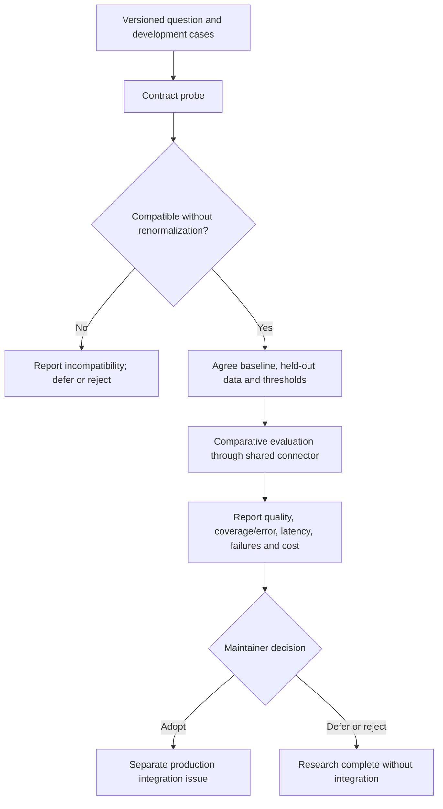

# Jev classifier research

Related: [#3970](https://github.com/vllm-project/semantic-router/issues/3970).
Owner: `wg/router-models-inference-runtime`.

This is a research harness, **not** a registered Router backend, production
integration, or recommendation to adopt Jev. It probes one pinned Jev Choice
question against `label_distribution.v1`. No default routing, configuration,
native model, or chat-generation path changes.

## Research questions and decision gates

1. Does the complete response contain exactly the configured labels, with
   finite probabilities in `[0,1]` summing to one within `1e-3`, without repair?
2. If compatible, does it offer useful quality/coverage, latency, and cost
   trade-offs against an agreed existing classifier on the same task?
3. Are the external-service and data-transmission dependencies acceptable?



Adoption is not the required outcome. Do not open a production follow-up before
the comparative evidence exists and maintainers agree.

## Current increment

- A research-only protocol adapter uses `pkg/modelruntime/connector` for
  authenticated HTTP, bounded requests/responses, deadlines, cancellation,
  connection reuse, redirect rejection, and typed errors.
- The operation is explicitly non-retrying. This initial probe uses concurrency
  one, stops on the first failure, and preserves its record. Unexecuted remaining
  cases must be reported as unexecuted, not counted as successes or silently
  excluded from a later comparison.
- It declares the existing config contract constant, not a new contract name.
  The offline research validator checks the maintainer's specified invariants;
  it does **not** call `native.validateDistribution`, which is unexported and
  belongs to the native runtime. It also checks exact labels, pinned response
  model, Choice type/argmax, and separately validates confidence. Passing this
  tool is not evidence that a production binding has been integrated.
- Expected labels and group IDs stay in local records, never in API requests.
- No confidence threshold is selected here. There is no fallback implementation,
  normalization, added probability mass, or conversion of an error into `other`.

`testdata/development.v1.jsonl` contains 12 authored synthetic development cases:
10 with expected labels and two intentionally ambiguous cases with `null` truth.
They are not a held-out benchmark. The multilingual and adversarial variants use
shared group IDs so they cannot later be split across development/test sets.
`other` is a configured semantic category, not an abstention or transport error.
The response constants in Go tests are synthetic, not captured Jev measurements.

## Offline checks (no key, model download, or paid API)

Run from the repository root:

```bash
make test-jev-eval
make vet-jev-eval
make build-jev-eval
```

Tests use local HTTP servers. They cover request shape/authentication, unchanged
raw responses, label/score rejection, confidence separation, cancellation,
deadline expiry, 401/429/529/503 errors without retries, redirects, response size
limits, malformed JSON, recording failures, case budgets, and duplicate IDs.
The command is registered in the existing external Go-tool inventory so core
CI discovers its offline tests. It reuses the Router module's dependencies.

## Explicit live probe (paid, public/synthetic inputs only)

First obtain a TypeSafe API key and put it in `TYPESAFE_API_KEY` in your local
shell. Do not put credentials in arguments, fixtures, logs, commits, or issues.
The executable only contacts `https://api.typesafe.ai`; it offers no arbitrary
endpoint flag that could forward the key elsewhere.

From the repository root, after reviewing the fixture contents:

```bash
make build-jev-eval
mkdir -p bench/jev/results
bin/jev-eval --live \
  --inputs bench/jev/testdata/development.v1.jsonl \
  --question bench/jev/testdata/question.v1.json \
  --output bench/jev/results/development-run-01.jsonl \
  --location YOUR_COARSE_TEST_REGION \
  --revision YOUR_TESTED_COMMIT_SHA \
  --max-cases 12 --timeout 10s
```

Replace the two metadata placeholders; use a clean commit and record any
experimental changes separately. No calls occur without `--live`. The entire
input file is validated before calling; exceeding `--max-cases` rejects the run
rather than silently truncating it. Output is created exclusively with mode
`0600`, and an existing output path is never overwritten. The parent directory
must already exist. Ctrl-C cancels the current call.

Each JSONL record contains the source revision, dataset/question SHA-256,
coarse location, timestamp, exact request, raw response string, contract check,
elapsed milliseconds, timeout, attempt count, status, and error category. Model
and token usage remain in the raw response. Headers and keys are not recorded.
Error bodies are bounded and truncation is marked. A rejected oversized success
body is unavailable; retain its typed error rather than pretending it is a
complete response. Review all raw provider bodies before sharing: they can echo
input or provider diagnostics. Local results are ignored by Git.

## Comparative evaluation protocol (not implemented or run yet)

Before collecting headline numbers, agree in #3970 on the existing baseline,
dataset, code location, acceptable quality/error trade-offs, and call budget.

| Slice | Question |
| --- | --- |
| Clear intent | Is the request classified correctly? |
| Neighboring categories | Does task meaning win over superficial keywords? |
| Missing context / multiple intents | Is uncertainty useful, without forced truth? |
| Out of scope | Is the explicit out-of-scope label useful? |
| Chinese / English / paraphrases | How does behavior vary across equivalent inputs? |
| Injected instructions | How does the prediction change from the clean pair? |

- Freeze the dataset, label rubric, model versions, question and baseline
  configuration before held-out measurement. Keep translation/paraphrase groups
  together. Never tune thresholds on test outcomes.
- Report scored-case accuracy, per-label errors, and coverage versus error among
  accepted requests. Ambiguous cases need separate adjudication/reporting, not
  invented single labels. Confidence is not a per-case correctness guarantee.
- Compare operating points, not identical numeric confidence thresholds across
  unrelated models. No calibration claim follows from 12 examples.
- Report successful-call latency and failed-call latency/counts separately,
  including P50/P95 only with sample counts and small-sample caveats. Record
  region, concurrency, timeout, warm/cold connection conditions, retries and
  repeat policy. End-to-end latency includes network/serialization, not just
  model inference.
- Report all planned, attempted, valid, failed and unexecuted cases. Preserve
  every attempt; do not silently retry failed cases into a clean success set.
- Calculate cost from recorded usage and a dated provider price; account for
  baseline costs and unavailable usage on failures. A case cap is not a dollar
  budget. Review input sizes before authorizing calls.

## Evidence status and next steps

No live API calls or comparative results are shipped in this increment. The
earlier issue comment's 12/12 contract and 10/10 scored smoke-test results were
reported from a separate Python script; they are not reproduced or claimed as
results of this adapter. Original raw records have not been imported.

- [ ] Maintainer confirms baseline, dataset and research code location.
- [ ] Run and review a versioned live compatibility probe.
- [ ] Freeze held-out protocol and implement the baseline/reporting path.
- [ ] Publish comparative evidence and an adopt/defer/reject recommendation.

References: [API](https://docs.typesafe.ai/api),
[confidence](https://docs.typesafe.ai/confidence),
[known limitations](https://docs.typesafe.ai/model-jaggedness/jev-1.13), and
[maintainer boundary](https://github.com/vllm-project/semantic-router/issues/3970#issuecomment-5754825917).
