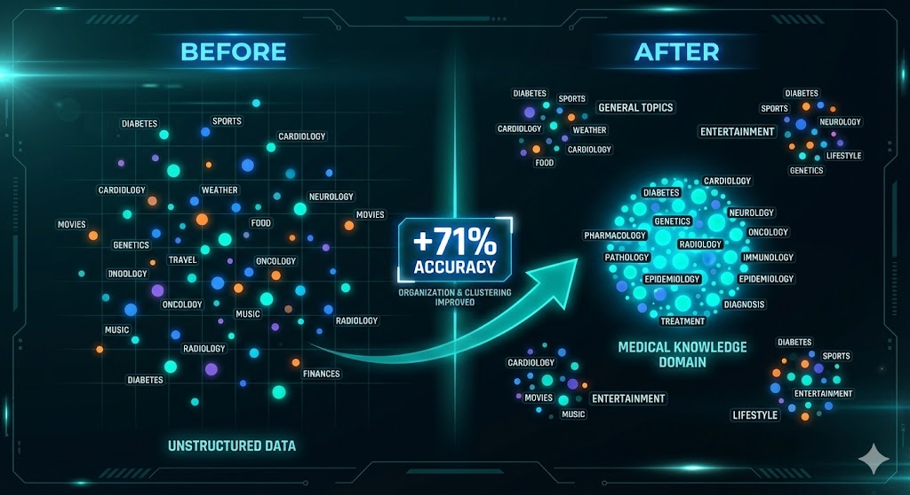

# Domain-Adapted Embeddings



This pipeline fine-tunes a SentenceTransformer for domain retrieval with
iterative hard-negative mining. It is useful when a general embedding model
ranks related domain passages above the passage that actually answers the
query.

## How It Works

For each iteration, the pipeline:

1. embeds the training queries and corpus;
2. mines relevant passages that rank too low and irrelevant passages that rank
   too high;
3. mixes hard and easy triplets to reduce forgetting;
4. fine-tunes with triplet loss;
5. evaluates MRR and recall on the held-out split.

The implementation uses the supplied question-to-answer relationship as ground
truth. It does not call an LLM judge.

## Start Here

Install the local requirements, prepare Q&A data, and run a small training job:

```bash
cd src/training/model_embeddings/domain_adapted_embeddings
pip install -r requirements.txt

python prepare_data.py \
  --source jsonl \
  --input-file domain_qa.jsonl \
  --output-dir data

python train.py \
  --data-dir data \
  --output-dir models/domain-adapted \
  --num-queries 500
```

See [USAGE.md](USAGE.md) for the input format and full command reference.

## Outputs and Evaluation

`prepare_data.py` writes a chunked corpus and train/test query mappings.
`train.py` writes per-iteration models, a `best` model directory, and an
evaluation summary.

Report the baseline and adapted MRR/recall together with the dataset, split,
base model, random seed, and mining parameters. Results from one domain do not
establish performance in another domain.

The output is a standalone embedding model. Choosing between one multi-domain
model, several domain-specific models, or a two-stage domain router remains a
deployment decision and requires end-to-end evaluation.

## Reference

The mining approach is based on
[“Distilling an LLM's Wisdom: A Framework for Creating Domain Adapted Financial
Embedding Models”](https://arxiv.org/abs/2512.08088).
