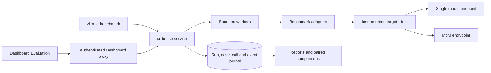

# sr-bench 1.0

Status: implementation and acceptance in progress. This document specifies the
release contract; unchecked acceptance items are not claims of availability.

## Outcome and scope

sr-bench measures the capability, cost and delivery performance of an actual
Mixture of Models (MoM) entrypoint and its constituent single models on the same
versioned tasks. A configuration change should produce a reproducible comparison
within a bounded iteration, followed by an independent holdout evaluation.

The primary decision is whether a MoM matches the strongest measured single
model at lower inference cost. A lower cost alone is not a quality win. The
strongest single is selected by the stated aggregate over the same complete
cases, not separately selected after each answer. A per-case oracle is a
diagnostic upper bound and must have a different label.

This replaces the unfinished CLI and Dashboard evaluation product. Old campaign,
gate, controlled-pair and intelligence command/API compatibility is deliberately
not retained. Existing user artifacts are preserved on disk. Routing preview,
configuration management, model verification and other independent features
remain available. There is one benchmark version, one run authority and one
result contract for CLI and Dashboard.

## Benchmark composition

The following is the initial sampling budget, in whole task units per target.
Source counts are descriptive; preparation verifies the pinned source and emits
the actual selected IDs, strata and digests. A changed selection creates a new
dataset identity. A subset report is explicitly a subset of sr-bench, not an
upstream full benchmark result.

| Benchmark | Capability | Smoke | Quick/dev | Standard/holdout | Evaluation unit |
| --- | --- | ---: | ---: | ---: | --- |
| MMLU-Pro | Breadth | 14 | 500 | 2,000 | One of 12,032 test questions; stratify across 14 subjects |
| GPQA Diamond | Scientific reasoning | 4 | 40 | 158 | One of 198 questions; deterministic option permutation |
| HLE text-only | Difficult reasoning | 4 | 40 | 200 | One text-only problem and a frozen judge protocol |
| LiveCodeBench v6 | Programming | 2 | 30 | 150 | One problem with its complete tests; cumulative v6 pool |
| SciCode | Scientific programming | 1 | 3 | 20 | One main problem with all dependent subproblems |
| Terminal-Bench 2.1 | Terminal agent | 1 | 3 | 15 | One task in a fresh pinned sandbox |
| SimpleQA Verified | Factuality | 5 | 100 | 500 | One factual question, graded correct/incorrect/not attempted |
| ARC-AGI-2 | Novel abstraction | 2 | 12 | 80 | One public evaluation puzzle, exact output grids |
| τ³ text | Interactive agent | 3 | 12 | 60 | One complete airline, retail or telecom trajectory |
| **Total task units** | | **36** | **740** | **3,183** | Agent tasks and judges require multiple calls |

These budgets are defaults, not mandatory spending on every configuration edit.
Users can select a capability slice. Only a run containing all nine required
benchmarks is eligible for the complete sr-bench aggregate. A missing benchmark
does not silently redistribute its weight. Heavy agent/coding evaluation stays
visible and selectable rather than disappearing from the catalog.

The aggregate uses fixed capability weights: breadth 20% (MMLU-Pro 10%,
SimpleQA 10%), reasoning 40% (GPQA 15%, HLE 15%, ARC 10%), coding 20%
(LiveCodeBench 10%, SciCode 10%), and agents 20% (Terminal-Bench 10%, τ³ 10%).
Every benchmark score and denominator accompanies the aggregate. The 1.0
weights are immutable. A future weighting policy requires a new bench version.

τ³ is pinned to release v1.0.1 and its resolved source commit. Its upstream
Python package/command name does not determine the benchmark version. Only the
current text domains are part of 1.0; voice and banking knowledge require
separate future profiles. There is no older τ benchmark adapter.

## Dataset construction and provenance

Preparation is a separate, reproducible operation. It acquires a pinned source,
checks required access, normalizes task records, assigns stable IDs, partitions
them and writes a manifest plus content-addressed task data. The manifest
records source URL, immutable revision, content digest, license/access notes,
adapter/grader revisions, selection algorithm, seed, strata and exact IDs.
Preparation never sends a model request. Gated sources use an environment
credential reference and require the user to have source access.

Quick and standard selections are disjoint. Smoke is a subset of quick. A
deterministic hash ordering within each stratum allocates whole tasks; it never
uses answers, model outputs or candidate scores. MMLU-Pro is subject-stratified;
agent tasks are domain-stratified. SciCode subproblems and ARC examples cannot
cross partitions. The pinned sources use whole problem IDs; an adapter that
introduces related task variants must partition by family before selection.
Benchmark names, expected answers and split labels
are grading metadata, never routing hints in the subject request.

Public evaluation splits reused as sr-bench development data are identified as
such. Public data is not claimed to be contamination-free. Previously inspected
GPQA labels make those results a retest, even if a local holdout split is used.
Standard results must not feed configuration tuning. Training exports contain
only explicitly eligible train/dev rows and provenance; the evaluation pipeline
does not silently launch model training or export holdout labels.

## Execution architecture

The service ships with the Python CLI and can run without the Dashboard. SQLite
is the local durable authority. Closing a browser or restarting the Dashboard
does not cancel its jobs. The Dashboard proxies a configured service origin with
authenticated ownership; a browser cannot choose arbitrary proxy destinations.
Secrets stay in the service environment. Published manifests contain only secret
references. The standalone service binds to loopback by default; remote clients
use authenticated deployment wiring.

Each run freezes dataset, target identities, configuration hash, source image or
revision, sampling, grader, prices, concurrency, budgets and environment. A
configuration change creates a new run. MoM requests bind to the request's actual
configuration snapshot and reject a mismatched expected revision. A management
hash read before and after a request alone cannot establish this guarantee.

Operators can enable recipe capture on a registered MoM target. The worker
captures the Router's canonical source document between two matching
source/generated/active hash observations, requiring the generated and active
hashes to match the run's frozen runtime identity. The stored routing snapshot
omits deployment wiring and redacts credentials. Reports expose its separate
content digest and verification scope; historical runs without a captured
snapshot remain explicitly unavailable. Every live call still verifies its own
runtime acknowledgement.

`BenchmarkAdapter` prepares/preflights tasks, executes the problem's interaction
protocol and grades saved final responses or sandbox outcomes. The shared target client
provides actual calls, identity, routing trace, streaming and usage. Their
separation lets a benchmark run against single and MoM targets without custom
schedulers or Dashboard code. Installed extensions are registered server-side;
untrusted browser manifests cannot name arbitrary executables or Python imports.

External harnesses run in isolated versioned environments and use the same
instrumented call path. Their user simulators and judges have fixed identities
and separately tagged calls. Each coding task uses a clean sandbox, fixed tests,
resource limits and a pinned runtime. Agent task turn limits and trial counts
are explicit. Version 1.0 uses one trial per task; it does not report multi-trial
all-success or at-least-one-success claims.

## Iteration modes

- **Preview** exercises the live Router preview API for the exact messages,
  tools and model entrypoint. It records signals, decision, candidates and
  selection status. With Learning enabled, it evaluates the same selection,
  adaptation and protection logic against a captured read-only state snapshot.
  Optional session/conversation identity supplies the protection context. The
  response includes the selected model, configuration and state hashes, capture
  time and sampling seed. Preview does not hydrate or evict shared state, record
  outcomes, or advance production random state. A seeded preview reproduces that
  snapshot's sampled choice; a later request can differ when state or its random
  draw changes. Preview is routing evidence and has no answer-quality score.
  Algorithms that require model execution remain explicitly unresolved.
- **Replay** uses a complete, identity-compatible saved single-model response
  matrix for eligible single-selection routing. Its report is an estimate.
  State-dependent Learning snapshots are not eligible for replay. Changed
  prompts, tool state, multi-model algorithms and new agent trajectories require
  live calls. Missing cells do not generate requests implicitly.
- **Live** executes the real model or MoM entrypoint and the full grader/task
  protocol. Only live evidence supports a measured capability/cost claim.

Configuration iteration uses the existing schema, validation, plan and CAS apply
APIs. After apply, the expected runtime hash must be active before evaluation;
pending activation is not success. Restart-required mutations use the supported
`vllm-sr serve` flow. Candidate runtime/state isolation is preferable to changing
an unrelated shared deployment. Stateful selectors must declare reset/frozen
state or be evaluated as an explicitly stateful protocol.

## Failure and spending controls

Every call has an absolute deadline, idle deadline, output bound and repetition
guard. Every task has a wall-clock/turn budget, and every run has call, elapsed
time and cost limits. Heartbeats only observe these controls; they do not own
progress, issue retries or restart workers. Continuous output cannot defeat an
absolute deadline. Cancellation interrupts active transport and external process
groups and persists the partial response and reason.

The journal records intent before dispatch, transport events during generation,
terminal status, final answer, usage and grading separately. A lost acknowledgement
or worker crash leaves an explicit unknown-dispatch state. Recovery reconciles
saved evidence; it never silently resends a generation. Failure and cancellation
retain artifacts. Regrading saved answers is a separate operation with a new
grader identity and zero subject calls. Request retries default to zero and are
not an automatic recovery path in 1.0.

An explicit recovery plan shows eligible and excluded case/target cells. The
default continues only undispatched cells. Retrying a failed cell requires a
known terminal outcome, complete usage/cost evidence and acknowledgement of a
new paid attempt; ambiguous dispatch or unknown billing is excluded. Recovery
creates a linked child run with atomically claimed cells and its own idempotency
key, denominator and spending. It preserves the parent and does not relabel a
partial recovery subset as a complete benchmark. UI reloads retain the submitted
recovery intent so a lost response cannot cause a duplicate attempt.

Plan and preflight detect inaccessible datasets, missing judge/simulator settings,
unavailable sandboxes, missing prices and incompatible protocol options before
paid work. Missing prices permit a capability-only run only when selected
explicitly; they cannot establish a cost-saving claim. Conservative reservations
include queued/in-flight calls. Actual spending and unaccounted usage remain
visible when a provider fails to return usage. Reservations estimate spend from
the submitted request and frozen prices; they are not a universal hard dollar
cap when a provider or routing plugin expands the request. Time, output and call
limits are enforced separately. The worker stops further dispatch when observed
spend reaches its limit; an in-flight request can exceed the estimate.

## Metrics and comparison

Reports include per task, target, benchmark and whole-run views:

- Quality, numerator, full planned denominator, attempted/scored/failed counts,
  coverage and uncertainty. Incomplete runs cannot be marked qualified.
- Input, cached input, cache-write and output tokens; reasoning tokens are a
  subset where the provider defines them that way, not an extra billed output.
- Subject inference cost, simulator/judge cost, total evaluation spend and
  accounting coverage. Missing usage or price produces an unknown cost, not zero.
- Per-call TTFT and final latency, task latency p50/p95, worker queue time and
  actual run wall time. Sum of call durations is not elapsed completion time.
- Requested/returned/selected model identities, routing decisions, configuration
  revision, termination reasons and complete MoM child-call accounting.

Four-bucket prices are versioned USD per million tokens. MoM cost is the sum of
all constituent calls, including reranking or synthesis when billed. The final
selected model cannot price the whole trajectory. Self-hosted token-equivalent
cost is labeled as such and does not prove GPU invoice or reserved-capacity
savings. Pilot/UI/earlier unrelated runs are excluded from benchmark cost.

Saving is `100 × (1 − MoM subject cost / baseline subject cost)` on the same
complete task set and accounting basis. Reports also show the absolute quality
delta and paired uncertainty. Small quick samples diagnose direction; they do
not prove equivalence. A release claim needs the prespecified holdout comparison,
a quality non-inferiority margin and its confidence interval. The report records
how the baseline was selected to expose winner-selection effects.
Exact quality ties choose the cheapest fully accounted single model, then a
stable target ID. All tied models remain visible. Unknown cost for a tied best
model prevents a cheapest-best savings claim.

## CLI and Dashboard experience

`vllm-sr benchmark` owns catalog discovery, dataset preparation, plan validation,
run submission/inspection/cancellation, reports and comparisons. The same run ID
and persisted records appear in Dashboard Evaluation. The UI offers prepared
datasets, single/MoM targets, profile/mode selection, budget review and launch;
it is not limited to a JSON editor. Detail pages expose progress, stopping reason,
cost coverage, latency, tokens, selected-model distribution and case evidence.
Comparison selects compatible runs and explains incompatibility instead of
silently intersecting away failures.

The operations skill gains a dedicated sr-bench reference covering installation,
data preparation, preview/config/live iteration, reporting, abnormal-run handling
and train/dev/holdout boundaries. Generated public skill copies ship with it.

## Acceptance and delivery

The PR includes implementation, this proposal, user documentation, updated skill
and sanitized acceptance evidence. Private infrastructure identifiers and raw
gated benchmark answers do not belong in the PR.

- [ ] Replace old CLI/API/UI evaluation surfaces and stale active documentation.
- [ ] Install from a built wheel and discover the same catalog from CLI and UI.
- [ ] Prepare reproducible datasets; verify disjoint splits and source digests.
- [ ] Verify deadline, continuous-stream repetition, cancellation, crash/unknown
  dispatch, budget stop and incomplete accounting with deterministic fault tests.
- [ ] Run actual single models and MoM through the CLI using fixed task IDs;
  verify saved responses, final-channel scoring, identities and metric arithmetic.
- [ ] Measure the current Balance recipe and every constituent single model on
  the same frozen development cases before tuning.
- [ ] Complete optimization loop 1: inspect baseline errors and cost, formulate
  a routing change, validate/plan/apply, confirm the active revision, then preview
  and measure the first optimized Balance recipe.
- [ ] Complete optimization loop 2: inspect the first iteration, apply and
  preview a second revision, then measure it on the same development cases.
  Compare all three Balance revisions with the complete single-model baseline.
- [ ] Evaluate the frozen final recipe and the chosen baseline on a disjoint
  holdout without tuning against it. Publish the final recipe and uncertainty;
  report measured regressions or inconclusive improvements without hiding them.
- [ ] Exercise all nine adapter execution/grade paths against real prerequisites;
  distinguish functional smoke acceptance from statistical capability claims.
- [ ] Use the real Dashboard to launch and inspect a run, compare CLI-created
  runs, inspect failures and cancel safely; verify persistence across UI reload.
- [ ] Run relevant CLI, backend, frontend, integration and generated-skill checks.
- [ ] Publish one signed-off PR, inspect its final-head checks and resolve blockers.

Real acceptance uses new bounded runs and a new evidence namespace. It never
resumes an aborted or frozen historical campaign. A pre-existing model quality
limitation remains attached to its evidence; benchmark completion does not
retroactively qualify that model or erase prior failures.

## Sources

- [MMLU-Pro](https://huggingface.co/datasets/TIGER-Lab/MMLU-Pro)
- [GPQA](https://huggingface.co/datasets/Idavidrein/gpqa)
- [HLE](https://huggingface.co/datasets/cais/hle)
- [LiveCodeBench versions](https://github.com/LiveCodeBench/LiveCodeBench)
- [SciCode](https://github.com/scicode-bench/SciCode)
- [Terminal-Bench](https://www.tbench.ai/)
- [SimpleQA Verified](https://www.kaggle.com/benchmarks/deepmind/simpleqa-verified)
- [ARC-AGI-2](https://github.com/arcprize/ARC-AGI-2)
- [τ³ v1.0.1](https://github.com/sierra-research/tau2-bench/releases/tag/v1.0.1)
