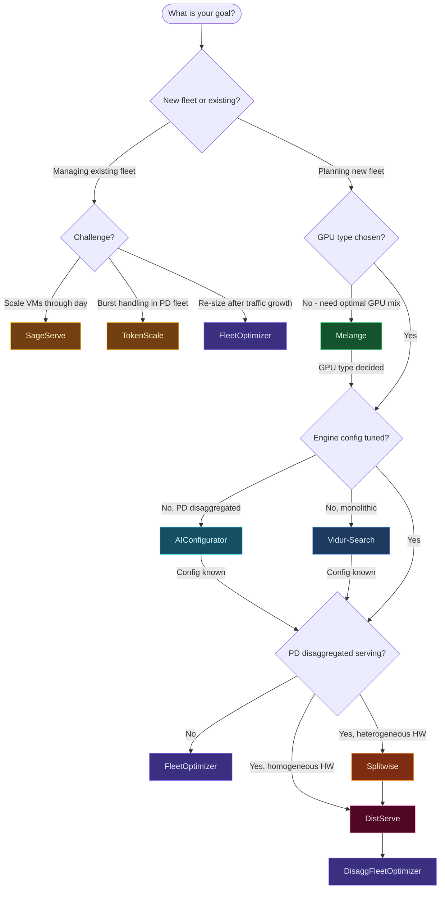

# Research Context

This page is optional. It exists to position `vllm-sr-sim` relative to adjacent
research systems and planning tools; most users can skip it and start with
[Getting started](./getting-started.md) or [Capacity planning scenarios](./use-cases.md).

`vllm-sr-sim` sits at the intersection of several active research threads.
Each related work answers a *different* question than this simulator.

---

## Mélange — heterogeneous GPU type selection

**Griggs et al., UC Berkeley, 2024 · [arXiv:2404.14527](https://arxiv.org/abs/2404.14527)**

Mélange shows that the optimal GPU type is determined by three interacting factors:
request size (short requests favour cheap GPUs; long ones favour high-end GPUs),
arrival rate (low rates allow right-sizing to cheaper hardware), and SLO tightness
(strict latency requires fast GPUs regardless of cost). It formulates GPU allocation
as cost-aware bin packing — GPUs are bins, workload slices are items — and uses an
ILP to find the minimum-cost multi-GPU-type allocation. Achieves up to 77% cost
reduction vs. a single GPU type.

**Key differences from `vllm-sr-sim`:**

| | Mélange | vllm-sr-sim |
|---|---|---|
| Input | Empirical throughput profiles per (GPU, request-size bucket, SLO) | Physics-derived `W`/`H` from `HardwareSpec` + `ModelSpec`; no GPU required |
| Output | Optimal mix of GPU *types* (how many A10G, A100, H100 …) | Optimal number of GPU *instances* per pool + routing topology |
| Routing | None — bins requests by size, assigns bins to GPU types | Explicit routing policies: length, semantic, C+R, model |
| Serving model | Single pool per GPU type, no pool routing | Multi-pool with inter-pool routing and SLO verification |
| SLO metric | Average TPOT | P99 TTFT (also supports TPOT via profile) |
| Validation | Benchmark runs on real hardware | Analytical Erlang-C + discrete-event simulation |

**When to use Mélange:** You have a homogeneous workload and want to know which cloud
GPU SKU to rent. Mélange selects the type; `vllm-sr-sim` then tells you how
many of that type you need, given your length-distribution and routing strategy.

---

## SageServe — forecast-aware runtime auto-scaling

**Jaiswal et al., Microsoft O365, 2025 · [arXiv:2502.14617](https://arxiv.org/abs/2502.14617)**

SageServe is a **runtime controller** for an existing fleet. It characterises
production O365 workloads (10 M+ requests/day across 3 US regions, 4 models),
observes strong diurnal periodicity in interactive (IW) traffic and opportunistic
non-interactive (NIW) batch jobs, and proposes: (1) a unified GPU VM pool shared
across IW and NIW instead of siloed pools; (2) ARIMA-based hourly traffic forecasting;
(3) an ILP to compute optimal instance count changes (δ) that minimise VM cold-start
overhead; (4) a reactive heuristic that fine-tunes based on live memory utilisation.
Saves 25% GPU-hours and reduces cold-start waste by 80%.

**Key differences from `vllm-sr-sim`:**

| | SageServe | vllm-sr-sim |
|---|---|---|
| Problem | How many instances to run *right now* given current traffic | How many GPUs to provision *in total* for a target traffic level |
| Time horizon | Minutes to hours (dynamic scaling loop) | Static capacity plan (peak-hour sizing) |
| Traffic model | Production traces + ARIMA forecast | Poisson arrivals / CDF workload / trace replay |
| Multi-tier workloads | IW-Fast, IW-Normal, NIW with different SLAs | Single SLO per pool (multi-SLO via multi-pool config) |
| Routing | Memory-utilisation-based cross-region routing | Length / semantic / model / C+R content-based routing |
| Performance model | Empirical TPS profiles per (model, GPU) | Physics-based roofline from specs |
| Hardware requirement | Real production traces from O365 GPT models | Self-contained; works without any hardware or traces |

**When to use SageServe:** You already have a deployed fleet and need to scale it
up/down through a 24-hour demand cycle. Use `vllm-sr-sim` first to size the
peak-hour fleet; then apply SageServe-style policies to scale down during off-peak
hours to save 20–30% GPU-hours.

---

## AIConfigurator — kernel-level configuration search for disaggregated clusters

**Xu et al., NVIDIA, 2025 · [arXiv:2601.06288](https://arxiv.org/abs/2601.06288)**

AIConfigurator decomposes LLM inference into fundamental operations (GEMM, attention,
all-reduce, P2P transfer) and maintains a **calibrated kernel performance database**
across Ampere/Hopper/Blackwell GPUs and popular models (GPT, Qwen, DeepSeek, Llama,
Mistral). Given a workload descriptor and SLA targets, it searches the combinatorial
space of TP/PP/EP degrees, batch sizes, CUDA-graph flags, and KV-cache fractions in
under 30 seconds, producing Pareto-optimal throughput-vs-latency frontiers and
ready-to-launch config files for vLLM, SGLang, and TRT-LLM. Reports up to 40%
improvement for dense models and 50% for MoE (DeepSeek-V3) vs. default configs.

**Key differences from `vllm-sr-sim`:**

| | AIConfigurator | vllm-sr-sim |
|---|---|---|
| Output | Optimal TP/PP/EP, batch size, engine flags for **one cluster** | Optimal number of GPU instances across **N pools** |
| Granularity | Intra-cluster parallelism degrees and runtime flags | Fleet-level pool count and routing topology |
| Models | GEMM/attention/communication ops on real silicon | Roofline W/H model (embeds AIConf. calibration constants) |
| Frameworks | vLLM, SGLang, TRT-LLM, Dynamo launch files | Framework-agnostic Python simulation |
| SLA scope | TTFT + TPOT per cluster configuration | P99 TTFT across the whole multi-pool fleet |
| MoE support | Native kernel DB for DeepSeek-V3, Qwen3 MoE | Embedded silicon-measured kernel table from AIConf. |

**Relationship:** `vllm-sr-sim` embeds AIConfigurator's empirical constants
(`ALPHA_BW = 0.80`, `LAYER_OVERHEAD_US = 3 µs`, MoE kernel table) so that its
`ProfileBuilder` produces calibrated W/H values without requiring hardware access.
Use AIConfigurator to find the optimal TP/EP config for a single node group; feed
that into `ProfileBuilder` as `ServingConfig.tp` to size the full fleet.

---

## DistServe — foundational disaggregated prefill/decode serving

**Zhong et al., Peking University + UCSD, OSDI 2024 · [arXiv:2401.09670](https://arxiv.org/abs/2401.09670)**

DistServe identifies that colocating prefill (compute-bound) and decode
(memory-bandwidth-bound) phases causes mutual interference: a single prefill batch
can inflate TPOT by 3–10×, and decoding jobs inflate TTFT. It routes prefill and
decode to physically separate GPUs, allows each to adopt its own TP/PP configuration
independently, and uses an M/D/1 queuing model to find the optimal prefill-to-decode
GPU ratio. Achieves 4.48× more requests or 10.2× tighter SLO vs. vLLM on A100s.

**Key differences from `vllm-sr-sim`:**

| | DistServe | vllm-sr-sim |
|---|---|---|
| Output | Optimal (TP, PP, batch strategy) for each phase | Optimal `n_prefill`, `n_decode` GPU counts at fleet scale |
| Scope | One model replica / cluster | Fleet of N replicated pool pairs |
| Queuing model | M/D/1 per phase (uniform request lengths) | M/G/c Erlang-C (variable service times from W, H, CDF) |
| KV transfer | Explicit NVLink/InfiniBand bandwidth modelling | Captured via `BETA_TTFT = 1.80` empirical multiplier |
| Routing | No content-based routing | Length, semantic, C+R, model routing on top of PD split |
| Phase performance | Empirical throughput measurement | Physics-derived via `ProfileBuilder` with `phase=` flag |

**When to use together:** DistServe determines the right TP/PP config for each phase.
`DisaggFleetOptimizer` then determines how many prefill and decode workers you need
to meet your P99 TTFT SLO at a given arrival rate.

---

## Splitwise — heterogeneous hardware co-design for PD-split clusters

**Patel et al., University of Washington + Microsoft, ISCA 2024 · [arXiv:2311.18677](https://arxiv.org/abs/2311.18677)**

Splitwise observes that token generation (decode) does not need the high FLOPs of
the latest GPUs — it is memory-bandwidth bound. H100 has 3.4× more compute than
A100 but only 1.6× more memory bandwidth. So pairing H100 (prompt) with A100 (token)
achieves better cost efficiency than two H100s. It designs three cluster archetypes
optimised for throughput, cost, and power, all using fast InfiniBand for KV-cache
state transfer. Achieves 1.4× higher throughput at 20% lower cost, or 2.35×
throughput at the same power budget.

**Key differences from `vllm-sr-sim`:**

| | Splitwise | vllm-sr-sim |
|---|---|---|
| Key insight | Different GPUs for prompt vs. token phase saves cost/power | Different GPU counts per pool, with any GPU type |
| Hardware | Heterogeneous GPU types within one cluster | Heterogeneous GPU types across separate pools |
| Optimisation | Cluster topology for throughput/cost/power | Fleet sizing for SLO-constrained minimum cost |
| KV transfer | Explicit InfiniBand bandwidth modelling | Modelled via empirical β multiplier |
| Routing | Load-balancing across instances | Content-aware: length, semantic, model, C+R |
| Configuration | Requires profiling on real hardware | Self-contained physics model |

**When to use together:** Use Splitwise's cluster archetypes to choose the GPU mix
within a pool node group (e.g., H100 prefillers + A100 decoders), then feed each
pool's GPU type into `ProfileBuilder` and run `DisaggFleetOptimizer` to find the
prefill-to-decode ratio and total GPU count.

---

## TokenScale — Token Velocity autoscaling for disaggregated fleets

**Lai et al., 2024 · [arXiv:2512.03416](https://arxiv.org/abs/2512.03416)**

TokenScale addresses the **runtime autoscaling** problem for PD-disaggregated fleets
under bursty traffic. It identifies that GPU utilisation and RPS are lagging indicators
that react only after SLO violations occur. It introduces **Token Velocity** — the
maximum token-processing rate at each stage (prefill, network, decode) — as a leading
indicator that exposes backpressure before it causes degradation. A paired mechanism
called **Convertible Decoders** lets decode GPUs temporarily serve prefill tasks
during bursts, absorbing spikes without cold-starting new instances. Improves SLO
attainment from 50–88% to 80–96% and reduces costs by 4–14% over DistServe and
AIBrix.

**Key differences from `vllm-sr-sim`:**

| | TokenScale | vllm-sr-sim |
|---|---|---|
| Problem | React to traffic bursts in an already-deployed PD fleet | Size the fleet before deployment |
| Time scale | Seconds (burst detection, Convertible Decoder activation) | Minutes to hours (planning phase) |
| Key metric | Token Velocity per stage (real-time) | P99 TTFT SLO (planning) |
| Scaling trigger | Token arrival rate vs. stage velocity ratio | Erlang-C wait ≤ SLO budget |
| Hardware assumption | Fixed GPU cluster, dynamic role assignment | GPU count is the decision variable |
| Burst model | Empirical burst statistics from Azure/OpenAI traces | Poisson arrival process |

**When to use together:** `vllm-sr-sim` gives the steady-state fleet size
(minimum GPUs for P99 TTFT ≤ T at rate λ). TokenScale then operates at runtime,
handling short-term bursts above λ using Convertible Decoders rather than expensive
over-provisioning.

---

## Vidur — high-fidelity single-instance LLM inference simulator

**Agrawal et al., Microsoft Research, 2024 · [arXiv:2405.05465](https://arxiv.org/abs/2405.05465)**

Vidur simulates the full inference stack of **one model deployment**: operator-level
profiling (GEMM, attention, MLP, communication), KV-cache block management,
continuous batching, chunked prefill, and preemption. It uses a profiling +
ML-regression approach to predict per-iteration latency with &lt;9% error. A companion
tool, **Vidur-Search**, explores hundreds of deployment configurations (TP, PP, batch
size, chunk size, scheduler) in ~1 CPU-hour, vs. ~42 000 GPU-hours for empirical
search. Targets per-engine configuration optimisation, not multi-pool fleet sizing.

**Key differences from `vllm-sr-sim`:**

| | Vidur | vllm-sr-sim |
|---|---|---|
| Scope | One model instance | N-pool fleet with inter-pool routing |
| Fidelity | Operator-level (GEMM, attention, NCCL profiled) | Request-level M/G/c queuing (W, H from roofline) |
| Configuration search | TP, PP, batch size, chunk size, scheduler | Pool count, GPU type, routing policy, γ compression |
| Input requirement | GPU profiling data per model | Only model spec + hardware spec (no GPU needed) |
| Fleet routing | None | Length, semantic, C+R, model, round-robin |
| Multi-pool analysis | None | First-class: two-pool, N-pool, disaggregated |
| SLO metric | TTFT, TBT, E2E latency | P99 TTFT, SLO attainment %, cost/year |

**When to use together:** Use Vidur-Search to determine the best scheduler and
batching parameters for one engine replica. Feed its throughput/latency measurements
into `ManualProfile` and pass it to `FleetOptimizer` to size and validate the full
fleet of replicas.

---

## One-line positioning

| Tool | Core question answered |
|---|---|
| **Vidur** | What batching/scheduling config maximises per-GPU goodput? |
| **AIConfigurator** | What TP/EP/engine flags maximise throughput for one cluster? |
| **Mélange** | Which GPU types to mix for minimum cost at given SLO? |
| **Splitwise** | Which GPU generations to use for prefill vs. decode? |
| **DistServe** | How many prefill vs. decode GPUs per cluster replica? |
| **TokenScale** | How to scale prefill/decode pools in real time under bursts? |
| **SageServe** | How many VM instances to run through a 24-hour demand cycle? |
| **vllm-sr-sim** | How many GPU pools, which routing policy, what fleet cost to meet P99 TTFT? |

---

## Decision tree — which tool to use first

Use the [Fleet Sim guide](./guide.md) for the consolidated reading pack, or follow
the flowchart below.

