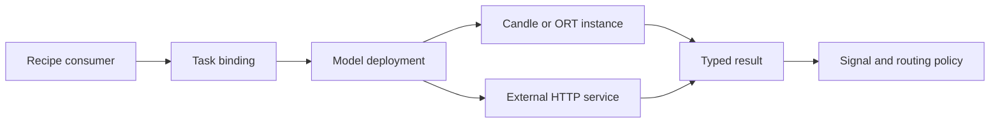

# Router Runtime

Router Runtime runs the models that classify, embed, score, and inspect requests
and responses. It also manages their resources as configuration changes. The
language models that ultimately answer a client are configured separately under
[`providers.models`](model-configuration.md).

Start with the task you need, then choose its execution engine and model. A
model name alone does not establish its task, hardware support, input length,
or output meaning.

| I need to… | Read |
| --- | --- |
| Choose an engine, image, or device | [Engines and hardware](runtime/engines-and-hardware.md) |
| Select a model, pin its files, or override one recipe | [Models and bindings](runtime/models-and-bindings.md) |
| Run classifiers inside the Router process | [In-process inference](runtime/in-process.md) |
| Call a separately operated classifier or scoring service | [External inference](runtime/external.md) |
| Configure prompt guard, PII, fact checking, or grounding | [Safety models](runtime/safety.md) |
| Use local or remote embeddings with signals and stores | [Embeddings](runtime/embeddings.md) |
| Set concurrency, inspect failures, or reload safely | [Lifecycle and diagnostics](runtime/lifecycle-diagnostics.md) |

## How the pieces fit

`global.model_catalog.deployments` declares execution: a local artifact and
engine, or a named external service. `routing.model_bindings` assigns that
execution to a task inside one recipe. Its contract describes the result; its
adapter describes how to call the model and interpret that result. Existing
catalog and module defaults remain usable when no explicit binding is supplied.

The Router prepares a candidate generation before publishing it. Requests keep
their generation until they finish. Compatible uses can share a physical
resource and its admission budget; separate models, heads, or execution settings
are not assumed to be interchangeable.

## Before selecting a model

- The prepared sequence and token classification tasks have a **512-token
  maximum**, including task preprocessing. A model called `mmbert32k` does not
  make those Router tasks accept 32K inputs. Embeddings have their own limits.
- Candle and ORT can run together when the image contains both bindings and the
  needed libraries. An unavailable engine or device cannot be enabled by YAML.
- A class distribution, regression score, categorical verdict, and token span
  are different products. Missing confidence remains unavailable; it is not a
  probability of zero or one.
- External inference sends the relevant text or grounding inputs to the named
  service. The Router controls its requests, not the service's model lifecycle.

Use `vllm-sr config validate --config config.yaml` to check a declaration, then
`vllm-sr serve --config config.yaml` and representative requests to verify the
actual model/runtime combination. See [Lifecycle and diagnostics](runtime/lifecycle-diagnostics.md)
for the distinction between configuration validation, prepared capabilities,
and real execution evidence.
