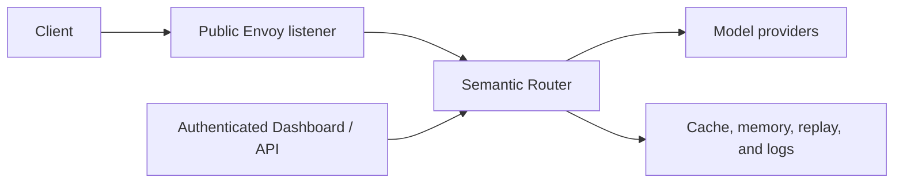

# Security Hardening

Semantic Router sits on the request path between clients and model providers.
Treat it as part of the application's trust boundary: it can inspect prompts,
choose providers, mutate requests, and optionally retain routing data.

This guide highlights the controls that need an explicit production decision.
It does not replace the identity, network, secret-management, and data-governance
controls of the surrounding platform.

## Map the trust boundaries



Review each boundary separately:

- who can call inference endpoints;
- which identity claims the Router trusts;
- which models and tools each role may use;
- where provider credentials are stored;
- which requests may leave the local environment;
- what prompts, responses, and route metadata are retained; and
- who can change configuration or inspect stored data.

## Protect the public listener

The maintained Envoy configuration removes internal control headers before a
client request reaches the Router. Do the same when supplying a custom Envoy or
gateway configuration. Internal examples include:

```yaml
request_headers_to_remove:
  - x-vsr-looper-request
  - x-vsr-looper-secret
  - x-vsr-looper-decision
  - x-vsr-looper-iteration
  - x-authz-user-id
  - x-authz-user-groups
```

Do not expose Router management, metrics, ExtProc, or backing-store ports as
public inference endpoints. Terminate client authentication at a trusted
boundary and allow only that component to supply identity headers.

## Configure authorization and rate limits

The Dashboard **Security Policy** page maps users or groups to Router roles and
model access, and can define per-subject request and token limits. Saving a
valid policy updates the canonical Router configuration and applies it to the
active stack.

Use preview before saving when a policy changes several mappings. Keep the
management surface authenticated and grant write permissions only to operators
who are allowed to change live routing policy.

Relevant Dashboard permissions include:

| Permission | Purpose | Default roles |
| --- | --- | --- |
| `feedback.submit` | Submit routing feedback. | admin, write |
| `replay.read` | List replay records. | admin, write, read |
| `security.manage` | Change security policy. | admin |
| `logs.read` | Read bounded local-stack service logs. | admin, write |

The Router management API distinguishes replay metadata from replay detail.
The Dashboard service can retrieve complete records, then removes captured
bodies and tool payloads for users who do not have configuration-write access.
It does not receive permission to reveal stored secret values.

See the [management API reference](../api/apiserver) for endpoints and response
contracts.

## Keep credentials out of configuration

Use environment references in canonical YAML:

```yaml
api_key: ${MODEL_API_KEY}
```

Do not commit literal API keys, passwords, authorization headers, credential
query parameters, or URLs containing user information.

For `vllm-sr serve --target k8s`, the CLI places sensitive environment values
in an immutable Secret revision scoped to the namespace and Helm release. Helm
values and the Deployment reference the Secret by name; they do not contain
the credential value. A failed upgrade keeps the previous workload and Secret
active. Release-owned old revisions are removed only after they are no longer
referenced.

Existing chart-native Secret references, such as a Dashboard JWT Secret, remain
external objects and are not copied into the CLI-managed Secret. Use the same
namespace and release ownership discipline for every manually managed Secret.

## Review stored request data

Replay, response cache, memory, response history, service logs, and provider
logs can all retain data derived from a request. Their settings are independent
from the model's placement. A route to a local model can still write a prompt
or response to a shared store.

For every enabled store:

- identify which routes write to it;
- inspect whether request or response bodies are captured;
- set a retention and deletion policy;
- restrict read and backup access;
- use encryption and transport security appropriate to the data; and
- test behavior when the store is unavailable.

Recipe Model Cards describe the checked-in replay and cache behavior for each
maintained recipe. See [Data and Storage](storage-overview) for deployment
guides.

## Limit container-runtime access

Some Dashboard workflows can manage local containers. The CLI mounts a
container-runtime socket only when it is a Unix socket with a safe owner and
group mode; it rejects symlinks, world-accessible sockets, and unsafe group
ownership. The Dashboard repeats the check inside the container and runs as a
non-root user.

When the socket is missing or rejected, Router and Dashboard still start, but
container-management features report the runtime as unavailable. Do not make a
socket world-writable to bypass this protection. Use
`VLLM_SR_CONTAINER_SOCKET` for a non-default rootless runtime socket and verify
its user-namespace and supplementary-group mapping.

If the deployment does not need Dashboard-managed containers, do not mount a
runtime socket.

## Production checklist

- [ ] Authenticate the public inference listener and the management surface.
- [ ] Strip internal control and identity headers at the trusted proxy.
- [ ] Bind Router management, ExtProc, metrics, and store ports to private
      interfaces.
- [ ] Restrict model access and rate limits by role or tenant.
- [ ] Keep provider and store credentials in a secret manager or Kubernetes
      Secret.
- [ ] Review every route's provider locality, tools, and data-retention behavior.
- [ ] Grant replay detail, logs, and configuration writes only to trusted
      operators.
- [ ] Set strict failure behavior where bypassing a policy is unacceptable.
- [ ] Test backup, restore, credential rotation, upgrade, and rollback.
- [ ] Leave the container-runtime socket unmounted unless a workflow requires
      it.
