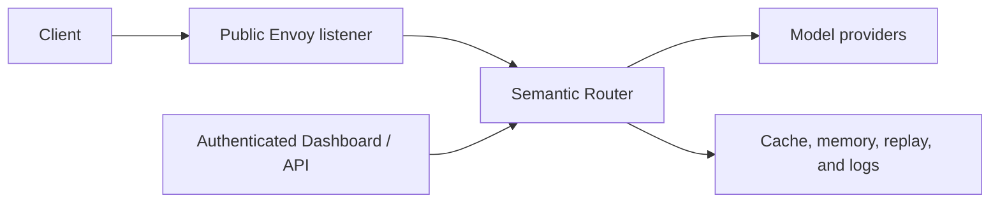

# Security Hardening

Semantic Router sits on the request path between clients and model providers.
Treat it as part of the application's trust boundary: it can inspect prompts,
choose providers, mutate requests, and optionally retain routing data.

This guide highlights the controls that need an explicit production decision.
It does not replace the identity, network, secret-management, and data-governance
controls of the surrounding platform.

## Map the trust boundaries



Review each boundary separately:

- who can call inference endpoints;
- which identity claims the Router trusts;
- which models and tools each role may use;
- where provider credentials are stored;
- which requests may leave the local environment;
- what prompts, responses, and route metadata are retained; and
- who can change configuration or inspect stored data.

## Protect the public listener

The maintained Envoy configuration removes internal control headers before a
client request reaches the Router. Do the same when supplying a custom Envoy or
gateway configuration. Internal examples include:

```yaml
request_headers_to_remove:
  - x-vsr-looper-request
  - x-vsr-looper-secret
  - x-vsr-looper-decision
  - x-vsr-looper-iteration
  - x-authz-user-id
  - x-authz-user-groups
```

Do not expose Router management, metrics, ExtProc, or backing-store ports as
public inference endpoints. Terminate client authentication at a trusted
boundary and allow only that component to supply identity headers.

## Configure authorization and rate limits

`routing.signals.role_bindings` maps request subjects to a role name so a
decision can branch on who is calling, and `global.services.ratelimit` defines
limiter providers and rules. Both are edited through the Router configuration
surfaces.

Neither is model authorization. A role binding decides which decision a request
can match; it does not stop a caller from reaching a model through another
decision, and it is only as trustworthy as the identity headers Envoy passes
through. The `local-limiter` provider keeps counters in the Router process, so
each replica enforces its own limits and they reset on restart. Use a shared
provider such as `redis` when a limit must hold across replicas, and treat model
access control as a concern of the layer that authenticates the caller.

The Dashboard Security Policy page that used to generate this configuration has
been retired; `/api/security/*` now returns `410 Gone`. Configuration it wrote
stays active and is not removed automatically, because the generator recorded no
ownership metadata and name-based cleanup could delete operator-authored
entries. To clean it up, read the active config and its version history, identify
likely generated entries (decisions named `rbac-*`, the role bindings they
reference, and `local-limiter` rules), preview a complete diff with
`POST /api/router/config/deploy/preview`, activate the reviewed snapshot, and
roll back with `POST /api/router/config/rollback` if routing behavior changes
unexpectedly.

Relevant Dashboard permissions include:

| Permission | Purpose | Default roles |
| --- | --- | --- |
| `feedback.submit` | Submit routing feedback. | admin, write |
| `replay.read` | List replay records. | admin, write, read |
| `logs.read` | Read bounded local-stack service logs. | admin, write |

The Router management API distinguishes replay metadata from replay detail.
The Dashboard service can retrieve complete records, then removes captured
bodies and tool payloads for users who do not have configuration-write access.
It does not receive permission to reveal stored secret values.

See the [management API reference](../api/apiserver) for endpoints and response
contracts.

## Keep credentials out of configuration

Use environment references in canonical YAML:

```yaml
api_key: ${MODEL_API_KEY}
```

Do not commit literal API keys, passwords, authorization headers, credential
query parameters, or URLs containing user information.

For `vllm-sr serve --target k8s`, the CLI places sensitive environment values
in an immutable Secret revision scoped to the namespace and Helm release. Helm
values and the Deployment reference the Secret by name; they do not contain
the credential value. A failed upgrade keeps the previous workload and Secret
active. Release-owned old revisions are removed only after they are no longer
referenced.

Existing chart-native Secret references, such as a Dashboard JWT Secret, remain
external objects and are not copied into the CLI-managed Secret. Use the same
namespace and release ownership discipline for every manually managed Secret.

## Secure the local stack's storage credentials

`vllm-sr serve` provisions Redis and Postgres for the local stack, so it also
owns their credentials. Each stack generates its own on first start. No value
ships in this repository, and nothing falls back to a shared default.

Where the material lives:

| Artifact | Path under `<state-root>/.vllm-sr/storage-secrets/` | Mode |
| --- | --- | --- |
| Credential state | `secrets[.<stack>].json` | `0600` |
| Postgres password | `postgres-password[.<stack>]` | `0600` |
| Redis config | `redis[.<stack>].conf` | `0644` |

The directory itself is `0700` and owner-verified, so every file in it is
unreachable by other users. The Redis config is `0644` on purpose: the Redis
image drops to an unprivileged user before reading it, and the bind mount
resolves inside the container without traversing the host's private parent.

The values reach their consumers without entering any shared surface. Postgres
reads its password from the mounted file via `POSTGRES_PASSWORD_FILE`; Redis
reads `requirepass` from its mounted config; Router receives the values as
inherited environment names and the generated runtime config carries only
`${VLLM_SR_STACK_POSTGRES_PASSWORD}` and `${VLLM_SR_STACK_REDIS_PASSWORD}`.
They do not appear in a `docker` command line, a generated config file, a log
record, or a report artifact. Dashboard is not given them.

These credentials authenticate network peers. They do not constrain a caller
that can reach the container runtime directly: the Postgres image trusts local
socket connections, so anyone able to `docker exec` bypasses the password. Keep
[container-runtime access](#limit-container-runtime-access) restricted
accordingly.

### Rotate

```bash
vllm-sr storage rotate
```

The command is scoped to one stack and follows `VLLM_SR_STACK_NAME`, like
`serve` and `stop`. Rotate each stack separately; there is deliberately no
cross-stack mode, because a partial failure would leave some stacks revoked and
others not.

Rotation has a short degradation window. Postgres changes its role password in
place, so existing connections continue but new ones fail until Router
restarts. Redis is rebuilt against its named volume. Plan the rotation for a
moment when a brief Router restart is acceptable.

### Recover

**The credential state is missing or malformed.** The CLI fails closed rather
than regenerating silently, because a regenerated credential would leave the
CLI believing it has access it no longer has. Delete the state file and rerun
`vllm-sr serve`. The stack is taken over in place: Postgres is re-keyed over
its trusted local socket, Redis is rebuilt against the same named volume, and
no data is lost.

**Data from an older stack is not picked up.** Storage data now lives in named
volumes, and an existing container's volume is adopted by name when the stack
is taken over. A container removed by an older CLI leaves its volume behind
with no record of which container it belonged to, so it cannot be adopted
automatically. Recover it manually:

```bash
docker system df -v --format '{{json .Volumes}}'
```

Look for volumes with `Links: 0`. Identify each candidate by its contents — a
Postgres data directory contains `PG_VERSION`, a Redis one contains
`dump.rdb`:

```bash
docker run --rm -v <volume>:/v:ro alpine ls /v
```

Then start a container against the identified volume, or copy its contents into
the stack's named volume (`vllm-sr-postgres-data` / `vllm-sr-redis-data`, with
the stack prefix for a named stack). The CLI does not guess which orphaned
volume is yours.

**Recipe activation reports that the credentials are not readable.** Dashboard
can start a managed store while activating a Recipe, but it runs as a separate,
less trusted account -- it holds the container-runtime socket, which is exactly
what these credentials are kept away from -- so it cannot read the credential
state, and it will not guess which volume holds the data. Run `vllm-sr serve`
from the account that owns the stack to provision the store, then activate the
Recipe again.

**An older CLI is used against a rotated stack.** It will fail to authenticate.
That is the intended outcome. Either upgrade the CLI, or reset the passwords by
hand through the container runtime.

## Review stored request data

Replay, response cache, memory, response history, service logs, and provider
logs can all retain data derived from a request. Their settings are independent
from the model's placement. A route to a local model can still write a prompt
or response to a shared store.

For every enabled store:

- identify which routes write to it;
- inspect whether request or response bodies are captured;
- set a retention and deletion policy;
- restrict read and backup access;
- use encryption and transport security appropriate to the data; and
- test behavior when the store is unavailable.

Recipe Model Cards describe the checked-in replay and cache behavior for each
maintained recipe. See [Data and Storage](storage-overview) for deployment
guides.

## Limit container-runtime access

Some Dashboard workflows can manage local containers. The CLI mounts a
container-runtime socket only when it is a Unix socket with a safe owner and
group mode; it rejects symlinks, world-accessible sockets, and unsafe group
ownership. The Dashboard repeats the check inside the container and runs as a
non-root user.

When the socket is missing or rejected, Router and Dashboard still start, but
container-management features report the runtime as unavailable. Do not make a
socket world-writable to bypass this protection. Use
`VLLM_SR_CONTAINER_SOCKET` for a non-default rootless runtime socket and verify
its user-namespace and supplementary-group mapping.

If the deployment does not need Dashboard-managed containers, do not mount a
runtime socket.

## Production checklist

- [ ] Authenticate the public inference listener and the management surface.
- [ ] Strip internal control and identity headers at the trusted proxy.
- [ ] Bind Router management, ExtProc, metrics, and store ports to private
      interfaces.
- [ ] Restrict model access and rate limits by role or tenant.
- [ ] Keep provider and store credentials in a secret manager or Kubernetes
      Secret.
- [ ] Review every route's provider locality, tools, and data-retention behavior.
- [ ] Grant replay detail, logs, and configuration writes only to trusted
      operators.
- [ ] Set strict failure behavior where bypassing a policy is unacceptable.
- [ ] Rotate the local stack's storage credentials on the same schedule as
      every other credential.
- [ ] Test backup, restore, credential rotation, upgrade, and rollback.
- [ ] Leave the container-runtime socket unmounted unless a workflow requires
      it.
