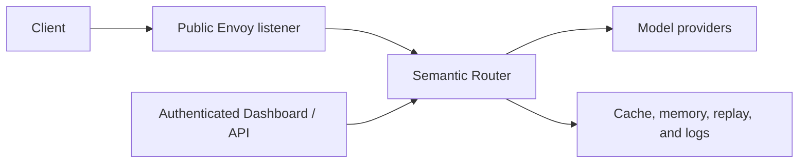

# Security Hardening

Semantic Router sits on the request path between clients and model providers.
Treat it as part of the application's trust boundary: it can inspect prompts,
choose providers, mutate requests, and optionally retain routing data.

This guide highlights the controls that need an explicit production decision.
It does not replace the identity, network, secret-management, and data-governance
controls of the surrounding platform.

## Map the trust boundaries



Review each boundary separately:

- who can call inference endpoints;
- which identity claims the Router trusts;
- which models and tools each role may use;
- where provider credentials are stored;
- which requests may leave the local environment;
- what prompts, responses, and route metadata are retained; and
- who can change configuration or inspect stored data.

## Protect the public listener

The maintained Envoy configuration removes internal control headers before a
client request reaches the Router. Do the same when supplying a custom Envoy or
gateway configuration. Internal examples include:

```yaml
request_headers_to_remove:
  - x-vsr-looper-request
  - x-vsr-looper-secret
  - x-vsr-looper-decision
  - x-vsr-looper-iteration
  - x-authz-user-id
  - x-authz-user-groups
  - x-authz-team-id
  - x-authz-tenant-id
  - x-vllm-sr-api-key-id
  - x-vllm-sr-user-id
  - x-vllm-sr-team-id
```

Do not expose Router management, metrics, ExtProc, or backing-store ports as
public inference endpoints. The Router authenticates inference
credentials and constructs its process-local `TenantContext`; no upstream
component should supply identity headers.

## Configure access and quotas

Use the Management API to bind AccessPolicies and RateLimitPolicies to API
keys, Users, or Teams. Router replicas consume immutable policy projections
and share atomic quota state through the configured access runtime. Keep the
Management listener private and grant mutation permissions only to operators.

See the [management API reference](../api/apiserver) for endpoints and response
contracts.

## Keep credentials out of configuration

File-authored backends reference an environment variable; they do not need the
secret value in YAML:

```yaml
providers:
  models:
    - name: remote/model
      provider_model_id: provider/model
      backend_refs:
        - provider: openai-compatible
          endpoint: https://models.example.com/v1
          api_key_env: MODEL_API_KEY
routing:
  modelCards:
    - name: remote/model
```

Do not commit literal API keys, passwords, authorization headers, credential
query parameters, or URLs containing user information.

For `vllm-sr serve --target k8s`, the CLI places sensitive environment values
in an immutable Secret revision scoped to the namespace and Helm release. Helm
values and the Deployment reference the Secret by name; they do not contain
the credential value. A failed upgrade keeps the previous workload and Secret
active. Release-owned old revisions are removed only after they are no longer
referenced.

Existing chart-native Secret references, such as a Dashboard JWT Secret, remain
external objects and are not copied into the CLI-managed Secret. Use the same
namespace and release ownership discipline for every manually managed Secret.

### Mount Dashboard identity files in Kubernetes

Strict Dashboard file staging accepts individually pinned, read-only regular
file mounts. It rejects the mutable symlink tree created by mounting an entire
projected Secret directory. Mount each required key with `subPath` and set its
source Secret immutable. To rotate the material, create a replacement immutable
Secret, update the file references, roll the Dashboard Pod, and remove the old
Secret only after the rollout succeeds.

## Secure the local stack's storage credentials

`vllm-sr serve` provisions Redis and Postgres for the local stack, so it also
owns their credentials. Each stack generates its own on first start. No value
ships in this repository, and nothing falls back to a shared default.

Workspace bootstrap creates only Router and Dashboard trust material. Storage
credentials are created by the storage provisioner after it has adopted the
stack's volumes. It applies the values to Redis and Postgres first and writes
the credential state last. A failed re-key therefore leaves no committed state
that could be mistaken for a usable credential on the next start.

Where the material lives:

| Artifact | Path under `<state-root>/.vllm-sr/storage-secrets/` | Mode |
| --- | --- | --- |
| Credential state | `secrets[.<stack>].json` | `0600` |
| Postgres password | `postgres-password[.<stack>]` | `0600` |
| Redis config | `redis[.<stack>].conf` | `0644` |

The directory itself is `0700` and owner-verified, so every file in it is
unreachable by other users. The Redis config is `0644` on purpose: the Redis
image drops to an unprivileged user before reading it, and the bind mount
resolves inside the container without traversing the host's private parent.

The values reach their consumers without entering any shared surface. Postgres
reads its password from the mounted file via `POSTGRES_PASSWORD_FILE`; Redis
reads `requirepass` from its mounted config; Router receives the values as
inherited environment names and the generated runtime config carries only
`${VLLM_SR_STACK_POSTGRES_PASSWORD}` and `${VLLM_SR_STACK_REDIS_PASSWORD}`.
They do not appear in a `docker` command line, a generated config file, a log
record, or a report artifact. The migration process receives only its Postgres
DSN, Router receives only values referenced by its config, Dashboard receives
only Dashboard authentication and TLS/bootstrap settings, and Envoy receives
none of them.

These credentials authenticate network peers. They do not constrain a caller
that can reach the container runtime directly: the Postgres image trusts local
socket connections, so anyone able to `docker exec` bypasses the password. Keep
[container-runtime access](#limit-container-runtime-access) restricted
accordingly.

### Rotate

```bash
vllm-sr storage rotate
```

The command is scoped to one stack and follows `VLLM_SR_STACK_NAME`, like
`serve` and `stop`. Rotate each stack separately; there is deliberately no
cross-stack mode, because a partial failure would leave some stacks revoked and
others not.

Rotation has a short degradation window. Postgres changes its role password in
place, so existing connections continue but new ones fail until Router
restarts. Redis is rebuilt against its named volume. Plan the rotation for a
moment when a brief Router restart is acceptable.

### Recover

**The credential state is missing or malformed.** The CLI fails closed rather
than regenerating silently, because a regenerated credential would leave the
CLI believing it has access it no longer has. Delete the state file and rerun
`vllm-sr serve`. The stack is taken over in place: Postgres is re-keyed over
its trusted local socket, Redis is rebuilt against the same named volume, and
no data is lost.

**Data from an older stack is not picked up.** Storage data now lives in named
volumes, and an existing container's volume is adopted by name when the stack
is taken over. A container removed by an older CLI leaves its volume behind
with no record of which container it belonged to, so it cannot be adopted
automatically. Recover it manually:

```bash
docker system df -v --format '{{json .Volumes}}'
```

Look for volumes with `Links: 0`. Identify each candidate by its contents — a
Postgres data directory contains `PG_VERSION`, a Redis one contains
`dump.rdb`:

```bash
docker run --rm -v <volume>:/v:ro alpine ls /v
```

Then start a container against the identified volume, or copy its contents into
the stack's named volume (`vllm-sr-postgres-data` / `vllm-sr-redis-data`, with
the stack prefix for a named stack). The CLI does not guess which orphaned
volume is yours.

**An older CLI is used against a rotated stack.** It will fail to authenticate.
That is the intended outcome. Either upgrade the CLI, or reset the passwords by
hand through the container runtime.

## Review stored request data

Replay, response cache, memory, response history, service logs, and provider
logs can all retain data derived from a request. Their settings are independent
from the model's placement. A route to a local model can still write a prompt
or response to a shared store.

For every enabled store:

- identify which routes write to it;
- inspect whether request or response bodies are captured;
- set a retention and deletion policy;
- restrict read and backup access;
- use encryption and transport security appropriate to the data; and
- test behavior when the store is unavailable.

Recipe Model Cards describe the checked-in replay and cache behavior for each
maintained recipe. See [Data and Storage](storage-overview) for deployment
guides.

## Limit container-runtime access

The local split stack gives Router only its compiled bootstrap, model directory,
one producer log file, exact managed-secret files, and an optional read-only
runtime knowledge-base directory. It does not mount the source bootstrap or the
private `.vllm-sr` state tree into Router. Keep new runtime data on similarly
narrow mounts instead of widening that boundary.

Dashboard container management is disabled by default. The CLI does not probe
for Docker or Podman sockets. To opt in, set `VLLM_SR_CONTAINER_SOCKET` to the
absolute, canonical path of the intended daemon socket:

```bash
VLLM_SR_CONTAINER_SOCKET=/var/run/docker.sock vllm-sr serve
```

This mount gives Dashboard **host-equivalent privilege** through the container
daemon: it can create privileged containers and mount host paths. Enable it only
on a trusted administrative workstation. Socket owner, Unix-socket type,
non-root group ID, and exact `0660` mode are validated before mounting; symlinks
and other owners or modes are rejected. Those checks constrain filesystem
sharing but do not reduce the daemon's capabilities. The Dashboard repeats the
socket type and group-mode checks inside the container and runs as a non-root
user.

When the socket is missing or rejected, Router and Dashboard still start, but
container-management features report the runtime as unavailable. Do not make a
socket world-writable to bypass this protection. For a rootless runtime, verify
the user-namespace and supplementary-group mapping before opting in. Leave
`VLLM_SR_CONTAINER_SOCKET` unset when Dashboard-managed containers are not
required.

## Production checklist

- [ ] Authenticate the public inference listener and the management surface.
- [ ] Strip internal control and identity headers at the trusted proxy.
- [ ] Bind Router management, ExtProc, metrics, and store ports to private
      interfaces.
- [ ] Restrict model access and rate limits by role or tenant.
- [ ] Keep provider and store credentials in a secret manager or Kubernetes
      Secret.
- [ ] Review every route's provider locality, tools, and data-retention behavior.
- [ ] Grant replay detail, logs, and configuration writes only to trusted
      operators.
- [ ] Set strict failure behavior where bypassing a policy is unacceptable.
- [ ] Rotate the local stack's storage credentials on the same schedule as
      every other credential.
- [ ] Test backup, restore, credential rotation, upgrade, and rollback.
- [ ] Leave the container-runtime socket unmounted unless a workflow requires
      it.
