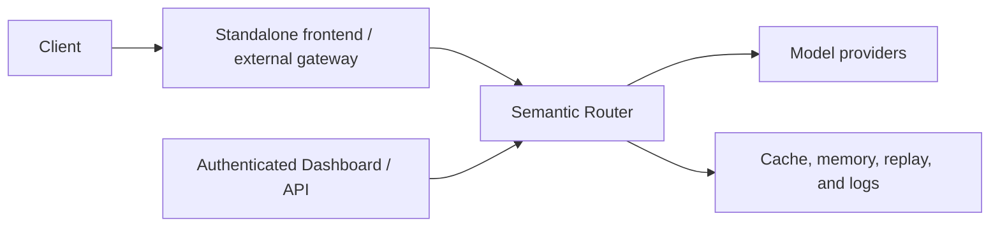

# Security Hardening

Semantic Router sits on the request path between clients and model providers.
Treat it as part of the application's trust boundary: it can inspect prompts,
choose providers, mutate requests, and optionally retain routing data.

This guide highlights the controls that need an explicit production decision.
It does not replace the identity, network, secret-management, and data-governance
controls of the surrounding platform.

## Map the trust boundaries


```mermaid
flowchart LR
    Client["Client"] --> Listener["Standalone frontend / external gateway"]
    Listener --> Router["Semantic Router"]
    Router --> Provider["Model providers"]
    Admin["Authenticated Dashboard / API"] --> Router
    Router --> Stores["Cache, memory, replay, and logs"]
```

Review each boundary separately:

- who can call inference endpoints;
- which identity claims the Router trusts;
- which models and tools each role may use;
- where provider credentials are stored;
- which requests may leave the local environment;
- what prompts, responses, and route metadata are retained; and
- who can change configuration or inspect stored data.

## Protect the public listener

The standalone frontend strips untrusted identity and proxy-control headers.
Configure listener API keys, Chat model allowlists, and native model grants
separately; see [Gateway Modes](gateway-modes). Do not treat a Dashboard login
as a public inference credential.

The maintained Envoy configuration also removes internal control headers. Keep
that boundary when supplying a custom Envoy or gateway configuration. Internal
examples include:

```yaml
request_headers_to_remove:
  - x-authz-user-id
  - x-authz-user-groups
```

Do not expose Router management, metrics, ExtProc, or backing-store ports as
public inference endpoints. Terminate client authentication at a trusted
boundary and allow only that component to supply identity headers.

Relevant Dashboard permissions include:

| Permission | Purpose | Default roles |
| --- | --- | --- |
| `feedback.submit` | Submit routing feedback. Read-role feedback is recorded on the replay without updating model experience. | admin, write, read |
| `replay.read` | List replay records. | admin, write, read |
| `logs.read` | Read bounded local-stack service logs. | admin, write |

The Router management API distinguishes replay metadata from replay detail.
The Dashboard service can retrieve complete records, then removes captured
bodies and tool payloads for users who do not have configuration-write access.
It does not receive permission to reveal stored secret values.

See the [management API reference](../api/apiserver) for endpoints and response
contracts.

## Keep credentials out of configuration

Use environment references in canonical YAML:

```yaml
api_key: ${MODEL_API_KEY}
```

Do not commit literal API keys, passwords, authorization headers, credential
query parameters, or URLs containing user information.

For `vllm-sr serve --target kubernetes`, the CLI places sensitive environment values
in an immutable Secret revision scoped to the namespace and Helm release. Helm
values and the Deployment reference the Secret by name; they do not contain
the credential value. A failed upgrade keeps the previous workload and Secret
active. Release-owned old revisions are removed only after they are no longer
referenced.

Existing chart-native Secret references, such as a Dashboard JWT Secret, remain
external objects and are not copied into the CLI-managed Secret. Use the same
namespace and release ownership discipline for every manually managed Secret.

### Isolate sr-bench credentials

The Dashboard proxies a server-owned sr-bench origin and forwards authenticated
user ownership. `SR_BENCH_TOKEN_ENV` names the service token environment variable
(default `SR_BENCH_TOKEN`). Keep this token separate from model API credentials
and Router management credentials. Browser manifests cannot change registered
target endpoints, prices, credential references or execution harness options.

The managed core worker receives only the registered model credential references
and its service token through inherited environment variables, not command-line
values. Its private store and adjacent token file live outside the common Router
and Dashboard mounts; the worker has no Docker socket or GPU passthrough.
Dashboard receives the service token but not model credential values.

For code/agent evaluation, use an independently prepared worker host and set
`SR_BENCH_URL` to an authenticated origin reachable by the Dashboard. The
standalone service binds loopback by default and requires a service token for
non-loopback binding. Keep its source, sandbox and model credentials confined to
that host. See [sr-bench 1.0](../benchmarking/sr-bench) for setup and limits.

## Secure the local stack's storage credentials

`vllm-sr serve` provisions Redis and Postgres for the local stack, so it also
owns their credentials. Each stack generates its own on first start. No value
ships in this repository, and nothing falls back to a shared default.

Where the material lives:

| Artifact | Path under `<state-root>/.vllm-sr/storage-secrets/` | Mode |
| --- | --- | --- |
| Credential state | `secrets[.<stack>].json` | `0600` |
| Postgres password | `postgres-password[.<stack>]` | `0600` |
| Redis config | `redis[.<stack>].conf` | `0644` |

The directory itself is `0700` and owner-verified, so every file in it is
unreachable by other users. The Redis config is `0644` on purpose: the Redis
image drops to an unprivileged user before reading it, and the bind mount
resolves inside the container without traversing the host's private parent.

The values reach their consumers without entering any shared surface. Postgres
reads its password from the mounted file via `POSTGRES_PASSWORD_FILE`; Redis
reads `requirepass` from its mounted config; Router receives the values as
inherited environment names and the generated runtime config carries only
`${VLLM_SR_STACK_POSTGRES_PASSWORD}` and `${VLLM_SR_STACK_REDIS_PASSWORD}`.
They do not appear in a `docker` command line, a generated config file, a log
record, or a report artifact. Dashboard is not given them.

These credentials authenticate network peers. They do not constrain a caller
that can reach the container runtime directly: the Postgres image trusts local
socket connections, so anyone able to `docker exec` bypasses the password. Keep
[container-runtime access](#limit-container-runtime-access) restricted
accordingly.

### Network layering

The local stack runs on two bridge networks.

| Container | `vllm-sr-network` | `vllm-sr-data-network` |
| --- | --- | --- |
| Redis, Postgres, Milvus | no | yes |
| Router | yes | yes |
| Envoy, Dashboard | yes | no |
| Jaeger, Prometheus, Grafana | yes | no |

Router is the only container on both. Requests reach it over the application
network; it reaches the stores over the data network. A named stack prefixes
both names, so two stacks share neither. Milvus joins the data network even
though it has no credentials of its own yet.

This closes east-west reachability. A container on the application network,
such as a sidecar, cannot
open a connection to `vllm-sr-redis:6379` or `vllm-sr-postgres:5432` at all. The
storage ports remain published on `127.0.0.1` only, which closes the same
exposure from the host side.

It does not constrain a caller that can reach the container runtime. Such a
caller can attach a container to any network, so the split is a boundary for
workloads, not for the runtime socket.

A stack created before the split has its stores on the application network. The
next `vllm-sr serve` attaches each running store to the data network and
detaches it from the application network. If that detach fails, `serve` stops
rather than continuing: a stack that reports the isolation without having it is
worse than one that refuses to start.

### Rotate

```bash
vllm-sr storage rotate
```

The command is scoped to one stack and follows `VLLM_SR_STACK_NAME`, like
`serve` and `stop`. Rotate each stack separately; there is deliberately no
cross-stack mode, because a partial failure would leave some stacks revoked and
others not.

Rotation has a short degradation window. Postgres changes its role password in
place, so existing connections continue but new ones fail until Router
restarts. Redis is rebuilt against its named volume. Plan the rotation for a
moment when a brief Router restart is acceptable.

### Recover

**The credential state is missing or malformed.** The CLI fails closed rather
than regenerating silently, because a regenerated credential would leave the
CLI believing it has access it no longer has. Delete the state file and rerun
`vllm-sr serve`. The stack is taken over in place: Postgres is re-keyed over
its trusted local socket, Redis is rebuilt against the same named volume, and
no data is lost.

**Data from an older stack is not picked up.** Storage data now lives in named
volumes, and an existing container's volume is adopted by name when the stack
is taken over. A container removed by an older CLI leaves its volume behind
with no record of which container it belonged to, so it cannot be adopted
automatically. Recover it manually:

```bash
docker system df -v --format '{{json .Volumes}}'
```

Look for volumes with `Links: 0`. Identify each candidate by its contents — a
Postgres data directory contains `PG_VERSION`, a Redis one contains
`dump.rdb`:

```bash
docker run --rm -v <volume>:/v:ro alpine ls /v
```

Then start a container against the identified volume, or copy its contents into
the stack's named volume (`vllm-sr-postgres-data` / `vllm-sr-redis-data`, with
the stack prefix for a named stack). The CLI does not guess which orphaned
volume is yours.

**An older CLI is used against a rotated stack.** It will fail to authenticate.
That is the intended outcome. Either upgrade the CLI, or reset the passwords by
hand through the container runtime.

## Secure the local stack's management credential

The Dashboard calls the Router management API with one service credential, the
`dashboard_control_plane` role. When a Recipe turns on bearer authentication,
the Router accepts the Dashboard only with that credential. `vllm-sr serve`
creates both containers, so it owns the value:

- It uses `VLLM_SR_DASHBOARD_RECIPE_TOKEN` from its own environment when you
  set it (64 lowercase hexadecimal characters, such as the output of
  `openssl rand -hex 32`), and never writes that value down.
- Otherwise the stack generates one on its first start and keeps it in
  `<state-root>/.vllm-sr/management-credential/dashboard[.<stack>].json`, mode
  `0600`, in an owner-verified `0700` directory.
- The Dashboard always receives it, and the Router whenever its runtime config
  binds it, as an inherited environment name. It never appears in a `docker`
  command line, a generated config file, the Recipe store or a log record, and
  the Dashboard keeps no copy on disk. A Recipe cannot bind the name as one of
  its environment inputs.

Who can read it: the user who runs `vllm-sr serve`, the Router and Dashboard
processes, and anyone who can inspect the containers through the container
runtime. To rotate it, delete the state file and run `vllm-sr serve`: it
generates a new value and recreates the Router and the Dashboard with it.

### Recipe store permissions

`vllm-sr serve` reads the Dashboard's Recipe store before it starts the stack
and finishes interrupted activations, as the user who runs it. The store,
`<state-root>/.vllm-sr/recipe-store/<stack>`, is therefore shared with that
user's group: its files are group-readable and its directories group-writable.
`.vllm-sr` around it stays open to its owner and the Dashboard only, so other
host users cannot reach the store, and the store holds package and config
documents only, no credential.

A store written by an earlier Dashboard is private to the Dashboard's account.
If `vllm-sr serve` reports that it cannot read it, share it once with the
command it prints (`chgrp -R` to your group and `chmod -R g+rwX`); the Dashboard
keeps it shared from then on. Rootless Docker and Podman map container users to
other host IDs, so this sharing does not reach the host user there.

## Review stored request data

Replay, response cache, memory, response history, service logs, and provider
logs can all retain data derived from a request. Their settings are independent
from the model's placement. A route to a local model can still write a prompt
or response to a shared store.

For every enabled store:

- identify which routes write to it;
- inspect whether request or response bodies are captured;
- set a retention and deletion policy;
- restrict read and backup access;
- use encryption and transport security appropriate to the data; and
- test behavior when the store is unavailable.

Recipe Model Cards describe the checked-in replay and cache behavior for each
maintained recipe. See [Data and Storage](storage-overview) for deployment
guides.

## Limit container-runtime access

`vllm-sr serve` is the only part of the local stack that uses the container
runtime. It creates, recreates and stops the stack's containers, and applies
every change saved in the Dashboard that needs them created anew. No stack
container mounts the runtime socket, and the Dashboard image contains no
container CLI. The Dashboard runs as a non-root user and reads service status
from the Router's and Envoy's HTTP probes and the files the CLI keeps beside
the runtime config, and service logs from the bounded log spool.

Treat access to the runtime as administrator access to the stack. A caller who
can reach it can read container environments, including the management
credential, and bypass the storage passwords. Keep the socket to the runtime's
administrators, and do not mount it into a stack container.

## Production checklist

- [ ] Authenticate the public inference listener and the management surface.
- [ ] Strip internal control and identity headers at the trusted proxy.
- [ ] Bind Router management, ExtProc, metrics, and store ports to private
      interfaces.
- [ ] Restrict model access and rate limits by role or tenant.
- [ ] Keep provider and store credentials in a secret manager or Kubernetes
      Secret.
- [ ] Review every route's provider locality, tools, and data-retention behavior.
- [ ] Grant replay detail, logs, and configuration writes only to trusted
      operators.
- [ ] Set strict failure behavior where bypassing a policy is unacceptable.
- [ ] Rotate the local stack's storage credentials on the same schedule as
      every other credential.
- [ ] Test backup, restore, credential rotation, upgrade, and rollback.
- [ ] Keep the container-runtime socket out of every stack container; only
      `vllm-sr serve` uses the runtime.
