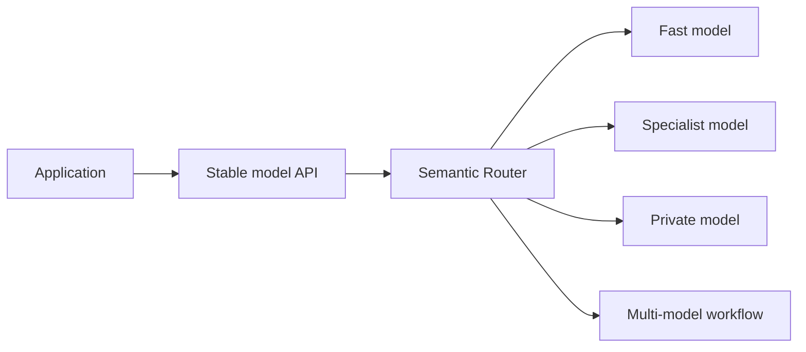

# vLLM Semantic Router

Modern AI applications rarely depend on one model. They use fast models for
interactive work, specialist models for code or vision, larger models for hard
reasoning, and private models for sensitive data. Those models may run on
different hardware, in different locations, and with different limits.

vLLM Semantic Router turns that changing model pool into one coherent service.
Applications call a stable OpenAI- or Anthropic-compatible endpoint; the Router
uses request meaning, policy, user intent, and runtime information to choose an
allowed execution path.

## What it solves

- **Clients should not track the model fleet.** A public model name can remain
  stable while its routing policy and backend pool evolve.
- **Hard constraints belong before optimization.** Privacy, authorization,
  modality, context length, and tool support can rule out unsafe or incapable
  paths before cost or latency ranking begins.
- **Different requests need different objectives.** The same pool can expose a
  balanced, fast, economical, accuracy-first, or local-only experience.
- **Some tasks need more than selection.** A route can choose one model,
  escalate by confidence, compare several answers, or run a bounded workflow.
- **Routing should be observable.** Decisions, feedback, replay, and evaluation
  make policy behavior inspectable instead of hiding it in application code.

## How it works

The request path is organized into explicit layers:

1. **Signals** describe the request and its context.
2. **Projections** combine related evidence into reusable scores or bands.
3. **Decisions** apply policy and select an eligible route.
4. **Algorithms** select or coordinate the route's candidate models.
5. **Plugins** run route-specific request, execution, or response hooks.
6. **Model pools** provide the physical inference endpoints.

The Router runs in the Envoy request path. The CLI and Dashboard configure and
operate local deployments, while Helm and the Operator integrate the same
canonical configuration with Kubernetes.

## Common uses

- route simple requests to efficient models and difficult work to stronger ones;
- keep sensitive workloads on approved local backends;
- preserve tool, vision, and long-context compatibility;
- send domain-specific work to specialist models;
- recover from low-confidence or unsatisfactory answers;
- expose several routing objectives from one shared model pool; and
- evaluate routing policy independently from model answer quality.

## Start here

- [Why Semantic Routing](overview/goals) explains the problem and design goals.
- [System Overview](overview/semantic-router-overview) shows the data plane,
  control plane, and request lifecycle.
- [Use Cases](overview/use-cases) maps real workloads to routing patterns.
- [Routing Pipeline](overview/signal-driven-decisions) explains how the policy
  layers fit together.
- [Mixture of Models](overview/mom-model-family) explains virtual models,
  selection, cascades, and orchestration.
- [Quickstart](/docs/installation) starts a local stack and sends a first
  request.

For a broader perspective on why semantic routing is becoming the decision
layer for heterogeneous AI systems, read
[The Semantic Routing Moment](https://www.liuxunzhuo.com/semantic-routing/).

## Project

vLLM Semantic Router is open source under the Apache 2.0 license. See the
[contributing guide](https://github.com/vllm-project/semantic-router/blob/main/CONTRIBUTING.md)
to propose changes or join the project community.
