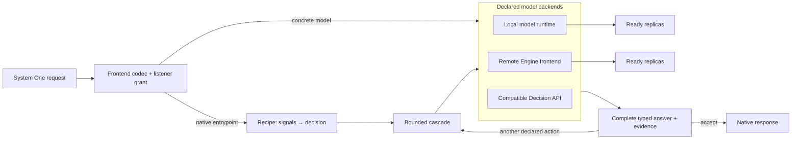

# Component Architecture

vLLM-SR combines a request frontend, an optional routing decision engine, and
model-serving resources. Run them together to route model calls, or serve a
decision model directly without configuring Chat backends.

These diagrams show the native HTTP frontend's logical components. They are
not a container layout or the complete Envoy/ExtProc deployment topology. See
[Gateway Modes](../installation/gateway-modes) for those deployment choices.

Click a diagram to open its full-size SVG.

## Compose the serving path

[](/img/architecture/system-one/01-component-composition.svg)

| Component | Responsibility |
| --- | --- |
| **Frontend** | Accept requests, enforce listener access, and adapt API protocols. |
| **Decision Engine** | Resolve a routing entrypoint to its recipe, evaluate signals and decisions, and coordinate Chat or native decision-model backends. |
| **Serving Engine / model runtime** | Serve decision, classifier, embedding, and reranking models through managed or attached workers. |
| **Chat backends** | Generate responses using your vLLM, Ollama, or provider services. |

The native System One API is available in both startup modes when the listener
publishes its models. Router mode additionally enables recipe routing and Chat
backends. Engine mode keeps the frontend and model management while leaving
saved routing configuration inactive:

```bash
# Router: MODEL overrides the default judgment model; Chat backends stay in YAML.
vllm-sr serve vllm-sr/Vela-2.0-0.3B --config config.yaml

# Engine: no Chat backend or user-authored routing YAML is needed.
vllm-sr serve vllm-sr/Vela-2.0-0.3B --engine --platform cpu
```

Every invocation without `--engine` (`-e`) starts Router mode. Passing MODEL
alone does not select Engine mode. Dashboard reports the startup mode and
manages deployments; it does not switch the instance mode.

Model workers are prepared for actual consumers: native model grants, routing
tasks, and enabled model-backed services. Declaring an unused deployment does
not start it. A rule-only Chat router can therefore run without model workers
when no other feature needs them. Semantic cache, embeddings, memory, and RAG
can introduce additional consumers. “On demand” refers to this configuration
demand, not loading every model on its first request.

## Separate protocol handling from routing policy

[](/img/architecture/system-one/02-frontend-and-decision-engine.svg)

For a routed request, the main decision path is:

1. Resolve the public model name to an entrypoint and recipe.
2. Evaluate the required **signals** and derive **projections**.
3. Match a **decision** and its candidate set.
4. Run its **algorithm** to select one backend or a bounded multi-model plan.
5. Dispatch and return the response through the appropriate protocol adapter.

Recipe plugins run at their request, execution, or response hooks; they are
not all one final step after model selection. Model-backed tasks resolve their
bindings independently of the Chat backend they help select. See the
[Routing Pipeline](signal-driven-decisions) for policy authoring.

Chat Completions, Responses, and Messages use protocol codecs. System One has
its own typed request handler. A concrete native model ID bypasses recipe
routing; an explicitly published native entrypoint enters its System One
recipe. Concrete Chat backend IDs also bypass recipe signals, decisions, and
plugins. Native recipes support a narrower set of signals and algorithms than
Chat recipes; see the [cascade guide](../tutorials/algorithm/native/cascade.md).

### Keep public and worker APIs distinct

| Surface | Endpoints | Access and purpose |
| --- | --- | --- |
| Public Chat APIs | `/v1/chat/completions`, `/v1/responses`, `/v1/messages`; discovery at `/v1/models` | Router mode; listener access and the requested API's service requirements apply. |
| Public System One API | `/v1/systemone`, alias `/v1/decisions`; discovery at `/v1/systemone/models` | Either startup mode; requires explicit `listeners[].systemone.models` publication and listener API keys when configured. |
| Worker API | Classify, embeddings, rerank, decisions, and bundle APIs supported by the loaded model | An independently operated `vllm-srun` endpoint or a private managed socket; not automatically published by the frontend. |

Dashboard sessions do not replace public listener credentials. Native model
grants are separate from the listener's Chat `models` allowlist. See the
[System One quickstart](../model-runtime/quickstart.md) for a complete request.

## Scale a deployment through replicas

[](/img/architecture/system-one/03-serving-engine-and-workers.svg)

Model selection answers **which model should handle this task?** Replica
dispatch answers **which ready worker of that deployment should execute it?**
They are separate decisions.

Managed replicas have independent processes that vLLM-SR starts and supervises.
Attached replicas point to independently operated runtimes. Compatible workers
in a pool share model identity, revision, profile, and capabilities. The diagram's
GPU placement is an example; CPU workers are also supported.

Current dispatch prefers the ready worker with the fewest outstanding request
bytes, breaking ties by the least recently assigned worker. Admission is
bounded at 32 in-flight HTTP requests per worker; the pool reports overload
instead of maintaining a waiting queue. These observations are not measured
token counts or GPU-forward concurrency.

Inside a worker, the model family defines inputs and typed outputs, the profile
plans work and numerics, and the execution engine and accelerator run it.
Several questions can share a request or compatible work, but one API call can
still require multiple forwards. These are software interfaces, not neural
network layers.

```bash
# Two independent copies on two host GPUs.
vllm-sr serve vllm-sr/Vela-2.0-4B -e --platform rocm -dp 2 --device-ids 0,1
```

DP replicates the model; it does not shard weights through tensor or pipeline
parallelism. Measure throughput and tail latency for your input lengths before
adding replicas, especially when several workers share one GPU. See
[Frontend and runtime deployments](../model-runtime/deploy.md) and
[Profiles](../model-runtime/profiles.md).

## Route System One across decision models



An explicit `api: systemone` entrypoint selects an isolated native recipe.
Its signals and decisions choose an experimental `cascade` algorithm. Each
cascade keeps a Choice / Score / Noul question bundle together and calls
declared decision-model backends within its own deadline and call budget.
Signal evaluation precedes that budget and retains its own timeouts and request
cancellation. A backend can be a local deployment, a separate
vLLM-SR Engine service, or a compatible external System One API.

The recipe chooses between models; each deployment separately chooses among
its replicas. A cascade first tries its fast stage, then advances only when
its acceptance conditions require another answer. An optional LLM judge can
select an intact earlier candidate or abstain; it cannot manufacture native
probabilities. See [System One cascade](../tutorials/algorithm/native/cascade.md).

Native discovery distinguishes concrete models (`routing: false`) from
published native recipes (`routing: true`). Both require an explicit listener
grant. The Chat default `vllm-sr/auto` does not implicitly enable native auto,
and Engine mode continues to serve concrete models without recipe execution.

## Next

- [System Overview](semantic-router-overview): configuration and deployment context.
- [Quickstart](../installation/installation.md): send a routed Chat request.
- [Model runtime quickstart](../model-runtime/quickstart.md): ask typed questions directly.
- [Frontend and runtime deployments](../model-runtime/deploy.md): bindings, placement, and readiness.
