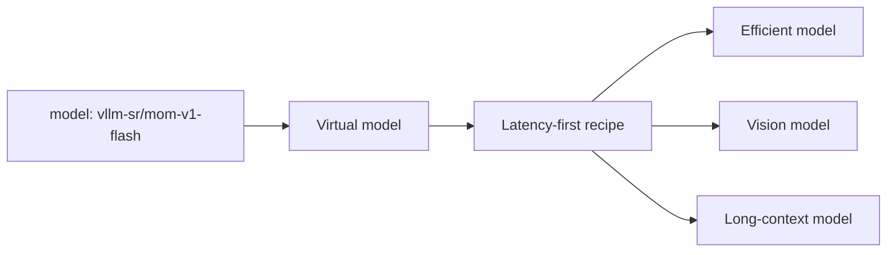

# Mixture of Models

A **Mixture of Models (MoM)** is a serving architecture in which several
independently deployed models act as one system. A routing policy decides which
model, cascade, panel, or workflow should handle each request.

The client does not need to know which physical backend won. It asks for a
stable virtual model that represents the desired behavior.



## MoM is not Mixture of Experts

Mixture of Experts (MoE) is a model architecture: a gating mechanism activates
parts of one checkpoint during inference. Mixture of Models is a serving-system
architecture: independently trained and independently served models are chosen
or coordinated at request time.

MoM can combine dense models, MoE models, hosted APIs, and local models. Their
internal architecture does not change the routing abstraction.

## Three kinds of model in the system

| Kind | Example | Role |
| --- | --- | --- |
| **Provider model** | A vLLM, Ollama, or hosted model endpoint | Generates the application response. |
| **Virtual model** | `vllm-sr/mom-v1-flash` | Gives clients a stable objective and selects a recipe. |
| **Router system model** | An embedding or classifier asset | Helps detect intent, risk, similarity, or another routing signal. |

Router system models support the decision process; they are not themselves the
Mixture of Models product exposed to clients.

## Execution patterns

### Select one model

Most requests should take a direct path. Policy narrows the eligible set and an
algorithm selects one backend by semantic fit, latency, relative cost, feedback,
or a fixed order.

### Cascade

Start with an efficient model, inspect a bounded confidence or verification
signal, and escalate only when needed. Cascades trade extra worst-case latency
for lower average cost.

### Orchestrate several models

Parallel comparison, multi-round reasoning, and workflows can use several
models before producing one response. These paths are valuable for selected
high-accuracy tasks, not as a default for all traffic.

## Virtual models and recipes

An entrypoint maps one or more public model names to an isolated recipe:

```yaml
entrypoints:
  - model_names: ["acme/assistant-fast"]
    recipe: fast

recipes:
  - name: fast
    routing:
      strategy: priority
      decisions:
        - name: default-fast-route
          description: Route eligible requests through the fast model pool.
          priority: 10
          rules:
            operator: AND
            conditions: []
          modelRefs:
            - model: local/small
              use_reasoning: false
            - model: local/vision
              use_reasoning: false
          algorithm:
            type: static
```

In a production recipe, signals and decisions would guard modality, context,
tools, locality, and other requirements before selection. The public model name
does not reach the backend; it resolves to the selected provider model.

See [Virtual Models](../tutorials/global/entrypoints-and-recipes)
for the full schema and isolation rules.

## MoM V1

MoM V1 is the built-in MoM example. It exposes five public models over one
shared pool of seven logical provider aliases:

| Virtual model | Objective |
| --- | --- |
| `vllm-sr/mom-v1-blend` | Balance quality, latency, cost, and answer recovery. |
| `vllm-sr/mom-v1-lite` | Prefer economical direct answers. |
| `vllm-sr/mom-v1-flash` | Prefer interactive latency while preserving capabilities. |
| `vllm-sr/mom-v1-ultra` | Prefer accuracy and allow bounded orchestration. |
| `vllm-sr/mom-v1-vault` | Keep traffic on the configured local pool with stricter containment. |

MoM is a routing policy, not a checkpoint or model installer. Its reference
backends must already be running and available under the configured aliases.
Tool execution remains the client's responsibility, and “local” privacy still
depends on the deployment's network, backends, logs, caches, and stores.

Open **Models** in the Dashboard to connect and verify physical inference
endpoints. Then choose a maintained **Recipe**, assign one or more connected
models to each decision, and publish a **Mixture-of-Model** entrypoint. The
Dashboard keeps backend credentials out of the Recipe while showing the
resulting topology before it goes live.

Start or resume the stack with one command:

```bash
vllm-sr serve
```

Read the full
[MoM V1 Model Card](https://github.com/vllm-project/semantic-router/blob/main/config/recipes/built-in/latest/mom-v1/README.md)
for intended use, backend roles, data handling, evaluation, and limitations.

## When MoM is the wrong abstraction

Use a direct model endpoint when one backend satisfies the workload and policy
is unlikely to change. A multi-model system adds configuration, evaluation,
observability, and operational cost. Its value should come from a clear
capability boundary, objective, or measured routing improvement.

## Next

- [Models, Entrypoints, and Serving](../tutorials/global/models-entrypoints-serving)
  for the complete CLI and backend-binding workflow.
- [Use Cases](use-cases) for practical patterns.
- [Routing Pipeline](signal-driven-decisions) for policy composition.
- [Algorithms](../tutorials/algorithm/overview) for selection and orchestration
  choices.
