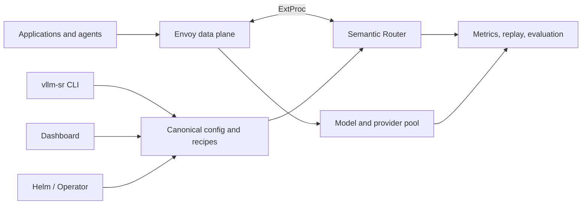

# System Overview

vLLM Semantic Router is a decision layer between AI clients and model
backends. It evaluates each request against an explicit routing policy, then
forwards the request to one model or coordinates a bounded multi-model path.

The project separates the high-throughput request path from the tools used to
configure and operate it.

## Architecture

### Data plane

- **Envoy** accepts client traffic, invokes the Router through the External
  Processing protocol, and forwards the resulting request upstream.
- **Semantic Router** extracts signals, evaluates policy, applies route-specific
  behavior, and selects or coordinates model candidates.
- **Backends** are OpenAI-compatible model services or provider endpoints. The
  Router does not load their model weights.

### Control plane

- **Canonical YAML** is the portable source of routing behavior.
- **Entrypoints** map one or more public model aliases to a recipe.
- **Recipes** are complete policy and runtime-state isolation boundaries. One
  or more entrypoints can select the same recipe.
- **CLI and Dashboard** support local setup, validation, model discovery,
  configuration, and operation.
- **Helm and the Operator** deploy the Router into Kubernetes environments.
- **Evaluation and observability** expose route outcomes so operators can test
  and improve policy.

## Core objects

| Object | Purpose |
| --- | --- |
| **Entrypoint** | A mapping from one or more public model aliases to a recipe. |
| **Recipe** | A complete routing-policy and runtime-state isolation boundary. |
| **Signal** | A named fact about the request, identity, conversation, or content. |
| **Projection** | A reusable score, partition, or band derived from signals. |
| **Decision** | A policy rule that chooses an eligible route and candidate set. |
| **Plugin** | Route-specific processing such as request controls, memory, retrieval, or response handling. |
| **Algorithm** | The method used to select or coordinate candidate models. |
| **Provider model** | A physical inference endpoint available to one or more recipes. |

This separation matters. Detection can be reused across policies, policy can
change without rewriting model selection, and the physical pool can evolve
without changing a public entrypoint.

## Request lifecycle

1. A client sends a request to an OpenAI- or Anthropic-compatible endpoint.
2. Envoy presents the request to the Router.
3. The requested model resolves to an entrypoint and its recipe.
4. The Router extracts relevant signals and computes projections.
5. Decisions enforce constraints and choose an eligible candidate set.
6. The route's algorithm selects one model or executes a bounded multi-model
   strategy.
7. Route plugins run at their configured request, execution, or response hook.
8. Envoy sends the provider-shaped request to the selected backend and returns
   the normalized response.

Explicit physical model names can still be exposed when an operator wants
direct selection. Those requests pass through without recipe signals,
decisions, route plugins, cache, learning, or session routing. Virtual model
names are useful when clients should choose an objective while the Router owns
the physical route. If no decision matches inside the selected recipe, the
configured default provider model is used.

## Protocol and deployment boundaries

Semantic Router can sit behind a direct Envoy listener or integrate with
Kubernetes gateway and inference-platform deployments. The same routing model
applies in local Docker, Kubernetes, and hybrid environments, but model
provisioning and capacity management remain the responsibility of the chosen
backend platform.

The Router can consider request semantics and configured runtime observations;
it does not replace a backend scheduler. A deployment may therefore use
Semantic Router to choose a model class and another component to choose a
healthy replica of that model.

## Next

- [Use Cases](use-cases) for practical deployment patterns.
- [Routing Pipeline](signal-driven-decisions) for the policy layers.
- [Mixture of Models](mom-model-family) for virtual models and multi-model
  execution.
- [Quickstart](/docs/installation) to run the local stack.
