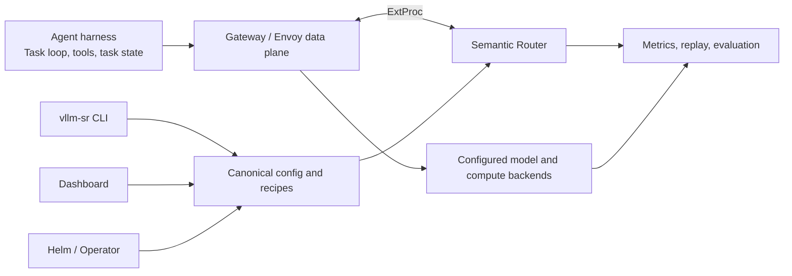

# System Overview

Agent harnesses call a stable model endpoint. Semantic Router applies policy to
select one model or coordinate a bounded multi-model path over configured
backends. The data plane handles requests; the control plane configures and
operates it.

## Architecture


```mermaid
flowchart LR
    Harness["Agent harness<br/>Task loop, tools, task state"] --> Envoy["Gateway / Envoy data plane"]
    Envoy <-->|"ExtProc"| Router["Semantic Router"]
    Envoy --> Pool["Configured model and compute backends"]

    CLI["vllm-sr CLI"] --> Config["Canonical config and recipes"]
    Dashboard["Dashboard"] --> Config
    Operator["Helm / Operator"] --> Config
    Config --> Router

    Router --> Telemetry["Metrics, replay, evaluation"]
    Pool --> Telemetry
```

### Data plane

- **Agent harness** owns the task loop, tool execution, and durable task state.
  Each inference call crosses the Router boundary; the response returns to the
  harness for the next step.
- **Envoy** accepts client traffic, invokes the Router through the External
  Processing protocol, and forwards the resulting request upstream.
- **Semantic Router** extracts signals, evaluates policy, applies route-specific
  behavior, and selects or coordinates model candidates.
- **Backends** are configured model services or provider endpoints. The
  Router does not load their model weights.

### Control plane

- **Canonical YAML** is the portable source of routing behavior.
- **Entrypoints** map one or more public model aliases to a recipe.
- **Recipes** are complete policy and runtime-state isolation boundaries. One
  or more entrypoints can select the same recipe.
- **CLI and Dashboard** support local setup, validation, model discovery,
  configuration, and operation.
- **Helm and the Operator** deploy the Router into Kubernetes environments.
- **Evaluation and observability** expose route outcomes so operators can test
  and improve policy.

## Core objects

| Object | Purpose |
| --- | --- |
| **Entrypoint** | A mapping from one or more public model aliases to a recipe. |
| **Recipe** | A complete routing-policy and runtime-state isolation boundary. |
| **Signal** | A named fact about the request, identity, conversation, or content. |
| **Projection** | A reusable score, partition, or band derived from signals. |
| **Decision** | A policy rule that chooses an eligible route and candidate set. |
| **Plugin** | Route-specific processing such as request controls, memory, retrieval, or response handling. |
| **Algorithm** | The method used to select or coordinate candidate models. |
| **Provider model** | A physical inference endpoint available to one or more recipes. |

Reuse detection across policies, change policy independently of model selection,
and evolve the physical pool behind a stable public entrypoint.

## Request lifecycle

1. A harness sends a request using OpenAI Chat Completions, OpenAI Responses, or
   Anthropic Messages.
2. Envoy presents the request to the Router.
3. The requested model resolves to an entrypoint and its recipe.
4. The Router extracts relevant signals and computes projections.
5. Decisions enforce constraints and choose an eligible candidate set.
6. The route's algorithm selects one model or executes a bounded multi-model
   strategy.
7. Route plugins run at their configured request, execution, or response hook.
8. Envoy sends the provider-shaped request to the selected backend and returns
   the normalized response.

This lifecycle covers a model call inside the harness's task loop. Router
plugins can filter the tools exposed to a model or process request context;
the harness and tool services still own tool execution and authorization.
Configured multi-model algorithms coordinate model calls within this boundary.

Explicit physical model names can still be exposed when an operator wants
direct selection. Those requests pass through without recipe signals,
decisions, route plugins, cache, learning, or session routing. Virtual model
names are useful when clients should choose an objective while the Router owns
the physical route. If no decision matches inside the selected recipe, the
configured default provider model is used.

## Protocol and deployment boundaries

Semantic Router can sit behind a direct Envoy listener or integrate with
Kubernetes gateway and inference-platform deployments. The same routing model
applies in local Docker, Kubernetes, and hybrid environments, but model
provisioning and capacity management remain the responsibility of the chosen
backend platform.

The Router can consider request semantics and configured runtime observations;
it does not replace a backend scheduler. A deployment may therefore use
Semantic Router to choose a model class and an Inference Router to choose a
healthy replica of that model. When an AI Gateway also fronts the stack, a
request crosses three routing layers:

```text
agent harness
  -> AI Gateway (e.g. Agent Router / LiteLLM / agentgateway)
  -> Semantic Router ExtProc
  -> Inference Router / pool scheduler (e.g. llm-d / vLLM Router / AIBrix gateway)
  -> model replica
```

| Layer | What it owns | Examples |
| --- | --- | --- |
| **AI Gateway** | Client ingress, provider translation, credentials, rate limits, and traffic policy. | [Agent Router (formerly Envoy AI Gateway)](../installation/k8s/ai-gateway), [LiteLLM](https://docs.litellm.ai/docs/simple_proxy), [agentgateway](../installation/k8s/agentgateway) |
| **Semantic Router** | Logical model or model pool selection from request intent and policy, through recipes and decisions. The choice is written to `x-selected-model`. | vLLM Semantic Router |
| **Inference Router** | Healthy replica or endpoint selection inside the selected pool. | [llm-d](../installation/k8s/llm-d), [vLLM Router](https://github.com/vllm-project/router), [AIBrix gateway](../installation/k8s/aibrix) |

Agent Router and agentgateway call Semantic Router through ExtProc.
[Kubernetes Gateways](../installation/k8s/gateways) and
[Inference Platforms](../installation/k8s/inference-platforms) list the
integrations this project maintains.

The client and selected backend do not need to use the same wire format. See
[Protocol Compatibility](../installation/protocol-compatibility) for the
supported client endpoints, backend formats, and pairwise translation matrix.

## Next

- [Use Cases](use-cases) for practical deployment patterns.
- [Routing Pipeline](signal-driven-decisions) for the policy layers.
- [Mixture of Models](mom-model-family) for virtual models and multi-model
  execution.
- [Quickstart](/docs/installation) to run the local stack.
