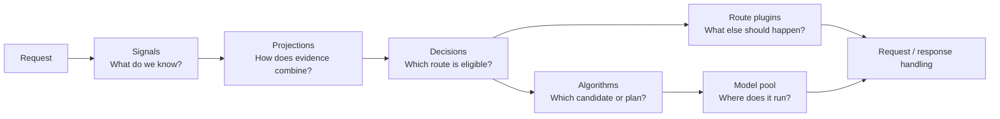

# Routing Pipeline

Semantic Router separates request understanding, policy, and model execution.
Each layer answers a different question, which keeps routing rules readable and
prevents one classifier or optimization score from becoming the whole policy.

## Signals: extract facts

A signal gives a name to something detected from the request, conversation,
identity, or content. Some signals are deterministic, such as a keyword,
metadata predicate, or context-length band. Others use embeddings or classifier
models for semantic intent, domain, complexity, PII, or jailbreak detection.

Signals describe facts; they do not choose the backend. The same signal can be
reused by several decisions inside one recipe.

See the [signal overview](../tutorials/signal/overview) for the maintained
heuristic and learned families.

## Projections: coordinate evidence

Projections turn several signal outputs into a reusable result:

- a **partition** chooses a coherent winner among overlapping matches;
- a **score** combines weighted inputs; and
- a **mapping** converts a score into named routing bands.

For example, domain evidence can form one exclusive domain partition while
complexity, context, and verification evidence form a difficulty score. Several
decisions can then reference those results without repeating the combination
logic.

See [Projections](../tutorials/projection/overview).

## Decisions: apply policy

A decision combines signals and projection outputs with boolean rules. Its
priority and the recipe's strategy determine which matching route wins. The
matched decision supplies candidate models, an optional algorithm, and
route-local plugins.

Keep hard requirements visible here. Authorization, local-only processing,
modality, context capacity, and tool compatibility should make a route eligible
or ineligible before an optimizer compares cost or latency.

See [Decisions](../tutorials/decision/overview).

## Algorithms: select or coordinate models

After a decision matches, its algorithm handles the candidate set.

- **Selection algorithms** choose one candidate using a fixed order, semantic
  fit, latency, feedback, or another bounded policy.
- **Looper algorithms** coordinate several calls through a cascade, panel,
  multi-round process, or workflow.

When a decision has one candidate, the simplest static behavior is often the
right choice. Orchestration should be reserved for tasks where its additional
latency and compute have measured value.

See [Algorithms](../tutorials/algorithm/overview).

## Plugins: apply route-specific behavior

Plugins add behavior associated with the selected route. Depending on the
plugin, that behavior may run before the provider request, during execution,
or while processing the response. Examples include request parameter changes,
context compression, retrieval, memory, replay, response caching, and response
controls.

Detection and enforcement are different. For example, a PII signal reports a
match; the decision and plugin policy determine whether to block, reroute,
transform, or simply observe it.

See [Plugins](../tutorials/plugin/overview).

## Model pools: execute the request

Providers bind logical model names to physical inference endpoints. A pool can
contain local vLLM or Ollama services, Kubernetes-hosted models, or remote
OpenAI-compatible providers. Semantic Router chooses the model path; the model
server or backend scheduler executes it and owns replica placement.

Capability and runtime metadata are useful only within policy boundaries. A
fast backend is not eligible if it cannot handle the request's modality,
context, tools, or locality requirement.

## Recipes keep policies isolated

An entrypoint selects one recipe. That recipe owns its signals, projections,
decisions, algorithms, plugins, cache namespace, and routing state. Providers,
stores, and router-owned model assets can be shared without allowing one
recipe's policy to leak into another.

Concrete backend model names are direct pass-through requests. They bypass
recipe signals, decisions, route-local plugins, cache, learning, and session
routing. If a virtual entrypoint's recipe has no matching decision, the Router
uses the configured default provider model.

See [Entrypoints and Multi-Recipe Routing](../tutorials/global/entrypoints-and-recipes)
for the complete configuration contract.

## Workload, Router, and pool

A useful routing decision joins three views:

| View | Examples |
| --- | --- |
| **Workload** | intent, language, complexity, context, tools, modality, identity |
| **Router policy** | eligibility, priority, objective, plugins, algorithm |
| **Model pool** | capabilities, locality, health, latency, load, relative cost |

The workload says what is needed. Policy says what is allowed and preferred.
The pool says what is currently available. Keeping these views separate makes
the system easier to change and evaluate.
