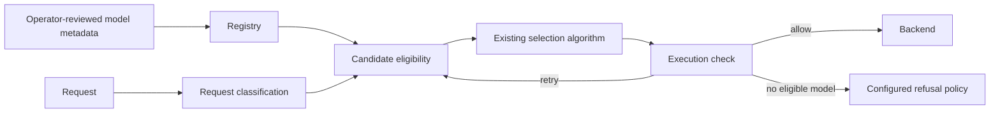

> **Status:** Proposal · **Created:** 2026-03-20

## Problem

Semantic relevance is not the same as eligibility. A model may appear suitable for a
domain while lacking an operator-approved role, required provenance, or permission to
answer a particular class of request.

PRISM proposes an optional legitimacy check around model selection. It does not
replace the recipe's signals, decisions, or selection algorithm.

## Proposal

PRISM divides the check into three keys:

| Key | Question | Output |
| --- | --- | --- |
| Qualification | What domains and constraints are approved for this model? | A registry entry. |
| Classification | What domain and constraints apply to this request? | A request classification with confidence. |
| Execution | Is the selected model eligible under both records? | Allow, retry with another candidate, or refuse. |

## Qualification registry

The 153-key schema is intended to describe domain qualifications, scope restrictions,
and evidence. The registry should be deterministic and inspectable at request time.

Model-generated self-description may help populate a draft entry, but it is not
authoritative evidence. Production eligibility should come from signed metadata,
operator review, or another trusted control-plane source. Registry entries need a
version, provenance, activation state, and expiration or review policy.

## Request classification

Classification maps the request to the same vocabulary used by the registry. A result
contains a domain, confidence, and any constraints required by policy. Low-confidence
or unknown results follow an explicit fallback policy; they must not silently become a
high-confidence general classification.

Classification should reuse existing signal infrastructure where possible. PRISM
should not create a parallel request parser or hidden decision engine.

## Candidate and execution checks

The candidate check removes models that are clearly ineligible before the existing
selection algorithm runs. The execution check confirms the selected model against the
same registry entry.

Retry is bounded by the original candidate set. It must not rematch decisions, widen
the recipe's model pool, or loop indefinitely. When no eligible model remains, the
route chooses between a refusal, an operator-declared fallback, or a pass-through
policy.

Pass-through is useful for gradual adoption but is unsafe when PRISM represents a
mandatory compliance control. The default therefore cannot be chosen independently of
the deployment's policy.

## Failure and observability

Registry readiness, classifier failure, and missing model entries are distinct states
and should produce distinct diagnostics. Useful events include:

- registry version and readiness;
- request classification and confidence;
- candidates excluded with reason codes;
- retry count; and
- the final allow, fallback, or refusal outcome.

Diagnostics must avoid exposing sensitive request text or qualification evidence in
response headers.

## Scope and non-goals

The initial proposal covers the combined qualification, request-classification, and
execution path. It does not:

- define the truth of a model's training claims;
- replace safety filters or authorization;
- choose a new model outside the matched decision;
- persist registry state without an explicit storage design; or
- establish universal thresholds for every domain.

## Evaluation

Use an operator-reviewed matrix of requests and eligible models. Measure false
allowances, false refusals, unknown-domain behavior, registry-unavailable behavior,
and additional routing latency. Include adversarial model metadata and stale registry
entries.

## Open questions

- Who signs or approves qualification records?
- Which parts of the 153-key schema are required for a minimal entry?
- Is in-memory registry state sufficient, or must updates survive restarts?
- Which routes require fail-closed behavior?
- How are overlapping or hierarchical domains represented?

## References

- [Tracking issue #1422](https://github.com/vllm-project/semantic-router/issues/1422)
- [PRISM white paper](https://github.com/user-attachments/files/25750911/PRISM-Vllm-SR-whitepaper-COMPLET-EN.pdf)
- [Signals, decisions, and model selection](../overview/signal-driven-decisions)
