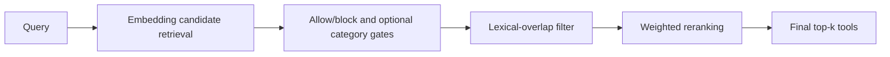

> **Status:** Implemented · **Created:** 2026-01-14

## Problem

Embedding similarity can retrieve tools that are linguistically close but wrong for
the user's intent. Returning too many near matches increases tool-choice ambiguity and
can expose tools from an unrelated domain.

Tool relevance is not authorization, but relevance should still be inspectable and
configurable.

## Implemented design

Advanced filtering is an optional stage in the `tool_selection` plugin's add mode:

When disabled, tool selection keeps the ordinary embedding retrieval path.

## Scoring

The reranker can combine normalized embedding similarity with lexical overlap and
matches on tool tags, name, and category. Operators choose the weights and a minimum
combined score.

The score is a relevance heuristic, not a probability. Weights and thresholds should
be calibrated on the deployment's own tool catalog and request set.

## Configuration boundary

The main controls are:

| Control | Purpose |
| --- | --- |
| `candidate_pool_size` | Limits the wider pool considered before final top-k selection. |
| `min_lexical_overlap` | Requires a minimum number of shared normalized terms. |
| `min_combined_score` | Rejects candidates below the final reranking score. |
| `weights` | Balances embedding, lexical, tag, name, and category evidence. |
| `allow_tools` / `block_tools` | Applies deterministic catalog restrictions. |
| `use_category_filter` | Enables category gating when category evidence is available. |

Use the maintained tool-selection fragment and current configuration schema for exact
field types and defaults.

## Failure and security behavior

Invalid weights and thresholds are rejected during configuration validation. Runtime
failure follows the plugin's configured fallback behavior.

Allow and block lists do not replace authorization. The caller or execution layer must
still verify that the user is permitted to invoke a selected tool.

## Scope and non-goals

Advanced filtering reranks a bounded set of tool candidates. It does not execute
tools, infer user permission, guarantee intent correctness, or add another model
dependency.

## Evaluation

Evaluate on a versioned catalog and labeled request set. Report precision, recall,
empty-selection rate, catalog coverage, and added latency. Percentage improvements
require a reproducible dataset, baseline configuration, and evaluation artifact.

## References

- [Tool-selection plugin guide](../tutorials/plugin/tool-selection)
- [Maintained add-mode fragment](https://github.com/vllm-project/semantic-router/blob/main/config/fragments/plugin/tool-selection/add-from-database.yaml)
- [Related issue #1002](https://github.com/vllm-project/semantic-router/issues/1002)
