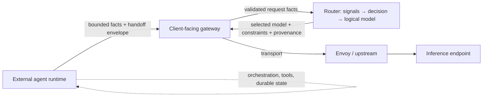

> **Status:** Proposal · **Created:** 2026-08-29 · **Epic:** [#2994](https://github.com/vllm-project/semantic-router/issues/2994)

## Problem

External agent runtimes delegate work through the same OpenAI-compatible gateway
that ordinary inference uses. Those requests carry role, lineage, budget,
capability, and residency constraints that are unsafe to infer from prompt text
alone. The Router must use that information when selecting a **logical model**
without becoming an agent orchestrator.

The [Agent Routing recipe](https://github.com/vllm-project/semantic-router/blob/main/config/recipes/agent/README.md)
routes agentic **workloads to model lanes**. [Router Flow](./router-flow-workflows)
orchestrates bounded multi-**model** workflows. [Session-aware selection](https://github.com/vllm-project/semantic-router/blob/main/src/semantic-router/pkg/selection/session_aware.go) already
applies tool-loop and handoff policy during model switches. None of these define
the versioned, bounded facts and handoff contracts that cross the Router,
gateway, and external-runtime seams.

## Proposal

Define agent-aware **facts** and **handoff envelopes** that let the Router select
logical models safely for external agent runtimes. Preserve the v0.3 contract:

- the Router selects a logical **Model**;
- Envoy and the client-facing gateway own upstream transport;
- recipe **decisions remain model-free** while **entrypoints own `model_names`**;
- optional agent services live **outside** the Router.

This document settles ownership, contract fields, and phased delivery for
maintainer review. Implementation PRs follow contract agreement; they do not
precede it.

## Ownership boundary

| Layer | Owns | Does not own |
| --- | --- | --- |
| **Router** | Semantic decisions, recipe execution, logical-model selection, recipe-scoped plugins, validation and projection of bounded agentic facts, content-minimized diagnostics | Agent identity, task orchestration, tool execution, durable task state, recursive delegation, agent endpoint invocation |
| **Client-facing gateway / data plane** | Deployment-specific proxy, transport, authenticated ingress of envelopes, downstream acknowledgement | Semantic model selection, recipe policy |
| **External agent runtime** | Agent identity, orchestration, tools, durable state, delegation graph, opaque context references | Router recipe decisions, model cards, or provider inventory |
| **Envoy / upstream transport** | Physical routing to the selected model endpoint after the Router decision | Agent discovery, mixed model/agent candidate pools |



Unsupported integrations **fall back to ordinary logical-model routing** with
explicit diagnostics when facts are missing, expired, untrusted, or out of scope.

## Contract surfaces

Epic #2994 defines two versioned, content-minimized surfaces. They are related to
the trusted gateway context envelope in
[#2546](https://github.com/vllm-project/semantic-router/issues/2546) but do not
block independent implementation slices.

### 1. Selection facts envelope ([#3379](https://github.com/vllm-project/semantic-router/issues/3379))

Facts arrive at the **signal boundary** from a configured, authenticated ingress.
The Router validates them before they influence hard eligibility or selection.

| Field group | Purpose | Router use |
| --- | --- | --- |
| **Lineage** | Root and parent invocation identifiers, delegation depth | Continuity guards, provenance, conflict detection |
| **Delegated role** | Bounded role label for the current subtask | Signal projection and eligibility |
| **Task phase** | Coarse lifecycle stage (for example `plan`, `execute`, `review`) | Policy and selection bias; not a workflow graph |
| **Budget** | Remaining token, time, or cost counters | Hard eligibility and degradation |
| **Capability requirements** | Declared skills or constraints the selected model must satisfy | Filter against `routing.modelCards` metadata |
| **Context portability** | Whether a model switch may occur mid-session | Reuse session-aware and context-portability locks |
| **Residency / trust** | Tenant scope, data residency, trust label | Privacy and containment signals |

Validation rules (all phases):

- bound size, depth, cardinality, and lifetime;
- reject or degrade missing, malformed, expired, conflicting, and untrusted data;
- **never widen** the configured candidate set or weaken authorization, safety, or
  residency policy;
- project only accepted facts into typed signals; keep rejected facts out of
  selection.

Decisions continue to declare **`modelRefs`** (or model-free assets with
`minimum_candidates`). Facts may **narrow** eligibility; they do not introduce
agent targets or mixed candidate kinds.

Illustrative ingress (transport shape is gateway-owned; schema is portable):

```yaml
# Request extension presented at the signal boundary after gateway authn/authz
agentic_facts:
  version: "1"
  lineage:
    root_invocation_id: inv-root-abc
    parent_invocation_id: inv-parent-def
    depth: 2
  delegated_role: security_review
  task_phase: execute
  budget:
    remaining_tokens: 12000
  required_capabilities: [code_review, structured_output]
  context_portability: sticky
  trust_boundary: tenant_scoped
```

### 2. Cross-model handoff envelope ([#3380](https://github.com/vllm-project/semantic-router/issues/3380))

When an external runtime changes logical model mid-task, it passes a **bounded
handoff envelope** across supported boundaries. The Router inspects only
validated **selection-readable** fields; opaque runtime references stay outside
Router storage.

| Field group | Purpose |
| --- | --- |
| **Identity** | Handoff ID, idempotency key, root/parent invocation IDs |
| **Selection-readable summary** | Delegated role, required capabilities, remaining budget, coarse task/result summaries |
| **Tool continuation** | References to authorized tool state, not raw tool payloads |
| **Lifecycle** | Expiry, cancellation token, version compatibility |
| **Receipts** | Accepted, rejected, expired, duplicate, or partially supported outcomes |

The gateway or data plane carries the envelope according to its deployment
contract. The Router validates bounds, redaction, integrity, and policy
compatibility before a handoff affects selection or session continuity. Handoff
does **not** rematch the semantic decision and does **not** invoke external
agents.

Coordination with [#2546](https://github.com/vllm-project/semantic-router/issues/2546):

- reuse reviewed gateway-context fields where they overlap (identity, budget stage,
  tool identifiers, retention, logical-model hint);
- keep Router Memory receipts content-free in diagnostics;
- defer deployment-specific transport semantics from the portable schema.

## What stays unchanged in v0.3

This proposal **does not** add:

- `providers.agents`, `routing.agentCards`, or agent backend inventory in Router
  config;
- `decisions[].targetRefs` or any mixed model/agent candidate pool;
- Router-native agent endpoint invocation, discovery, or composition;
- agent endpoints in model configuration or decisions that select an agent instead
  of a logical model;
- unrestricted workflow graphs, full transcripts, credentials, or hidden reasoning
  in routing fields.

[Router Flow](./router-flow-workflows) worker pools remain **model-only**
`modelRefs`. Multi-model collaboration algorithms belong to
[#3037](https://github.com/vllm-project/semantic-router/issues/3037), not this
epic.

## External collaboration surfaces

Optional collaboration paths such as ClawOS room workflows remain **outside**
Router orchestration. Epic work keeps them lifecycle-safe and bounded:

- transport races and send-after-close behavior ([#1521](https://github.com/vllm-project/semantic-router/issues/1521));
- explicit failure, retry, cancellation, and observability at the integration
  seam;
- no embedding of room transcripts or orchestration state into Router decisions.

The Router may consume the same bounded facts and handoff envelopes when a
collaboration surface fronts inference through the gateway, but it does not host
rooms, workers, or delegation graphs.

## Phased delivery

Each phase is a separate implementation PR gated on maintainer review of the
prior phase.

| Phase | Deliverable | Epic completion criterion |
| --- | --- | --- |
| **0** | This proposal, execution plan PL-0041, GitHub sub-issue alignment | Research graduation gate |
| **1** | Ownership-boundary docs, selection-facts schema, validation, fail/ degrade policy | Facts are bounded, versioned, and non-executable |
| **2** | Signal projection, eligibility narrowing, Replay provenance for #3379 | Agentic facts improve or preserve selection outcomes |
| **3** | Handoff envelope schema, receipts, idempotency, and model-switch E2E for #3380 | Bounded handoff across supported boundaries |
| **4** | One external collaboration surface with lifecycle, failure, and observability coverage | Collaboration seam is bounded and testable |
| **5** | Evaluation against latency, cost, continuity loss, safety; unsupported-integration fallback | Graduation from `research` to scheduled delivery |

Phase 0 is proposal-only. Phases 1–5 open only after contract agreement.

## Evaluation

Each phase ships reproducible evidence:

- **Phase 2:** selection quality, latency, cost, and policy-rejection rates with
  and without validated facts; prove facts never widen candidates.
- **Phase 3:** handoff round-trip, retry/idempotency, cancellation, and model-switch
  continuity against declared baselines.
- **Phase 4:** lifecycle and failure coverage for the chosen collaboration surface.
- **Phase 5:** shadow or offline comparison showing agent-aware facts preserve or
  improve outcomes without moving orchestration into the Router.

## Scope and non-goals

This proposal covers:

- ownership documentation across Router, gateway, and external runtime;
- bounded selection facts and handoff envelopes;
- validation, provenance, and unsupported-integration fallback.

It does **not**:

- invoke, host, discover, or recursively compose external agents inside the Router;
- implement agent tools, memory, internal reasoning, or durable task orchestration;
- extend Router Flow or MoM algorithms to agent participants;
- replace the client-facing gateway, data plane, or external agent runtime.

## Resolved design choices

These choices are fixed in this proposal so implementation phases do not reopen
them silently:

| Question | Decision |
| --- | --- |
| Candidate pool shape | **`modelRefs` only** in decisions; no `targetRefs` or mixed kinds |
| Agent inventory location | **External runtime**; not `providers.agents` in Router config |
| Composition ownership | **External runtime** for multi-agent orchestration; **Router Flow / MoM (#3037)** for model-only collaboration |
| Router output | Selected **logical model**, applicable constraints, provenance, and content-minimized diagnostics |
| Unsupported integrations | Ordinary logical-model routing with explicit diagnostics |

## Open questions

- Exact signal names and projection mapping for each selection-fact field.
- Minimum handoff envelope fields for Phase 3 versus deferred overlap with #2546.
- Which ingress authenticators and header or body carriers each gateway profile
  supports.
- Graduation criteria to move Epic #2994 from `research` to scheduled delivery.
- Trace fields safe for user-facing responses versus operator-only Replay.

## References

- [Epic #2994: Define agent-aware Router contracts and bounded external collaboration](https://github.com/vllm-project/semantic-router/issues/2994)
- [Feature #3379: Carry external agent lineage and delegated-role facts into model selection](https://github.com/vllm-project/semantic-router/issues/3379)
- [Feature #3380: Define bounded cross-model handoff envelopes at external runtime boundaries](https://github.com/vllm-project/semantic-router/issues/3380)
- [Epic #2546: Trusted gateway context envelope](https://github.com/vllm-project/semantic-router/issues/2546)
- [Epic #3037: Bounded multi-model collaboration algorithms](https://github.com/vllm-project/semantic-router/issues/3037)
- [Agentic & Context workgroup #2987](https://github.com/vllm-project/semantic-router/issues/2987)
- [Unified Config Contract v0.3](./unified-config-contract-v0-3)
- [Router Flow Workflows](./router-flow-workflows)
- [Model Execution Fallback](./model-execution-fallback)
- [Agent Routing recipe](https://github.com/vllm-project/semantic-router/blob/main/config/recipes/agent/README.md)
