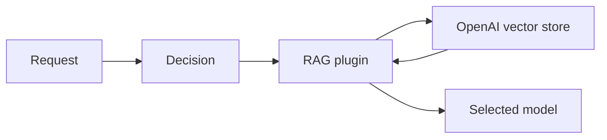

> **Status:** Implemented · **Created:** 2026-01-23

## Problem

Applications that already keep documents in OpenAI vector stores should not need a
second retrieval service just to use those documents in a routed request. The RAG
plugin needs a backend that preserves the route's retrieval, injection, caching, and
failure policy while delegating document search to OpenAI.

## Implemented design

The `rag` decision plugin accepts `backend: openai` and a backend configuration that
identifies a vector store and credential. Retrieval runs only after the decision has
matched.

## Workflow modes

| Mode | Router behavior | Use when |
| --- | --- | --- |
| `direct_search` | Search the vector store before inference and inject bounded retrieved content. | The route requires synchronous, router-controlled retrieval. |
| `tool_based` | Add an OpenAI `file_search` tool definition to the request. | The selected provider and request protocol support that tool workflow. |

`direct_search` is the default. In `tool_based` mode, Semantic Router mutates the
request; it does not currently turn response annotations into injected context for a
second model call.

## Configuration boundary

The backend-specific fields are:

| Field | Purpose |
| --- | --- |
| `vector_store_id` | Selects the OpenAI vector store. |
| `api_key` | Authenticates the OpenAI request; source it from a secret. |
| `base_url` | Overrides the API origin when required. |
| `max_num_results` | Limits returned search results. |
| `max_response_bytes` | Caps each direct-search response; `0` uses 4 MiB. |
| `file_ids` and `filter` | Narrow the search when supported by the workflow. |
| `workflow_mode` | Chooses direct search or tool mutation. |
| `timeout_seconds` | Bounds the remote request. |

Generic RAG settings still own context limits, injection mode, result caching, minimum
confidence, and `on_failure` behavior. Use the canonical plugin guide for the complete
shape rather than copying a frozen full configuration from this record.

## Data and security

The search query and any configured filters are sent to the OpenAI-compatible
endpoint. Retrieved document content may then be sent to the selected model provider.
Operators must confirm that both transfers meet data-residency, retention, and access
requirements.

API keys must come from a secret source and must not be committed in configuration.
Vector-store access control remains an OpenAI account concern; semantic relevance is
not document authorization.

## Failure behavior

Empty search results, authentication failures, timeouts, and invalid filters are
retrieval failures. The route's `on_failure` policy decides whether to skip retrieval,
continue with a warning, or block.

Cached retrieval results reduce repeat searches but can also serve stale content.
Choose a TTL that matches document-update expectations.

## Scope and non-goals

The integration searches an existing vector store or adds a `file_search` tool. It
does not manage document ingestion, vector-store lifecycle, user-level document
permissions, or the selected provider's implementation of tool calls.

## Evaluation

Test retrieval relevance, empty results, filters, context truncation, credential
failure, timeout behavior, and data leakage across identities. Validate the direct
search and tool-based paths separately.

## References

- [Current RAG plugin guide](../tutorials/plugin/rag)
- [OpenAI vector-store search API](https://developers.openai.com/api/reference/resources/vector_stores/methods/search)
- [OpenAI File Search guide](https://developers.openai.com/api/docs/guides/tools-file-search)
