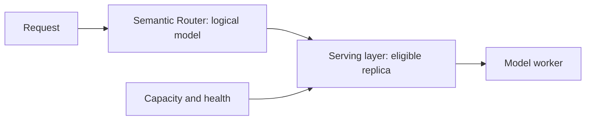

> **Status:** Decision record · **Created:** 2026-07-14

## Problem

Batch-level routing can jointly assign several requests under a shared budget and
per-model capacity limits. That is attractive for bulk workloads, but it conflicts
with an inline router that must decide independently for each arriving request.

The architectural question is whether live capacity belongs inside semantic
decision-making or below it in the serving layer.

## Decision

Semantic Router remains per-query. It selects a logical model from request meaning,
policy, and configured algorithm inputs.

Capacity, queue depth, replica health, and worker-local cache state remain serving and
load-balancing concerns:

The router may consume bounded, request-safe performance signals when an algorithm
explicitly supports them. It does not collect a batch and solve a joint assignment on
the ExtProc hot path.

## Rationale

- **Latency:** Waiting to form a batch adds queueing delay before routing begins.
- **State:** Capacity is volatile and belongs near the component that owns queues and
  workers.
- **Failure isolation:** A serving-layer overload should not require semantic policy
  to rematch.
- **Composability:** The same recipe can run above different schedulers and inference
  platforms.
- **Evaluation:** Model-choice quality and replica scheduling can be measured
  independently.

No benchmark claim is part of this decision. Synthetic routing results do not establish
production capacity behavior and should not be presented as product guarantees.

## Consequences

Semantic Router cannot guarantee that the preferred model has immediate capacity.
The serving layer may queue, reject, or use an explicitly compatible fallback.
Cross-model fallback still needs its own safety contract because changing a logical
model is not equivalent to selecting another replica.

Fleet sizing and capacity planning remain offline concerns. The Fleet Simulator can
evaluate candidate fleet shapes without putting an optimizer in the request path.

## Scope and non-goals

This decision applies to interactive routing through the gateway. It does not rule out
a separate asynchronous or bulk API that deliberately batches work and accepts solver
latency.

It also does not prohibit latency-aware or load-informed algorithms. Those algorithms
must operate on bounded telemetry and preserve the matched decision's candidate set.

## Revisit when

Reconsider the boundary if:

- a dedicated bulk interface is introduced;
- production evidence shows logical model capacity, rather than replica scheduling,
  dominates routing failures;
- the serving layer cannot express required admission or spillover policy; or
- a bounded allocation method can meet the inline latency and failure budget.

## References

- [Fleet Simulator overview](../fleet-sim/overview)
- [Latency-aware selection](../tutorials/algorithm/selection/latency-aware)
- [Model execution fallback](./model-execution-fallback)
