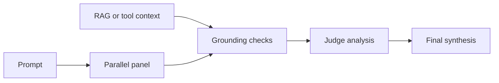

> **Status:** Proposal · **Created:** 2026-06-17

## Problem

Fusion can expose one prompt to several models, ask a judge to compare the responses,
and synthesize one answer. This can surface contradictions and complementary coverage,
but it also adds calls and does not make the majority correct.

The design question is how to improve deliberation without turning model agreement
into a false factuality signal.

## Current baseline

The implemented Fusion looper has three stages:

1. run a bounded panel in parallel;
2. ask a judge for structured analysis; and
3. synthesize a final answer.

Partial panel failure follows the configured error policy. The judge and panel remain
inside the matched decision's declared model pool and configuration.

## Proposal

Use grounding evidence before synthesis:

When authoritative context is available, compare panel responses with that context.
Otherwise, cross-model consistency can identify disagreement but cannot establish
truth. The default policy should annotate or softly weight evidence, not discard a
lone dissenting response solely because it disagrees with the majority.

## Candidate extensions

| Extension | Purpose | Main risk |
| --- | --- | --- |
| Adaptive gating | Use a single model first and deliberate only when evidence warrants it. | A weak gate may skip difficult requests. |
| Multi-agent debate | Let bounded rounds challenge claims before synthesis. | Additional cost, latency, and convergence failure. |
| Panel composition | Choose a diverse, route-approved panel for the request. | Diversity heuristics may become opaque policy. |
| Grounding-aware synthesis | Give the judge evidence about support and contradiction. | Groundedness is not the same as truth. |

Each extension should be a typed algorithm or Fusion option, not hidden prompt logic.

## Scope and non-goals

The proposal keeps decision matching, candidate policy, timeouts, and concurrency in
the existing router contract. It does not claim that more models are always better,
that consensus proves correctness, or that one panel works for every domain.

Web search and retrieval remain separate tools. Deliberation may consume their
evidence but should not silently enable them.

## Evaluation

Compare plain Fusion with one change at a time. Report task quality, factual errors,
contradicted claims retained in the final answer, latency, tokens, upstream calls,
partial failures, and judge sensitivity. Preserve prompts, model versions, panel
composition, and raw outputs so the result can be reproduced.

## Open questions

- Which requests justify adaptive escalation?
- When should grounding failure fall back to plain Fusion versus fail the route?
- How should panel diversity be measured without introducing hidden model policy?
- Which traces are safe to expose when panel responses contain sensitive data?

## References

- [Current Fusion guide](../tutorials/algorithm/looper/fusion)
- [TruthLens proposal](./hallucination-mitigation-milestone)
- [SelfCheckGPT](https://arxiv.org/abs/2303.08896)
- [Multiagent debate](https://arxiv.org/abs/2305.14325)
