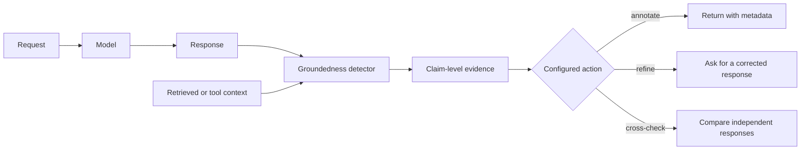

> **Status:** Proposal · **Created:** 2025-12-02

## Problem

A model can produce fluent text that is unsupported by the context supplied with the
request. Application-specific checks can catch some failures, but implementing them in
every client duplicates policy and makes behavior difficult to audit.

The router is a useful policy boundary because it can see the request, retrieved
context, selected model, and response. It is not, however, a source of truth. A
detector can estimate groundedness; it cannot prove that an open-domain statement is
factually correct.

## Proposal

TruthLens separates detection from response policy:



The detector should identify spans or claims as supported, unsupported, or
contradicted when evidence is available. The policy then decides whether to annotate,
retry, refine, block, or escalate.

## Operating modes

The proposal groups policies into three operator-facing modes:

| Mode | Behavior | Main trade-off |
| --- | --- | --- |
| Lightweight | Run one detector pass and expose the result or apply a simple action. | Lowest additional work, no automatic correction guarantee. |
| Standard | Ask a model to revise flagged claims, then run a bounded verification pass. | Additional latency and tokens; may repeat the same model's bias. |
| Cross-verification | Compare responses from independently selected models before synthesis or escalation. | Highest resource use and more complex failure handling. |

These are policy shapes, not benchmark tiers. A deployment should select actions from
measured detector behavior and the consequence of false positives and false negatives.

## Evidence contract

Each detection result should include:

- the response span or claim being evaluated;
- the relevant context span, when one exists;
- a detector score and configured threshold;
- a classification such as supported, unsupported, or contradicted;
- the detector version; and
- the action taken by policy.

The router should preserve this evidence in bounded diagnostics or replay metadata
without exposing sensitive context in default response headers.

## Policy boundaries

- Detection alone must not silently block traffic.
- A route chooses its action explicitly.
- Refinement and cross-verification use bounded attempts and model allowlists.
- Streaming responses require a declared policy because a response cannot be safely
  replaced after bytes have been committed.
- Detector failure follows an explicit skip, annotate, or block policy.
- Retrieved context and tool output remain untrusted input and must not be promoted to
  a system instruction.

## Scope and non-goals

TruthLens is intended for responses that can be checked against supplied evidence,
especially retrieval and tool-assisted workflows. It is not a general fact database,
a substitute for domain review, or a guarantee that supported context is itself true.

The current route-local plugin reads its model dependencies from the canonical module
path below. The exhaustive reference configuration owns the detector and explainer
details:

```yaml
global:
  model_catalog:
    modules:
      hallucination_mitigation:
        enabled: true
        on_hallucination_detected: annotate

routing:
  decisions:
    - name: grounded_answers
      plugins:
        - type: hallucination
          configuration:
            enabled: true
            hallucination_action: header
```

The proposal does not require one detector architecture or one model vendor. The
current hallucination plugin documentation remains the source of truth for behavior
that is actually implemented.

## Evaluation

Evaluation should use a versioned, labeled set that matches the deployment's domains.
Report:

- claim-level precision and recall for each evidence class;
- false-positive and false-negative rates at the chosen thresholds;
- added latency, tokens, and upstream calls by mode;
- correction success after refinement;
- behavior when context is missing, contradictory, or malicious; and
- results for streaming and detector-failure cases.

Do not publish improvement percentages without the dataset, baseline, thresholds,
model versions, prompt templates, and raw evaluation artifacts.

## Open questions

- Should unsupported and contradicted claims always produce different actions?
- Which evidence may be retained for replay, and for how long?
- How should a route handle claims that cannot be checked against supplied context?
- When is a second model sufficiently independent for cross-verification?
- Which actions are safe once streaming has started?

## References

- [Current hallucination plugin guide](../tutorials/plugin/hallucination)
- [LettuceDetect](https://arxiv.org/abs/2502.17125)
- [SelfCheckGPT](https://arxiv.org/abs/2303.08896)
- [Self-Refine](https://arxiv.org/abs/2303.17651)
- [Finch-Zk](https://arxiv.org/abs/2508.14314)
