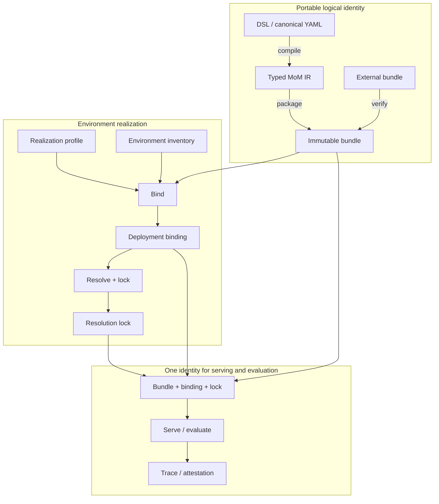

# Mixture-of-Models Bundle: A Model Format and Lifecycle for Virtual Composite Models

- **Status:** Draft proposal
- **Roadmap:** H2
- **Tracking issue:** [#2562](https://github.com/vllm-project/semantic-router/issues/2562)
- **Position paper:** [Mixture-of-Models: Conditional Computation Across Model Boundaries](/mom-paper)

> This document proposes a target contract. vLLM Semantic Router implements
> important execution primitives today, but it does not yet implement the full
> bundle, binding, lock, import/export, and shared serving/evaluation lifecycle
> described here.

## 1. Why Mixture-of-Models needs a model format

A model architecture becomes operational when it has a model artifact. A
checkpoint can be named, versioned, transferred, loaded, served, evaluated, and
reproduced. A Mixture-of-Models (MoM) architecture needs the same treatment.

Today, vLLM Semantic Router can express much of an MoM deployment through its
canonical configuration:

- `routing.modelCards` describe logical model capabilities;
- `routing.signals` and `routing.projections` produce reusable routing facts;
- `routing.decisions` and `modelRefs` define admissible choices;
- algorithms and plugins define selection, validation, collaboration, and
  post-processing;
- `providers.models[].backend_refs[]` bind logical models to reachable
  endpoints.

That configuration is deployable state. It is not yet a portable model
artifact. It mixes logical model semantics with environment-specific
realization, has no immutable composite-model identity, and cannot guarantee
that serving and evaluation consume the same resolved system.

The proposal is therefore not a new router configuration file. It is a model
format and lifecycle above the current configuration:

> **A MoM Bundle is to model-call graphs what ONNX ModelProto is to tensor
> graphs; OCI distributes it, and Hugging Face-like coordinates make it usable.**

The analogy has a boundary. MoM portability preserves identified control
semantics, contracts, and resolved constituents. It does not claim bitwise or
predictive equivalence between opaque providers.

## 2. Product contract

To a caller, an MoM behaves like one ordinary model:

```text
model: vllm-sr/mom-v1-ultra:1.0.0
```

The identity can represent a deliberate operating point:

| Model identity | Primary objective |
| --- | --- |
| `vllm-sr/mom-v1-flash:1.0.0` | latency first |
| `vllm-sr/mom-v1-light:1.0.0` | cost first |
| `vllm-sr/mom-v1-ultra:1.0.0` | accuracy first |
| `vllm-sr/mom-v1-halu:1.0.0` | grounding and hallucination sensitivity |
| `vllm-sr/mom-v1-secu:1.0.0` | jailbreak, PII, and security policy |

Each identity is one **behavior variant** and one logical model. A request may
adjust preferences only inside the domain published by that variant. It cannot
turn `ultra` into `light` while retaining the same model identity.

A family index may group related variants, but one bundle exports exactly one
behavior variant. Released semantic versions are immutable. Mutable aliases
such as `latest` may resolve to a new digest, but must never be confused with an
immutable version or digest.

## 3. Design principles

### 3.1 Compose leaf formats instead of replacing them

The bundle sits above constituent model formats. A leaf may remain a pinned
Hugging Face snapshot, safetensors repository, ONNX graph, GGUF file, OCI
artifact, private vLLM deployment, or closed provider model.

MoM defines the composite model's control semantics. It does not reserialize
every constituent into a new tensor format.

### 3.2 Separate logical identity from physical realization

The model's graph, policies, contracts, objectives, and logical constituent
requirements belong to portable identity. Endpoints, credentials, live
capacity, accelerator placement, and deployment revisions belong to an
environment realization.

The same bundle may be realized on:

- CUDA or ROCm clusters;
- CPU or NPU edge nodes;
- a private data center;
- a robot with a local model and cloud escalation;
- a sovereign deployment that forbids selected data from leaving a region;
- a hybrid pool of open and closed models.

Those environments can produce different bindings while retaining the same
semantic identity.

### 3.3 Fail closed

An engine must reject a bundle when it cannot support the required operator
set, interface, identity strength, constraint semantics, or realization
capability. Unknown semantics must not degrade silently into best-effort
routing.

### 3.4 Keep mutable evidence outside model identity

Evaluation results, traces, signatures, SBOMs, and provenance statements refer
to a bundle. They do not mutate it. This lets new evidence accumulate without
redefining the evaluated model.

### 3.5 Exclude secrets

Bundles and locks may contain secret references, never secret values.
Production endpoints, credentials, live health, counters, and private traces
remain outside the portable artifact.

## 4. Lifecycle and artifact boundaries



The layers are:

| Layer | Owner | Portable | Meaning |
| --- | --- | ---: | --- |
| Authoring source | model author | yes | Human-facing DSL or canonical YAML |
| Typed IR | compiler | yes | Normalized graph, types, policies, and bounds |
| Bundle | publisher | yes | Immutable distribution unit |
| Realization profile | publisher/operator | yes | Required capabilities, not actual hosts |
| Environment inventory | operator | no | Available engines, devices, endpoints, and revisions |
| Binding | binder | environment-scoped | Logical-to-physical mapping |
| Lock | resolver | environment-scoped | Exact revisions, images, engines, and observations |
| Run record | serving/eval engine | no | Realized trace attributed to all identities |
| Attestation | evaluator/signer | detachable | Evaluation, signature, SBOM, or provenance evidence |

The critical separation is `bundle + profile + inventory -> binding + lock`.
CUDA and ROCm are not model identities. They are possible realizations of a
model whose requirements admit those accelerators.

## 5. Portable bundle layout

A directory representation is useful for authoring and inspection:

```text
mom-v1-ultra.mombundle/
├── manifest.json
├── mom.ir.json
├── source/
│   └── mom-v1-ultra.mom.yaml
├── assets/
│   ├── controller-policy.json
│   └── system-prompt.txt
├── contracts/
│   ├── chat-request.schema.json
│   ├── chat-response.schema.json
│   └── answer.schema.json
├── targets/
│   ├── hybrid-cuda-cloud.yaml
│   └── hybrid-rocm-cloud.yaml
├── eval/
│   └── protocols/
│       └── accuracy.yaml
└── evidence/
    └── build-provenance.json
```

The manifest uses content-addressed descriptors for every object:

```json
{
  "role": "semantic-asset",
  "path": "assets/controller-policy.json",
  "mediaType": "application/vnd.vllm.mom.controller-policy+json",
  "digest": "sha256:...",
  "size": 500
}
```

The bundle may be exported in three closures:

- **thin:** immutable references to external constituent artifacts and
  providers;
- **materialized:** all redistributable leaf objects are vendored;
- **targeted:** selected runtime objects for a realization accompany the
  semantic base.

A targeted export may change distribution identity, but it must not change
semantic identity. Non-redistributable or opaque provider models remain pinned
references with explicit identity strength.

## 6. The semantic core

### 6.1 Typed entrypoints and signatures

Media types alone are not a sufficient model interface. Each entrypoint must
name normative schemas for:

- request and response objects;
- request parameters;
- tools and tool results;
- streaming events;
- declared compatibility and extension policy.

This borrows the useful part of MLflow model signatures while keeping the
signature language-neutral. An adapter may translate transport syntax, but it
must not change the logical request or response contract without declaring a
semantic transformation.

### 6.2 Logical constituents

Each logical model declares:

- an identity URI and identity strength;
- required protocols and modalities;
- context and output limits;
- required and preferred capabilities;
- data-handling policy;
- allowed substitution policy.

Production locks for Hugging Face constituents require full commit hashes or
content digests. Branches and tags are acceptable authoring references, but
they are not immutable locks.

Closed provider identities use an explicit weaker class such as
`observed-opaque`, together with the provider model ID, observation time,
revalidation policy, and any provider-exposed revision.

### 6.3 Operators, effects, and bounds

The typed IR describes model-invocation events rather than tensor operations.
The initial operator registry should cover:

- selection and admissibility filtering;
- direct model calls;
- cascade, fan-out, fusion, and bounded workflow calls;
- contract validation and grounding checks;
- fallback, abstention, and return;
- trace and metric emission.

Every operator belongs to a versioned opset and declares its type signature and
effect class. Effects distinguish pure projections from model calls, network
access, state access, tool execution, and external side effects.

The bundle also declares finite resource bounds such as maximum model calls,
fan-out, rounds, events, wall time, and output tokens. Engines negotiate
capabilities against required opsets and reject unsupported bundles.

### 6.4 Objectives and constraints

Behavior variants combine:

- objectives such as quality, cost, latency, energy, or groundedness;
- hard constraints such as privacy, residency, safety, or capability;
- a bounded request-preference domain;
- a finite execution graph.

Hard constraints are evaluated before soft optimization and use fail-closed
unknown handling where safety or policy is involved.

## 7. Realization is a six-axis contract

The word “backend” currently hides several independent choices. The proposed
format keeps them separate:

| Axis | Examples |
| --- | --- |
| Wire transport | HTTP, gRPC, Unix socket |
| API adapter | OpenAI Chat, Anthropic Messages, native vLLM |
| Model runtime | vLLM, llama.cpp, ONNX Runtime, TensorRT-LLM, provider-managed |
| Leaf artifact | HF/safetensors snapshot, ONNX, GGUF, provider alias |
| Accelerator | CPU, CUDA GPU, ROCm GPU, NPU |
| Deployment driver | existing endpoint, Docker, Kubernetes, Slurm, device-native |

This separation prevents a transport choice from being mistaken for an
accelerator choice, or a router image from being mistaken for a constituent
model deployment.

In the current CLI, `vllm-sr serve --platform amd|nvidia` selects the image and
device behavior for the router's own runtime models. CPU is the default path.
It does not provision every constituent LLM in an MoM fleet. The future binder
and deployment drivers must make that distinction explicit.

## 8. Binding and locking

The binder consumes the bundle, a realization profile, and an operator-owned
environment inventory:

```yaml
profile: hybrid-rocm-cloud
requirements:
  local-generalist:
    runtime: vllm
    accelerator: rocm
    minMemoryGiB: 48
  cloud-reasoner:
    runtime: provider-managed
    apiAdapter: openai.chat
```

The inventory reports what is actually available. The binder chooses a valid
mapping. The resolver then freezes:

- constituent artifact or provider revisions;
- runtime and image digests;
- engine and opset versions;
- accelerator and deployment driver;
- endpoint references;
- opaque-provider observation metadata.

Serving and evaluation must consume the same `bundle + binding + lock` tuple.
Changing any member creates a different realized system and invalidates
unqualified comparisons.

## 9. Identity and reproducibility

Four identities are required:

1. `semanticDigest` commits to normalized MoM semantics;
2. `bundleDigest` commits to the exported manifest and object descriptors;
3. `bindingDigest` commits to the logical-to-physical mapping;
4. `lockDigest` commits to exact resolved artifacts and runtime observations.

The v0alpha1 specification should adopt one normative canonical JSON procedure,
including UTF-8 handling, number normalization, path ordering, and exclusion
rules. RFC 8785 JSON Canonicalization Scheme is the preferred baseline.

An OCI registry manifest has its own OCI digest. It is distinct from
`bundleDigest` unless the specification deliberately defines the bundle digest
over the exact OCI manifest bytes.

## 10. Import, export, serving, and evaluation

The proposed CLI is one lifecycle:

```bash
vllm-sr mom build model.mom.yaml --output model.mombundle
vllm-sr mom import model.mombundle
vllm-sr mom inspect vllm-sr/mom-v1-ultra:1.0.0
vllm-sr mom diff <coordinate-a> <coordinate-b>

vllm-sr mom bind model.mombundle \
  --profile hybrid-rocm-cloud.yaml \
  --inventory inventory.yaml \
  --output deployment.binding.yaml

vllm-sr mom resolve model.mombundle \
  --binding deployment.binding.yaml \
  --output resolution.lock.json

vllm-sr serve --bundle model.mombundle \
  --binding deployment.binding.yaml \
  --lock resolution.lock.json

vllm-sr eval --bundle model.mombundle \
  --binding deployment.binding.yaml \
  --lock resolution.lock.json \
  --protocol accuracy

vllm-sr mom push vllm-sr/mom-v1-ultra:1.0.0 \
  oci://registry.example/mom
```

`build` compiles authoring syntax. `import` verifies an already built artifact
and never executes embedded code. `export` materializes an explicit closure.
`serve` and `eval` share the resolved identity rather than rebuilding
environment state independently.

## 11. Distribution and attestations

OCI is the preferred registry transport because it provides descriptors,
manifests, indexes, content-addressed blobs, and registry interoperability.
The MoM specification still needs to define:

- the bundle `artifactType`;
- config and layer media types;
- object-role annotations;
- family and targeted-realization index behavior;
- mapping between model coordinates, aliases, versions, and OCI digests;
- referrer subjects for signatures, SBOMs, provenance, and eval attestations.

OCI Distribution Spec referrers attach evidence without rewriting the subject
bundle. Standard OCI platform fields describe operating systems and CPU
architectures; CUDA and ROCm requirements must remain MoM realization metadata,
not be encoded as fictitious OCI CPU platforms.

## 12. What we borrow from existing formats

The proposal deliberately composes proven ideas rather than claiming that one
existing format already solves composite models.

| Precedent | Principle adopted | Boundary in MoM |
| --- | --- | --- |
| [Hugging Face Hub](https://huggingface.co/docs/hub/en/models-the-hub) | Familiar model coordinates, repository contents, cards, and revision-pinned retrieval | A leaf repository does not define a multi-model control graph, environment binding, or resolution lock |
| [MLflow Model](https://mlflow.org/docs/latest/ml/model/) | A model is more than weights; lifecycle tools consume an explicit signature and packaged metadata | Arbitrary Python flavors are not semantic authority; executable dependencies remain capability-checked realization concerns |
| [ONNX IR](https://onnx.ai/onnx/repo-docs/IR.html) and [Execution Providers](https://onnxruntime.ai/docs/execution-providers/) | Versioned typed IR, opsets, capability negotiation, and rejection of unsupported semantics | MoM nodes are model calls and policy events that may be remote, stochastic, stateful, and costly |
| [OCI Image/Artifact specifications](https://github.com/opencontainers/image-spec) and [Distribution Spec](https://github.com/opencontainers/distribution-spec) | Content-addressed distribution, manifests, indexes, and detachable attestations | OCI is transport, not MoM semantic authority |
| [GGUF](https://github.com/ggml-org/ggml/blob/master/docs/gguf.md) | A self-contained, extensible, memory-mappable constituent suitable for local and edge realizations | GGUF does not express closed providers, cross-model topology, bindings, or system attestations |

TensorFlow SavedModel provides another useful comparison for signatures,
functions, variables, and assets in a runtime-specific package. BentoML
illustrates a different boundary: a service bundle packages an application and
its deployment dependencies, whereas an MoM bundle defines portable model
semantics. A targeted MoM export may reference runtime artifacts without
silently becoming a service container.

## 13. Security and trust

Import is a verification operation, not code execution. A conforming importer
must:

- reject path traversal, duplicate paths, unsupported media types, and digest
  mismatches;
- enforce archive size and object-count limits;
- disable implicit remote Python or pickle execution;
- verify signatures according to operator trust policy;
- preserve license and redistribution metadata across materialization;
- require explicit capabilities and sandbox policy for executable plugins;
- reject secret values in bundles and locks.

Provider observations also need expiry and revalidation. An old
`observed-opaque` record must not imply that a hosted model is unchanged
forever.

## 14. Alignment with the current repository

The design grows from current vLLM Semantic Router concepts:

| Current surface | Role in the proposed format |
| --- | --- |
| Canonical `version/listeners/providers/routing/global` config | Import source and deployment adapter, not the distribution format itself |
| `routing.modelCards` | Logical constituent capabilities |
| `routing.signals` and `routing.projections` | Typed observations and reusable routing facts |
| `routing.decisions`, `modelRefs`, algorithms, and plugins | Control topology and policy |
| `providers.models[].backend_refs[]` | Existing-endpoint binding input |
| Router replay and traces | Basis for digest-attributed run records |
| Training and evaluation workflows | Future consumers of bundle identity and eval protocols |
| `vllm-sr serve` | Future bundle realization and serving entrypoint |

The first implementation should compile a supported subset into today's
canonical config rather than introduce a second request-time policy
interpreter. The existing router remains the execution engine.

## 15. Proposed implementation sequence

### M0 — Specification

1. Publish the vocabulary, one-bundle/one-variant invariant, coordinate policy,
   and compatibility rules.
2. Define typed entrypoint signatures.
3. Define the initial operator/type/effect registry and opset negotiation.
4. Define canonicalization and the four digest closures.
5. Define the exact OCI projection and attestation subject model.

### M1 — Thin bundle toolchain

1. Add schemas for manifest, IR, realization profile, binding, lock, eval
   protocol, run record, and attestation.
2. Add `build`, `import`, `export`, `inspect`, `diff`, and `verify`.
3. Compile the supported IR subset into canonical router config.
4. Support existing-endpoint binding without provisioning.

### M2 — Shared serving and evaluation identity

1. Add `serve --bundle --binding --lock`.
2. Make evaluation consume the same tuple and emit digest-bound attestations.
3. Attribute traces, cost, latency, checks, and outcomes to all four digests.

### M3 — Environment binding and deployment drivers

1. Define environment inventory discovery.
2. Add CUDA, ROCm, CPU, and provider-managed capability matching.
3. Add Docker and Kubernetes deployment drivers before broader schedulers.
4. Add provider observation expiry and revalidation.

### M4 — Registry and materialization

1. Add OCI push/pull and family indexes.
2. Add signatures, SBOMs, provenance, and eval referrers.
3. Add materialized and targeted exports with license enforcement.
4. Publish conformance fixtures and interoperability tests.

## 16. Decisions required before v0alpha1 freezes

The draft intentionally exposes the remaining specification decisions:

1. Which request, response, parameter, tool, and streaming schemas form the
   first stable interface signature?
2. Which operators and effect classes belong to `mom.core/v0alpha1`?
3. Does `bundleDigest` intentionally equal an OCI manifest digest, or remain a
   format-level digest?
4. How are mutable aliases represented without weakening immutable semantic
   versions?
5. What is the minimum identity strength allowed for production evaluation?
6. How long may an `observed-opaque` provider lock remain valid?
7. Which plugin capabilities are permitted, and under what sandbox contract?
8. Which parts of a targeted runtime export are separate registry artifacts
   referencing the same semantic base?

## 17. Acceptance criteria

The proposal is complete when an independent implementation can:

1. build identical semantic and bundle digests from the same source;
2. reject unsupported opsets, effects, signatures, and identity strengths;
3. import a bundle without executing arbitrary code;
4. bind one bundle to at least two heterogeneous realization profiles;
5. produce a complete lock with no unresolved constituent;
6. serve and evaluate the same bundle/binding/lock tuple;
7. emit a trace and attestation attributable to all four digests;
8. exchange the artifact through an OCI registry without changing semantic
   identity.

That contract turns Mixture-of-Models from deployment-specific glue into a
model architecture that can be authored, versioned, distributed, served,
evaluated, and improved as one system.
