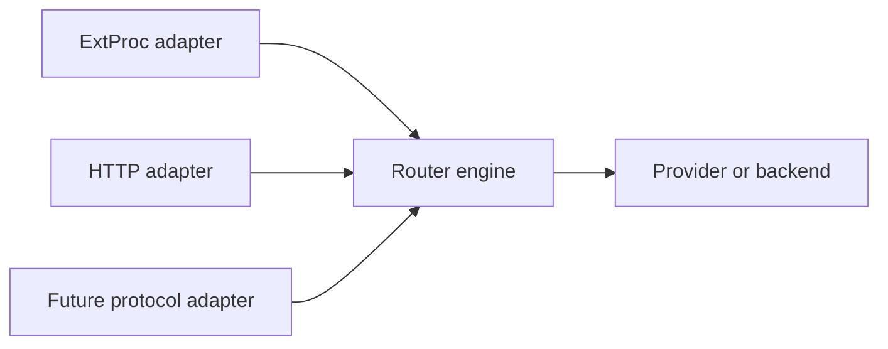

> **Status:** Proposal · **Created:** 2026-02-18

## Problem

Semantic Router currently enters the request path through Envoy ExtProc. ExtProc is a
good gateway integration, but protocol concerns should not define the routing engine.
A direct HTTP endpoint, another proxy protocol, or an internal test harness should not
need to reimplement signals, decisions, plugins, or model selection.

## Proposal

Separate protocol translation from one shared routing pipeline:

Each adapter converts a protocol request into a canonical internal request, invokes
the engine, and converts the result back to protocol-specific output. The engine owns
all routing behavior.

## Adapter contract

An adapter is responsible for:

- listener lifecycle and protocol negotiation;
- authentication context supplied by the protocol boundary;
- request and streaming-body assembly;
- conversion to the canonical OpenAI-compatible request model;
- transport-specific errors, cancellation, and backpressure; and
- conversion of mutations, immediate responses, and diagnostics back to the client.

An adapter must not own signal evaluation, decision matching, selection algorithms,
plugin policy, caches, or replay semantics.

## Router engine contract

The shared engine accepts a canonical request plus trusted connection metadata. It
returns one of three outcomes:

| Outcome | Meaning |
| --- | --- |
| Forward | Send the mutated request to the selected provider or backend. |
| Immediate response | Return a response generated by policy, cache, or a looper. |
| Reject | Return a policy or validation error. |

The result also carries bounded routing diagnostics and the information needed for
response-side plugins. Protocol adapters should not infer the outcome from incidental
headers.

## Behavioral parity

All adapters should produce the same semantic result for the same canonical request
and trusted metadata. Parity tests should cover:

- entrypoint and recipe resolution;
- request-body mutation;
- immediate responses;
- streaming and cancellation;
- authentication and client identity;
- response-side plugins; and
- replay and trace correlation.

Protocol-specific features may be unsupported, but the adapter must report that
explicitly instead of silently skipping policy.

## Lifecycle and concurrency

One process may host several listeners backed by one engine. Startup succeeds only
after the shared configuration and required model modules are ready. Each adapter has
its own health state, while engine readiness reflects shared routing dependencies.

Cancellation propagates from the client through the engine to upstream calls. Adapter
code must not retain mutable request state across concurrent requests.

## Security boundary

The transport authenticates the connection; the engine consumes a typed, trusted
identity. An adapter must distinguish client-controlled headers from metadata asserted
by the listener or gateway. TLS termination, request-size limits, and protocol-level
rate limiting remain adapter concerns.

Adding a direct listener increases the exposed attack surface. It should be disabled
by default until authentication, authorization, body limits, streaming behavior, and
management-port separation are defined.

## Scope and non-goals

The first proposal keeps ExtProc behavior unchanged and extracts the shared engine
behind it. A later HTTP adapter can use that boundary.

This proposal does not:

- replace Envoy or deprecate ExtProc;
- define a public configuration shape before the engine boundary is proven;
- expose management APIs on an inference listener;
- guarantee that every protocol supports every streaming feature; or
- introduce protocol-specific routing policy.

## Migration

Migration should be incremental:

1. characterize current ExtProc behavior with parity tests;
2. move routing orchestration behind a protocol-neutral interface;
3. keep ExtProc as the only production adapter until parity passes; and
4. add one new adapter with an explicit capability matrix.

This is an architectural sequence, not evidence that the adapters are implemented.

## Open questions

- Is the canonical internal request strictly OpenAI-compatible, or a smaller
  protocol-neutral envelope?
- Where does upstream provider invocation live for direct HTTP mode?
- Which streaming outcomes can be represented consistently across adapters?
- How are listener identity and authorization claims made trustworthy?
- Can adapters be restarted independently without rebuilding model modules?

## References

- [Envoy External Processing filter](https://www.envoyproxy.io/docs/envoy/latest/configuration/http/http_filters/ext_proc_filter)
- [Semantic Router system overview](../overview/semantic-router-overview)
- [Gateway deployment options](../installation/k8s/gateways)
