> **Status:** Implemented · **Created:** 2026-02-18

## Outcome

The Router evaluates one protocol-neutral semantic request regardless of the client
or selected backend wire format. Wire JSON is decoded once at ingress and encoded
once at the provider boundary. Response bodies and streaming events take the inverse
path before returning to the client.

Envoy remains the production transport. It owns listeners, upstream clusters,
connection lifecycle, retries, and request forwarding. The ExtProc service owns
semantic model selection and request or response policy. The codec layer only maps
between wire contracts and the Router's neutral types.

```mermaid
flowchart LR
  Client["Client wire format"] --> Ingress["Ingress codec"]
  Ingress --> Request["Neutral request"]
  Request --> Router["Signals, decisions, algorithms, plugins"]
  Router --> Provider["Provider codec"]
  Provider --> Envoy["Envoy upstream transport"]
  Envoy --> ProviderResponse["Provider response codec"]
  ProviderResponse --> Response["Neutral response or event stream"]
  Response --> ClientResponse["Client response codec"]
```



## Neutral contract

`pkg/llmprotocol` is the only semantic contract shared by codecs and Router policy.
It represents:

- ordered instructions, messages, and multimodal content blocks;
- tool definitions, tool calls, tool results, hosted image-generation controls,
  and tool choice;
- sampling and structured-output constraints;
- reasoning controls and reasoning content;
- response alternatives and stop reasons;
- provider request identity and typed transport errors;
- token usage with provenance for standard input, cache reads, cache writes,
  reasoning output, other output, and totals; and
- trusted transport metadata that codecs cannot populate from client input.

Raw wire objects do not enter semantic routing. An envelope may retain bounded
same-format representation details, but it is not routing state and cannot be used
to bypass validation.

## Codec contracts

Each registered codec is stateless and safe for concurrent use. It declares its wire
format and capabilities and implements four buffered operations:

1. decode a request into the neutral request;
2. encode a neutral request for a backend;
3. decode a response into the neutral response; and
4. encode a neutral response for a client.

Transport errors use a separate typed contract because an HTTP error is not a failed
model response resource. Streaming codecs create request-scoped decoders and
encoders that exchange neutral events. No mutable stream state is stored in the
registry.

The registry is immutable after construction. Adding a wire format requires one
buffered codec, one streaming codec, declared capabilities, and matrix tests. Router
policy does not gain protocol branches when a codec is added.

## Supported matrix

| Wire format | Buffered request | Buffered response | Streaming | Tools | Images | Structured output | Usage |
| --- | --- | --- | --- | --- | --- | --- | --- |
| OpenAI Chat Completions | Decode and encode | Decode and encode | SSE decode and encode | Yes | Input | JSON object and schema | Authoritative when present |
| OpenAI Responses | Decode and encode | Decode and encode | Event decode and encode | Yes | Input plus hosted image-generation lifecycle | JSON schema | Authoritative when present |
| Anthropic Messages | Decode and encode | Decode and encode | Event decode and encode | Yes | Input | Supported schema subset | Authoritative when present |

The complete pairwise request, response, transport-error, and streaming matrix is
tested. A request may enter in any supported client format and leave in the format
declared by the selected provider model. The response returns in the original client
format.

Top-level request and response inventories are also closed against the published
OpenAI OpenAPI schemas and generated Anthropic Messages types. A newly published
field cannot pass through an untyped JSON bucket: it must map to the neutral contract,
fail as an explicit unsupported feature, or be recorded as bounded provider metadata
that is intentionally omitted from the client representation.

## Verification contract

The schema contract is pinned to published upstream revisions. Tests close every
top-level field, nested object field, and published union discriminator against an
explicit semantic, transport-only, extension, or unsupported disposition. The
current pins are OpenAI OpenAPI `690521b1753dce0c6d6b275f583d22537679cff9`
and Anthropic SDK `d19dea9ed85bbb5fdb2d6f20fb6f903920ed23fa`.

The E2E provider simulators are part of the same contract. Their native Chat,
Responses, and Messages boundaries use revision-pinned closed inventories, reject
unknown top-level fields with provider-native errors, and retain nested wire objects
without an untyped normalization step. A Go conformance test compares those
simulator manifests directly with the codec request, response, and usage wire
inventories. Simulator tests replay every published top-level request field, while
the codec goldens close nested fields and union discriminators. This prevents a
permissive mock from hiding a field that ExtProc dropped or invented.

Human-readable fixtures use a stable input/output convention:

```text
NNN-{client-protocol}-{case}-in.json
NNN-{client-protocol}-{case}-{backend-protocol}-out.json
```

Every request, response, transport error, stream, capability boundary, and typed
rejection input has exactly one expected output for each built-in target protocol.
Stream fixtures preserve the exact SSE transcript and are replayed again one byte at
a time to prove that transport chunk boundaries do not change semantics. The corpus
includes malformed and truncated JSON, duplicate fields, invalid unions and enums,
ordered multimodal content, tools and tool results, structured output, reasoning,
usage, cancellation, timeouts, incomplete streams, midstream failures, identity
changes, sequence violations, hosted image generation, and resource limits. Image
generation fixtures preserve every published option, distinguish a `null` result
from an empty payload, and cover ordered progress, contiguous partial-image indexes,
terminal success or failure, malformed base64, and target capability rejection.

Deployment-level coverage is a required 18-cell matrix:

```text
3 client protocols x 3 native backend protocols x 2 modes = 18 E2E cells
```

Each cell traverses Envoy and ExtProc, validates the client-native buffered envelope
or SSE lifecycle, requires a deterministic backend marker in the translated output,
and rejects leaked backend wire shapes. Additional E2E contracts cover structured
output, buffered provider errors, tool-call continuation, incomplete streams, and
errors after partial output for every backend protocol.

## Translation rules

Translation is semantic, not field-by-field copying:

- fields with an equivalent neutral meaning are preserved;
- fields unsupported by the target fail with a typed `unsupported_feature` error;
- unknown fields may only survive an unmodified same-format buffered round trip;
- cross-format translation and semantic mutation reject unknown fields rather than
  silently dropping them;
- request and response generations advance after semantic mutation;
- diagnostics are bounded and returned through the existing Router observability
  contract; and
- codecs never fetch URLs, resolve files, authenticate callers, or invoke providers.

Capability checks happen before encoding. This makes unsupported tools, media,
multiple candidates, strict schemas, reasoning, or streaming behavior explicit and
testable.

## Streaming

Every provider event is decoded into a neutral event before policy or client
encoding. The stream engine enforces ordering, terminal-state uniqueness, bounded
diagnostics, and final usage settlement. Split network frames are buffered by the
wire decoder; Router policy never parses partial JSON or SSE records.

Hosted image generation follows the same stream engine. An output item starts in
`in_progress`, progress may advance through `generating` and ordered partial images,
and the item finishes exactly once as `completed` or `failed`. Backward transitions,
sparse partial indexes, conflicting terminal state, and result data on a progress
event fail before a client success terminal can be published.

Router-produced responses use a neutral event encoder directly. They do not create
an intermediate provider-shaped stream. Cancellation and backpressure stay with
Envoy and ExtProc's request lifecycle.

## Usage and cost

Token counts retain provenance so accounting can distinguish authoritative provider
usage from derived, estimated, or unavailable values. Final provider usage replaces
intermediate estimates when the stream terminates.

Pricing is deployment metadata and remains on each provider model:

```yaml
providers:
  models:
    - name: local/fast
      pricing:
        currency: USD
        prompt_per_1m: 0.20
        cached_input_per_1m: 0.02
        cache_write_per_1m: 0.25
        completion_per_1m: 0.80
```

`routing.modelCards` describes semantic capabilities; it does not own connection or
pricing data. Currency is optional and resolves to USD for accounting when omitted.
Configured rates must be finite and non-negative, and an explicit zero represents a
free rate.

## Security boundary

Client-controlled headers and body metadata are untrusted. Only the ExtProc boundary
may populate trusted identity, session, task, and correlation fields after the
transport has established them. Codecs cannot promote wire metadata into trusted
metadata.

Public inference listeners and the management listener remain separate. This design
does not add a direct Router HTTP proxy, an agent service, a product management
plane, or a second upstream transport.

## Extension checklist

A new codec is complete only when it provides:

- a stable wire-format identifier;
- an explicit capability declaration;
- strict buffered request, response, and transport-error codecs;
- request-scoped stream decoding and encoding;
- malformed-input and unsupported-feature tests;
- pairwise matrix coverage against every built-in format;
- authoritative usage and terminal-event tests; and
- ExtProc regression coverage proving that routing behavior is unchanged.

## References

- [Router API](../api/router)
- [Semantic Router system overview](../overview/semantic-router-overview)
- [Gateway deployment options](../installation/k8s/gateways)
