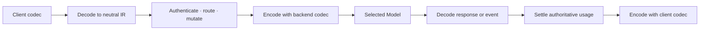

> **Status:** Proposal · **Created:** 2026-08-23

This document is the normative protocol appendix for
[Router-Native Access Control and Quota Accounting](./router-native-access-control).
It defines one semantic boundary for public clients, routing, backend invocation,
streaming, usage settlement, and errors. A wire format is a codec selected at an
edge; it is not the Router's internal data model and it is not a Provider product.

## Product contract

Users may call one Entrypoint through any installed public format and may connect a
Model that speaks any compatible backend format. Supporting three formats must
produce a complete translation matrix, not three favored paths and a collection of
pair-specific converters:



The first built-in formats are:

| Wire format | Identifier | Request and response | Streaming |
| --- | --- | --- | --- |
| OpenAI Chat Completions | `openai.chat.v1` | Yes | Yes |
| OpenAI Responses | `openai.responses.v1` | Yes | Yes |
| Anthropic Messages | `anthropic.messages.v1` | Yes | Yes |

For `N` codecs the Router obtains `N × N` paths by decoding once to the neutral IR
and encoding once from it. No source/target pair may register a private translator.
Adding a fourth format therefore requires one codec, one capability declaration,
and its conformance fixtures—not six new pairwise implementations.

## Ownership boundaries

| Component | Owns | Must not own |
| --- | --- | --- |
| Public listener | Path and content-type negotiation, trusted transport identity, body limits, cancellation, backpressure | Routing policy or backend dialect |
| Codec | One wire format, neutral decoding/encoding, streaming state, error shape, fidelity diagnostics | Provider catalog UX, credentials, Model selection, quota policy |
| Router engine | Neutral semantic mutation, signals, projections, decisions, algorithms, plugins, Model selection | Wire-format conditionals |
| BackendInvoker | Pinned backend revision, retry/deadline/fallback execution, target codec invocation | Client-format branches or Provider UI metadata |
| Access runtime | Authentication, grants, admission, actual settlement, usage and cost events | Protocol-specific token inference when authoritative usage exists |
| Provider Integration | Control-plane forms, discovery, defaults, compile-time selection of a stable wire format and capabilities | Runtime translation code or open-ended fields in a published snapshot |

ExtProc remains the production gateway integration, but it carries a typed protocol
context rather than making OpenAI Chat its internal contract. A direct listener or
test harness uses the same codec registry and Router engine. Envoy never translates
between LLM APIs.

## Neutral IR

The IR is a versioned in-process Go model. It is not accepted as a public inference
API, stored as user-authored YAML, or exposed as an unbounded JSON escape hatch.
Every optional scalar preserves the distinction between absent and explicitly zero.

### Request

`Request` contains:

- public Model or Entrypoint name;
- ordered instructions and messages with `system`, `developer`, `user`,
  `assistant`, and `tool` roles;
- ordered content blocks for text, refusal, image, audio, video, file reference,
  tool call, and tool result;
- tool definitions with name, description, strictness, and JSON Schema input;
- a closed tool choice of `auto`, `none`, `required`, or one named tool;
- parallel-tool permission;
- sampling values, output-token limit, stop sequences, seed, and penalties;
- text, JSON object, or strict JSON Schema output format;
- streaming preference;
- safe application metadata; and
- trusted request metadata carrying namespace, actor, subject, session, turn,
  correlation, and selected source-format identity.

Unknown content variants are not placed in a generic semantic block. The source
codec records a bounded extension only when policy permits exact same-format replay;
otherwise it returns an explicit unsupported-feature diagnostic.

### Response

`Response` contains:

- response ID, created time, public Model name, and ordered output items;
- assistant content, reasoning content, refusals, tool calls, and generated media;
- bounded URL citations attached to text, with title and validated text offsets;
- normalized stop reason plus the source stop value when preservation is allowed;
- authoritative usage split into uncached input, cache-read input, cache-write input,
  reasoning output, other output, and totals;
- bounded protocol-neutral model evidence, such as token log probabilities, for
  Router algorithms; this evidence is never used for usage settlement;
- provider request ID and safe diagnostics; and
- one terminal error when the request did not produce a response.

Usage fields carry provenance: `authoritative`, `derived`, `estimated`, or `unknown`.
Only authoritative or policy-approved derived values settle an enforced post-response
quota. A codec cannot silently turn an absent cache bucket into zero.

### Streaming events

Streaming uses semantic events rather than forwarding arbitrary SSE payloads:

| Event | Meaning |
| --- | --- |
| `response.started` | Stable response identity and initial metadata |
| `output.item.started` | One ordered output item begins |
| `output.text.delta` | Text bytes for one item |
| `output.reasoning.delta` | Reasoning bytes for one item |
| `tool.call.delta` | Tool identity, name, or argument fragment |
| `output.item.completed` | One output item is complete |
| `usage.updated` | Monotonic authoritative usage update |
| `response.completed` | Final response, stop reason, and usage |
| `response.failed` | Typed terminal error |
| `provider.opaque` | Bounded same-format event retained only by explicit policy |

Each event has a monotonic sequence number and stable item index. Tool call IDs,
argument ordering, content ordering, response IDs, and finish semantics survive every
representable translation. Citation additions use the same ordered text event with a
bounded citation payload; an encoder renders the target format's native annotation
event or fails under the fidelity policy. An encoder owns per-stream state and a mandatory
`Finalize` operation so a clean EOF, provider terminal event, malformed frame,
timeout, and client cancellation cannot be confused.

## Codec contracts

Buffered and streaming concerns are separate interfaces:

```go
type Codec interface {
    Format() WireFormat
    Capabilities() CapabilitySet
    DecodeRequest([]byte, DecodePolicy) (Request, Envelope, Diagnostics, error)
    EncodeRequest(Request, Envelope, EncodePolicy) ([]byte, Diagnostics, error)
    DecodeResponse([]byte, DecodePolicy) (Response, Envelope, Diagnostics, error)
    EncodeResponse(Response, Envelope, EncodePolicy) ([]byte, Diagnostics, error)
    EncodeError(ProtocolError) []byte
}

type StreamCodec interface {
    NewDecoder(StreamContext, DecodePolicy) StreamDecoder
    NewEncoder(StreamContext, EncodePolicy) StreamEncoder
}
```

`StreamDecoder.Push` accepts an arbitrary bounded transport chunk and emits zero or
more semantic events. Its incremental framer preserves partial lines and JSON across
chunks, handles several frames in one chunk, and never assumes that network reads
align with SSE events. `StreamEncoder.Push` accepts one semantic event and emits zero
or more target frames. Both are request-scoped, reject use after terminal state,
bound buffered fragments, and expose `Finalize`. Finalization is single-consume and
must drain and validate framing state even after a wire terminal was observed; it
must not emit a second semantic terminal. Non-whitespace bytes after a terminal,
including an incomplete trailing frame in the same transport chunk, are an explicit
upstream protocol error rather than ignored input. Registry construction is
immutable, rejects duplicate or malformed identifiers, and startup verifies every
published Model format is installed.

The translation engine is the only composition point:

```text
decode(source) → validate capabilities → apply neutral mutation
               → encode(target)

decode(target response/event) → extract usage → settle
                              → encode(source response/event)
```

Codecs do not call one another. The engine does not switch on format names. Protocol
errors are closed categories—invalid request, authentication, permission, not found,
conflict, unsupported feature, rate limited, upstream unavailable, upstream timeout,
and internal—and the client codec renders the correct public shape.

## Capability matrix

A capability is semantic and independently testable. Initial capability keys include
text, image input/output, audio input/output, video input/output, file input/output,
multiple candidates, tools, parallel tools, reasoning,
structured JSON, strict JSON Schema, streaming, cache accounting, reasoning
accounting, and authoritative terminal usage.

There are two checks:

1. Publication intersects the ModelCard capabilities, compiled backend format, and
   connection capabilities. An impossible Model revision never becomes ready.
2. Per request, the engine derives required capabilities from the decoded IR and
   validates both client and selected backend paths before dispatch. Unsupported
   behavior fails before billable work.

Provider Integrations may choose a built-in wire format and narrow its capabilities.
They cannot claim a capability absent from the codec. A new product that speaks an
existing format requires no data-plane code. A genuinely new wire format requires a
reviewed codec and rollout acknowledgement before its Models may publish.

## Fidelity policy and source envelope

Translation decisions are explicit policy values, not ad hoc best effort:

| Policy | Values | Default |
| --- | --- | --- |
| Unknown fields | `reject`, `preserve_same_format` | `reject` across formats |
| Lossy features | `reject`, `allow_with_diagnostic` | `reject` |
| Missing stable IDs | `reject`, `generate_stable` | `generate_stable` for representable items |
| Source preservation | `disabled`, `bounded_same_format` | `bounded_same_format` |

The in-memory `Envelope` may retain small, separately bounded source fragments,
original field
presence, and format-specific stop values. It never contains authorization headers,
cookies, credentials, secret query values, or unbounded bodies. It is not written to
request logs, usage events, sessions, snapshots, or YAML. Same-format exact replay is
allowed only when the semantic generation has not changed and no security mutation
is required; otherwise the codec re-encodes the IR. Thus preservation is an
optimization and fidelity feature, never a path around access control or Model
rewriting.

Every allowed lossy conversion produces a machine-readable diagnostic with source
format, target format, semantic field, action, and safe reason. Diagnostics are
bounded and may appear in operator traces; they do not disclose prompts or tool
arguments.

`source_envelope_bytes` is independent of the accepted request-body limit. A large
valid request is decoded normally but is not copied into the envelope. Unknown-field
preservation is valid only for an unchanged, same-format generation; cross-format
translation or any semantic mutation re-decodes under `reject` policy so an unknown
field can never disappear silently.

## Routing, access, and accounting

Authentication and admission run for every public format before Model discovery or
dispatch. The same effective User, Team, Access Policy, Rate Limit Policy, and
delegated-session rules apply to Chat Completions, Responses, Messages, Playground,
and Agent turns.

The Router evaluates signals and plugins against the neutral request. Feature
extractors receive explicit semantic views such as ordered text, message history,
modality, tool definitions, and metadata; they do not parse wire JSON. A plugin that
mutates the request returns a new IR generation. No plugin may edit an `Envelope`.

For buffered responses, backend decoding and settlement precede client encoding.
For streaming responses, deltas may be encoded and forwarded as semantic events
arrive, but terminal usage and attempt evidence flow directly from the decoder to the
single settlement finalizer and never depend on parsing client-encoded bytes. A
malformed stream, disconnect, or unknown terminal usage produces one terminal
unknown-usage fence rather than guessing zero; a settlement failure after visible
output cannot rewrite already-sent deltas and instead fences the next admission.

## Limits and security

The registry defines global maxima for body bytes, nesting depth, messages, content
blocks, tools, schema bytes, metadata bytes, SSE frame bytes, unfinished tool
arguments, events, and diagnostic count. Codecs enforce limits while decoding, not
after allocating an unbounded object. JSON rejects duplicate security-sensitive
fields and trailing documents. Media URLs and references remain data; codecs do not
fetch them.

Client-controlled headers never enter trusted metadata. Target credentials are
resolved only after routing by the credential adapter and injected after the codec
has produced a credential-free wire request. Logs expose format IDs, capability
decisions, sizes, event counts, and error categories—not bodies, source envelopes,
secrets, tool arguments, or provider error echoes.

## Configuration and API surface

Human-authored Model YAML keeps the provider binding separate from the
connection-free routing card:

```yaml
providers:
  models:
    - name: remote/reasoning
      provider_model_id: reasoning-model
      backend_refs:
        - provider: hosted-anthropic
          api_key_env: HOSTED_ANTHROPIC_API_KEY
routing:
  modelCards:
    - name: remote/reasoning
      capabilities: [chat, tools, reasoning]
```

The control-plane Integration compiler resolves `provider` into a compiled backend
revision containing stable `wire_format`, canonical origin, provider model, safe
connection values, credential reference, and capability intersection. Generated IDs,
catalog revisions, codec implementation names, and fidelity policy internals never
appear in user YAML or Recipe DSL.

Readiness exposes the installed format identifiers and semantic capabilities. The
Management API exposes effective Model capabilities and safe validation diagnostics,
but never source envelopes or credentials. Codec configuration is process-level and
versioned with the Router binary; arbitrary executable codecs cannot be uploaded
through the inference or Management API.

## Required conformance

Completion requires automated fixtures for every installed source/target pair, both
buffered and streaming. The matrix covers:

- text and multilingual ordering;
- images and mixed content blocks;
- tool definitions, forced choice, parallel calls, call IDs, argument fragments,
  results, and ordering;
- reasoning and refusal content;
- URL citations in buffered responses and streaming annotation events, including
  offset validation, monotonic annotation indexes, and explicit rejection by a target
  that cannot represent them;
- strict structured output;
- stop reasons and stop sequences;
- cache-read, cache-write, reasoning, input, output, and total usage;
- same-format field preservation and cross-format rejection diagnostics;
- upstream and Router-generated errors;
- fragmented SSE frames, multi-event frames, comments, malformed data, missing
  terminal events, oversized fragments, timeout, cancellation, and finalization;
- all public authentication, Model visibility, quota admission, actual settlement,
  cost, request-log, and audit invariants; and
- concurrent registry use with request-scoped stream state.

Golden wire fixtures test each codec. Semantic fixtures test the IR. Matrix tests
must verify independently encoded output against the public wire contract.
End-to-end tests run through Envoy, ExtProc, BackendInvoker, and a deterministic
fake backend for each format. Every tested conversion traverses the neutral IR, and
every tested usage fact comes from the protocol-neutral settlement path.

## Deliberate simplicity

There is one IR, one immutable registry, one buffered engine, one streaming engine,
and one error taxonomy. There is no canonical-provider JSON, pairwise translator,
Provider-specific Router branch, open-ended extension map, protocol-specific quota
settler, or gateway retry path. Product variety stays in control-plane Integrations;
wire semantics stay in codecs; routing stays neutral.
