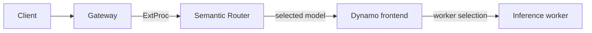

> **Status:** Proposal · **Created:** 2025-10-09

## Problem

Semantic routing and inference-fleet routing answer different questions:

- Semantic Router decides which logical model and policy should handle a request.
- NVIDIA Dynamo decides which eligible worker should execute that model request.

Treating either layer as a replacement for the other loses information. A semantic
router does not track worker-local KV state or live decode load. A worker router does
not decide whether a request belongs to a coding model, a small general model, or a
policy-restricted model pool.

## Proposal

Place Semantic Router at the gateway boundary and send its selected provider model to
a Dynamo frontend that serves the same model name.



The integration is deliberately layered. The components do not share an optimizer,
and neither component reaches into the other's internal state.

## Responsibilities

| Layer | Responsibility |
| --- | --- |
| Gateway | Accept client traffic, invoke ExtProc, and forward the resulting request. |
| Semantic Router | Resolve the entrypoint, evaluate signals and policy, run request plugins, and select a provider model. |
| Dynamo frontend | Accept the selected model request and apply the configured Dynamo routing mode. |
| Dynamo workers | Execute inference and publish any state required by Dynamo routing. |

Semantic Router may terminate a request before Dynamo when a configured policy blocks
it or a response-producing plugin returns a result. Otherwise, Dynamo remains
responsible for the physical worker choice.

## Integration contract

The deployment must establish these invariants:

1. Every model Semantic Router can select is served by the target Dynamo frontend.
2. The selected provider model maps to the model identifier Dynamo expects.
3. Gateway routing preserves the mutated request body and required model metadata.
4. Direct requests to the Dynamo frontend succeed before the gateway path is enabled.
5. Operators can correlate one request across the gateway, Semantic Router, the
   Dynamo frontend, and a worker.

Model aliases and backend endpoints are deployment data. They should live in the
canonical provider configuration, not in signal or decision rules.

Semantic classification remains a Router concern. Its canonical configuration stays
under the model catalog rather than being copied into Dynamo's worker-routing config:

```yaml
global:
  model_catalog:
    modules:
      classifier:
        domain:
          enabled: true
```

A resulting domain category can constrain the logical model pool; Dynamo then selects
a worker serving the chosen model. Request-safety modules stay at the same Router
boundary:

```yaml
global:
  model_catalog:
    modules:
      prompt_guard:
        enabled: true
        variant: mmbert32k
        threshold: 0.7
```

## Cache boundary

The two cache layers are independent:

- A Semantic Router response cache can answer a request without running inference.
- Dynamo's KV-aware routing can reuse token-prefix state while executing a new
  inference request.

A response-cache hit says nothing about Dynamo's KV state. A Dynamo KV hit says
nothing about semantic equivalence between two requests. Metrics and traces should
keep those events separate.

## Failure and policy behavior

The gateway must define whether an ExtProc failure is fail-open or fail-closed. A
fail-open path can preserve availability, but it can also bypass model-selection and
safety policy. Deployments with mandatory policy enforcement should fail closed or
route to an explicitly constrained fallback.

Semantic Router should not infer worker health from a successful semantic decision.
Dynamo should not reinterpret semantic confidence as worker capacity. Each layer
reports and handles failures within its own boundary.

## Scope

This proposal covers:

- the request path between Semantic Router and a Dynamo frontend;
- logical-model to served-model identity;
- independent response-cache and KV-cache behavior; and
- observability across both routing layers.

It does not define Dynamo installation, worker topology, KV-router tuning, or
disaggregated-serving configuration. Those remain owned by Dynamo and change on their
own release cadence.

## Validation

An integration test should prove:

- every configured model is visible from the Dynamo frontend;
- a direct request works for each model before gateway routing is tested;
- representative requests select the expected logical model;
- Dynamo dispatches only to workers serving that model; and
- fail-open or fail-closed behavior matches the deployment's policy.

Performance claims require a reproducible comparison against the same model pool,
traffic sample, cache state, and routing mode. This proposal makes no latency, quality,
or cost claim without such evidence.

## Open questions

- Should one Dynamo frontend serve the whole semantic model pool, or should provider
  bindings target separate frontends?
- Which request identifier is stable across all four layers?
- Which policy classes require fail-closed behavior?
- How should model aliases be versioned when Dynamo and Semantic Router are upgraded
  independently?

## References

- [Current Semantic Router and Dynamo deployment guide](../installation/k8s/dynamo)
- [NVIDIA Dynamo documentation](https://docs.nvidia.com/dynamo/latest/)
- [Semantic Router system overview](../overview/semantic-router-overview)
