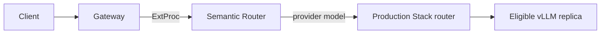

> **Status:** Proposal · **Created:** 2025-10-13

## Problem

The vLLM Production Stack manages model serving, service discovery, replica
scheduling, and inference lifecycle. Those capabilities do not decide which model pool
best fits the meaning or policy requirements of an incoming request.

Semantic Router can make that logical model choice, but it should not duplicate the
Production Stack's replica scheduling or infrastructure control plane.

## Proposal

Run Semantic Router before the Production Stack request router:

Semantic Router selects a provider model from the recipe. The Production Stack then
selects a replica that serves that model.

## Responsibilities

| Component | Owns |
| --- | --- |
| Semantic Router | Entrypoints, signals, decisions, logical model selection, and recipe-scoped plugins. |
| vLLM Production Stack | Model deployment, service discovery, replica scheduling, and inference lifecycle. |
| Gateway | Client traffic, ExtProc attachment, and forwarding to the selected backend. |

This separation keeps semantic policy independent from changing replica topology.

## Integration contract

Each selectable provider model must map to a stable OpenAI-compatible Production Stack
endpoint and served model identifier. Kubernetes DNS names, credentials, and
provider-specific identifiers belong in provider bindings. Decisions should reference
logical model names rather than cluster addresses.

The end-to-end path is ready only when:

1. every backend works directly;
2. the full Semantic Router configuration validates;
3. the gateway invokes ExtProc before backend selection;
4. the selected logical model maps to the intended Production Stack pool; and
5. logs or traces show which replica ultimately executed the request.

## Cache and scheduling boundary

Semantic response caching and inference scheduling solve different problems. A
response cache may complete a request before it reaches the Production Stack.
Prefix-aware or KV-aware scheduling only affects requests that continue to inference.
Their hit rates and latency effects should be measured separately.

Semantic signals may narrow the eligible model pool, but they should not directly
choose a replica. Live queue depth, prefix locality, and replica health remain
Production Stack concerns.

## Security and failure behavior

Detection is not enforcement. PII, jailbreak, or other signals affect traffic only
when a decision or plugin applies an action.

The gateway must declare ExtProc failure behavior. Fail-open preserves a path to the
backend but may bypass semantic and security policy. Fail-closed protects policy at the
cost of availability. The correct choice is route-specific and should be tested.

Secrets, tenant identity, and data-retention settings must remain consistent across
the gateway, Semantic Router, Production Stack, and any external stores.

## Scope

This proposal defines the layering and logical Model-to-serving-endpoint contract. It does not:

- replace Production Stack deployment or scheduling APIs;
- prescribe a particular replica-routing algorithm;
- make quality, cost, or latency claims;
- couple Semantic Router releases to Production Stack releases; or
- require shared cache state between the two systems.

## Validation

Use a small set of requests with known expected model pools. Confirm the semantic
selection and the physical replica independently. Record configuration versions,
served model identifiers, cache state, and traffic shape before publishing any
performance comparison.

## Open questions

- Should a deployment expose one multi-model endpoint or one endpoint per model pool?
- Which request identifier should correlate gateway, semantic, and replica traces?
- Which routes must fail closed when Semantic Router is unavailable?
- How should model aliases be rolled out without breaking in-flight requests?

## References

- [Current Production Stack integration guide](../installation/k8s/production-stack)
- [vLLM Production Stack documentation](https://docs.vllm.ai/projects/production-stack/en/latest/)
- [Production Stack semantic-routing use case](https://docs.vllm.ai/projects/production-stack/en/latest/use_cases/semantic-router-integration.html)
- [Semantic Router system overview](../overview/semantic-router-overview)
