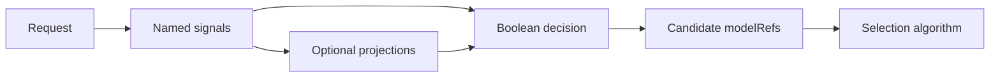

> **Status:** Proposal · **Created:** 2025-10-08

## Problem

No single classifier is ideal for every routing condition. Operators sometimes need an
exact rule for a product name or compliance pattern, semantic matching for paraphrases,
and a learned classifier for broad domains. Encoding all of those needs in one model
makes deterministic policy difficult to inspect and update.

## Proposal

Represent each detector as an independent, named signal and compose the results in
decisions:

| Signal | Best suited for | Main limitation |
| --- | --- | --- |
| Keyword | Exact terms and operator-owned vocabulary. | Misses paraphrases and requires normalization rules. |
| Regex | Structured identifiers and bounded syntax patterns. | Unsafe patterns can consume excessive CPU or match too broadly. |
| Embedding | Concepts that appear in varied language. | Thresholds depend on the model and evaluation set. |
| Learned classifier | Broad intent, domain, safety, or preference labels. | Requires model artifacts and calibrated confidence. |

The proposal is additive. A route can use one signal or combine several; a learned
classifier is not required for a deterministic rule.

## Routing model

Signals describe observations. Projections combine or transform observations.
Decisions express policy. The selection algorithm chooses only from the candidate
models declared by the matched decision.

## Configuration boundary

The original proposal used separate top-level blocks for keyword, regex, embedding,
and fusion configuration. Those examples are no longer the canonical configuration
shape.

Current configuration belongs under `routing.signals`, `routing.projections`, and
`routing.decisions`. Each signal type owns its detector-specific fields, while
decisions reference signal names and conditions. Use the current signal tutorials and
reference configuration rather than copying historical proposal YAML.

## Composition rules

- Deterministic rules should remain deterministic; do not hide an exact policy inside
  a weighted score.
- Confidence values from different detectors are not automatically comparable.
- Boolean decisions should be sufficient for allow, deny, and required-route policy.
- Weighted or derived coordination belongs in a named projection with documented
  normalization.
- A default decision should handle requests for which no specialized rule matches.

## Safety and failure behavior

Regex evaluation needs input-size limits, safe compilation, and protection from
pathological expressions. External or model-backed signals need timeouts and explicit
error behavior. A detector failure must not be confused with a negative match.

Signals that inspect sensitive content should expose bounded labels and scores rather
than copying raw request text into logs or headers.

## Scope and non-goals

This proposal defines how heterogeneous prompt detectors participate in routing. It
does not:

- choose the physical backend replica;
- make signal confidence globally calibrated by default;
- allow signals to widen a decision's declared model pool;
- replace authorization or content-safety actions; or
- preserve the retired top-level configuration examples.

## Evaluation

Evaluate each signal independently before evaluating a composed decision. Report
false matches, missed matches, detector latency, model or artifact version, and the
effect of chosen thresholds. Then evaluate the final route on a held-out request set.

Avoid synthetic percentage claims unless the dataset, labels, configuration, and
evaluation script are available.

## Open questions

- Should regex become a first-class signal or remain an operator extension?
- Which projections require confidence calibration across signal families?
- How should a decision distinguish detector failure from an ordinary non-match?
- Which signal artifacts can be hot-reloaded safely?

## References

- [Signals, decisions, and model selection](../overview/signal-driven-decisions)
- [Signal overview](../tutorials/signal/overview)
- [Keyword signal](../tutorials/signal/heuristic/keyword)
- [Embedding signal](../tutorials/signal/learned/embedding)
- [Classifier signal](../tutorials/signal/learned/classifier)
- [Related issue #313](https://github.com/vllm-project/semantic-router/issues/313)
