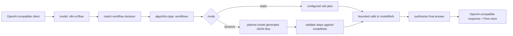
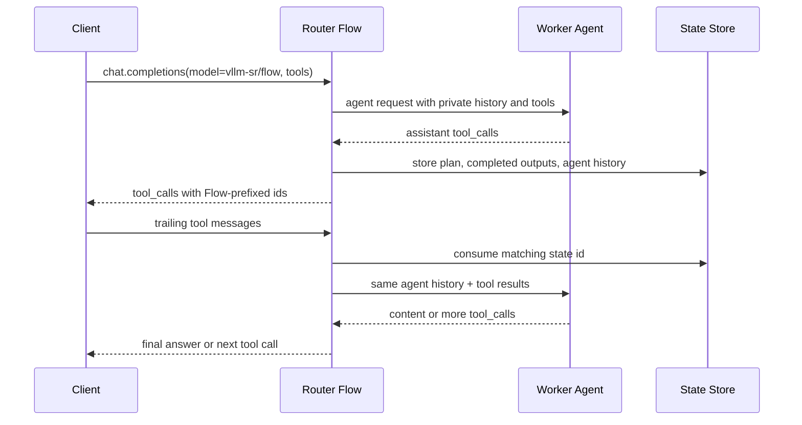

# Router Flow Workflows

## Status

Proposal and implementation contract for Router Flow, a micro-agent workflow
runtime exposed through a single OpenAI-compatible model name:
`vllm-sr/flow`.

This proposal targets a model API that appears to the user as one model, while
routing internally across multiple models, roles, and coordination steps.

Router Flow should beat the product shape first: explicit worker pools,
operator-owned models, inspectable plans, configurable static/dynamic workflows,
and deployment inside the existing vLLM Semantic Router gateway. Coordinator
training is intentionally deferred until the serving contract and eval loop are
stable.

## Product Shape

Router Flow has three public concepts:

| Concept | Public Surface | Purpose |
| --- | --- | --- |
| Flow model | `vllm-sr/flow` | One API model name that triggers workflow execution. |
| Workflow algorithm | `algorithm.type: workflows` | Per-decision execution policy. |
| Worker pool | `modelRefs` | The allowed models that workflow steps may call. |

The name exposed to users is Router Flow. The algorithm type remains
`workflows`, because it describes the implementation class and leaves room for
future Flow model aliases.

## Why This Can Win

The core product advantage is packaging: multi-agent orchestration appears as a
single model API. vLLM Semantic Router already owns the gateway position, so
Router Flow can expose that product shape while adding controls generic hosted
APIs cannot assume:

- explicit `modelRefs` worker pools per route;
- enterprise-owned local and external model mixes;
- decision-level signals before orchestration;
- route-specific cost, privacy, and policy boundaries;
- inspectable workflow traces;
- static workflows for deterministic production paths;
- dynamic planner workflows only where the route opts in;
- direct compatibility with existing Fusion and ReMoM looper infrastructure.

The strategy is not "train a better coordinator first." The first strategy is
"make the router into the orchestration control plane," then use evals to decide
where a trained coordinator is worth it.

## Architecture



Router Flow reuses the looper internal execution path. The new pieces are:

- direct Flow model-name recognition under `global.integrations.looper.flow`;
- a `workflows` algorithm config block;
- static plan generation;
- dynamic planner invocation;
- plan validation;
- per-agent tool-loop state;
- workflow trace formatting.

## Function-Calling Workflow Semantics

Flow supports normal Chat Completions `tools` and legacy `functions` on the
single `vllm-sr/flow` model API. The planner request strips tool schemas so
planning stays declarative. Worker and final-synthesis calls can receive tools
and can independently enter tool loops.



The state key is embedded in returned `tool_call_id` values, so a subsequent
tool-result turn can be routed back to the exact pending agent. Flow validates
that every trailing tool message belongs to the pending state and matches the
requested tool-call ids before it resumes execution.

Agent communication remains controlled by the workflow topology. Each worker has
its own private tool trajectory. A step's `access_list` exposes selected earlier
step outputs or selected earlier agent outputs only; it does not expose raw tool
calls, tool results, or another agent's hidden message history. Step ids keep
the older role-level behavior. Agent ids use
`<step-id>:<model-index>:<model-name>` when a later step should see only one
worker from a parallel step, and the same ids are emitted in Flow traces for
worker responses. The final synthesizer receives step outputs and can itself
enter a tool loop without rerunning completed workers.

Pending workflow state is backed by `global.integrations.looper.flow.state`.
The default `file` backend is restart-tolerant on a preserved filesystem;
`memory` is for local single-process development; `redis` is the intended
multi-replica backend.

## Static Mode

Static mode is for predictable production workflows. It requires no planner and
must explicitly declare ordered roles. Each role maps to one or more models from
the decision's `modelRefs`; role models outside `modelRefs` are rejected during
config validation.

```yaml
routing:
  decisions:
    - name: flow_static_code
      rules:
        operator: OR
        conditions:
          - type: domain
            name: code
      modelRefs:
        - model: qwen-worker
        - model: deepseek-worker
        - model: claude-worker
      algorithm:
        type: workflows
        workflows:
          mode: static
          template: micro_agent
          roles:
            - name: thinker
              models: [qwen-worker]
              prompt: Break down the task and identify constraints.
            - name: worker
              models: [deepseek-worker, claude-worker]
              prompt: Solve independently with concrete evidence.
            - name: verifier
              models: [qwen-worker]
              prompt: Check the worker outputs against the original request.
          final:
            model: qwen-worker
            prompt: Produce the final answer for the user.
          max_steps: 3
          max_parallel: 2
          include_intermediate_responses: true
          on_error: fail
```

Static mode is the right default for stable routes, narrow task families, and
cases where auditability matters more than exploratory planning.

## Dynamic Mode

Dynamic mode calls a configured planner model to produce the workflow plan.
The planner model is configured like any other model/provider and then
referenced by name under the decision's workflow config.

```yaml
global:
  integrations:
    looper:
      endpoint: http://localhost:8899/v1/chat/completions
      flow:
        model_names:
          - vllm-sr/flow

routing:
  decisions:
    - name: flow_dynamic_code
      rules:
        operator: OR
        conditions:
          - type: domain
            name: code
      modelRefs:
        - model: qwen-worker
        - model: deepseek-worker
        - model: claude-worker
      algorithm:
        type: workflows
        workflows:
          mode: dynamic
          planner:
            model: qwen-coordinator
            max_completion_tokens: 2048
          template: micro_agent
          max_steps: 6
          max_parallel: 3
          max_completion_tokens: 32768
          include_intermediate_responses: true
          on_error: fail
```

Dynamic mode deliberately does not expose `source: modelRefs`. The worker pool
is always the decision's `modelRefs`; the planner only decides how to use that
pool. A dynamic plan is rejected if it names a worker or final model outside the
pool. `planner.max_completion_tokens` caps only the compact JSON plan; the
top-level `max_completion_tokens` is reserved for worker and final synthesis
answers.

## Coordinator Strategy

The design leaves room for two future coordinator families:

- small coordinator: a compact model optimized for role assignment and
  delegation;
- conductor model: a stronger LLM or fine-tuned model that writes natural
  language coordination plans.

Router Flow M1 does not train either. It supports both as pluggable planner
models. For M2 validation, a locally served Qwen-family model can act as
`qwen-coordinator` while worker models are served locally or through an external
OpenAI-compatible provider.

The important boundary is that the planner is control-plane compute and
workers are task-plane compute. The planner creates a plan. Only workers in
`modelRefs` execute task steps. Final synthesis may use the planner model by
default, or a validated worker when the plan specifies one.

## Implementation Plan

M1, implemented in the router:

- config: `FlowRuntimeConfig`, `WorkflowsAlgorithmConfig`;
- extproc: direct Flow dispatch for `vllm-sr/flow`;
- looper: static and dynamic workflow execution;
- Python CLI: schema, validation, and static override default;
- DSL: compile/decompile `ALGORITHM workflows`;
- dashboard: algorithm schema, Monaco hints, topology metadata;
- docs: tutorial, config docs, proposal, execution plan;
- tests: config validator, extproc dispatch, looper dynamic execution, DSL,
  Python schema/CLI.

M2, validation and attention:

- serve a coordinator model on AMD hardware;
- use OpenRouter-compatible external worker models through provider config;
- run Flow static, Flow dynamic, Fusion, and single-model baselines on the same
  prompt set;
- record success rate, judge score, latency, token count, model-call count, and
  failure modes;
- publish a blog that markets the capability without claiming unreproduced
  benchmark parity.

Training is out of scope for M1/M2. A trained coordinator becomes a later
follow-up only if eval data shows that prompt-only dynamic planning is the
bottleneck.

## Evaluation Contract

The first eval should be lightweight but honest:

- single API model UX: request `model: "vllm-sr/flow"`;
- benchmark slices covering coding, terminal/code repair, general reasoning,
  science/math, and long context;
- compare Flow dynamic against Flow static, Fusion, and the best single worker;
- report reproducible internal measurements before writing marketing claims;
- keep API keys and private host details out of committed artifacts.

Recommended first metrics:

| Metric | Meaning |
| --- | --- |
| solved | Task-specific pass/fail or judge pass/fail. |
| judge_score | LLM-as-judge score for non-executable tasks. |
| latency_ms | End-to-end request latency. |
| upstream_calls | Planner, worker, and synthesis call count. |
| prompt_tokens / completion_tokens | Cost proxy. |
| trace_complete | Whether Flow returned plan and worker trace. |
| failure_mode | Planner parse, worker failure, final synthesis failure, or validation rejection. |

## Non-Goals

- Do not train a coordinator in the first implementation.
- Do not implement RL coordinator training in the first implementation.
- Do not add an unbounded agent framework inside extproc.
- Do not expose extra worker-pool source knobs when `modelRefs` already define
  the boundary.
- Do not publish private AMD validation details or secrets.

## Open Follow-Ups

- trained coordinator model selection and distillation;
- planner prompt versioning;
- dashboard trace visualization beyond raw response metadata;
- benchmark adapters for SWE-bench style executable tasks.
