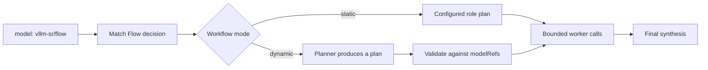

> **Status:** Implemented · **Created:** 2026-06-30

## Problem

Multi-step model workflows often require a separate orchestration service and a
client-specific API. That makes model pools, routing policy, traces, and failure
behavior harder to manage alongside ordinary inference.

Router Flow exposes bounded orchestration through the same OpenAI-compatible gateway
and recipe policy used for other routes.

## Implemented design

Router Flow has three public concepts:

| Concept | Surface | Purpose |
| --- | --- | --- |
| Flow model | `vllm-sr/flow` | A request model name that selects Flow-capable decisions. |
| Workflow algorithm | `algorithm.type: workflows` | The decision-local orchestration policy. |
| Worker pool | `modelRefs` | The only models workflow steps may invoke. |

```mermaid
flowchart LR
  Request["model: vllm-sr/flow"] --> Decision["Match Flow decision"]
  Decision --> Plan{"Workflow mode"}
  Plan -->|"static"| Static["Configured role plan"]
  Plan -->|"dynamic"| Planner["Planner produces a plan"]
  Planner --> Validate["Validate against modelRefs"]
  Static --> Workers["Bounded worker calls"]
  Validate --> Workers
  Workers --> Final["Final synthesis"]
```

The planner creates a plan; worker models execute task steps. A planner cannot add a
model that is absent from `modelRefs`.

## Static workflows

Static mode uses an operator-authored role plan. It is suitable when steps, models,
dependencies, and synthesis behavior should be deterministic and reviewable.

Independent steps may run concurrently when the plan declares no dependency between
them. Dependent steps receive only the bounded outputs declared by the workflow.

## Dynamic workflows

Dynamic mode asks a configured planner model for a structured plan. The router parses
and validates that plan before any worker call:

- step identifiers must be unique;
- dependencies must form an acyclic graph;
- roles and models must be allowed by the decision;
- tool loops, steps, calls, and output sizes are bounded; and
- invalid plans fail through the configured error policy.

Planner output is untrusted data, not executable configuration.

## Function-calling boundary

Each workflow step has its own message and tool-call state. Tool results return only to
the step that requested them. The router enforces per-step and workflow-wide limits so
a planner cannot create an unbounded agent loop.

Tools still require authorization outside semantic relevance. A workflow may select a
tool only when both the route and caller are permitted to use it.

## Failure and observability

The workflow trace should distinguish planning, validation, worker execution, tool
calls, and final synthesis. Partial worker failure follows the decision's policy; it
must not silently disappear from the trace.

Timeouts apply to individual calls and to the complete workflow. Cancellation
propagates to outstanding worker calls.

## Scope and non-goals

The implemented boundary supports static and dynamic workflows with bounded workers
inside the gateway. It does not:

- train a coordinator;
- provide a general-purpose agent framework;
- allow arbitrary code execution;
- widen the decision's worker pool;
- promise that a workflow outperforms its best worker; or
- hide workflow cost behind a single-model response.

## Evaluation

Compare Flow with the best single worker and other looper algorithms on the same task
set. Report task success, judge criteria where necessary, latency, tokens, upstream
calls, plan-validation failures, tool-loop failures, and trace completeness.

## Open questions

- Which workloads justify dynamic planning over static plans?
- When should final synthesis use the planner versus a worker?
- Which trace fields are safe for user-facing responses?
- What evidence would justify training or distilling a coordinator?

## References

- [Current workflows guide](../tutorials/algorithm/looper/workflows)
- [Algorithm overview](../tutorials/algorithm/overview)
- [Fusion](../tutorials/algorithm/looper/fusion)
