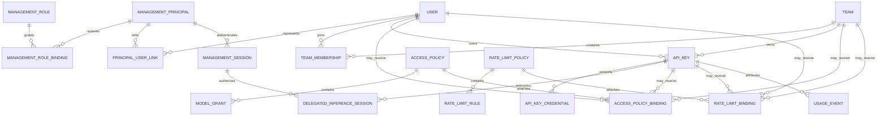

> **Status:** Proposal appendix · **Created:** 2026-08-22

This appendix is normative for [Router-Native Access Control and Quota Accounting](./router-native-access-control) resources and runtime. The parent owns boundaries, request semantics, deployment, contract versioning, and acceptance criteria.
The [Management API appendix](./router-native-access-control-management-api) owns management identity, endpoints, and responses. The [Management authorization appendix](./router-native-access-control-authorization) owns permissions, roles, and scopes.
Provider Integration, compiler, and adapter semantics live in
[Provider catalog](./router-native-access-control-provider-catalog);
invocation-control and pricing semantics live in
[Model runtime](./router-native-access-control-model-runtime); applied counters and
reconciliation live in [quota runtime](./router-native-access-control-quota-runtime).

## Canonical resource model



### Ownership invariants

- An InferenceAPIKey has exactly one owner: one User or one Team.
- A User-owned key may select one `context_team_id`, and the User must be an active
  member of that Team.
- A Team-owned key has no User owner and always uses its owner Team as context.
- Direct use of a Team-owned secret attributes usage to the key and Team, not an
  inferred User. A delegated inference session adds the authenticated linked User.
- Disabling a key, owner User, or context Team denies the key.
- TeamRole does not create a ManagementRole; the evaluator synthesizes only the fixed,
  non-delegable Team entitlements in the authorization contract.
- Deleting a User or Team requires key reassignment or key deletion. Usage and audit
  retain immutable subject snapshots after resource deletion.
- A multi-Team User selects accounting context by creating a key for that context;
  an untrusted request header can never switch a key between Teams.

### Effective access inheritance

Access selects the first explicitly configured layer:

```text
Key AccessPolicy -> User AccessPolicy -> context Team AccessPolicy
```

Within the selected layer, multiple AccessPolicies form an allow union; an explicit deny
wins. No policy at any layer means no model access. The effective-policy API returns
both the resolved grants and their source.

### Effective quota inheritance and hard caps

Rate-limit bindings have one of two modes:

- `allocation`: select the first explicit allocation at Key, User, then Team.
- `hard_cap`: enforce every applicable Key, User, and Team cap in addition to the
  selected allocation.

Each namespace has one immutable canonical `quota_partition_id`. Every binding
in the namespace copies and database-validates that value, so every allocation and
hard cap touched by one admission is co-located with its pending lease, settlement
marker, fence, and usage stream. A subject has at most one active `allocation`
binding, enforced by a partial unique constraint. It may have several active
`hard_cap` bindings. Counter scope is derived only from the binding subject; there is
no second `counter_scope` field.

The binding subject owns the counter. A Team allocation is shared by all requests that
inherit that Team binding; a User allocation is shared by that User's keys; a Key
override is private to that key. Reusing a RateLimitPolicy does not share a counter.

An administrator can expand an invitation-created key by assigning a more generous
Key allocation. Removing that binding restores User or Team inheritance. A Team hard
cap still applies until it is changed explicitly, preventing a Key override from
silently bypassing an organizational ceiling.

## PostgreSQL authoritative schema contract

PostgreSQL stores desired state and immutable facts. Every namespace-scoped root has
`namespace_id`; global principals, issuers, and sessions acquire namespace authority
only through scoped bindings and links. A child may inherit namespace through an
immutable parent foreign key. Composite foreign keys prevent cross-namespace
ownership and binding. The SQL is illustrative; the field and invariant inventory is
normative.

| Table family | Purpose |
| --- | --- |
| `access_namespaces` | Top-level isolation and quota atomicity domain. |
| `access_subjects` | Typed User, Team, and API-key registry used by binding foreign keys. |
| `access_users`, `access_teams`, `access_team_memberships` | Inference identities and Team roles. |
| `access_api_keys`, `access_api_key_credentials` | Logical keys and independently rotatable secrets. |
| `access_policies`, `access_policy_grants` | Reusable explicit model visibility and invocation rights. |
| `routing_claim_schemas`, `routing_subject_claims` | Namespace allowlist/type contract and Router-owned Key/User/Team routing-context values. |
| `rate_limit_policies`, `rate_limit_rules` | Reusable ordered quota definitions. |
| `routing_models`, `routing_model_revisions`, `routing_model_backends` | Logical Model UIDs, immutable invocation-control/pricing revisions, provider/backend references, and lifecycle. |
| `routing_recipes`, `routing_recipe_revisions`, `routing_recipe_decisions` | Draft/published model-free Recipe documents plus separately compiled stable Decision identities. |
| `routing_entrypoints`, `routing_entrypoint_rules`, `routing_decision_assignments`, `routing_assignment_models` | Callable aliases, trusted matchers, Recipe references, per-decision fallback policy, and priority-ordered Model references. |
| `routing_snapshots`, `routing_snapshot_members` | Content-addressed, immutable compiled routing state and activation revisions. |
| `access_policy_bindings` | AccessPolicy attachment to a typed subject. |
| `rate_limit_bindings` | Quota attachment, inheritance mode, partition, and counter identity. |
| `management_principals`, `management_roles`, `management_role_bindings` | Global management identities, built-in/custom permission sets, and cluster/namespace/resource scopes. |
| `management_installation_state` | Singleton bootstrap-consumed marker, recovery nonces, and immutable receipts. |
| `management_principal_user_links`, `management_service_accounts`, `management_service_account_credentials` | Namespace links and cluster- or namespace-owned rotated automation identities. |
| `trusted_identity_issuers`, `management_mtls_mappings`, `management_sessions`, `management_invitations` | Identity exchange, certificate mapping, revocation, step-up attributes, and one-time onboarding authority. |
| `management_session_policy` | Cluster singleton for Management token/session TTL, active-session limits, and cluster-action assurance/authentication age. |
| `management_security_policies` | Namespace-scoped assurance and authentication-age requirements for sensitive actions. |
| `delegated_inference_sessions` | Short-lived, non-revealable Playground-style credentials tied to one logical key and Management session. |
| `provider_credentials`, `provider_credential_versions` | Separately encrypted backend credentials; never accepted from inference callers. |
| `provider_catalog_revisions`, `provider_catalog_state`, `provider_catalog_replica_acks` | Immutable Integration Registry snapshots, active digest, and bounded adapter-capability acknowledgement leases. |
| `self_service_policies` | Key-count, delegation, onboarding, and Team-default rules. |
| `management_operations`, `management_idempotency` | Async domain work, progress, cancellation, and bounded encrypted one-time responses. |
| `policy_revisions`, `policy_outbox`, `projector_watermarks` | Desired-to-applied consistency. |
| `unknown_usage_fences`, `unknown_usage_fence_bindings` | Durable per-admission accounting ambiguity and every affected quota binding. |
| `usage_settlements` | Compact global request-id deduplication independent of time partitions. |
| `usage_events`, `usage_dispatches` | Time-partitioned external requests and backend-call breakdowns. |
| `usage_rollup_1m`, `usage_rollup_1h`, `usage_rollup_1d` | Bounded long-range analytics. |
| `inference_outcomes`, `inference_outcome_idempotency` | Replay-owned feedback, cross-replica idempotency receipts, and learning projection input. |
| `access_audit_events` | Append-only management and security audit. |

### Core field inventory

| Resource | Required fields and constraints |
| --- | --- |
| Namespace | Immutable ID/name, canonical quota partition ID and ISO-4217 billing currency, status, revision, runtime epoch, timestamps. |
| Subject | `(namespace_id, id)` primary key and immutable User, Team, or API-key kind; lifecycle exists only on the concrete resource. |
| User | Subject FK of kind User, normalized unique email, display name, status, timestamps. |
| Team | Subject FK of kind Team, unique name, active or disabled status, and timestamps. Creation atomically materializes its selected AccessPolicy bindings and one RateLimit allocation binding. |
| Membership | Composite Team/User FKs in one namespace, TeamRole, status, timestamps, unique pair. |
| API key | Subject FK, one User/Team owner, optional context Team, status, expiry, policy and delegation epochs, revision, soft-delete time. |
| Credential version | Logical-key FK, globally unique `kid`, HMAC and pepper version, optional ciphertext/nonce/KEK version, lifecycle times. |
| AccessPolicy | Namespace, immutable ID, mutable display name, status, revision. |
| ModelGrant | Parent policy FK, immutable resource UID, type, permission, effect; unique grant tuple. |
| Routing claim schema/value | Namespace schema revision with at most 16 namespaced string, boolean, or bounded-integer definitions; typed subject FK/value, revision, and unique `(subject_id, claim_name)`. |
| RateLimitPolicy | Namespace, immutable ID, mutable display name, status, revision. |
| RateLimitRule | Parent policy FK, immutable rule ID, metric, algorithm-specific parameters, accounting, enforcement, ordinal. |
| Model/backend | Namespace, immutable Model UID, mutable unique name/aliases, capability metadata, status/current immutable revision; the revision embeds invocation control and four-rate pricing values. Each ordered endpoint pins provider attribution, exactly one stable wire format, canonical origin, provider model ID, compiled non-secret connection values, weight, and optional ProviderCredential UID. |
| Recipe/revision | Namespace, immutable Recipe UID, mutable name, lifecycle/revision; immutable validated document revision with signals, projections, readable Decision names, algorithms, and plugins. Stable Decision UIDs are compiler-owned metadata and never appear in the source document. |
| Entrypoint/rule | Namespace, immutable Entrypoint/rule UIDs, mutable names/aliases, lifecycle/revision, trusted matchers, exact Recipe revision, and complete decision assignments. Each decision assignment stores an optional typed priority-fallback policy. Its ordered Model references store required Model UID, priority 0-31, optional positive canonical-decimal weight, Model-declared LoRA name, and typed reasoning controls; endpoint, pricing, invocation control, and credential data are forbidden here. |
| Routing snapshot | Namespace routing revision, content digest, compiled blob/object reference, staged/active/failed status, replica acknowledgement set, timestamps. |
| Access binding | Composite policy and typed-subject FKs in one namespace, status, revision. |
| Rate binding | Composite policy and typed-subject FKs, allocation or hard-cap mode, quota partition, status, revision. |
| ManagementPrincipal | Global immutable `(issuer, subject)` identity, status, attributes, timestamps. |
| ManagementRole | Built-in or namespace-owned custom role, immutable validated permission set, mutable display metadata, immutable built-in flag, revision. |
| Role binding | Principal and role FKs, discriminated cluster, namespace, Team, User, or resource scope with namespace, typed resource kind/ID, separate delegation-ceiling permission set, status, revision. |
| Principal/User link | Principal plus namespace maps to at most one User in that namespace; several login identities may explicitly link to one User. |
| Management session | Principal, issuer session, token ID, audience, auth-source kind and stable issuer/service-credential/mTLS mapping ID, typed human or workload assurance evidence, source-assured/auth times, expiry, status, revocation time. |
| Management invitation | Expected identity, namespace, role/scope grants, optional registered TeamRole, expiry, token HMAC, and one-use status. Team onboarding pins membership but leaves User policy layers empty so Team changes continue to apply; no-Team onboarding pins immutable default-policy IDs/revisions resolved from self-service policy. |
| mTLS identity mapping | Global immutable ID, exact normalized SPIFFE ID, SAN URI, SAN DNS, or subject-DN digest matcher, ManagementPrincipal FK, workload-assurance class and assured-at time, status, revision; uniqueness prevents ambiguous matches. |
| Service account/credential | ManagementPrincipal subtype with reserved issuer, immutable cluster or namespace owner scope, public credential ID, HMAC/pepper, workload-assurance class and assured-at time, lifecycle, expiry, and no inference authority. Namespace-owned principals cannot bind elsewhere. |
| Delegated inference session | Management session, principal, namespace, logical key and delegation epoch, User/Team context, token HMAC/pepper, audience, expiry, revocation; no reveal. |
| Provider credential/version | Namespace, immutable provider ID, credential-adapter ID, catalog revision and normalized scheme/host/port/base-path origin, encrypted secret/nonce/KEK version, lifecycle, revision; no inference-key HMAC or reveal. |
| Self-service policy | Namespace, `max_keys_per_user`, delegation TTL, required Team defaults, onboarding behavior, revision. |
| Management session policy | Cluster singleton, access-token/session TTL, active-session limits, typed human/workload authentication predicates per cluster action, revision. |
| Management security policy | Namespace, typed human/workload authentication predicates per sensitive action, revision; no token/session TTL. |
| Management operation | Namespace, domain kind, actor chain, normalized request digest, state/progress, target IDs, desired/publication/applied revisions, item errors, cancellation, timestamps. |
| Unknown usage fence | Stable fence ID, admission ID, namespace, reason, evidence, open, reconciling, or resolved lifecycle, reconciliation strategy/actor/revision, and one or more affected binding FKs. |

Type-specific subject constraints use database constraint triggers maintained with
the schema. The subject registry contains identity and kind only, so status and
revision cannot diverge from User, Team, or API-key tables. An API-key owner must
reference a User or Team in the same namespace; a context Team must be active and
contain the owner User; and bindings reject the wrong subject kind. The service
validates first, but database enforcement is authoritative.

### Global Management sessions and scoped action security

A ManagementSession and Router-signed JWT are global across the principal's
authorized namespaces. The cluster singleton ManagementSessionPolicy alone defines
token/session TTL, active-session limits, and assurance/authentication-age rules for
cluster-scoped actions. JWT `exp` is the earliest of verified bootstrap evidence
expiry, cluster token TTL, and durable session expiry; exchange rejects a new session
when its deterministic active-session limit would be exceeded.

An action-authentication requirement is an explicit OR-set of typed predicates, not
one scalar AAL. A human predicate contains `minimum_aal`, accepted AMR, and
`max_authentication_age`; a workload predicate contains `minimum_workload_class` and
`max_source_age`. A session contains exactly one evidence kind. Human assertion
exchange derives AAL/AMR from the trusted issuer mapping. Service-token and mTLS
exchange derive workload class and `source_assured_at` from the exact credential or
mapping revision; neither may claim or be compared with a human AAL.

`workload_strong` requires a Router-generated 256-bit service credential with an
active bounded lifetime, or a listener-verified client certificate with an exact
active mapping. Both require an explicitly registered strong class, fresh
`source_assured_at`, and normal source/principal/session checks. Creating or upgrading
a strong source is itself a sensitive action and cannot elevate the current session.
Bootstrap is the sole exception: its serializable transaction may issue the first
strong service credential at the seed revision so that a service-account first
administrator is not locked out.

A restrictive cluster-policy update installs the cluster session barrier, revokes
sessions older than the new TTL and deterministic oldest excess sessions by
`(created_at, id)`, projects the rule, and only then reports success.

Namespace ManagementSecurityPolicy never changes token/session lifetime. On each
targeted request, middleware evaluates the session's typed evidence against that
namespace's applied action requirement. A restrictive policy change installs a
namespace security barrier before success. Insufficient human evidence receives a
step-up challenge; insufficient workload evidence requires source rotation or
re-registration and never receives an impossible human challenge. The session remains
valid elsewhere; cluster actions use the cluster policy.

### Effective routing context

Routing-context values exist only on typed Key, User, and Team subjects. For each
schema-defined name, the projector selects the first explicit value in this order:

```text
User-owned key: Key -> User -> context Team
Team-owned key: Key -> owner Team
```

Absence means the claim is omitted; there is no caller-provided default. Updating a
schema or value schedules every affected key projection and cannot advance the active
pointer until all values validate. Removing or changing a definition that is still
referenced by a published Entrypoint rule is rejected unless the same operation
replaces or unpublishes that rule. Claim values are not grants and never add a Model
or Entrypoint permission.

### Logical keys and credential versions

```sql
CREATE TABLE access_api_keys (
  id uuid PRIMARY KEY,
  namespace_id uuid NOT NULL,
  name text NOT NULL,
  owner_user_id uuid,
  owner_team_id uuid,
  context_team_id uuid,
  status text NOT NULL,
  expires_at timestamptz,
  revision bigint NOT NULL,
  created_at timestamptz NOT NULL,
  updated_at timestamptz NOT NULL,
  deleted_at timestamptz,
  CHECK (num_nonnulls(owner_user_id, owner_team_id) = 1)
);

CREATE TABLE access_api_key_credentials (
  id uuid PRIMARY KEY,
  api_key_id uuid NOT NULL REFERENCES access_api_keys(id),
  kid text NOT NULL UNIQUE,
  secret_hmac bytea NOT NULL,
  pepper_version text NOT NULL,
  secret_ciphertext bytea,
  ciphertext_nonce bytea,
  kek_version text,
  status text NOT NULL,
  not_before timestamptz NOT NULL,
  expires_at timestamptz,
  revoked_at timestamptz,
  created_at timestamptz NOT NULL
);
```

`last_used_at` is a batched projection on the logical key, not a synchronous write on
every request. Usage remains linked to the stable logical key across rotations.
Production DDL adds composite `(namespace_id, id)` candidate keys and composite owner
and context-Team foreign keys. A deferred membership constraint prevents a
User-owned key from committing with an invalid Team context.

### Grants and rate-limit rules

```sql
CREATE TABLE access_policy_grants (
  policy_id uuid NOT NULL REFERENCES access_policies(id),
  resource_type text NOT NULL,
  resource_id text NOT NULL,
  permission text NOT NULL,
  effect text NOT NULL DEFAULT 'allow',
  PRIMARY KEY (policy_id, resource_type, resource_id, permission, effect),
  CHECK (resource_type IN ('entrypoint', 'model')),
  CHECK (permission IN ('discover', 'invoke')),
  CHECK (effect IN ('allow', 'deny'))
);

CREATE TABLE rate_limit_rules (
  id uuid PRIMARY KEY,
  policy_id uuid NOT NULL REFERENCES rate_limit_policies(id),
  metric text NOT NULL,
  algorithm text NOT NULL,
  limit_value numeric(42,0),
  window_seconds bigint,
  calendar_period text,
  timezone text,
  bucket_capacity numeric(42,0),
  refill_amount numeric(42,0),
  refill_period_milliseconds bigint,
  gcra_emission_interval_microseconds bigint,
  gcra_burst_tolerance bigint,
  accounting text NOT NULL,
  enforcement text NOT NULL,
  ordinal integer NOT NULL,
  UNIQUE (policy_id, ordinal),
  CHECK (
    (algorithm = 'sliding_log'
      AND limit_value IS NOT NULL AND limit_value > 0
      AND window_seconds IS NOT NULL AND window_seconds > 0
      AND calendar_period IS NULL AND timezone IS NULL
      AND bucket_capacity IS NULL AND refill_amount IS NULL
      AND refill_period_milliseconds IS NULL
      AND gcra_emission_interval_microseconds IS NULL
      AND gcra_burst_tolerance IS NULL)
    OR
    (algorithm = 'calendar_window'
      AND limit_value IS NOT NULL AND limit_value > 0
      AND calendar_period IS NOT NULL
      AND calendar_period IN ('day', 'month')
      AND timezone IS NOT NULL AND window_seconds IS NULL
      AND bucket_capacity IS NULL AND refill_amount IS NULL
      AND refill_period_milliseconds IS NULL
      AND gcra_emission_interval_microseconds IS NULL
      AND gcra_burst_tolerance IS NULL)
    OR
    (algorithm = 'token_bucket'
      AND bucket_capacity IS NOT NULL AND bucket_capacity > 0
      AND refill_amount IS NOT NULL AND refill_amount > 0
      AND refill_period_milliseconds IS NOT NULL
      AND refill_period_milliseconds > 0
      AND limit_value IS NULL AND window_seconds IS NULL
      AND calendar_period IS NULL AND timezone IS NULL
      AND gcra_emission_interval_microseconds IS NULL
      AND gcra_burst_tolerance IS NULL)
    OR
    (algorithm = 'gcra'
      AND gcra_emission_interval_microseconds IS NOT NULL
      AND gcra_emission_interval_microseconds > 0
      AND gcra_burst_tolerance IS NOT NULL
      AND gcra_burst_tolerance >= 0
      AND limit_value IS NULL AND window_seconds IS NULL
      AND calendar_period IS NULL AND timezone IS NULL
      AND bucket_capacity IS NULL AND refill_amount IS NULL
      AND refill_period_milliseconds IS NULL)
    OR
    (algorithm = 'concurrency'
      AND limit_value IS NOT NULL AND limit_value > 0
      AND window_seconds IS NULL
      AND calendar_period IS NULL AND timezone IS NULL
      AND bucket_capacity IS NULL AND refill_amount IS NULL
      AND refill_period_milliseconds IS NULL
      AND gcra_emission_interval_microseconds IS NULL
      AND gcra_burst_tolerance IS NULL)
  ),
  CHECK (
    (metric = 'requests' AND accounting = 'request'
      AND algorithm <> 'concurrency')
    OR
    (metric IN ('input_tokens', 'output_tokens', 'total_tokens',
                'served_input_tokens', 'served_output_tokens',
                'served_total_tokens', 'cost')
      AND accounting = 'response_actual'
      AND algorithm IN ('sliding_log', 'calendar_window'))
    OR
    (metric = 'concurrent_requests' AND accounting = 'request'
      AND algorithm = 'concurrency')
  ),
  CHECK (enforcement IN ('enforce', 'shadow'))
);
```

Metrics initially include `requests`, routed-backend `input_tokens`,
`output_tokens`, `total_tokens`, `concurrent_requests`, and optional
`served_input_tokens`, `served_output_tokens`, `served_total_tokens`, and `cost`.
The OpenAPI schema is the same discriminated union as the database check. Whole-unit
metrics use an integer decimal-string `limit`. Cost uses a canonical currency-decimal
`limit` with at most 15 fractional digits; the compiler maps it exactly to the
internal per-million numerator stored in `limit_value`:

- `sliding_log` requires a positive limit and duration;
- `calendar_window` requires a positive limit, `day|month`, and IANA timezone, so
  daylight-saving and variable month boundaries are not encoded as seconds;
- `token_bucket` requires capacity, refill amount, and refill period;
- `gcra` requires emission interval and burst tolerance; and
- `concurrency` requires only a positive limit and has no window.

The projector compiles each calendar rule with the Router binary's embedded IANA
tzdb and publishes that binary capability version beside a UTC boundary schedule at
least 18 months ahead. The tzdb version is never mutable Router configuration, so
replicas running different calendar capabilities cannot silently produce one applied
revision. Valkey `TIME` selects the interval from the schedule; Functions never
interpret an IANA zone. The projector refreshes before a 30-day safety horizon, and
access readiness fails closed if the active schedule cannot cover server time.

The metric matrix permits token-bucket and GCRA only for request accounting. Actual
token/cost metrics use sliding-log or calendar-window rules, whose settlement records
the full crossing debit; concurrency uses only its algorithm. Enforcement is
`enforce` or `shadow`. Only unknown usage for an applicable enforce rule enters
`unknown-by-binding` and freezes admission. Shadow-only unknown remains an incomplete
ledger/health fact available for reconciliation and can never deny traffic; a mixed
binding freezes only because of its affected enforce rules.

`access_policy_bindings` has a direct AccessPolicy foreign key. `rate_limit_bindings`
has a direct RateLimitPolicy foreign key plus `binding_mode` and the namespace's
`quota_partition_id`. Both reference `access_subjects(namespace_id, id)`, so there is
no polymorphic policy foreign key. A composite foreign key or constraint trigger
requires every rate binding's partition to equal its namespace partition. A partial
unique index permits at most one active allocation per `(namespace_id, subject_id)`.
The binding ID, not the policy ID, becomes runtime counter identity.

### Usage idempotency and partitioning

PostgreSQL cannot enforce a global request-id uniqueness constraint on a
time-partitioned event table unless the partition key participates in that
constraint. The design therefore uses a compact logically global deduplication table
that may itself be hash-partitioned only by its complete primary key:

```sql
CREATE TABLE usage_settlements (
  namespace_id uuid NOT NULL,
  admission_id text NOT NULL,
  state text NOT NULL CHECK (state IN ('unknown', 'settled', 'waived')),
  canonical_usage_digest bytea,
  reconciliation_id uuid,
  revision bigint NOT NULL,
  settled_at timestamptz,
  event_partition_date date NOT NULL,
  event_retained boolean NOT NULL DEFAULT true,
  raw_retired_at timestamptz,
  PRIMARY KEY (namespace_id, admission_id)
) PARTITION BY HASH (namespace_id, admission_id);
```

For known usage, the usage writer inserts a `settled` row and the target partitioned
UsageEvent in one PostgreSQL transaction. A duplicate with the same digest is an
idempotent success; a different digest is an accounting conflict. For unknown usage,
it inserts an `unknown` row and an immutable unknown UsageEvent. Reconciliation is the
only legal compare-and-set transition from `unknown` to `settled` or `waived`; it
stores a unique reconciliation ID and appends a correction UsageEvent instead of
rewriting history. Rollups apply that correction exactly once. A late authoritative
finalizer enters the same reconciliation state machine with a system actor rather
than attempting a second ordinary settlement.

Settlement rows are the permanent admission directory and canonical-digest
tombstone; the first retention implementation never compacts them. A matching stream
redelivery remains idempotent when `event_retained=false`, while a different digest
remains a conflict. The three raw fact tables use aligned UTC-month range partitions.
Monthly maintenance is advisory-lock safe across replicas, creates future partitions,
and deletes raw facts only when an operator configured `raw_retention` and every
durable rollup queue, inference replay, unknown-usage fence, and reconciliation gate
for that event partition is clear. Raw and audit retention are otherwise indefinite.

### Usage event and request-log fields

An internal request-level UsageEvent ledger row contains:

- namespace, admission ID, optional external request ID, event time, completion time,
  status/error class, cache state, and terminal usage state;
- immutable key, User, Team, Entrypoint, Entrypoint rule, Recipe revision, access
  policy revision, and routing snapshot IDs plus deletion-safe display snapshots;
- actual client-served input/output/total tokens, four mutually exclusive backend
  billing-token aggregates, request count, latency, internal exact cost numerator,
  currency, and cost-completeness counters; and
- quota receipt IDs and every binding/rule counter affected by admission or
  settlement; and
- event kind `terminal|usage_unknown|usage_reconciliation`, event sequence, optional
  reconciliation ID/strategy, and the prior event digest for a correction.

A UsageDispatch contains admission/dispatch/attempt ID and ordinal, parent/parallel
group, decision/Model/backend/provider and pinned Model/pricing revision IDs,
retry/cache classification, four billing-token buckets and rate snapshots, internal
exact cost numerator, currency/completeness, timing, status/error, and authoritative
usage state, but no credential. Unknown events preserve every bounded dispatch intent
and evidence state before terminal detail exists. These ledger objects and the Valkey
ingestion stream are internal. Management, export, webhook, and any public event
serializer use CurrencyDecimal and `costs[]`; they never emit numerator, scale, or limbs.

Every public usage total, series point, and breakdown row has the same
`costs: CostSummary[]` shape, sorted by currency for 0, 1, or many currencies. A row
with no cost-bearing dispatch is `costs: []`; the API does not invent a zero summary.
Each CostSummary has `currency`, canonical string `knownAmount`, `completeness`
(`complete|partial|unknown`), and decimal-string `knownDispatches` and
`incompleteDispatches`, with at least one count nonzero. `CurrencyDecimal` is a
non-negative plain string with at most 15 fractional digits, no exponent or rounding.
Known plus incomplete is partial; only incomplete is unknown; only known is complete.
A partial `knownAmount` is a lower bound and no `totalAmount` exists. Rollups sum the
internal numerator and counts only within equal currency, recompute the enum, and add
reconciliation corrections instead of overwriting history. Different currencies are
never summed and the API has no mixed-currency total field.

Request-log metadata is keyed by admission ID and records protocol/path, sanitized
request metadata, selected route, response status, timing, tool/stream flags, and
correlation IDs. Optional request/response bodies live in a separately encrypted,
short-retention payload table and are never required for usage, quota, or audit.
Rollups store count, sums, error/cache rates, and latency sketches over an explicit
dimension allowlist; they never infer identity or routing fields from mutable current
resources.

### Required indexes and constraints

- Unique `(namespace_id, lower(email))` for Users and `(namespace_id, lower(name))`
  for Teams and policies.
- Unique `kid` and indexed `(api_key_id, status, expires_at)` for credentials.
- Keyset indexes `(namespace_id, created_at DESC, id)` on every listable resource.
- Membership indexes `(namespace_id, user_id, created_at DESC, team_id)` and
  `(namespace_id, team_id, created_at DESC, user_id)` for bounded User/Team detail.
- Principal-link indexes `(namespace_id, user_id, principal_id)` and
  `(principal_id, namespace_id)` support exact User and principal lookup.
- Role-binding indexes `(principal_id, namespace_id, created_at DESC, id)` and
  `(scope_namespace_id, scope_kind, scope_resource_id, created_at DESC, id)`
  support principal and typed-scope lookup.
- Binding indexes
  `access_policy_bindings(namespace_id, subject_id, status, policy_id)` and
  `rate_limit_bindings(namespace_id, subject_id, status, policy_id)`.
- Usage indexes `(namespace_id, created_at DESC, admission_id)`,
  `(key_id, created_at DESC, admission_id)`, `(user_id, created_at DESC, admission_id)`,
  `(team_id, created_at DESC, admission_id)`, and `(model_id, created_at DESC,
  admission_id)`.
- A partition-local unique key including event time for external events and
  dispatches; `usage_settlements` supplies global request idempotency.
- Foreign keys use `RESTRICT` for active ownership and policy references. Explicit
  lifecycle services perform reassignment, soft deletion, or archival.
- Usage is time-partitioned. Old raw partitions can be detached or archived without
  deleting rollups or audit records.
- Unique namespace-scoped Model, Recipe, and Entrypoint names/aliases plus immutable
  UIDs; assignment foreign keys must reference a decision in the selected Recipe
  revision and a Model in the same namespace. Priority fallback requires a
  single-dispatch decision, at least two contiguous tiers beginning at zero, and one
  or more Model references in every tier. Weight is interpreted only inside one
  active tier.
- Unique routing snapshot digest and revision, with immutable member rows and one
  active pointer per namespace.

## Routing desired-state and snapshot contract

With a Management store, Model, Recipe, and Entrypoint mutations commit to
PostgreSQL with ETag, revision, audit, and outbox. Draft resources remain
control-plane only. Entrypoint publication resolves mutable names to immutable UIDs,
validates every matcher, Recipe decision, Model assignment, backend,
ProviderCredential reference, plugin, and cross-resource lifecycle, and then emits
one immutable compiled snapshot.

The same repeatable-read transaction derives the exact ProviderCredential IDs used
by that snapshot and projects only those credentials. A coupled immutable document
contains canonical binding/lifecycle metadata and envelope-encrypted active plus
unexpired retiring versions; plaintext is forbidden. Active credentials publish
exactly one active version and at most 31 retiring versions. Disabled or deleted
credentials publish metadata with zero versions. Every document and manifest entry
is scoped by namespace, quota partition, publication ID, and credential ID and is
covered by the canonical publication digest.

The compiled snapshot retains each decision's priority tiers and closed fallback
trigger set. Router may skip a tier whose Models are all unavailable, but it may
advance after an attempted dispatch only when the adapter proves a configured
failure class, zero billable usage, and no client-visible output. The dispatch ledger
stores selected tier, attempt ordinal, failure evidence, transition, and terminal
Model revision. Gateway retry configuration never changes Model priority or performs
a cross-Model fallback.

The projector stages the content-addressed snapshot in Valkey. Active Router replicas
hold renewable readiness leases, fetch and validate the staged routing and exact
ProviderCredential manifests, and acknowledge the publication. Missing, extra,
malformed, cross-scope, binding-mismatched, or digest-mismatched credential documents
fail closed before acknowledgement. Activation atomically changes
`routing:active:<namespace-id>`; a replica without the acknowledged revision is
removed from readiness before that pointer becomes usable. New replicas load and
verify the active snapshot before becoming ready. The request path reads an
in-process immutable snapshot selected by the active revision and never queries
PostgreSQL.

Access and routing publication are dependency ordered. A grant expansion waits until
its resource UID is in the active routing snapshot. A Model, Recipe, Entrypoint, or
assignment restriction installs the appropriate deny barrier before routing
activation and remains until all affected access projections are safe. Failed
snapshot publication blocks the routing watermark and cannot advance an access
watermark.

Entrypoint reads return identity/lifecycle metadata under Entrypoint-scoped
`routing.read`; rules, Recipe revision, assignments, and topology are one atomic
expansion requiring read on every dependency. Snapshot member views and export require
namespace-wide `routing.read`. Unauthorized topology is omitted, never partly leaked
through list, detail, resolve, Operation, audit, or error serialization.

After initialization, YAML and built-in Recipe catalogs are explicit import manifests. Import calls
the same Management resources and does not mount a second live configuration source.
Export may render a portable manifest, but re-import creates an ordinary revision
rather than replacing PostgreSQL out of band.

The release image carries exactly one built-in Recipe distribution sourced from
`config/recipes/built-in/latest/mom-v1/{metadata.yaml,config.yaml}`. With a
Management store, Router validates those bytes with the normal Recipe validator,
removes physical Model assignments, and installs each member through the same
PostgreSQL mutation, audit, and publication boundaries as user-authored Recipes.
Installation is Namespace-scoped and content-addressed. Deterministic Recipe IDs
include Namespace, distribution ID, distribution version, and source Recipe ID so
the current globally keyed Recipe table cannot collide across Namespaces.

An advisory transaction lock plus unique provenance keys make reconciliation
idempotent across Router replicas. Startup does not become ready until every active
Namespace has a complete verified distribution; a background reconciler covers
Namespaces created later. Distribution rows record the asset digest and member
count, while each Recipe records source identity/revision, asset digest, projected
Recipe digest, installed revision, and installation time. A version whose bytes
change in place is a conflict. A new version creates immutable sibling Recipes;
existing Entrypoints remain pinned and are never rewritten automatically. Built-in
Recipe update/delete is rejected. Customization means creating an ordinary custom
Recipe from the readable document. Dashboard and independent consoles list the same
resources through Recipe GET APIs and own no catalog mirror.

Docker images place those two canonical files under the image's configured asset
base. Kubernetes and Helm inherit the files from the Router image and must not put
them in ConfigMaps, CRDs, or Dashboard images. The explicit schema migration runs
before Router startup; installation itself is a normal Management mutation and does
not run migrations or create another runtime authority.

A file-only deployment uses that same manifest schema, UID rules, validator, and
snapshot compiler but activates the result only in local memory at startup. It has no
routing CRUD, drafts, API-key access, outbox, or shared publication. Configuring a
Management store initializes only an empty store from the file and never creates two
simultaneous authorities.

## API-key credential contract

The client credential format is:

```text
vsr_<public-kid>_<256-bit-random-secret>
```

Authentication is O(1): parse the non-secret `kid`, fetch one runtime projection,
HMAC the presented credential with the referenced deployment pepper, compare in
constant time, and validate status and time bounds. A high-entropy machine secret
uses keyed HMAC, not a password hash.

The same Valkey lookup/authorization Function obtains `TIME` and decides inference
credential/delegation not-before/expiry plus key, User, Team, and membership status;
Router Pod clocks never decide that boundary. Management JWT validation uses its
separately specified bounded clock-skew tolerance.

Separating InferenceAPIKey and APIKeyCredentialVersion gives the lifecycle clean
semantics:

- **create** creates one logical key and one credential version;
- **disable/enable** changes the logical key without changing its secret;
- **rotate** adds a new credential version and optionally allows a bounded overlap;
- **renew** changes expiry without changing ownership or policy;
- **delete** immediately denies the logical key, revokes every credential, and
  cryptographically erases every secret ciphertext/nonce; a non-secret tombstone and
  immutable usage/audit attribution remain through retention; and
- **reveal** decrypts only an active or bounded-overlap credential while revealable
  credentials are enabled; inactive, revoked, expired, and deleted versions cannot
  be revealed.

Any restrictive mutation of a pending onboarding result atomically invalidates and
cryptographically erases its undelivered claim/response envelope before reporting
success. This includes principal or User disable/unlink, key disable/delete/reassign,
credential revoke/expiry, Team or membership disable, and their deny barriers.
Re-enabling a resource never recreates the erased delivery capability.

HMAC is always stored for authentication. The system supports revealable credentials,
while the deployment chooses whether that capability is enabled by default. A
revealable secret is envelope-encrypted. The key-encryption key exists only in a
Docker or Kubernetes secret, has a version, and rotates independently. Reveal is a
non-cacheable `POST`, has its own rate limit, requires a dedicated permission and the
action's typed authentication predicate, and writes an audit event. Lists, logs,
traces, usage, metrics, and errors never contain secret material or ciphertext.

Deleting/revoking one version erases its ciphertext/nonce after the deny barrier;
retiring overlap versions erase them when overlap ends. Only HMAC and non-secret
tombstone metadata remain for bounded retention.

Create and rotate store one encrypted response envelope in the idempotency operation
record for a bounded TTL. Replaying the same `Idempotency-Key` returns the identical
credential version and secret response without creating another version. This
temporary envelope uses a management-response KEK, never plaintext or a log field,
and is deleted at TTL. After that TTL, an operator uses audited reveal when enabled; a
non-revealable credential cannot be recovered and must be rotated.

Losing a reveal KEK disables reveal and revealable-key creation but does not break
HMAC authentication. Losing every configured HMAC pepper makes access-enabled Router
replicas not ready; they never skip verification.

### Delegated inference sessions

A delegated credential uses a distinct `vsd_<public-session-id>_<random-secret>`
format. Its PostgreSQL row stores only HMAC, pepper version, Management session,
principal, namespace, logical key, resolved User and Team context, audience, status,
and time bounds. It never stores ciphertext and has no reveal operation. Creation
uses the same outbox/publication path as a key, waits until the Valkey projection is
active, and returns the secret once.

The selected logical key must be User-owned by the linked User or Team-owned by a
Team in which that User has active membership; Team-key delegation must also be
enabled by namespace self-service policy. There is no implicit key-delegation
resource.

Inference AuthN parses the delegated session ID, verifies its HMAC in constant time,
then resolves the logical key's current active policy and binding-owned counters.
It checks delegation, Management session, ManagementPrincipal, key, User, Team, and
membership deny barriers. It does not snapshot grants or quota at session creation.
Revoking or expiring the Management session denies every child delegation
immediately through one shared session barrier; cleanup of individual projections is
asynchronous. External identity back-channel logout and Dashboard logout call the
same session-revocation path. A bounded delegation TTL limits exposure when an issuer
cannot provide logout notification.

### Provider credentials

With a Management store, ProviderCredential is a separate backend-secret resource. A create
or rotate request supplies secret material over the private Management transport.
PostgreSQL and Valkey store only envelope-encrypted versions under a
provider-specific KEK keyring; a Router replica decrypts the selected active version
only in process immediately before backend dispatch. Responses contain metadata,
never the submitted secret, ciphertext, or a reveal action.

A Model backend binding references a ProviderCredential UID. Client requests cannot
name a provider credential, and the Router strips every caller-supplied provider or
authorization header before selecting it. Provider rotation may use a bounded overlap
between versions without altering any inference API key.

Management serialization is field-authorized. `routing.read` alone exposes safe
provider/catalog capability and `credentialConfigured: true`; credential UID,
normalized origin, version, status, and sensitive connection fields require
`provider_credential.read` on that exact credential. One shared serializer applies
this omission to Models, snapshots, resolve, Operations, audit detail, and errors.

The credential's provider, credential adapter, catalog revision, and normalized
origin are immutable. A fixed public provider takes its origin from the active
Provider Definition; user-supplied providers bind the validated origin at credential
creation. Model, discovery, and probe paths must match provider/adapter/origin
exactly; connection overrides may change only definition-approved non-secret fields.
Changing any binding creates a new credential. Secret-bearing calls never follow
redirects, so an allowed second host cannot receive the credential.

Each credential has one CAS-protected active pointer with status, revision, active
version, and bounded retiring versions. Rotation stages the new encrypted version,
then atomically advances that pointer; new dispatches use only the active version,
while already journaled in-flight calls may finish on a retiring version. Disablement
installs the resource deny barrier before clearing the pointer. Revision checks prevent
a stale projector from reactivating an old version without a routing republish.
Deletion waits for bounded in-flight retirement, erases ciphertext/nonces, and keeps
only non-secret attribution tombstones.

The backend dispatch capability pins namespace, quota partition, and publication ID.
Inference `Pin` and `ResolvePinned` address only that publication's immutable Valkey
document; they never read PostgreSQL, follow a mutable credential pointer, or
substitute a version from another publication. Retained routing publications retain
their matching encrypted credential documents so an already pinned dispatch remains
resolvable until snapshot retirement, with the credential codec still enforcing
binding, not-before, expiry, and lifecycle. Decryption and adapter materialization are
backend-invoker-only and plaintext is zeroed after use. Management discovery and
connection probes use an explicit Management resolver and may read PostgreSQL; that
resolver is never composed into inference.

File-backed Models instead reference a bootstrap name whose secret comes from an
environment/file/Secret reference outside the manifest. Startup compiles it into the
same in-process backend-credential interface. File-backed routing never persists,
reveals, or dynamically rotates that value, and dynamic resources can never reference
the static bootstrap namespace.

## Model visibility and invocation contract

Model grants reference immutable resource UIDs generated when the Model or Entrypoint
is persisted. Display names and request aliases are mutable attributes, not
authorization identity. YAML import persists or deterministically assigns the UID
before publication. Friendly selectors or labels may be used while authoring, but
publication resolves them to explicit UIDs. Runtime globs, SQL joins, and name-prefix
grants are not authorization semantics. Adding or renaming a Model can never broaden
an old policy implicitly.

Entrypoints are the normal client-visible resources. Direct Models are hidden and
denied by default; a suitable administrator key may receive explicit `model`
`discover` and `invoke` grants for diagnostics.

When native access is enabled, one access evaluator and one Entrypoint resolver form
the model boundary:

- `GET /v1/models` requires a valid inference credential and returns only resources
  with `discover` permission whose Entrypoint rule is visible for the trusted caller
  and optional `for_path`;
- invocation requires `invoke` on the requested Entrypoint or direct Model and, for
  an Entrypoint, exactly one matched rule from the same resolver;
- Playground obtains the same filtered catalog and invokes through the same public
  inference contract;
- an Entrypoint grant authorizes its complete published internal assignment path;
  direct Model grants are not required for hidden internal dispatches;
- publication validates every assigned Model, while trusted access claims may select
  tier-specific Entrypoint rules without accepting a client-supplied Model override;
  and
- an unauthorized and a nonexistent requested model both return
  `404 model_not_found` to avoid inventory disclosure.

With native access enabled, an unauthenticated `/v1/models` request returns `401`;
it never lists the Router's inventory. An authenticated caller with no visible
resources receives `200` with an empty data array. Caller-filtered discovery
responses are private and not shared cacheable. A claimed Entrypoint with no matching
rule never falls through to a concrete Model or default Recipe.

When access is disabled, the
public catalog lists only published Entrypoint aliases from the active snapshot;
direct Models remain hidden unless routing configuration explicitly publishes them.
Discovery and invocation use the same Entrypoint resolver, but no inference
credential, AccessPolicy, or quota policy is evaluated. A file-only deployment obtains
that snapshot from its local manifest; a deployment with a Management store obtains
it from the routing publication path. Management inventory remains a separate endpoint
with a ManagementRole check when the Management API is enabled.

Model or Entrypoint deletion is rejected while a published grant references it unless
the same transaction replaces those grants and schedules affected-key projection.
If two access tiers require different candidate sets, they receive different
Entrypoints or trusted-claim rules; a caller cannot escape an Entrypoint by naming one
of its hidden Models.
