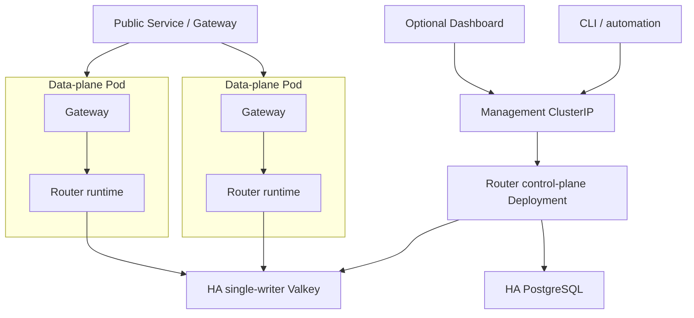

> **Status:** Proposal appendix · **Created:** 2026-08-22

This appendix is normative for deployment and recovery details of
[Router-Native Access Control and Quota Accounting](./router-native-access-control).
The [resource contract appendix](./router-native-access-control-contracts) owns
storage, credential, policy, counter, and runtime projection details. The
[Management API appendix](./router-native-access-control-management-api) owns
identity, endpoints, and responses. The
[Management authorization appendix](./router-native-access-control-authorization)
owns permissions, roles, and scopes.

## Router bootstrap configuration

Managed-mode Router YAML declares infrastructure and runtime semantics only.
Standalone additionally declares its sole immutable routing manifest. The existing
`global.services.management_api` remains the sole owner of the Management listener,
transport authentication entrypoint, and bootstrap mode. Durable principals, roles,
bindings, issuers, and sessions are Management resources, not YAML mappings. The
access service registers resources on that listener; it does not create another HTTP
listener.

```yaml
version: v0.4

global:
  control_plane:
    mode: managed

  stores:
    access:
      type: postgres
      postgres:
        dsn_file: /run/secrets/vllm_sr_access_database_url
        max_connections: 40
    access_runtime:
      type: redis
      redis:
        url_file: /run/secrets/vllm_sr_access_redis_url
        key_prefix: vllm-sr:access

  services:
    access:
      enabled: true
      credentials:
        api_key_hmac_keyring_file: /run/secrets/vllm_sr_api_key_peppers
        delegation_hmac_keyring_file: /run/secrets/vllm_sr_delegation_peppers
        reveal:
          enabled: true
          kek_keyring_file: /run/secrets/vllm_sr_api_key_keks
      tenant_context:
        signing_key_file: /run/secrets/vllm_sr_tenant_context_keys
        max_start_age: 30s
      enforcement:
        failure_mode: deny
        request_accounting: admission
        token_accounting: response_actual
        unknown_usage_action: freeze
        settle_on: stream_done
        deduplicate_by: admission_id
        max_usage_backlog: 1000000

    backend_credentials:
      provider_kek_keyring_file: /run/secrets/vllm_sr_provider_credential_keks
    backend_egress:
      policy_file: /etc/vllm-sr/backend-egress-policy.yaml

    management_api:
      bind_address: 0.0.0.0
      port: 8080
      remote_exposure: false
      tls:
        certificate_file: /run/secrets/vllm_sr_management_tls_cert
        private_key_file: /run/secrets/vllm_sr_management_tls_key
        client_ca_bundle_file: /run/secrets/vllm_sr_management_client_ca
      auth:
        token_signing_keyring_file: /run/secrets/vllm_sr_management_token_keys
        service_account_hmac_keyring_file: /run/secrets/vllm_sr_management_peppers
        invitation_hmac_keyring_file: /run/secrets/vllm_sr_invitation_peppers
        response_kek_keyring_file: /run/secrets/vllm_sr_management_response_keks
        bootstrap:
          token_file: /run/secrets/vllm_sr_management_bootstrap_token
          disable_after_first_cluster_admin: true
        recovery:
          enabled: false
          loopback_only: true
```

Every secret field supports one environment reference or one secret-file reference,
never both. Keyrings contain an active version and retained verification/decryption
versions so pepper, KEK, and signing-key rotation do not require an unsafe flag day.
Literal DSNs or key material are rejected in production mode. Enabling recovery also
requires a separate `token_file`; omitting it, reusing the bootstrap token, or exposing
the recovery route off loopback is a startup error.

### Versioned security seeds

Schema migration creates one versioned ManagementSessionPolicy before bootstrap:
15-minute access tokens, eight-hour sessions, five active sessions per principal, and
either human `aal2` with 15-minute authentication age or `workload_strong` with a
30-day source-assurance age for cluster-sensitive actions. Bootstrap locks and
validates it; a missing, duplicate, or unknown seed version keeps Management and
public readiness false. An external-principal bootstrap must meet the human branch;
a service-account bootstrap atomically issues a `workload_strong` credential with
`source_assured_at` equal to the bootstrap transaction time, so the first
administrator can satisfy the seeded policy.

Namespace creation atomically inserts the Namespace, a SelfServicePolicy with zero
self-service keys/sessions, no automatic first key, no Team-key use/capabilities, and
null Access/Rate defaults, plus a versioned ManagementSecurityPolicy. Its initial
matrix accepts either human `aal2` within 15 minutes or `workload_strong` within 30
days for secret delivery/reveal, role delegation, quota waiver, and policy loosening.
Ordinary service credentials and mTLS mappings start `workload_standard`; an already
qualified actor must explicitly register or upgrade a strong source. Operators enable
onboarding only after selecting policies. A missing companion row rolls back creation
and fails readiness for an existing namespace; runtime code has no implicit fallback.

The v0.4 migration maps explicit existing values or writes these restrictive seeds
and blocks cutover until every namespace validates. Later seed revisions are audited
migrations, never startup guesses.

The backend-egress policy is an operator bootstrap boundary shared by Model validation,
discovery, probes, and inference. It allowlists schemes/hosts/ports/CIDRs and private
network exceptions, rechecks DNS and redirects, and denies metadata/link-local targets
by default. It is not a Dashboard preference or a dynamically supplied URL bypass.

Managed production requires Router-terminated TLS on the Management listener. Server
certificate and key files are mandatory; the client CA bundle is mandatory when an
mTLS mapping exists. Readiness verifies key/certificate match, chain and SAN policy,
validity margin, file permissions, and a loopback handshake. Files rotate through
atomic replacement and bounded live reload; a failed reload retains the last valid
context and makes diagnostics unhealthy before expiry. v0.4 never trusts forwarded
certificate headers. A service mesh may use TCP passthrough, but the Router remains
the mTLS identity verifier and Management access-token issuer.

Standalone uses the mutually exclusive bootstrap:

```yaml
version: v0.4
global:
  control_plane:
    mode: standalone
    routing_manifest_file: /etc/vllm-sr/routing.yaml
  services:
    backend_credentials:
      private_provider:
        secret_file: /run/secrets/private_provider_api_key
    access:
      enabled: false
```

The manifest is read-only and compiled before readiness. A standalone backend may
reference a named environment/file/Secret credential declared in bootstrap, never a
literal secret or managed ProviderCredential UID. The compiler creates the same
in-process backend-credential interface without persistence or reveal. Standalone
rejects store configuration, access enablement, and routing Management mutation
routes instead of falling back between authorities.

In managed mode the YAML contains no Models, Recipes, Entrypoints, Users, Teams,
keys, policies, bindings, usage, or audit. Without the Dashboard, operators use the
same API through CLI commands such as:

```text
vllm-sr access apply -f access-policy.yaml
vllm-sr teams create ...
vllm-sr keys create ...
vllm-sr keys rotate ...
```

## Docker-first deployment

The minimum topology depends on the explicit control-plane mode:

| Mode | Required | Dynamic behavior |
| --- | --- | --- |
| Standalone | Public gateway, Semantic Router, one local routing manifest | No routing Management mutations and no API-key access control. |
| Managed routing | Public gateway, Semantic Router, PostgreSQL, Valkey | Dynamic Model/Recipe/Entrypoint CRUD and snapshot publication; access enforcement may remain off. |
| Managed access | Public gateway, Semantic Router, PostgreSQL, Valkey | Managed routing plus API keys, authorization, quota, usage, and audit. |

Dashboard and observability are optional in every mode. The managed Docker stack
contains:

```text
postgres          authoritative desired state and ledger
valkey            policy projection, counters, idempotency, usage stream
access-migrate    one-shot schema migration using the Router image
router            ExtProc, access runtime, Management API, projector, workers
gateway           only public inference endpoint
dashboard         optional service
```

AuthN, AuthZ, quota, routing/policy projector, and usage-writer responsibilities are
narrow modules inside one Router binary, not separately deployed business services.
Docker runs the roles together. The Dashboard and monitoring services are explicit
opt-ins and are not access-control dependencies.

The managed single-host profile starts one PostgreSQL and one Valkey with named
volumes. It is the smallest persistent topology, not an HA claim. A production HA
profile supplies external or separately managed PostgreSQL and a fenced,
single-writer Valkey topology:

| Profile | Persistence and acknowledgement contract |
| --- | --- |
| Single-host | PostgreSQL WAL and Valkey AOF use named volumes. Local commit/fsync settings and volume failure define the declared acknowledged-loss window. |
| HA standard | PostgreSQL may use asynchronous replicas with a declared failover-loss window. Fenced Valkey writes wait for the configured replica acknowledgement while persistence may retain a documented fsync window. |
| HA strict | PostgreSQL Management, outbox, audit, usage-settlement, and UsageEvent commits wait for synchronous replica quorum. Every security-critical Valkey write waits for configured persistence and replica quorum. |
| External stores | The operator declares the durability profile. Router readiness verifies observable endpoint, epoch, replica, and acknowledgement properties but cannot prove failure-domain placement or election safety. |

Neither PostgreSQL nor Valkey may acknowledge writes from a minority or stale
primary. Election uses quorum and fences the old writer before routing clients to the
new primary. Every access Function also validates the active runtime epoch. A usage
worker acknowledges a stream item only after the PostgreSQL transaction satisfies
the selected durability profile. Exact quota and ledger continuity survive failover
for operations acknowledged under the strict profile; standard and single-host
profiles expose their bounded durability windows instead of claiming zero loss.

Security-critical Valkey writes include admission and settlement, key/principal/
session/auth-source deny barriers, credential and provider-credential lifecycle
projections, staged policy and routing publication gates, active pointers, and runtime
epoch transitions. They also include each bounded dispatch-intent journal; under HA
strict, the Router must receive persistence and replica-quorum acknowledgement before
allowing the corresponding upstream path. A restrictive Management operation, logout, revocation, or
publication cannot report applied until those writes meet the selected acknowledgement
profile. Readiness uses the same rule, so strict failover cannot resurrect authority
that the API already reported revoked.

### Startup and readiness

1. PostgreSQL and Valkey pass dependency health checks.
2. `access-migrate` obtains a PostgreSQL advisory lock, runs forward-only migrations,
   and verifies the cluster singleton and every namespace companion-policy row.
3. The projector verifies the active runtime epoch, loads or rebuilds policy
   projections and the routing snapshot, and publishes both watermarks.
4. The quota recovery gate verifies that counters, pending admissions, settlement
   markers, and the usage stream belong to a known-good runtime epoch.
5. Managed Router readiness waits for compatible schema, Valkey, routing and policy
   publication, quota recovery when access is enabled, and every runtime-verifiable
   property of the selected durability profile. After bootstrap commits, readiness
   also requires the bootstrap token file to be absent.
6. The public gateway accepts traffic only after Router `/ready` succeeds.
7. The optional Dashboard starts independently.

`/health` reports only process liveness. `/ready` returns coarse readiness and reason
codes. Every managed mode requires Valkey continuously because active routing and
ProviderCredential lifecycle are one revisioned runtime boundary; no replica serves a
pinned snapshot with unverifiable credential state. Managed access also requires a
valid epoch and applied policy revision. Management readiness additionally requires
PostgreSQL and a compatible schema. Authenticated
`/management/v1/runtime-diagnostics` exposes store state, replica acknowledgements,
usage backlog, projector lag, and recovery details.

PostgreSQL and Valkey use named volumes in the managed profile. Router configuration
mounts read-only. Secrets, Management TLS material, and its optional client CA use
Docker secrets or `/run/secrets/*`. PostgreSQL,
Valkey, and the Management listener are not public; a local CLI binding is limited to
loopback at the host-publish layer. Inside Docker, the Management listener binds the
Router's private container interface so an optional Dashboard or administrative
sidecar can reach it; `remote_exposure: false` forbids a public host port and public
gateway route. The default Docker Management identity is a secret-backed, scoped
service account. OIDC and mTLS remain optional integrations.

`vllm-sr serve` follows one mode contract:

- standalone: compile the one local manifest with the canonical snapshot compiler
  and start no stores, Management mutation workers, or access runtime;
- managed with no external store URLs: start PostgreSQL and Valkey as managed Docker
  services;
- managed with external store URLs: start only the gateway and Router roles; and
- access may be enabled only in managed mode, while Dashboard and observability
  remain explicit opt-ins.

## Kubernetes deployment



In Kubernetes, standalone is one stateless deployment with a mounted immutable
manifest and no Management Service or stateful stores. The remaining topology
describes managed mode.

The managed data-plane Pod is stateless. A gateway sidecar and Router runtime may communicate
over loopback, so the HPA scales a complete replica and no sticky session is required.
The control-plane Deployment runs Management, projector, admission reconciler, and
usage-worker roles from the same Router image. A shared gateway with Router gRPC
Services behind ClusterIP is also valid; both layouts use the same contracts.

Required Kubernetes resources are:

- Router/gateway data-plane Deployment, HPA, PodDisruptionBudget, and topology spread;
- Router control-plane Deployment with its own PDB and constrained replica count;
- a public Service or Gateway exposing inference only;
- a private ClusterIP for the Management listener;
- a migration Job, not migration in every replica;
- ConfigMap for static Router bootstrap only;
- Secret or ExternalSecret for PostgreSQL, Valkey, API-key and delegation HMAC
  keyrings, reveal/provider/response KEKs, TenantContext and Management-token signing
  keyrings, service-account/invitation HMAC keyrings, Management TLS key/certificate
  and client CA, bootstrap credential, and optional recovery credential; and
- NetworkPolicies that allow public traffic only to inference and allow Management
  access only from authorized service accounts and administrative networks.

Production uses an external or operator-managed HA PostgreSQL and HA single-writer
Valkey. Optional Helm subcharts are for development and demonstration and remain
disabled by default. Arbitrary cross-slot clustered quota execution is outside the
first production contract. Stateful store operators must expose a quorum-fenced
writer endpoint and the selected persistence/replica acknowledgement profile; the
Router does not infer safety from a Service name. Failure-domain placement, quorum
election, stale-primary fencing, backup validation, and synchronous-replication
policy remain deployment-system guarantees; readiness reports their declared and
observable state separately.

Projectors coordinate through aggregate sequencing plus row claiming or leader
election. Usage workers share a consumer group. Data-plane replicas never query
PostgreSQL and do not require sticky sessions. They load the active routing snapshot
from Valkey before readiness. TenantContext is signed and request bounded, so any
replica can process the request.

Kubernetes custom resources contain deployment references only:

```yaml
spec:
  access:
    enabled: true
    failureMode: Deny
    postgres:
      secretRef:
        name: router-access-postgres
    runtimeStore:
      secretRef:
        name: router-access-valkey
    management:
      service:
        type: ClusterIP
```

Creating a User, key, policy, or UsageEvent never updates a custom resource, etcd,
xDS, or a gateway route and never rolls a Pod.

## Failure semantics

| Failure | Data-plane behavior | Control-plane behavior |
| --- | --- | --- |
| Dashboard unavailable | No inference impact | Other Management API clients continue. |
| PostgreSQL unavailable | Already applied keys continue from Valkey while the usage stream remains below its safety bound | Mutations and long-range queries stop; no false success. |
| Valkey unavailable | Every managed mode fails closed with `503` and replicas become unready | Mutations and snapshot activation remain pending or fail. |
| Projector lag | Existing complete per-key revisions continue | Mutation reports `pending`; expansions remain gated and restrictions keep deny barriers. |
| Usage writer unavailable | Counters continue and events queue in the durable stream | Analytics freshness reports lag. |
| Usage backlog over bound | New admission fails with `503` to avoid unaccounted traffic | Operators receive explicit backlog health and alerts. |
| Expired-pending backlog | Admission drains a bounded batch, then fails `503` while an expired oldest item remains | Reconciler lag/backlog marks access unready until each item is fenced. |
| One Router Pod fails | Readiness removes it; other replicas continue | Workers reclaim unacknowledged jobs. |
| Router dies after admission | The pending admission expires into an unknown fence | Reconciliation resolves the fence from backend evidence or an audited action. |
| Provider omits usage | The affected token scope is fenced; usage is never treated as zero | Provider health identifies the incompatible path. |
| Reveal KEK is unavailable | Existing HMAC-authenticated keys continue | Reveal and revealable-key creation fail closed. |
| HMAC pepper is unavailable | Access-enabled Router remains not ready | No credential fallback is allowed. |
| Schema is incompatible | Access services remain not ready | No destructive automatic migration runs. |
| Credential is invalid | Request returns `401` | Audit records a bounded, non-secret anomaly. |
| Resource is absent or forbidden | Request returns nondisclosing `404` | Effective-policy evaluation explains the denial to authorized administrators. |
| Quota is exceeded | Request returns `429` and `Retry-After` | Live quota snapshot shows the exact limiting rule. |

Valkey persistence and replication protect the interval while PostgreSQL is down.
The configured persistence and replica acknowledgement policy defines the
acknowledged-loss window and its latency cost. Only strict acknowledgements are
described as failover-exact; asynchronous persistence is never described as
zero-loss.

## Valkey catastrophic-loss recovery

Policy projections and routing snapshots can be rebuilt from PostgreSQL. Live
rolling counters, pending admissions, not-yet-persisted stream entries, and
settlement markers cannot be assumed recoverable from desired state. An empty or
unknown-epoch Valkey therefore keeps managed access not ready.

Recovery requires one of these audited paths:

1. restore a known-good Valkey AOF, snapshot, or replica and verify its runtime epoch;
2. create a new epoch under a namespace-wide conservative fence, keep inference
   drained, and rebuild only from complete durable evidence: sliding logs may clear
   after the longest window, concurrency may clear after maximum request lifetime
   plus heartbeat grace, calendar request/token/cost counters require a complete
   ledger, and token-bucket or GCRA state requires replay from a complete admission
   ledger or waiting its full refill horizon; or
3. explicitly accept a documented conservative debit, waiver, or counter reset
   through a privileged recovery operation after traffic is drained.

A total Valkey loss also loses identities for admitted but unsettled work that never
reached PostgreSQL. Without complete backend evidence, those admissions cannot be
reconstructed and path 2 cannot claim exact recovery; the namespace fence remains
until path 3 records the decision. Persisting admissions before dispatch would add a
PostgreSQL request hot path and is intentionally not part of this proposal.

The Router never automatically rebuilds only policies and silently resets quota.
Operators choose the maximum usage-stream backlog by capacity, not by an unbounded
availability promise. Backups cover PostgreSQL, Valkey persistence, HMAC peppers,
KEKs, signing keys, and the runtime-epoch record.

## PostgreSQL disaster recovery

PostgreSQL is the only desired-state, identity, routing, ledger, and audit authority.
Valkey can help recover acknowledged runtime facts, but it can never be promoted into
desired state after a PostgreSQL restore.

An audited point-in-time or full PostgreSQL recovery follows this order:

1. install a quorum-acknowledged namespace/cluster maintenance fence in the current
   Valkey epoch, stop Management mutations and new admission, and drain or convert
   every remaining admission into an explicit unknown fence;
2. restore the database and replay verified WAL to the selected recovery point, then
   validate schema, backup manifest, keyring versions, transaction timeline, outbox
   sequence, resource revisions, routing digests, usage-settlement watermark, and
   audit continuity before starting a writer; a restored pre-bootstrap state is valid
   only when the external bootstrap secret is already absent or deliberately rotated;
3. compare the restored PostgreSQL epoch and desired/applied revisions with a
   read-only capture of Valkey. Never recreate a User, key, grant, ProviderCredential,
   or Entrypoint from a Valkey projection. Post-restore Valkey credentials or pointers
   absent from PostgreSQL remain denied as orphans;
4. replay only authenticated usage/reconciliation stream items newer than the restored
   ledger watermark through normal settlement deduplication. Reconcile counters,
   pending work, and gaps with the catastrophic-loss rules above; incomplete evidence
   remains fenced rather than becoming zero;
5. commit a new runtime epoch in PostgreSQL, build a fresh Valkey prefix from restored
   desired state, compile routing snapshots, project credentials/policies, and keep
   the old epoch read-only for evidence until retention permits erasure; and
6. remove the maintenance fence and declare readiness only after resource-count and
   digest checks, outbox continuity, replica acknowledgements, usage/counter recovery,
   orphan denial, and a durable recovery audit event all pass.

If the selected PostgreSQL recovery point predates an acknowledged strict-profile
commit, the recovery is invalid and must continue WAL/backup recovery or remain
blocked. Standard and single-host profiles may lose changes inside their declared
window; those resources are not reconstructed from Valkey, and the recovery report
lists the gap. Loss of both authoritative backups and required keyring versions is not
an automatic-reset path: managed access remains unavailable until a privileged,
audited re-bootstrap and credential migration is completed.
