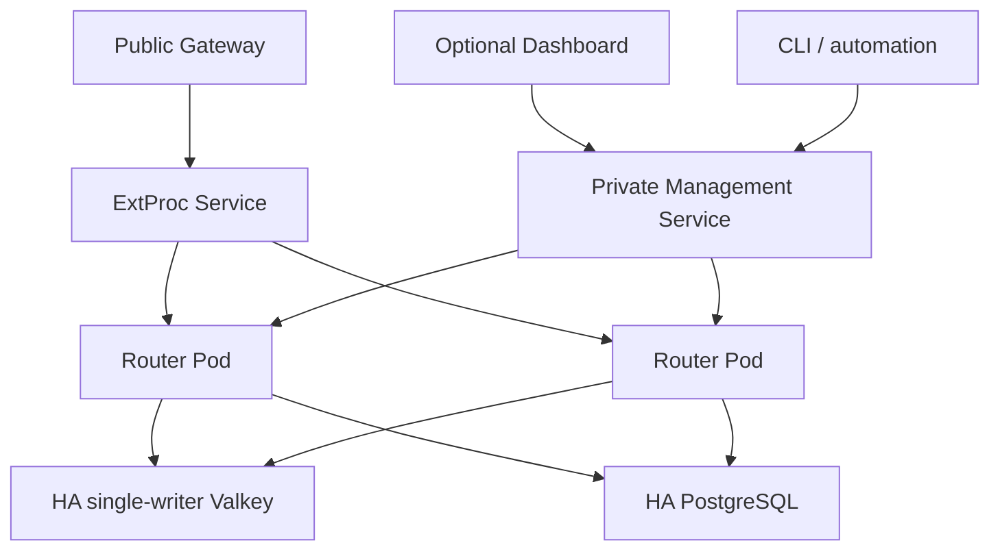

> **Status:** Proposal appendix · **Created:** 2026-08-22

This appendix is normative for deployment and recovery details of
[Router-Native Access Control and Quota Accounting](./router-native-access-control).
The [resource contract appendix](./router-native-access-control-contracts) owns
storage, credential, policy, counter, and runtime projection details. The
[Management API appendix](./router-native-access-control-management-api) owns
identity, endpoints, and responses. The
[Management authorization appendix](./router-native-access-control-authorization)
owns permissions, roles, and scopes. The
[Provider catalog appendix](./router-native-access-control-provider-catalog) owns
Integration Registry composition and adapter rollout.

## Router bootstrap configuration

Managed-mode Router YAML declares infrastructure and runtime semantics only.
Standalone additionally declares its sole immutable routing manifest.
`global.services.management_api` owns the Management listener, transport
authentication entrypoint, and bootstrap mode. Durable principals, roles,
bindings, issuers, and sessions are Management resources, not YAML mappings. The
access service registers resources on that listener; it does not create another HTTP
listener.

```yaml
version: v0.4

global:
  control_plane:
    mode: managed
    provider_catalog:
      replica_id_env: VLLM_SR_REPLICA_ID
      lease: 45s
      renew_interval: 15s
      rollout_groups:
        - {plane: control, id: management}
        - {plane: data, id: router}
      required_rollout_groups:
        - {plane: control, id: management}
        - {plane: data, id: router}

  stores:
    access:
      type: postgres
      postgres:
        dsn_file: /run/secrets/vllm_sr_access_database_url
        max_connections: 40
    access_runtime:
      type: redis
      redis:
        url_file: /run/secrets/vllm_sr_access_redis_url
        key_prefix: vllm-sr:access

  services:
    access:
      enabled: true
      credentials:
        api_key_hmac_keyring_file: /run/secrets/vllm_sr_api_key_peppers
        delegation_hmac_keyring_file: /run/secrets/vllm_sr_delegation_peppers
        reveal:
          enabled: true
          kek_keyring_file: /run/secrets/vllm_sr_api_key_keks
      tenant_context:
        signing_key_file: /run/secrets/vllm_sr_tenant_context_keys
        max_start_age: 30s
      enforcement:
        failure_mode: deny
        request_accounting: admission
        token_accounting: response_actual
        unknown_usage_action: freeze
        settle_on: stream_done
        deduplicate_by: admission_id
        max_usage_backlog: 1000000

    backend_credentials:
      provider_kek_keyring_file: /run/secrets/vllm_sr_provider_credential_keks
    backend_egress:
      policy_file: /app/config/backend-egress-policy.yaml

    management_api:
      bind_address: 0.0.0.0
      port: 8080
      remote_exposure: false
      tls:
        certificate_file: /run/secrets/vllm_sr_management_tls_cert
        private_key_file: /run/secrets/vllm_sr_management_tls_key
        client_ca_bundle_file: /run/secrets/vllm_sr_management_client_ca
      auth:
        mode: router
        token_signing_keyring_file: /run/secrets/vllm_sr_management_token_keys
        service_account_hmac_keyring_file: /run/secrets/vllm_sr_management_peppers
        invitation_hmac_keyring_file: /run/secrets/vllm_sr_invitation_peppers
        control_plane_hmac_keyring_file: /run/secrets/vllm_sr_control_plane_hmac_roots
        response_kek_keyring_file: /run/secrets/vllm_sr_management_response_keks
        bootstrap:
          token_file: /run/secrets/vllm_sr_management_bootstrap_token
          disable_after_first_cluster_admin: true
        recovery:
          enabled: false
          loopback_only: true
```

Every secret field supports one environment reference or one secret-file reference,
never both. Keyrings contain an active version and retained verification/decryption
versions so pepper, KEK, and signing-key rotation do not require an unsafe flag day.
Literal DSNs or key material are rejected in production mode. Enabling recovery also
requires a separate `token_file`; omitting it, reusing the bootstrap token, or exposing
the recovery route off loopback is a startup error.

`control_plane_hmac_keyring` is a dedicated 256-bit, versioned root authority. The
process derives catalog-cursor, discovery-claim, Management-command,
Management-cursor, and bootstrap-idempotency keys with HKDF-SHA256 using fixed
schema-versioned, domain-separated labels. The Management domains are shared by all
Management resources rather than being named after one current resource family; the
bootstrap domain remains isolated because its one-time installation authority has a
different lifecycle. Root bytes are never used directly and are never reused for
API-key peppers, Management service accounts, invitations, or any KEK. New values are
signed only by the active version; explicit wire or durable key-version references let
retained versions verify old values. An unknown or removed referenced version fails
readiness closed. Rotation first distributes a retained root version to every replica,
then activates it atomically, and removes the previous version only after every bounded
artifact and durable idempotency reference has expired.

Provider Integrations and backend compilers are installed when the control-plane
application is composed; they are not YAML bootstrap values. Startup validates the
immutable Integration Registry, stages its content-addressed catalog revision, and
requires plane-specific adapter-capability acknowledgements before activation. The
Definitions do not enter the inference request path or add gateway routes. Adding an
ordinary compatible Provider changes the control-plane Integration set, not Router
runtime configuration or Dashboard product code. See the
[Provider catalog appendix](./router-native-access-control-provider-catalog).

`provider_catalog.rollout_groups` identifies the stable deployment groups served by
this process; `required_rollout_groups` is the explicit catalog activation gate.
`replica_id_env` supplies only the current process instance identity used for a
renewable lease. Pod or container IDs never enter the required set, so autoscaling
does not change policy. A rolling upgrade blocks a new catalog while any live
instance in a required group reports incompatible capabilities, or while compatible
live instances in that group report different plane-specific capability digests.
Expired instances do not satisfy the group. This lets an old replica age out through
its lease before a new binary activates catalog semantics that are not homogeneous
across the rollout group.

### Versioned security seeds

Schema migration creates one versioned ManagementSessionPolicy before bootstrap:
15-minute access tokens, eight-hour sessions, five active sessions per principal, and
either human `aal2` with 15-minute authentication age or `workload_strong` with a
30-day source-assurance age for cluster-sensitive actions. Bootstrap locks and
validates it; a missing, duplicate, or unknown seed version keeps Management and
public readiness false. An external-principal bootstrap must meet the human branch;
a service-account bootstrap atomically issues a `workload_strong` credential with
`source_assured_at` equal to the bootstrap transaction time, so the first
administrator can satisfy the seeded policy.

Namespace creation atomically inserts the Namespace, a SelfServicePolicy with zero
self-service keys/sessions, no automatic first key, no Team-key use/capabilities, and
null Access/Rate defaults, plus a versioned ManagementSecurityPolicy. Its initial
matrix accepts either human `aal2` within 15 minutes or `workload_strong` within 30
days for secret delivery/reveal, role delegation, quota waiver, and policy loosening.
Ordinary service credentials and mTLS mappings start `workload_standard`; an already
qualified actor must explicitly register or upgrade a strong source. Operators enable
onboarding only after selecting policies. A missing companion row rolls back creation
and fails readiness for an existing namespace; runtime code has no implicit fallback.

The v0.4 schema migration installs these restrictive seeds and blocks managed
readiness until every namespace validates. Later seed revisions are audited schema
changes, never startup guesses.

The backend-egress policy is an operator bootstrap boundary shared by Model validation,
discovery, probes, and inference. It allowlists schemes/hosts/ports/CIDRs and private
network exceptions, rechecks DNS and redirects, and denies metadata/link-local targets
by default. It is not a Dashboard preference or a dynamically supplied URL bypass.

Managed production requires Router-terminated TLS on the Management listener. Server
certificate and key files are mandatory; the client CA bundle is mandatory when an
mTLS mapping exists. Readiness verifies key/certificate match, chain and SAN policy,
validity margin, file permissions, and a loopback handshake. The listener requires
TLS 1.3 or newer. Files rotate through atomic replacement and bounded live reload; a
failed reload retains the last valid context and makes readiness unhealthy before
expiry. v0.4 never trusts forwarded
certificate headers. A service mesh may use TCP passthrough, but the Router remains
the mTLS identity verifier and Management access-token issuer.

Standalone uses the mutually exclusive bootstrap:

```yaml
version: v0.4
global:
  control_plane:
    mode: standalone
  services:
    backend_credentials:
      private_provider:
        secret_file: /run/secrets/private_provider_api_key
    access:
      enabled: false
```

The manifest is read-only and compiled before readiness. A standalone backend may
reference a named environment/file/Secret credential declared in bootstrap, never a
literal secret or managed ProviderCredential UID. The compiler creates the same
in-process backend-credential interface without persistence or reveal. Standalone
rejects store configuration, access enablement, and routing Management mutation
routes instead of falling back between authorities.

In managed mode the YAML contains no Models, Recipes, Entrypoints, Users, Teams,
keys, policies, bindings, usage, or audit. The Dashboard and independent consoles use
the same versioned Management API; automation may use its generated client directly.

The user-facing launch contract is one command: `vllm-sr serve`. It resolves
`./config.yaml`, or the immutable v0.4 bootstrap selected by `--config`, and starts
the selected standalone or managed topology. Built-in Recipes are installed into
managed desired state; Models, Entrypoints, decision assignments, and fallback
priorities are configured through the Management API. Portable Recipe packages are
validated or imported through those same resources. Infrastructure flags such as
target, image, platform, namespace, and secret sources configure deployment only.
Standalone reads exactly one immutable manifest, and `--config` selects that
bootstrap manifest without authoring routing state.

## Docker-first deployment

The minimum topology depends on the explicit control-plane mode:

| Mode | Required | Dynamic behavior |
| --- | --- | --- |
| Standalone | Public gateway, Semantic Router, one local routing manifest | No routing Management mutations and no API-key access control. |
| Managed routing | Public gateway, Semantic Router, PostgreSQL, Valkey | Dynamic Model/Recipe/Entrypoint CRUD and snapshot publication; access enforcement may remain off. |
| Managed access | Public gateway, Semantic Router, PostgreSQL, Valkey | Managed routing plus API keys, authorization, quota, usage, and audit. |

The ordinary local Docker experience includes Dashboard. `--minimal` omits it for
an operator-managed control plane, while observability is added only with
`--with-observability`. The managed Docker stack contains:

```text
postgres          authoritative desired state and ledger
valkey            policy projection, counters, idempotency, usage stream
access-migrate    one-shot schema migration using the Router image
router            ExtProc, access runtime, backend invoker, Management API, projector, workers
gateway           only public inference endpoint and one stable Router invoker upstream
dashboard         Management API client (omitted only with --minimal)
```

The Router distribution composes its supported Provider Integrations in the control
plane. Docker and Kubernetes deploy the same application capability set; neither
mounts provider definitions or creates one resource per Provider. Changing that set
is an application rollout followed by catalog activation, not a per-tenant resource
update. All Management replicas read the durable active revision, while data-plane
replicas receive only stable adapter IDs and compiled Model backend values.

AuthN, AuthZ, quota, routing/policy projector, and usage-writer responsibilities are
narrow modules inside one Router binary, not separately deployed business services.
Docker runs the roles together. Dashboard remains outside the authority boundary,
and monitoring services are explicit opt-ins; neither is an inference dependency.

The gateway never expands a Model into a static route or cluster. ExtProc resolves the
request and emits only a short-lived, audience-bound dispatch capability for the
stable internal invoker upstream. The invoker validates that capability, pins the
active routing revision, and owns backend selection, ProviderCredential injection,
per-Model deadlines, safe retries, and attempt evidence. In Kubernetes, the capability
may cross Router Pods and therefore uses the configured tenant-context signing
keyring; it is bound to namespace, admission, dispatch ordinal, Model revision,
request digest, audience, and a short expiry. A public request cannot call the
internal invoker listener or synthesize those fields.

The managed single-host profile starts one PostgreSQL and one Valkey with named
volumes. It is the smallest persistent topology, not an HA claim. A production HA
profile supplies external or separately managed PostgreSQL and a fenced,
single-writer Valkey topology:

| Profile | Persistence and acknowledgement contract |
| --- | --- |
| Single-host | PostgreSQL WAL and Valkey AOF use named volumes. Local commit/fsync settings and volume failure define the declared acknowledged-loss window. |
| HA standard | PostgreSQL may use asynchronous replicas with a declared failover-loss window. Fenced Valkey writes wait for the configured replica acknowledgement while persistence may retain a documented fsync window. |
| HA strict | PostgreSQL Management, outbox, audit, usage-settlement, and UsageEvent commits wait for synchronous replica quorum. Every security-critical Valkey write waits for configured persistence and replica quorum. |
| External stores | The operator declares the durability profile. Router readiness verifies observable endpoint, epoch, replica, and acknowledgement properties but cannot prove failure-domain placement or election safety. |

Neither PostgreSQL nor Valkey may acknowledge writes from a minority or stale
primary. Election uses quorum and fences the old writer before routing clients to the
new primary. Every access Function also validates the active runtime epoch. A usage
worker acknowledges a stream item only after the PostgreSQL transaction satisfies
the selected durability profile. Exact quota and ledger continuity survive failover
for operations acknowledged under the strict profile; standard and single-host
profiles expose their bounded durability windows instead of claiming zero loss.

Security-critical Valkey writes include admission and settlement, key/principal/
session/auth-source deny barriers, credential and provider-credential lifecycle
projections, staged policy and routing publication gates, active pointers, and runtime
epoch transitions. They also include each bounded dispatch-intent journal; under HA
strict, the Router must receive persistence and replica-quorum acknowledgement before
allowing the corresponding upstream path. A restrictive Management operation, logout, revocation, or
publication cannot report applied until those writes meet the selected acknowledgement
profile. Readiness uses the same rule, so strict failover cannot resurrect authority
that the API already reported revoked.

### ProviderCredential runtime projection

Managed ProviderCredentials follow the same immutable publication boundary as routing;
they are not request-time PostgreSQL resources. The desired-state reader opens one
repeatable-read transaction, loads the routing snapshot, derives its exact set of
referenced ProviderCredential IDs, and loads only those credential rows and versions
before committing. An active credential contributes exactly one active encrypted
version plus its unexpired retiring versions, with a hard limit of 32 total versions
per credential. Disabled or deleted credentials contribute metadata with no version
material so activation is restrictive and new dispatch fails closed.

Each ProviderCredential document contains lifecycle and binding metadata plus only
envelope ciphertext, nonce, and KEK version. Plaintext is never serialized. Canonical
ordering and digests cover every document and its manifest entry. Immutable Valkey keys
are scoped by namespace, quota partition, publication ID, and credential ID; publication
verification rejects an absent, extra, malformed, cross-namespace, cross-partition,
cross-publication, binding-mismatched, or digest-mismatched document before any replica
acknowledges the routing snapshot.

The signed dispatch plan carries the namespace, quota partition, and publication ID.
Inference `Pin` and `ResolvePinned` use those exact values to read the immutable Valkey
document and never follow a mutable credential pointer or query PostgreSQL. Secret
decryption and adapter materialization happen only inside the backend invoker and the
plaintext is zeroed after use. Retained routing publications retain their matching
credential documents, allowing an already pinned request to resolve its original active
or retiring version until that publication is retired; the codec still enforces
not-before, expiry, binding, and lifecycle rules. Management-only discovery and
connection probes may resolve ProviderCredentials from PostgreSQL explicitly, but that
resolver is not composed into the inference dispatch path.

### Startup and readiness

1. PostgreSQL and Valkey pass dependency health checks.
2. `access-migrate` obtains a PostgreSQL advisory lock, runs forward-only migrations,
   and verifies the cluster singleton and every namespace companion-policy row.
3. The projector verifies the active runtime epoch, loads or rebuilds policy
   projections, the routing snapshot, and its referenced encrypted ProviderCredential
   documents, then publishes the coupled watermarks.
4. The quota recovery gate verifies that counters, pending admissions, settlement
   markers, and the usage stream belong to a known-good runtime epoch.
5. On an empty durable Provider Catalog, replicas compare-and-swap the unique
   application-installed revision, ACK their declared rollout groups, and activate it
   only after the complete gate passes. Concurrent conflicts converge by rereading;
   an existing desired or active revision is never replaced automatically.
6. The process starts its private TLS Management listener while public readiness
   remains false. A private Kubernetes Management Service publishes these bootstrap
   endpoints even though the Pod is not yet inference-ready; authentication,
   NetworkPolicy, and Management authorization still apply.
7. On a fresh installation, an authorized Management client completes identity
   bootstrap and publishes the first coupled policy and routing revision. The
   Dashboard may perform this workflow, but it is not required.
8. Managed Router readiness waits for compatible schema, Valkey, Provider Catalog,
   routing and policy
   publication, quota recovery when access is enabled, and every runtime-verifiable
   property of the selected durability profile. After bootstrap commits, readiness
   also requires the bootstrap token file to be absent.
9. The public gateway accepts traffic only after Router `/ready` succeeds. Once the
   first revision is active, Dashboard removal or outage has no inference impact.

`/health` reports only process liveness. `/ready` returns coarse inference readiness
and reason codes. It deliberately remains false before the first complete publication;
operators must not use `helm --wait` as the first-install bootstrap mechanism. The
private Management Service is the only pre-readiness path and never exposes inference.
Every managed mode requires Valkey continuously because active routing and
ProviderCredential lifecycle are one revisioned runtime boundary; no replica serves a
pinned snapshot with unverifiable credential state. Managed access also requires a
valid epoch and applied policy revision. The same Valkey deployment carries the
bounded, expiring response-terminal rendezvous used when private backend dispatch and
the owning ExtProc request land on different Router replicas; its atomic one-time
consume is an accounting invariant, not a sticky-routing optimization. Management
readiness additionally requires
PostgreSQL and a compatible schema. Authenticated
`/management/v1/runtime-diagnostics` exposes store state, replica acknowledgements,
usage backlog, projector lag, and recovery details. The cluster summary reads only
the namespace-directory cardinality; an exact `namespaceId` selector performs a
constant-space directory lookup before reading that partition's bounded queues.
Diagnostics therefore do not turn a 100,000-key or multi-namespace installation into
a Management API scan. Partial but trustworthy dependency state is reported as
`degraded`; the endpoint never publishes store addresses, raw Valkey keys,
credentials, policies, or routing documents.

Usage storage diagnostics also report active and retired UTC-month partitions and
minute/hour/day dirty-rollup queue depths. Partition maintenance runs on every Router
replica under a PostgreSQL advisory lock. A failed pass degrades that replica's
readiness without stopping its already running ingestion workers; a healthy replica
may complete the same idempotent work. Current and configured future months are
created ahead of traffic, and writers can transactionally create a missing month for
late delivery. Each pass inspects a bounded candidate set and retires at most one
aligned month, so an operator enabling retention never creates an unbounded DDL
transaction.

Raw usage and audit history are indefinite by default. Explicit raw usage retention
can retire only a complete month after rollups are durable and no replay or unresolved
reconciliation reference remains. Settlement digest tombstones and rollups are not
deleted. The v0.4 baseline creates the aligned range-partition hierarchy directly;
there is no runtime dual-schema mode.

PostgreSQL and Valkey use named volumes in the managed profile. Router configuration
mounts read-only. Secrets, Management TLS material, and its optional client CA use
Docker secrets or `/run/secrets/*`. PostgreSQL,
Valkey, and the Management listener are not public; a local CLI binding is limited to
loopback at the host-publish layer. Inside Docker, the Management listener binds the
Router's private container interface so Dashboard or an administrative sidecar can
reach it; `remote_exposure: false` forbids a public host port and public gateway
route. Browser requests use short-lived Management tokens exchanged from
Dashboard-signed subject assertions; no broad Dashboard service identity is mounted.
OIDC and mTLS remain optional integrations.

`vllm-sr serve` follows one mode contract:

- standalone: compile the one local manifest with the canonical snapshot compiler
  and start no stores, Management mutation workers, or access runtime;
- managed with no external store URLs: start PostgreSQL and Valkey as managed Docker
  services;
- managed with external store URLs: start only the gateway and Router roles; and
- access may be enabled only in managed mode; local Dashboard is included unless
  `--minimal` is explicit, while observability remains opt-in.

### Local first-administrator installation

The local Docker profile generates three independent trust boundaries under the
private stack state directory: Router Management TLS, Dashboard issuer TLS, and the
Dashboard assertion-signing key. It also creates a dedicated one-time Router
bootstrap token file. Directories are owner-only and secret files are mode `0600`;
no secret value is written into Router YAML, process arguments, or logs. Router never
receives the Dashboard issuer private key, and Dashboard never receives the Router
Management private key.

First registration is one retryable saga:

1. Dashboard persists the candidate administrator with status `provisioning` plus a
   stable User UUID and synthetic session UUID. Login remains closed.
2. Dashboard uses the one-time token to register its private HTTPS issuer and that
   exact User UUID as an external Router principal. The resulting principal receives
   only the bootstrap-created cluster administrator binding needed to finish install.
3. Dashboard exchanges its signed subject assertion for a short-lived Management
   token, creates or discovers the `Default` namespace through the public Namespace
   API, creates the exact Router User, links principal to User, and creates the
   namespace-scoped `platform_admin` binding.
4. Dashboard verifies the principal, User link, namespace, and binding through
   `/management/v1/me`, removes the dedicated token file, fsyncs its directory, and
   only then marks the local administrator active.
5. Router observes file disappearance, atomically erases its in-memory token digest,
   and converges readiness without a process restart. A concurrent retry may replay
   only the same bounded bootstrap request; a replacement token file is never
   deleted.

Every Router mutation carries a stable idempotency key, so interruption can resume
without creating a second namespace, User, link, or binding. Failure leaves the local
identity non-loginable and the credential available only for that retry. File-backed
Docker bootstrap finalizes automatically. Environment-backed or Kubernetes Secret
bootstrap requires the deployer to remove the source and roll Router Pods; Kubernetes
secret provisioning remains an explicit deployment responsibility.

## Kubernetes deployment



In Kubernetes, standalone is one stateless deployment with a mounted immutable
manifest and no Management Service or stateful stores. The remaining topology
describes managed mode.

The managed Router Pod is stateless. One Router process owns ExtProc, the private
Management listener, the backend invoker, projectors, reconcilers, and usage workers.
Workers coordinate through durable claims and consumer groups, so adding a replica does
not create a second authority or require a singleton control-plane Pod. A gateway
sidecar and Router may communicate over loopback, or a shared gateway may call the
Router gRPC Service. Both layouts scale the complete Router runtime and require no
sticky session.

Keeping one Deployment is intentional. A separate control-plane Deployment would add
another role configuration, rollout order, certificate boundary, health contract, and
failure mode without changing the resource or consistency model. If independent role
sizing becomes necessary later, it can be introduced as an operational optimization;
it is not part of the v0.4 contract.

Required Kubernetes resources are:

- Router Deployment, HPA, PodDisruptionBudget, and topology spread;
- a public Service or Gateway exposing inference only;
- a private ClusterIP for the Management listener;
- a migration Job, not migration in every replica;
- ConfigMap for static Router bootstrap only;
- Secret or ExternalSecret for PostgreSQL, Valkey, API-key and delegation HMAC
  keyrings, reveal/provider/response KEKs, TenantContext and Management-token signing
  keyrings, service-account/invitation HMAC keyrings, Management TLS key/certificate
  and client CA, bootstrap credential, and optional recovery token; and
- NetworkPolicies that allow public traffic only to inference and allow Management
  access only from authorized service accounts and administrative networks.

Production uses an external or separately managed HA PostgreSQL and HA single-writer
Valkey. The Router Helm chart does not install those authoritative stores; Docker is
the bundled single-host experience. Arbitrary cross-slot clustered quota execution is
outside the first production contract. Stateful store operators must expose a quorum-fenced
writer endpoint and the selected persistence/replica acknowledgement profile; the
Router does not infer safety from a Service name. Failure-domain placement, quorum
election, stale-primary fencing, backup validation, and synchronous-replication
policy remain deployment-system guarantees; readiness reports their declared and
observable state separately.

Projectors coordinate through aggregate sequencing plus row claiming or leader
election. Usage workers share a consumer group. Inference authentication, admission,
routing, ProviderCredential resolution, and settlement never query PostgreSQL; the
same process uses PostgreSQL only for Management commands and asynchronous durable
workers. Every replica validates and loads the exact active policy,
provider-credential, and routing publication from Valkey before acknowledgement and
readiness. TenantContext is signed and request bounded, so any replica can process the
request.

The Operator custom resource contains deployment concerns and one immutable
bootstrap reference only:

```yaml
spec:
  bootstrap:
    configMapRef:
      name: router-bootstrap-v7
      key: config.yaml
  replicas: 3
  service:
    management:
      port: 8443
  podDisruptionBudget:
    minAvailable: 2
  topologySpread:
    topologyKey: topology.kubernetes.io/zone
    whenUnsatisfiable: ScheduleAnyway
  networkPolicy:
    inferencePeers:
      - namespaceSelector:
          matchLabels:
            kubernetes.io/metadata.name: gateway-system
    managementPeers:
      - podSelector:
          matchLabels:
            app.kubernetes.io/component: console
  env:
    - name: VLLM_SR_ACCESS_DATABASE_URL
      valueFrom:
        secretKeyRef:
          name: router-managed-bootstrap
          key: postgres-dsn
```

The referenced ConfigMap must set `immutable: true`. Its selected key is mounted
read-only as `config.yaml`; a bootstrap revision creates a new immutable object,
updates the reference, and rolls Pods. The Operator never synthesizes inline
Models, Recipes, Entrypoints, or access resources. Helm follows the same immutable
manifest-and-rollout boundary. Secret values enter through Kubernetes Secrets or
ExternalSecrets and are referenced from the manifest by file or environment name.

The Operator reads only the shallow deployment boundary needed to reconcile
Kubernetes resources: v0.4 mode, Management and backend-dispatch listener
ports, and the PostgreSQL DSN environment or file reference used by the
migrator. The Router remains the sole full manifest compiler. Managed
reconciliation creates a content-addressed migration Job from the Router image
and gates each new rollout until it succeeds. Status publishes the observed
bootstrap digest, migration Job/state, listener Service names, and readiness
conditions.

The inference Service follows the requested Service type. Management and
backend-dispatch Services are always private ClusterIP Services, with metrics
on its own ClusterIP Service when enabled. Managed mode enables a
PodDisruptionBudget, topology spread, and listener-specific ingress
NetworkPolicy by default. Empty peer families stay denied; backend dispatch is
limited to Pods of the same `SemanticRouter`. These deployment controls never
contain or project per-key access policy.

Creating a User, key, policy, or UsageEvent never updates a custom resource, etcd,
xDS, or a gateway route and never rolls a Pod.

## Upgrade compatibility contract

Every Router process reads one manifest contract. The v0.4 runtime accepts only
`version: v0.4`; it has no v0.3 reader or fallback mode. A standalone deployment
converts v0.3 offline with `vllm-sr config migrate`, stores source and output as
separate immutable artifacts, validates the output with the target release, and
rolls back by restoring the previous image together with its retained source
manifest. Conversion never runs in a serving Pod.

A managed deployment additionally runs the target release's forward-only
PostgreSQL migration job before new replicas become ready. Rollback without a
database restore is allowed only when the previous release declares the resulting
schema revision readable. Otherwise operators restore the recorded database backup
and required keyring versions before starting the previous image. Valkey projections
are rebuilt from authoritative state rather than translated in place.

The manifest version does not negotiate the Management HTTP API. Clients pin
`/management/v1`, its versioned media type, and its OpenAPI contract explicitly.
Compatible v1 evolution is restricted to additive response fields and optional,
defaulted request fields; breaking semantics require `/management/v2` and a new
media type. See [Upgrade and rollback](../installation/upgrade-rollback.md) for the
operator checklist.

## Failure semantics

| Failure | Data-plane behavior | Control-plane behavior |
| --- | --- | --- |
| Dashboard unavailable | No inference impact | Other Management API clients continue. |
| PostgreSQL unavailable | Already applied keys continue from Valkey while the usage stream remains below its safety bound | Mutations and long-range queries stop; no false success. |
| Valkey unavailable | Every managed mode fails closed with `503` and replicas become unready | Mutations and snapshot activation remain pending or fail. |
| Projector lag | Existing complete per-key revisions continue | Mutation reports `pending`; expansions remain gated and restrictions keep deny barriers. |
| Usage writer unavailable | Counters continue and events queue in the durable stream | Analytics freshness reports lag. |
| Usage backlog over bound | New admission fails with `503` to avoid unaccounted traffic | Operators receive explicit backlog health and alerts. |
| Expired-pending backlog | Admission drains a bounded batch, then fails `503` while an expired oldest item remains | Reconciler lag/backlog marks access unready until each item is fenced. |
| One Router Pod fails | Readiness removes it; other replicas continue | Workers reclaim unacknowledged jobs. |
| Router dies after admission | The pending admission expires into an unknown fence | Reconciliation resolves the fence from backend evidence or an audited action. |
| Provider omits usage | The affected token scope is fenced; usage is never treated as zero | Provider health identifies the incompatible path. |
| Reveal KEK is unavailable | Existing HMAC-authenticated keys continue | Reveal and revealable-key creation fail closed. |
| HMAC pepper is unavailable | Access-enabled Router remains not ready | No credential fallback is allowed. |
| Schema is incompatible | Access services remain not ready | No destructive automatic migration runs. |
| Credential is invalid | Request returns `401` | Audit records a bounded, non-secret anomaly. |
| Resource is absent or forbidden | Request returns nondisclosing `404` | Effective-policy evaluation explains the denial to authorized administrators. |
| Quota is exceeded | Request returns `429` and `Retry-After` | Live quota snapshot shows the exact limiting rule. |

Valkey persistence and replication protect the interval while PostgreSQL is down.
The configured persistence and replica acknowledgement policy defines the
acknowledged-loss window and its latency cost. Only strict acknowledgements are
described as failover-exact; asynchronous persistence is never described as
zero-loss.

## Valkey catastrophic-loss recovery

Policy projections and routing snapshots can be rebuilt from PostgreSQL. Live
rolling counters, pending admissions, not-yet-persisted stream entries, and
settlement markers cannot be assumed recoverable from desired state. An empty or
unknown-epoch Valkey therefore keeps managed access not ready.

Recovery requires one of these audited paths:

1. restore a known-good Valkey AOF, snapshot, or replica and verify its runtime epoch;
2. create a new epoch under a namespace-wide conservative fence, keep inference
   drained, and rebuild only from complete durable evidence: sliding logs may clear
   after the longest window, concurrency may clear after maximum request lifetime
   plus heartbeat grace, calendar request/token/cost counters require a complete
   ledger, and token-bucket or GCRA state requires replay from a complete admission
   ledger or waiting its full refill horizon; or
3. explicitly accept a documented conservative debit, waiver, or counter reset
   through a privileged recovery operation after traffic is drained.

A total Valkey loss also loses identities for admitted but unsettled work that never
reached PostgreSQL. Without complete backend evidence, those admissions cannot be
reconstructed and path 2 cannot claim exact recovery; the namespace fence remains
until path 3 records the decision. Persisting admissions before dispatch would add a
PostgreSQL request hot path and is intentionally not part of this proposal.

The Router never automatically rebuilds only policies and silently resets quota.
Operators choose the maximum usage-stream backlog by capacity, not by an unbounded
availability promise. Backups cover PostgreSQL, Valkey persistence, HMAC peppers,
KEKs, signing keys, and the runtime-epoch record.

## PostgreSQL disaster recovery

PostgreSQL is the only desired-state, identity, routing, ledger, and audit authority.
Valkey can help recover acknowledged runtime facts, but it can never be promoted into
desired state after a PostgreSQL restore.

An audited point-in-time or full PostgreSQL recovery follows this order:

1. install a quorum-acknowledged namespace/cluster maintenance fence in the current
   Valkey epoch, stop Management mutations and new admission, and drain or convert
   every remaining admission into an explicit unknown fence;
2. restore the database and replay verified WAL to the selected recovery point, then
   validate schema, backup manifest, keyring versions, transaction timeline, outbox
   sequence, resource revisions, routing digests, usage-settlement watermark, and
   audit continuity before starting a writer; a restored pre-bootstrap state is valid
   only when the external bootstrap secret is already absent or deliberately rotated;
3. compare the restored PostgreSQL epoch and desired/applied revisions with a
   read-only capture of Valkey. Never recreate a User, key, grant, ProviderCredential,
   or Entrypoint from a Valkey projection. Post-restore Valkey credentials or pointers
   absent from PostgreSQL remain denied as orphans;
4. replay only authenticated usage/reconciliation stream items newer than the restored
   ledger watermark through normal settlement deduplication. Reconcile counters,
   pending work, and gaps with the catastrophic-loss rules above; incomplete evidence
   remains fenced rather than becoming zero;
5. commit a new runtime epoch in PostgreSQL, build a fresh Valkey prefix from restored
   desired state, compile routing snapshots, project credentials/policies, and keep
   the old epoch read-only for evidence until retention permits erasure; and
6. remove the maintenance fence and declare readiness only after resource-count and
   digest checks, outbox continuity, replica acknowledgements, usage/counter recovery,
   orphan denial, and a durable recovery audit event all pass.

If the selected PostgreSQL recovery point predates an acknowledged strict-profile
commit, the recovery is invalid and must continue WAL/backup recovery or remain
blocked. Standard and single-host profiles may lose changes inside their declared
window; those resources are not reconstructed from Valkey, and the recovery report
lists the gap. Loss of both authoritative backups and required keyring versions is not
an automatic-reset path: managed access remains unavailable until a privileged,
audited re-bootstrap and credential migration is completed.
