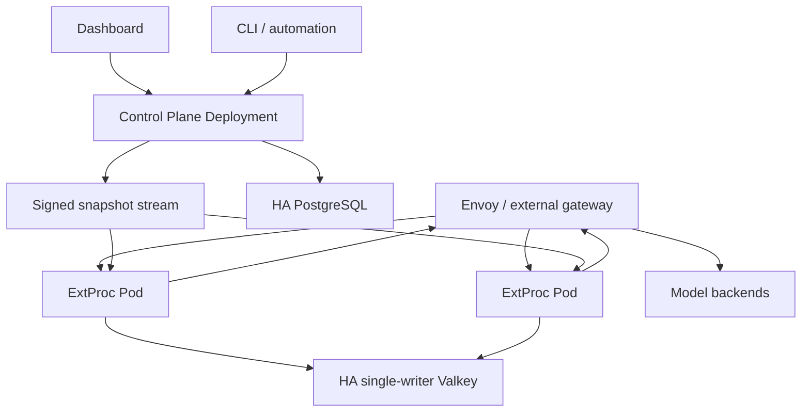

> **Status:** Proposal appendix · **Created:** 2026-08-22

This appendix is normative for deployment and recovery details of
[Access Control and Quota Accounting](./router-native-access-control).
The [resource contract appendix](./router-native-access-control-contracts) owns
storage, credential, policy, counter, and runtime projection details. The
[control-plane and projection API appendix](./router-native-access-control-management-api) owns
identity, endpoints, and responses. The
[authorization appendix](./router-native-access-control-authorization)
owns permissions, roles, and scopes. The
[Provider catalog appendix](./router-native-access-control-provider-catalog) owns
Integration Registry composition and adapter rollout.

## Router bootstrap configuration

A Router bootstrap YAML declares the v0.3 semantic-routing configuration and optional
ExtProc enforcement capabilities.
A file-only deployment serves that routing value directly. Dynamic access adds a
trusted snapshot source and shared runtime store. Dashboard identity, Users, Teams,
invitations, key lifecycle, policies, Budgets, PostgreSQL, and the control-plane HTTP
listener are configured in the control-plane deployment, not Router YAML.

```yaml
version: v0.3

global:
  stores:
    runtime:
      redis:
        url_file: /run/secrets/vllm_sr_access_redis_url
        key_prefix: vllm-sr:access

  services:
    access:
      enabled: true
      snapshot:
        transport: grpc
        endpoint: access-control-plane:9443
        namespace: default
        publisher_ids: [dashboard-control-plane]
        ca_bundle_file: /run/secrets/vllm_sr_access_snapshot_ca
        client_certificate_file: /run/secrets/vllm_sr_access_snapshot_client_cert
        client_private_key_file: /run/secrets/vllm_sr_access_snapshot_client_key
        stale_after: 24h
        reconnect_backoff: 1s
      credentials:
        api_key_hmac_keyring_file: /run/secrets/vllm_sr_api_key_peppers
        delegation_hmac_keyring_file: /run/secrets/vllm_sr_delegation_peppers
      tenant_context:
        signing_key_file: /run/secrets/vllm_sr_tenant_context_keys
        max_start_age: 30s
      enforcement:
        failure_mode: deny
        request_accounting: admission
        token_accounting: response_actual
        unknown_usage_action: freeze
        settle_on: stream_done
        deduplicate_by: admission_id
        max_usage_backlog: 1000000

    backend_credentials:
      provider_kek_keyring_file: /run/secrets/vllm_sr_provider_credential_keks
    backend_egress:
      policy_file: /app/config/backend-egress-policy.yaml
    routing_security:
      hmac_keyring_file: /run/secrets/vllm_sr_routing_hmac_roots
```

Every infrastructure secret field in this block supports one environment reference or
one secret-file reference, never both. Keyrings contain an active version and retained
verification/decryption versions so pepper, KEK, and signing-key rotation do not
require an unsafe flag day. Literal store DSNs, TLS private keys, and keyrings are
rejected by the runtime contract. This restriction is separate from the file-backed
Model `api_key` authoring input described below. API-key reveal encryption, invitation
signing, browser sessions, and bootstrap/recovery tokens stay entirely in the control
plane.

The configured `routing_security.hmac_keyring_file` or
`routing_security.hmac_keyring_env` source provides a dedicated 256-bit, versioned
root authority. It
belongs to durable routing rather than the optional control-plane listener. The
process derives catalog-cursor, discovery-claim, Management-command,
Management-cursor, and bootstrap-idempotency keys with HKDF-SHA256 using fixed
schema-versioned, domain-separated labels. The Management domains are shared by all
Management resources rather than being named after one current resource family; the
bootstrap domain remains isolated because its one-time installation authority has a
different lifecycle. Root bytes are never used directly and are never reused for
API-key peppers, Management service accounts, invitations, or any KEK. New values are
signed only by the active version; explicit wire or durable key-version references let
retained versions verify old values. An unknown or removed referenced version fails
readiness closed. Rotation first distributes a retained root version to every replica,
then activates it atomically, and removes the previous version only after every bounded
artifact and durable idempotency reference has expired.

Provider Integrations and backend compilers are installed when the control-plane
application is composed; they are not YAML bootstrap values. Startup validates the
immutable Integration Registry, stages its content-addressed catalog revision, and
requires plane-specific adapter-capability acknowledgements before activation. The
Definitions do not enter the inference request path or add gateway routes. Adding an
ordinary compatible Provider changes the control-plane Integration set, not Router
runtime configuration or Dashboard product code. See the
[Provider catalog appendix](./router-native-access-control-provider-catalog).

Replica identity, publication leases, rollout groups, and catalog capability digests
are generated deployment/runtime state. The Docker and Kubernetes composers derive
them from the running topology; users do not copy them into Router YAML. A rolling
upgrade still blocks a catalog revision while a live required deployment group has
incompatible capabilities, but that safety mechanism is intentionally below the
public authoring contract.

### Versioned security seeds

Schema migration creates one versioned ManagementSessionPolicy before bootstrap:
15-minute access tokens, eight-hour sessions, five active sessions per principal, and
either human `aal2` with 15-minute authentication age or `workload_strong` with a
30-day source-assurance age for cluster-sensitive actions. Bootstrap locks and
validates it; a missing, duplicate, or unknown seed version keeps Management and
public readiness false. An external-principal bootstrap must meet the human branch;
a service-account bootstrap atomically issues a `workload_strong` credential with
`source_assured_at` equal to the bootstrap transaction time, so the first
administrator can satisfy the seeded policy.

Namespace creation atomically inserts the Namespace, a SelfServicePolicy with zero
self-service keys/sessions, no automatic first key, no Team-key use/capabilities, and
null Access/Rate defaults, plus a versioned ManagementSecurityPolicy. Its initial
matrix accepts either human `aal2` within 15 minutes or `workload_strong` within 30
days for secret delivery/reveal, role delegation, quota waiver, and policy loosening.
Ordinary service credentials and mTLS mappings start `workload_standard`; an already
qualified actor must explicitly register or upgrade a strong source. Operators enable
onboarding only after selecting policies. A missing companion row rolls back creation
and fails readiness for an existing namespace; runtime code has no implicit fallback.

The schema migration installs these restrictive seeds and blocks Management
readiness until every namespace validates. Later seed revisions are audited schema
changes, never startup guesses.

The backend-egress policy is an operator bootstrap boundary shared by Model validation,
discovery, probes, and inference. It allowlists schemes/hosts/ports/CIDRs and private
network exceptions, rechecks DNS and redirects, and denies metadata/link-local targets
by default. It is not a Dashboard preference or a dynamically supplied URL bypass.

Production with a remotely exposed control-plane API requires control-plane-terminated
TLS on its management listener. Server
certificate and key files are mandatory; the client CA bundle is mandatory when an
mTLS mapping exists. Readiness verifies key/certificate match, chain and SAN policy,
validity margin, file permissions, and a loopback handshake. The listener requires
TLS 1.3 or newer. Files rotate through atomic replacement and bounded live reload; a
failed reload retains the last valid context and makes readiness unhealthy before
expiry. The control plane never trusts forwarded certificate headers. A service mesh
may use TCP passthrough, but the control plane remains the mTLS identity verifier and
management access-token issuer.

The same file can be used without dynamic access by omitting Access and runtime-store
blocks:

```yaml
version: v0.3
global:
  services:
    backend_credentials:
      private_provider:
        credential_adapter_id: bearer
        secret_file: /run/secrets/private_provider_api_key
```

The manifest is read-only and compiled before readiness. A file-backed backend may
use exactly one of a named bootstrap `credential`, `api_key_env`, or inline `api_key`;
the named or environment-backed forms are preferred. An inline value remains part of
the public file schema, but makes the whole manifest secret-bearing and is never
returned by configuration APIs. File-backed Models cannot reference a dynamic
ProviderCredential UID. The compiler creates the same in-process backend-credential
interface without persistence or reveal. Users, Teams, inference API keys, policies,
bindings, usage, and audit never appear in YAML. A control plane may import Models,
Recipes, and Entrypoints from the manifest and publish an immutable routing snapshot;
the Router never merges form-oriented CRUD into its file authority.

The user-facing launch contract is one command: `vllm-sr serve`. Docker uses an
existing `./config.yaml` or the immutable v0.3 manifest selected by `--config`.
Kubernetes requires an explicit manifest. In every case the typed blocks determine
the topology; there is no mode field. The optional Dashboard stack starts the
reference control plane and its stores explicitly; Router startup never silently
creates that product state. Built-in Recipes, Models, Entrypoints, decision
assignments, and fallback priorities are authored through the control-plane API or a
static manifest. Portable Recipe packages are validated or imported through those
same resources. Infrastructure flags such as
target, image, platform, namespace, and secret sources configure deployment only.
File-backed startup reads exactly one immutable manifest, and `--config` selects that
complete bootstrap rather than a Model, Recipe, or deployment mode.

## Docker-first deployment

The minimum topology depends on explicit capabilities:

| Configuration   | Required                                                    | Dynamic behavior                                                                           |
| --------------- | ----------------------------------------------------------- | ------------------------------------------------------------------------------------------ |
| File only       | Public gateway, Semantic Router, one local routing manifest | No dynamic product CRUD and no native API-key access control.                              |
| Dynamic routing | Public gateway, Semantic Router, control plane, PostgreSQL  | Dynamic Model/Recipe/Entrypoint authoring and immutable routing publication.               |
| Dynamic access  | Dynamic-routing topology plus Valkey/Redis                  | API keys, authorization, global quota, usage, and audit through compiled access snapshots. |

The ordinary local Docker experience includes Dashboard. `--minimal` omits it for
an operator-controlled deployment, while observability is added only with
`--with-observability`. The dynamic Docker stack contains:

```text
control-plane     Dashboard backend, desired-state API, compiler, projector, workers
postgres          control-plane desired state and ledger
valkey            policy projection, counters, idempotency, usage stream
control-migrate   one-shot control-plane schema migration
router            ExtProc selection, access execution, settlement, projection watcher
gateway           Envoy public inference endpoint, transport, health, and upstream dispatch
dashboard         control-plane web client (omitted only with --minimal)
agent             optional Chat/Builder API and worker; may be linked into control-plane
```

The reference control-plane application composes its supported Provider Integrations.
Docker and Kubernetes deploy the same application capability set; neither
mounts provider definitions or creates one resource per Provider. Changing that set
is an application rollout followed by catalog activation, not a per-tenant resource
update. All control-plane replicas read the durable active revision, while data-plane
replicas receive only stable adapter IDs and compiled Model backend values.

AuthN, AuthZ, quota, snapshot validation, and settlement are narrow modules inside the
Router. Desired-state CRUD, policy compilation, projection publication, and analytics
writing are control-plane roles. Docker may package the reference roles together, but
they remain separate processes and contracts. Dashboard frontend and monitoring are
explicit opt-ins; neither is an inference dependency.

ExtProc never reverse-proxies a selected Model. It resolves one logical dispatch and
returns immutable selection evidence through Envoy filter state or an integration's
native route-hint contract. The bundled Envoy adapter maps that evidence to the active
gateway route or cluster, injects the projected ProviderCredential, applies compiled
per-Model timeout and safe retry policy, and owns connection pools, endpoint health,
backpressure, streaming, and upstream transport.

The control plane publishes routing desired state and the gateway adapter compiles the
transport representation appropriate to the selected gateway. Model count therefore
does not force one universal cluster shape: a deployment may use explicit clusters,
aggregate or dynamic clusters, endpoint discovery, or an external gateway's native
backend resources. ExtProc remains independent of that representation. It identifies
the logical Model revision and fallback plan, never a socket address or cluster name.

An external gateway installs only the matching selection and response-evidence
adapter. It retains ownership of route generation, clusters, endpoint health,
credentials, and transport policy. Integrations declare which attempt and terminal
evidence they return; exact retry, fallback, usage, or cost features fail validation
when the adapter cannot prove the required evidence.

The persistent single-host profile starts one PostgreSQL and one Valkey with named
volumes. It is the smallest persistent topology, not an HA claim. A production HA
profile supplies external or separately managed PostgreSQL and a fenced,
single-writer Valkey topology:

| Profile         | Persistence and acknowledgement contract                                                                                                                                                                         |
| --------------- | ---------------------------------------------------------------------------------------------------------------------------------------------------------------------------------------------------------------- |
| Single-host     | PostgreSQL WAL and Valkey AOF use named volumes. Local commit/fsync settings and volume failure define the declared acknowledged-loss window.                                                                    |
| HA standard     | PostgreSQL may use asynchronous replicas with a declared failover-loss window. Fenced Valkey writes wait for the configured replica acknowledgement while persistence may retain a documented fsync window.      |
| HA strict       | PostgreSQL control-plane, outbox, audit, usage-settlement, and UsageEvent commits wait for synchronous replica quorum. Every security-critical Valkey write waits for configured persistence and replica quorum. |
| External stores | The operator declares the durability profile. Router readiness verifies observable endpoint, epoch, replica, and acknowledgement properties but cannot prove failure-domain placement or election safety.        |

Neither PostgreSQL nor Valkey may acknowledge writes from a minority or stale
primary. Election uses quorum and fences the old writer before routing clients to the
new primary. Every access Function also validates the active runtime epoch. A usage
worker acknowledges a stream item only after the PostgreSQL transaction satisfies
the selected durability profile. Exact quota and ledger continuity survive failover
for operations acknowledged under the strict profile; standard and single-host
profiles expose their bounded durability windows instead of claiming zero loss.

Security-critical Valkey writes include admission and settlement, key/principal/
session/auth-source deny barriers, credential and provider-credential lifecycle
projections, staged policy and routing publication gates, active pointers, and runtime
epoch transitions. They also include each bounded dispatch-intent journal; under HA
strict, the Router must receive persistence and replica-quorum acknowledgement before
allowing the corresponding upstream path. A restrictive control-plane operation, logout, revocation, or
publication cannot report applied until those writes meet the selected acknowledgement
profile. Readiness uses the same rule, so strict failover cannot resurrect authority
that the API already reported revoked.

### ProviderCredential runtime projection

Dynamic ProviderCredentials follow the same immutable publication boundary as routing;
they are not request-time PostgreSQL resources. The desired-state reader opens one
repeatable-read transaction, loads the routing snapshot, derives its exact set of
referenced ProviderCredential IDs, and loads only those credential rows and versions
before committing. An active credential contributes exactly one active encrypted
version plus its unexpired retiring versions, with a hard limit of 32 total versions
per credential. Disabled or deleted credentials contribute metadata with no version
material so activation is restrictive and new dispatch fails closed.

Each ProviderCredential document contains lifecycle and binding metadata plus only
envelope ciphertext, nonce, and KEK version. Plaintext is never serialized. Canonical
ordering and digests cover every document and its manifest entry. Immutable Valkey keys
are scoped by namespace, quota partition, publication ID, and credential ID; publication
verification rejects an absent, extra, malformed, cross-namespace, cross-partition,
cross-publication, binding-mismatched, or digest-mismatched document before any replica
acknowledges the routing snapshot.

The signed selection evidence carries the namespace, quota partition, publication ID,
and logical Model revision. The gateway credential adapter uses those exact values to
read the immutable credential document and never follows a mutable pointer or queries
PostgreSQL. Secret decryption and header materialization happen only at that Envoy
transport edge, and plaintext is zeroed after use. Retained routing publications retain their matching
credential documents, allowing an already pinned request to resolve its original active
or retiring version until that publication is retired; the codec still enforces
not-before, expiry, binding, and lifecycle rules. Management-only discovery and
connection probes may resolve ProviderCredentials from PostgreSQL explicitly, but that
resolver is not composed into the inference dispatch path.

### Startup and readiness

1. The control-plane migration job verifies PostgreSQL schema and desired-state
   invariants. Router startup does not run product migrations.
2. The control plane compiles and signs the first complete routing and access
   snapshots.
3. Valkey passes runtime-epoch, counter, pending-admission, settlement-marker, and
   usage-stream recovery gates.
4. Every Router replica authenticates the configured publisher, resumes after its
   last applied revision, validates the full snapshot, stages it, and atomically
   advances its active pointer.
5. Dynamic access readiness waits for a valid snapshot, runtime store, HMAC keyring,
   and every runtime-verifiable property of the selected durability profile.
6. The public gateway accepts traffic only after Router `/ready` succeeds. Once the
   first revision is active, control-plane or Dashboard outage has no inference
   impact until the configured staleness bound is reached.

`/health` reports only process liveness. `/ready` returns coarse inference readiness
and reason codes. It deliberately remains false before the first complete publication;
operators must not route inference before the first snapshot is acknowledged. The
private control-plane service may remain available for installation and publication;
it never exposes inference.
Native access requires Valkey continuously because credential projections and global
quota counters are one revisioned runtime boundary; no replica serves a pinned
snapshot with unverifiable credential state. Native access also requires a
valid epoch and applied policy revision. The same Valkey deployment carries the
bounded, expiring response-terminal rendezvous used when private backend dispatch and
the owning ExtProc request land on different ExtProc replicas; its atomic one-time
consume is an accounting invariant, not a sticky-routing optimization. The Router's
private applied-revision status exposes runtime-store state, replica acknowledgements,
usage backlog, projection lag, and recovery details. The cluster summary reads only
the namespace-directory cardinality; an exact `namespaceId` selector performs a
constant-space directory lookup before reading that partition's bounded queues.
Diagnostics therefore do not turn a 100,000-key or multi-namespace installation into
a control-plane scan. Partial but trustworthy dependency state is reported as
`degraded`; the endpoint never publishes store addresses, raw Valkey keys,
credentials, policies, or routing documents.

Usage storage diagnostics also report active and retired UTC-month partitions and
minute/hour/day dirty-rollup queue depths. Partition maintenance runs on control-plane
workers under a PostgreSQL advisory lock. A failed pass degrades control-plane
analytics freshness without stopping its already running ingestion workers; a healthy worker
may complete the same idempotent work. Current and configured future months are
created ahead of traffic, and writers can transactionally create a missing month for
late delivery. Each pass inspects a bounded candidate set and retires at most one
aligned month, so an operator enabling retention never creates an unbounded DDL
transaction.

Raw usage and audit history are indefinite by default. Explicit raw usage retention
can retire only a complete month after rollups are durable and no replay or unresolved
reconciliation reference remains. Settlement digest tombstones and rollups are not
deleted. The durable baseline creates the aligned range-partition hierarchy directly;
there is no runtime dual-schema mode.

PostgreSQL and Valkey use named volumes when those stores are enabled. Router
configuration mounts read-only. Control-plane TLS material and optional client CA use
Docker secrets or `/run/secrets/*`. PostgreSQL, Valkey, and the projection service are
not public. Browser requests terminate at the Dashboard/control-plane backend; no
broad Dashboard service identity is mounted into the Router. OIDC and mTLS remain
optional control-plane integrations.

`vllm-sr serve` derives the Router composition from configured capabilities:

- no `global.access`: compile the one local routing manifest and start no access
  runtime or stores;
- `global.access.snapshot`: start the snapshot watcher and fail readiness until the
  first complete revision is active;
- runtime store with no external URL: the reference Docker stack may start Valkey;
- external store references: start only the gateway and Router roles; and
- the optional Dashboard stack starts its own control-plane service and PostgreSQL.

### Local first-administrator installation

The local Docker profile generates independent control-plane session, invitation,
credential-encryption, and snapshot-publisher keys under the private stack state
directory. The Router receives only the snapshot trust root and credential HMAC
verification keyring. Directories are owner-only and secret files are mode `0600`;
no secret value is written into Router YAML, process arguments, or logs.

First registration is one retryable saga:

1. The control plane persists the candidate DashboardMember with status
   `provisioning`; login remains closed.
2. One serializable transaction creates the first DashboardRole binding, default
   Namespace, optional linked inference User, audit event, and consumed bootstrap
   marker.
3. The control plane verifies the complete result through its own API, removes the
   one-time bootstrap source, fsyncs its state directory, and marks the member active.
4. When access is enabled, the compiler publishes the first signed snapshot and waits
   for the Router applied-revision acknowledgment before reporting inference access
   ready.

Every control-plane mutation carries a stable idempotency key, so interruption can
resume without duplicate members, namespaces, Users, or bindings. Router startup and
readiness do not participate in browser-account bootstrap.

## Kubernetes deployment



In Kubernetes, a file-only installation is one stateless deployment with a mounted
immutable manifest and no control plane or stateful stores. The remaining
topology shows the optional dynamic components.

The ExtProc Pod remains stateless when stores are configured. It owns semantic
selection, the private projection watcher, access execution, and settlement. Envoy or
the selected external gateway owns backend invocation. The
control-plane Deployment owns CRUD, compiler, projector, migration, and analytics
workers. Workers coordinate through durable claims and consumer groups, so adding a
replica does not create a second authority. A gateway sidecar and ExtProc may
communicate over loopback, or a shared gateway may call a horizontally scaled ExtProc
gRPC Service. Both layouts require no sticky session.

Separating the Deployments is intentional: ExtProc replicas scale with inference,
while control-plane replicas scale with authoring, projection, and analytics work.
Their only shared contracts are signed snapshots, applied-revision acknowledgments,
Valkey runtime state, and usage events.

Required Kubernetes resources are:

- Router Deployment, HPA, PodDisruptionBudget, and topology spread;
- a public Service or Gateway exposing inference only;
- a private ClusterIP for the control-plane and projection listeners;
- a control-plane migration Job, never migration in ExtProc replicas;
- ConfigMap for static Router bootstrap only;
- Secret or ExternalSecret for PostgreSQL, Valkey, API-key and delegation HMAC
  keyrings, reveal/provider/response KEKs, TenantContext and control-plane token
  signing keyrings, snapshot-publisher keys, service-account/invitation HMAC keyrings,
  control-plane TLS key/certificate and client CA, bootstrap credential, and optional
  recovery token; and
- NetworkPolicies that allow public traffic only to inference and allow control-plane
  access only from authorized service accounts and administrative networks.

Production uses an external or separately managed HA PostgreSQL and HA single-writer
Valkey. The Router Helm chart does not install those authoritative stores; Docker is
the bundled single-host experience. Arbitrary cross-slot clustered quota execution is
outside the first production contract. Stateful store operators must expose a quorum-fenced
writer endpoint and the selected persistence/replica acknowledgement profile; the
Router does not infer safety from a Service name. Failure-domain placement, quorum
election, stale-primary fencing, backup validation, and synchronous-replication
policy remain deployment-system guarantees; readiness reports their declared and
observable state separately.

Projectors coordinate through aggregate sequencing plus row claiming or leader
election. Usage workers share a consumer group. Inference authentication, admission,
routing, ProviderCredential resolution, and settlement never query PostgreSQL; the
same process uses PostgreSQL only for Management commands and asynchronous durable
workers. Every replica validates and loads the exact active policy,
provider-credential, and routing publication from Valkey before acknowledgement and
readiness. TenantContext is signed and request bounded, so any replica can process the
request.

The Operator custom resource contains deployment concerns and one immutable
bootstrap reference only:

```yaml
spec:
  bootstrap:
    configMapRef:
      name: router-bootstrap-v7
      key: config.yaml
  replicas: 3
  service:
    management:
      port: 8443
  podDisruptionBudget:
    minAvailable: 2
  topologySpread:
    topologyKey: topology.kubernetes.io/zone
    whenUnsatisfiable: ScheduleAnyway
  networkPolicy:
    inferencePeers:
      - namespaceSelector:
          matchLabels:
            kubernetes.io/metadata.name: gateway-system
    managementPeers:
      - podSelector:
          matchLabels:
            app.kubernetes.io/component: console
  env:
    - name: VLLM_SR_ACCESS_DATABASE_URL
      valueFrom:
        secretKeyRef:
          name: router-managed-bootstrap
          key: postgres-dsn
```

The referenced ConfigMap must set `immutable: true`. Its selected key is mounted
read-only as `config.yaml`; a bootstrap revision creates a new immutable object,
updates the reference, and rolls Pods. The Operator never synthesizes inline
Models, Recipes, Entrypoints, or access resources. Helm follows the same immutable
manifest-and-rollout boundary. Secret values enter through Kubernetes Secrets or
ExternalSecrets and are referenced from the manifest by file or environment name.

The Operator reads only the shallow deployment boundary needed to reconcile
Kubernetes resources: the v0.3 bootstrap, Management and backend-dispatch listener
ports, and the PostgreSQL DSN environment or file reference used by the
migrator. The Router remains the sole full manifest compiler. Dynamic
reconciliation creates a content-addressed migration Job from the Router image
and gates each new rollout until it succeeds. Status publishes the observed
bootstrap digest, migration Job/state, listener Service names, and readiness
conditions.

The inference Service follows the requested Service type. Management and
backend-dispatch Services are always private ClusterIP Services, with metrics
on its own ClusterIP Service when enabled. Dynamic capabilities enable a
PodDisruptionBudget, topology spread, and listener-specific ingress
NetworkPolicy by default. Empty peer families stay denied; backend dispatch is
limited to Pods of the same `SemanticRouter`. These deployment controls never
contain or project per-key access policy.

Creating a User, key, policy, or UsageEvent never updates a custom resource, etcd,
xDS, or a gateway route and never rolls a Pod.

## Upgrade contract

Every Router process reads one strict `version: v0.3` manifest and has no fallback
parser. Manifest conversion, when required by a release, runs offline, keeps source
and output as separate immutable artifacts, and validates the result with the target
release. It never runs in a serving Pod.

When a control-plane store is configured, its target release's forward-only PostgreSQL
migration job must finish before new control-plane replicas become ready. Rollback without a database
restore is allowed only when the previous release declares the resulting schema
revision readable. Otherwise operators restore the recorded database backup and
required keyring versions before starting the previous image. Runtime-store projections
are rebuilt from authoritative state rather than translated in place.

The manifest version does not negotiate the control-plane HTTP API. Clients pin
`/management/v1`, its versioned media type, and its OpenAPI contract explicitly.
Compatible v1 evolution is restricted to additive response fields and optional,
defaulted request fields; breaking semantics require `/management/v2` and a new
media type. See [Upgrade and rollback](../installation/upgrade-rollback.md) for the
operator checklist.

## Failure semantics

| Failure                                           | Data-plane behavior                                                                             | Control-plane behavior                                                                   |
| ------------------------------------------------- | ----------------------------------------------------------------------------------------------- | ---------------------------------------------------------------------------------------- |
| Dashboard frontend unavailable                    | No inference impact                                                                             | Control-plane API and automation continue.                                               |
| Control plane unavailable                         | Last acknowledged snapshot continues until its configured staleness bound                       | Mutations and long-range queries stop; no false success.                                 |
| PostgreSQL unavailable                            | Already applied keys continue from Valkey while the usage stream remains below its safety bound | Mutations and long-range queries stop; no false success.                                 |
| Valkey unavailable while native access is enabled | Admission fails closed with `503` and replicas become unready                                   | Mutations and snapshot activation remain pending or fail.                                |
| Projector lag                                     | Existing complete per-key revisions continue                                                    | Mutation reports `pending`; expansions remain gated and restrictions keep deny barriers. |
| Usage writer unavailable                          | Counters continue and events queue in the durable stream                                        | Analytics freshness reports lag.                                                         |
| Usage backlog over bound                          | New admission fails with `503` to avoid unaccounted traffic                                     | Operators receive explicit backlog health and alerts.                                    |
| Expired-pending backlog                           | Admission drains a bounded batch, then fails `503` while an expired oldest item remains         | Reconciler lag/backlog marks access unready until each item is fenced.                   |
| One ExtProc Pod fails                             | Readiness removes it; other replicas continue                                                   | Workers reclaim unacknowledged jobs.                                                     |
| Router dies after admission                       | The pending admission expires into an unknown fence                                             | Reconciliation resolves the fence from backend evidence or an audited action.            |
| Provider omits usage                              | The affected token scope is fenced; usage is never treated as zero                              | Provider health identifies the incompatible path.                                        |
| Reveal KEK is unavailable                         | Existing HMAC-authenticated keys continue                                                       | Reveal and revealable-key creation fail closed.                                          |
| HMAC pepper is unavailable                        | Access-enabled Router remains not ready                                                         | No credential fallback is allowed.                                                       |
| Schema is incompatible                            | Access services remain not ready                                                                | No destructive automatic migration runs.                                                 |
| Credential is invalid                             | Request returns `401`                                                                           | Audit records a bounded, non-secret anomaly.                                             |
| Resource is absent or forbidden                   | Request returns nondisclosing `404`                                                             | Effective-policy evaluation explains the denial to authorized administrators.            |
| Quota is exceeded                                 | Request returns `429` and `Retry-After`                                                         | Live quota snapshot shows the exact limiting rule.                                       |

Valkey persistence and replication protect the interval while PostgreSQL is down.
The configured persistence and replica acknowledgement policy defines the
acknowledged-loss window and its latency cost. Only strict acknowledgements are
described as failover-exact; asynchronous persistence is never described as
zero-loss.

## Valkey catastrophic-loss recovery

Policy projections and routing snapshots can be rebuilt from PostgreSQL. Live
rolling counters, pending admissions, not-yet-persisted stream entries, and
settlement markers cannot be assumed recoverable from desired state. An empty or
unknown-epoch Valkey therefore keeps native access not ready.

Recovery requires one of these audited paths:

1. restore a known-good Valkey AOF, snapshot, or replica and verify its runtime epoch;
2. create a new epoch under a namespace-wide conservative fence, keep inference
   drained, and rebuild only from complete durable evidence: sliding logs may clear
   after the longest window, concurrency may clear after maximum request lifetime
   plus heartbeat grace, calendar request/token/cost counters require a complete
   ledger, and token-bucket or GCRA state requires replay from a complete admission
   ledger or waiting its full refill horizon; or
3. explicitly accept a documented conservative debit, waiver, or counter reset
   through a privileged recovery operation after traffic is drained.

A total Valkey loss also loses identities for admitted but unsettled work that never
reached PostgreSQL. Without complete backend evidence, those admissions cannot be
reconstructed and path 2 cannot claim exact recovery; the namespace fence remains
until path 3 records the decision. Persisting admissions before dispatch would add a
PostgreSQL request hot path and is intentionally not part of this proposal.

The Router never automatically rebuilds only policies and silently resets quota.
Operators choose the maximum usage-stream backlog by capacity, not by an unbounded
availability promise. Backups cover PostgreSQL, Valkey persistence, HMAC peppers,
KEKs, signing keys, and the runtime-epoch record.

## PostgreSQL disaster recovery

PostgreSQL is the only desired-state, identity, routing, ledger, and audit authority.
Valkey can help recover acknowledged runtime facts, but it can never be promoted into
desired state after a PostgreSQL restore.

An audited point-in-time or full PostgreSQL recovery follows this order:

1. install a quorum-acknowledged namespace/cluster maintenance fence in the current
   Valkey epoch, stop Management mutations and new admission, and drain or convert
   every remaining admission into an explicit unknown fence;
2. restore the database and replay verified WAL to the selected recovery point, then
   validate schema, backup manifest, keyring versions, transaction timeline, outbox
   sequence, resource revisions, routing digests, usage-settlement watermark, and
   audit continuity before starting a writer; a restored pre-bootstrap state is valid
   only when the external bootstrap secret is already absent or deliberately rotated;
3. compare the restored PostgreSQL epoch and desired/applied revisions with a
   read-only capture of Valkey. Never recreate a User, key, grant, ProviderCredential,
   or Entrypoint from a Valkey projection. Post-restore Valkey credentials or pointers
   absent from PostgreSQL remain denied as orphans;
4. replay only authenticated usage/reconciliation stream items newer than the restored
   ledger watermark through normal settlement deduplication. Reconcile counters,
   pending work, and gaps with the catastrophic-loss rules above; incomplete evidence
   remains fenced rather than becoming zero;
5. commit a new runtime epoch in PostgreSQL, build a fresh Valkey prefix from restored
   desired state, compile routing snapshots, project credentials/policies, and keep
   the old epoch read-only for evidence until retention permits erasure; and
6. remove the maintenance fence and declare readiness only after resource-count and
   digest checks, outbox continuity, replica acknowledgements, usage/counter recovery,
   orphan denial, and a durable recovery audit event all pass.

If the selected PostgreSQL recovery point predates an acknowledged strict-profile
commit, the recovery is invalid and must continue WAL/backup recovery or remain
blocked. Standard and single-host profiles may lose changes inside their declared
window; those resources are not reconstructed from Valkey, and the recovery report
lists the gap. Loss of both authoritative backups and required keyring versions is not
an automatic-reset path: native access remains unavailable until a privileged,
audited re-bootstrap and credential migration is completed.
