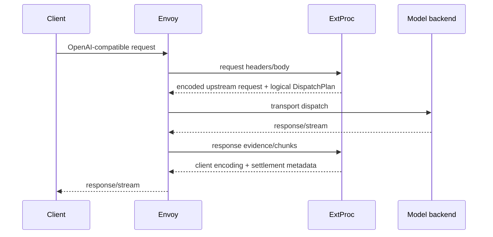

> **Status:** Proposal appendix · **Created:** 2026-08-22

This appendix is normative for Model execution and pricing in
[Access Control and Quota Accounting](./router-native-access-control). The
[resource contract](./router-native-access-control-contracts) owns persistence and
usage records; the [control-plane API](./router-native-access-control-management-api)
owns Model CRUD; the [neutral protocol](./multi-protocol-adaptor) owns wire codecs.

## One readable Model

The v0.3 readable-name split remains the authoring boundary. `providers.models` owns
connections, invocation control, and pricing. `routing.modelCards` owns only
connection-free semantic metadata. Recipe and DSL authors use Model cards and never
see endpoints or credentials.

```yaml
name: local/primary
provider_model_id: primary
backend_refs:
  - provider: vllm
    endpoint: http://model:8000
    protocol: http
control:
  retry:
    count: 2
    on: [unavailable, timeout]
  timeout:
    request: 5m
    stream: 15m
pricing:
  input_cost_per_million_tokens: "0.50"
  output_cost_per_million_tokens: "1.50"
  cache_read_cost_per_million_tokens: "0.05"
  cache_write_cost_per_million_tokens: "0.625"
```

Static YAML and control-plane CRUD/import/export use the same semantics, not the same
wire serialization. YAML uses readable names. Control-plane JSON uses stable resource
IDs and optimistic revisions internally but human export omits generated identity,
catalog digests, and compiled gateway values. The Dashboard presents one Model form;
`control` and `pricing` are optional Advanced settings.

A fixed-origin Provider Integration fills its default endpoint. A no-auth backend
omits credential fields. File authoring keeps the existing mutually exclusive named,
environment, or direct credential inputs. Dynamic Models reference a
ProviderCredential and never expose its secret in a Model response.

Reasoning wire behavior and semantic support remain separate. A provider Model picks
a named reasoning family; its Model card declares the assignment values a Recipe may
request. An Entrypoint cannot assign a reasoning value the Model card does not
advertise.

Publication resolves readable names, validates Provider Integration and codec
capabilities, and creates one immutable Model revision. That revision contains the
logical Model identity, semantic capabilities, pricing revision, one or more physical
backend route descriptors, transport control, credential reference, and codec IDs.
Provider logos, forms, default URLs, discovery, and product names remain in the
control plane. ExtProc and Envoy receive only compiled values.

One logical Model may reference several physical endpoints. Endpoint weight, health,
and outlier policy compile into the gateway representation; they are not a second
semantic routing layer. A differently priced endpoint is a different logical Model.

## Selection and transport boundary

ExtProc selects; Envoy dispatches.



ExtProc owns:

- decoding the client request to the neutral protocol representation;
- access-policy execution and semantic selection;
- choosing one Entrypoint decision and an ordered logical candidate plan;
- applying Recipe-scoped request/response transformations;
- encoding the selected upstream request and decoding its response; and
- settlement from authenticated gateway and provider usage evidence.

Envoy or the installed external gateway owns:

- route/cluster/backend resolution from the logical dispatch key;
- connection pools, DNS/TLS, endpoint health, outlier ejection, and backpressure;
- ProviderCredential injection at the transport edge;
- request and stream deadlines;
- physically safe retries and fallback attempts allowed by the compiled plan;
- upstream HTTP lifecycle and streaming; and
- a typed, authenticated attempt/terminal receipt returned to ExtProc.

ExtProc never opens a Model connection. Envoy never evaluates Signals, Decisions, or
AccessPolicy. Client-supplied route, cluster, credential, identity, timeout, retry, or
attempt-evidence headers are stripped before either contract is evaluated.

The control plane compiles a gateway-specific transport projection from the same
immutable Model revisions. The bundled Envoy integration may use explicit clusters,
dynamic forward proxy, aggregate clusters, or endpoint discovery. An external gateway
uses its native backend resources. ExtProc sees only logical route keys, so supporting
1,000 Models does not force one cluster per Model and does not force all traffic
through one shared internal reverse-proxy cluster.

The gateway adapter advertises capabilities such as buffered/streaming codec support,
credential injection, attempt receipts, same-Model retry, cross-Model fallback, and
usage evidence. Publication fails when a Recipe or Model requires a capability that
the selected deployment adapter cannot prove. There is no silent degraded execution.

## DispatchPlan

The ExtProc-to-gateway value is a short-lived, request-bound logical plan, not user
configuration:

```text
DispatchPlan
  namespace / publication / admission / request digest
  client codec and selected decision
  whole-request deadline
  ordered candidate tiers
    logical Model revision
    gateway route key
    backend request codec
    credential projection reference
    retry and timeout control
  required terminal-evidence contract
```

The plan is stored in Envoy filter state when co-located. When it crosses a process
boundary it is signed, audience-bound, short-lived, and replay-protected. It contains
no plaintext credential or physical socket address. The gateway adapter validates the
active routing publication before dispatch.

Each attempt receives a stable dispatch ordinal. The terminal receipt identifies the
attempts made, Model/backend revisions, timestamps, known-zero or actual usage state,
provider usage, and final outcome. ExtProc accepts it only for the matching admission,
request digest, publication, and response stream.

An optional multi-call orchestration service is a separate logical upstream. It is
required only for Recipes whose algorithm genuinely issues parallel, cascade, fusion,
or workflow model calls. Its subcalls use the same gateway dispatch contract and it
returns one signed aggregate receipt. It is not part of ExtProc and is not required
for ordinary single-dispatch Recipes.

## Retry and timeout

`control.retry.count` is the number of additional attempts for the same immutable
Model revision and is bounded from zero through five. `control.retry.on` is a
duplicate-free subset of `unavailable|timeout`; when count is positive and `on` is
omitted it defaults to `unavailable`.

A retry is allowed only when the gateway's transport evidence proves `known_zero`:
no request byte reached an inference-capable upstream and no response byte became
client-visible. HTTP responses, including 429 and 503, are not known-zero evidence.
An ambiguous timeout, partial write, partial stream, known billable work, or missing
attempt receipt is terminal. ExtProc and clients cannot assert retry safety.

`control.timeout.request` is the total non-streaming deadline, including all retries
and fallback. `control.timeout.stream` is the total streaming lifetime, with retries
allowed only before the first client-visible byte. Durations use positive Go duration
syntax, are bounded from one second through 24 hours, and default to 300 seconds. A
retry or fallback never resets the deadline.

Envoy implements the physical timer and retry. ExtProc places the compiled limit in
the immutable plan and verifies terminal evidence. This keeps transport control in the
data plane without giving Envoy semantic routing authority.

## Priority fallback between Models

Same-Model retry belongs to `Model.control`. Cross-Model fallback belongs to one
Entrypoint decision assignment:

```yaml
assignments:
  Complex:
    models:
      - { model: remote/primary, priority: 0, weight: "1" }
      - { model: local/secondary, priority: 1, weight: "1" }
    fallback:
      strategy: priority
      on: [unavailable, timeout]
```

Lower priority wins. The Recipe algorithm chooses only among eligible Models in the
active tier and may use weights within that tier. Tiers are contiguous from zero,
bounded to 32, and must all satisfy modality, reasoning, tool, context, and protocol
requirements.

Fallback is valid only for single-dispatch cardinality. A required fusion or workflow
cohort is not a backup list. The gateway exhausts safe same-Model retries before moving
to the next logical tier. Transition requires a known-zero receipt before visible
output. Every attempted or skipped tier is represented in the terminal receipt.

Cross-codec fallback requires a gateway adapter capable of re-encoding the buffered
request for each candidate and producing one authenticated receipt. If the gateway
cannot do that, publication accepts only same-codec fallback or rejects the assignment.
No ExtProc direct call is used as a compatibility path.

## Neutral protocol matrix

The public edge decodes the client format to the neutral request representation.
ExtProc performs semantic processing on that representation and encodes the chosen
backend format before Envoy forwards it. Response chunks follow the inverse path.
There are no pair-specific translators and no provider-specific accounting paths.

Each installed codec declares buffered request, buffered response, streaming request,
streaming response, tool-call, multimodal, reasoning, and usage capabilities. The
matrix test executes every supported client-codec/backend-codec pair. Publication
rejects a Model or fallback tier when the active gateway adapter and codecs cannot
preserve its required features.

Modality classification is routing evidence only. Image-bearing requests select an
authorized multimodal Model and use the same DispatchPlan. ExtProc has no separate
omni HTTP client. Retrieval, memory rewriting, classifiers, and embedding adapters are
internal typed dependencies and cannot masquerade as request-facing Models.

## Pricing and actual cost

Prices are non-negative decimal strings in the Namespace's immutable ISO-4217
currency, with at most nine fractional digits and a maximum of 1,000,000 currency
units per million tokens. Exponent notation, NaN, infinity, overflow, and silent
rounding are rejected. Explicit `"0"` means free; null input/output means unpriced.
Null cache-read and cache-write prices inherit input.

Usage separates uncached input, cache-read input, cache-write input, and output tokens.
Rates compile to integer nano-currency units per million tokens. The checked
QuotaInteger accumulates `sum(tokens * pinned_rate)` across authenticated dispatch
receipts. Historical events pin Model and pricing revisions and are never recomputed
after a price edit.

A differential cache price without authoritative cache buckets, or nonzero tokens
without a required rate, makes cost unknown rather than zero. `cost` is a
response-actual quota metric with the same crossing-request, settlement, and
unknown-fence semantics as token metrics. Publication rejects an enforced cost rule
whose reachable Models are unpriced or whose adapter cannot prove required billing
buckets; it may be shadow-only.

Valkey stores the exact fixed-width integer representation used by settlement.
PostgreSQL stores the canonical numerator. Dashboard formatting is a presentation
concern and never becomes quota truth.

## Scale and conformance

Production acceptance includes:

- a 1,000-Model catalog without a mandatory 1,000-static-cluster topology;
- bounded gateway and ExtProc memory per active route, codec, and endpoint;
- high-concurrency streaming, DNS/TLS reuse, backpressure, circuit breaking, and
  replica loss without sticky sessions;
- same-Model retry and cross-Model fallback with exact known-zero proof;
- no retry after visible output or unknown usage;
- end-to-end deadline preservation;
- buffered and streaming neutral-codec matrix coverage;
- exact actual-token and cost settlement for every authenticated attempt; and
- equivalent behavior through the bundled Envoy adapter and each supported external
  gateway adapter.

## Deliberate simplicity

There is no reusable PriceBook, RetryPolicy, TimeoutPolicy, Router backend invoker, or
second transport API. Users edit one Model and one Entrypoint assignment. ExtProc
selects, Envoy dispatches, and the control plane compiles both immutable projections.
