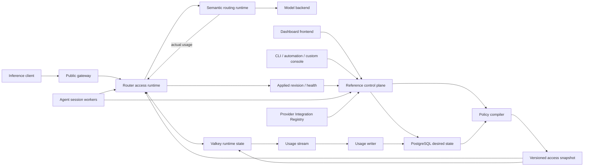

> **Status:** Proposal · **Created:** 2026-08-22

Normative appendices: [resources](./router-native-access-control-contracts),
[Provider catalog](./router-native-access-control-provider-catalog),
[Model runtime](./router-native-access-control-model-runtime),
[neutral protocol](./multi-protocol-adaptor),
[quota runtime](./router-native-access-control-quota-runtime),
[control-plane and projection APIs](./router-native-access-control-management-api),
[authorization](./router-native-access-control-authorization), and
[deployment](./router-native-access-control-deployment), plus the
[Agent and Playground Builder](./router-native-agent-runtime).

## Problem

Inference enforcement is a Router responsibility. Inference desired state is not.
Clients call the Router without the Dashboard, so credential verification, model
visibility, quota admission, and accounting must remain in the Router data path.
Users, Teams, invitations, API-key lifecycle, policies, and budgets are control-plane
concepts and must not turn the Router into a product directory or administration
application.

The bundled Dashboard backend is the reference control plane, not a required inference
hop. A different console may own the same desired-state contract and publish the same
compiled projection. This separation avoids four structural problems:

- bypassing the Dashboard must not bypass the policy boundary;
- Dashboard availability must not become inference availability;
- multiple Router replicas must share one applied enforcement revision; and
- a custom console must not depend on Dashboard tables or a broad Router CRUD API.

The design must support at least 10,000 API keys with independent model visibility and quota. That state must not expand into Router YAML, gateway routes, xDS, ConfigMaps, or one custom resource per key, which would couple every mutation to configuration distribution and reloads.

## Decision summary

This proposal makes the following decisions:

1. Semantic Router owns the public inference access boundary. It does not own User,
   Team, invitation, key-lifecycle, AccessPolicy, or Budget CRUD.
2. A replaceable control plane owns those product resources, their versioned API,
   PostgreSQL desired state, secret delivery, policy compilation, and audit.
   The bundled Dashboard backend is one implementation.
3. The Router accepts only immutable, versioned access snapshots and exposes a narrow
   private projection/status contract. It never receives an API-key plaintext secret,
   email address, invitation, Dashboard role, or form-oriented resource graph.
4. Valkey or Redis is the applied runtime store for credential projections,
   compiled policies and routing snapshots, global counters, settlement idempotency,
   and the durable usage-ingestion stream.
5. The Dashboard frontend talks only to its control-plane backend. It never registers
   or proxies public inference routes. Control-plane loss does not stop inference from
   the last acknowledged snapshot.
6. Router YAML remains the static routing bootstrap contract. It configures the
   trusted access-projection source and runtime stores, never individual Users, Teams,
   keys, grants, or budgets. There is no `standalone`/`managed` product mode.
7. API-key authentication, model discovery, invocation authorization, and quota
   admission use the same compiled effective policy.
8. Request counts are admitted before inference. Token quotas use authoritative
   response usage only: the current request may cross a token limit, and the next
   request is blocked.
9. An Entrypoint is the callable Mixture-of-Models. Decision assignments belong
   directly to the Entrypoint; pools and mixtures are derived views, not resources.
10. A routing-only Docker manifest requires neither PostgreSQL nor Valkey. Enabling
    dynamic access adds the reference control plane store and Valkey; Kubernetes may
    replace either with managed services. Both use the same projection protocol.
11. Runtime code accepts exactly the contracts defined here. Each resource has one
    authoritative writer, one validated read path, and one publication path.
12. Provider products are application-installed control-plane Integrations. Their
    Definitions and compiler plugins render canonical Model backends; the inference
    data plane receives only a stable wire-format ID, credential-adapter ID, semantic
    capabilities, and compiled non-secret settings. It contains no product-provider
    switch or Dashboard catalog.
13. Every public and backend format uses one neutral request/response/event IR and an
    immutable Codec Registry. Formats compose through the IR; pair-specific
    translators and protocol-specific accounting paths do not exist.
14. Playground Chat and Builder are two modes of one durable Agent session kernel.
    Every model step uses the public OpenAI-compatible streaming inference API. Builder
    may prepare a Recipe publication, but only an authorized human may commit it.
15. Exact issuer-session reissue preserves one durable control-plane session and stable
    token ID across Dashboard replicas. Changed evidence creates a bounded new
    session, while durable digested SID and subject logout selectors close every
    exchange/logout race.

## Goals

- Enforce API-key authentication and authorization on every public inference path.
- Keep `GET /v1/models`, invocation, Playground, and direct-model testing consistent.
- Make key disable, expiry, grant reduction, and quota reduction globally effective
  across Router replicas without configuration reloads.
- Support reusable policies and a distinct policy per key without request-time SQL
  joins.
- Support exact rolling RPM, actual-token and actual-cost quotas, daily windows, and
  concurrency through one extensible rule model.
- Make per-decision Model fallback explicit, priority ordered, safe before visible
  output, and fully accounted by Router rather than hidden in gateway retries.
- Preserve complete per-request accounting for streaming, non-streaming, and
  multi-dispatch Mixture-of-Models execution.
- Expose a stable control-plane API and compiler contract so the bundled Dashboard,
  automation, and independent consoles can produce the same applied snapshot.
- Keep the Router projection API private, narrow, idempotent, and independent of
  product CRUD concepts.
- Keep the Docker deployment small while preserving a direct path to stateless
  Kubernetes scale-out.
- Make failure and consistency semantics visible in APIs, health endpoints, and the
  Dashboard.
- Let an operator add an ordinary compatible Provider through the control-plane
  Integration Registry, without changing the Dashboard or inference runtime.
- Preserve tools, multimodal content, reasoning, stop semantics, streaming events,
  and authoritative usage across a complete client/backend protocol codec matrix.
- Let users describe, tune, probe, evaluate, review, and publish a Mixture-of-Models
  through a durable Playground Builder session without creating a second Recipe or
  inference authority.

## Non-goals

- Storing inference API keys in static Router configuration or Kubernetes objects.
- Making the Dashboard frontend an inference proxy or policy engine.
- Making the Router the authoritative User/Team directory or exposing broad
  product-management CRUD from the data plane.
- Using inference credentials as management credentials.
- Conflating inference credentials with the separately encrypted
  ProviderCredentials used by the Router to call model backends.
- Choosing or scheduling a physical model replica; access grants target logical
  Router resources.
- Treating the analytics ledger as the source of live quota remaining.
- Providing an in-memory or SQLite enforcement mode with different quota semantics.
- Hiding approximate rate-limit algorithms behind labels that imply exact windows.

## Product and trust boundaries

The following diagram separates desired state from enforcement. A minimal routing-only
deployment omits Dashboard, the reference control plane, PostgreSQL, Valkey, projector,
and writers. Enabling dynamic access adds a replaceable control plane; it does not put
the Dashboard in the inference path.



| Component                 | Owns                                                                                                                                                        | Must not own                                                                             |
| ------------------------- | ----------------------------------------------------------------------------------------------------------------------------------------------------------- | ---------------------------------------------------------------------------------------- |
| Public gateway            | Listener, transport filtering, access-service calls, and forwarding                                                                                         | API-key records, policy compilation, quota state, or usage truth                         |
| Router access runtime     | Credential verification, trusted principal context, grants, admission, settlement, and global quota decisions                                               | Browser sessions or Dashboard presentation state                                         |
| Router routing runtime    | Entrypoint resolution, signals, projections, decisions, algorithms, plugins, neutral protocol processing, codec dispatch, and backend invocation            | Product-provider catalogs, Management identity authentication, or mutable policy storage |
| Reference control plane   | Dashboard identity, Users, Teams, invitations, API-key lifecycle, AccessPolicy, Budget, Provider Integrations, policy compilation, usage queries, and audit | Public inference proxying or request-time enforcement                                    |
| Router projection service | Authenticate the trusted publisher, validate and atomically apply immutable access snapshots, report applied revision and health                            | User/Team CRUD, secret reveal, invitations, Dashboard roles, or form validation          |
| Router Agent runtime      | Durable sessions, leased turns, trusted Skills, authorized Tools, probes/evals, and immutable publication plans                                             | Autonomous publication, backend credentials, or a second Recipe/inference path           |
| PostgreSQL                | Control-plane identities, routing desired state, policies, revisions, ledger, rollups, and audit                                                            | Per-request hot-path reads                                                               |
| Valkey/Redis              | Applied credential/policy projections, compiled routing snapshots, global counters, idempotency, and ingestion stream                                       | Long-term analytics or the only copy of desired state                                    |
| Dashboard frontend        | Product UX over its control-plane backend and public inference API                                                                                          | Direct Router database access or a required data-plane hop                               |

One Router image may expose ExtProc, internal authentication and quota services, the
private projection/status service, health, and metrics. It does not expose the
control-plane product API. When dynamic access is enabled, every ingress adapter
executes access authentication, authorization, and quota admission before semantic
ExtProc. After verification, the Router removes the inference `Authorization` header;
backend dispatch injects a separate ProviderCredential. No access-enabled adapter may
bypass the shared `AccessRuntime`. Deployments without dynamic access do not start
`AccessRuntime`; their public discovery and invocation paths still share the same
Entrypoint resolver and active routing snapshot.

### Two identity planes

Control-plane identity and inference identity are intentionally different:

- A **DashboardMember** authenticates to the control plane. Its DashboardRole controls
  administrative actions and visible product surfaces.
- A control-plane **User** consumes model service. It may belong to Teams and own API
  keys. User and Team records are not projected to the Router as directory objects.
- One DashboardMember may be linked to one User, but the link is explicit rather than
  inferred from an email address.
- An **InferenceAPIKey** authenticates only to public inference APIs unless an
  explicit, separately issued control-plane credential says otherwise.

The compiler resolves User, Team, key, AccessPolicy, and Budget inheritance into one
effective subject. The Router receives opaque subject IDs, grants, meter descriptors,
and a policy revision. It does not receive names, emails, memberships, invitations,
or DashboardRole data.

This keeps Dashboard login state, DashboardRole authority, TeamRole membership, and
inference access policy from sharing an ambiguous `role` field.

## Terminology

| Term                           | Meaning                                                                                                                                               |
| ------------------------------ | ----------------------------------------------------------------------------------------------------------------------------------------------------- |
| `Namespace`                    | The top-level isolation boundary for management, policies, routing resources, and analytics.                                                          |
| `DashboardMember`              | Browser-login identity governed by a DashboardRole; never an inference principal by itself.                                                           |
| `DashboardRole`                | A control-plane permission preset for administration and product visibility.                                                                          |
| `ServiceAccount`               | A non-human control-plane principal used by automation.                                                                                               |
| `User`                         | A model-service consumer identity owned by the control plane.                                                                                         |
| `Team`                         | A control-plane collection of Users with defaults and optionally shared hard caps.                                                                    |
| `TeamMembership`               | A User's membership and TeamRole in one Team.                                                                                                         |
| `TeamRole`                     | Membership authority inside one Team; independent of DashboardRole.                                                                                   |
| `RoutingRole`                  | A typed routing-context value compiled from control-plane subject state; it grants no control-plane capability.                                       |
| `InferenceAPIKey`              | A stable logical key resource used for ownership, policy, usage, and URLs.                                                                            |
| `APIKeyCredentialVersion`      | One secret version for an InferenceAPIKey; rotation creates another version.                                                                          |
| `DelegatedInferenceSession`    | A short-lived session linking a Management session, User, and permitted logical key.                                                                  |
| `DelegatedInferenceCredential` | The non-revealable Bearer secret issued for one DelegatedInferenceSession.                                                                            |
| `AccessPolicy`                 | A reusable set of explicit discover/invoke grants. The Dashboard may label it **Access Group**.                                                       |
| `RateLimitPolicy`              | A reusable ordered set of quota rules. The Dashboard may label it **Budget**.                                                                         |
| `AccessPolicyBinding`          | Attaches an AccessPolicy to a key, User, or Team; it owns no quota counter.                                                                           |
| `RateLimitBinding`             | Attaches a RateLimitPolicy to a key, User, or Team and owns its counters.                                                                             |
| `ModelGrant`                   | Permission on a stable Entrypoint or Model identifier.                                                                                                |
| `QuotaCounter`                 | Live enforcement state in Valkey.                                                                                                                     |
| `UsageEvent`                   | An immutable accounting fact persisted in the analytics ledger.                                                                                       |
| `ProviderCredential`           | A secret used by the Router to call a backend; never an inference key.                                                                                |
| `ProviderIntegration`          | An application-installed control-plane extension that contributes one immutable Provider Definition.                                                  |
| `ProviderDefinition`           | Product metadata, origin rules, typed UX fields, compiler configuration, and references to stable adapters.                                           |
| `WireFormat`                   | A stable data-plane contract such as OpenAI Chat or Anthropic Messages, resolved through the immutable Codec Registry; never a product catalog entry. |
| `CredentialAdapter`            | A stable secret materializer such as Bearer or `x-api-key`; never a product catalog entry.                                                            |
| `TenantContext`                | Router-issued trusted request identity and policy context.                                                                                            |
| `AccessSnapshot`               | Immutable compiled credentials, effective grants, quota descriptors, and revision accepted by Router replicas.                                        |

The routing `authz` signal consumes a verified TenantContext as a routing fact.
API-key authentication and Model authorization belong to the AccessRuntime before
Recipe evaluation.

## Routing resource boundary

This section defines the complete human authoring and internal publication boundary.
Runtime code consumes this contract through the canonical validator and snapshot
compiler.

Only three persistent routing concepts are needed:

- **Model**: the existing `providers.models` connection record joined by name to
  its connection-free `routing.modelCards` semantic record, with optional
  advanced invocation control and pricing settings on the provider Model.
- **Recipe**: reusable signals, projections, decisions, algorithms, and plugins.
- **Entrypoint**: a callable Mixture-of-Models that selects a Recipe and assigns
  Models to that Recipe's readable decision names.

The manifest extends the existing public `v0.3` sections instead of introducing a
second top-level Model shape. Human YAML, DSL, and Dashboard authoring use readable
names. They never expose resource UIDs, revision hashes, backend IDs, catalog digests,
compiled adapters, or database keys. The importer resolves names within one Namespace
and generates publication identity internally. The control-plane API still returns
stable resource IDs, revisions, and ETags for safe automation and optimistic
concurrency; those values are never serialized back into human source.

The target v0.3 boundary is deliberately narrow. Users, Teams, inference API keys,
access policies, quota policies, bindings, counters, usage, and audit are dynamic
control-plane resources and never Router YAML. Model rates are exact quoted decimal
strings under `providers.models[].pricing`; per-Model retries and deadlines are
structured under `providers.models[].control.retry` and
`providers.models[].control.timeout`. Runtime authority is derived from the configured
stores, and no caller-controlled Router bypass participates in inference. The
serving code implements only this target contract. Every other public v0.3 concept
keeps its existing role.

The three representations share semantics without sharing serialization or exposing
implementation identity:

| Boundary          | Model                                                                                                                                                                       | Recipe                                                                                                                                | Entrypoint                                                                                           |
| ----------------- | --------------------------------------------------------------------------------------------------------------------------------------------------------------------------- | ------------------------------------------------------------------------------------------------------------------------------------- | ---------------------------------------------------------------------------------------------------- |
| Human v0.3 YAML   | A readable-name join between `providers.models[]` connections and `routing.modelCards[]` semantics                                                                          | Connection-free `recipes[].routing`; normally model-free, with complete static-only candidate extraction when assignments are omitted | `model_names`, one readable Recipe name, and Decision-name `assignments`                             |
| Control-plane API | One revisioned Model resource whose write contains semantic fields, backend inputs, `control`, and `pricing`; `/routing/model-cards` is its connection-free read projection | One revisioned Recipe resource                                                                                                        | One revisioned Entrypoint whose rules pin Recipe and Model resource IDs under optimistic concurrency |
| Compiled runtime  | Immutable Model/backend IDs, catalog provenance, closed connection values, credentials by reference, and effective defaults                                                 | Immutable model-free Recipe revision                                                                                                  | Immutable resolver rules, complete Decision assignments, and priority tiers                          |

This mapping is one-way at publication: readable authoring values compile into
internal identity, while a human export resolves that identity back to names and
omits compiler-owned fields. Control-plane JSON uses camelCase and stable IDs for safe
automation; YAML and DSL use names and the existing v0.3 field spellings. They are
not required to be byte-for-byte copies of one another.

Canonical authoring normalization is part of this single v0.3 contract, not a
compatibility reader. After strict decoding accepts only current v0.3 fields, the
compiler may apply documented defaults, canonical ordering, shorthand expansion,
and the complete inline-`modelRefs` extraction described below. Those operations do
not recognize removed field names, alternate object shapes, or another manifest
version. Rewriting an older public shape is an explicit offline migration; serving,
validation, import, and publication never invoke that migrator or maintain a second
runtime representation.

This boundary does not expose connections to Recipe authors. Every Model read has a
permission-filtered **ModelCardView** projection from `routing.modelCards`, containing semantic identity,
modality, capabilities, context, reasoning family, quality, LoRAs, and tags. Recipe
and DSL editors never receive an origin, ProviderCredential, authentication field,
or compiled backend. `ModelCardView` has no independent CRUD or persistence: it is
joined to the provider Model by its unique readable name, so validation cannot publish
a connection without metadata or metadata without a connection.

The DSL may render that projection as a `MODEL` card block for authoring context, but
the block contains no connection, credential, UID, or revision syntax. Saving a
Recipe mutates only `Recipe.routing`; executable Model selection remains an
Entrypoint assignment action.

An Entrypoint is the product's Mixture-of-Models. Control-plane and DSL authoring
always keep Recipe documents model-free and put the complete mapping for every
dispatching Decision in Entrypoint `assignments`. Full static v0.3 manifest authoring
may omit that map only when every Decision in the selected inline Recipe carries a
complete `modelRefs` candidate set. During validation or first import, the compiler
extracts those candidates into the Entrypoint assignment value and removes physical
selection from the persisted Recipe projection. It rejects a partial or lossy
extraction. Entrypoint assignments are therefore the only persistent Model-to-Recipe
association; immutable UIDs, revisions, compiled backends, and catalog provenance
exist only after validation at the internal snapshot boundary.

The established top-level routing shorthand is preserved. A default routing profile
with complete Decision `modelRefs` compiles through the same Entrypoint pipeline and
keeps `vllm-sr/auto`, `auto`, and `MoM` (or the configured primary name). A supplied
`global.router.auto_model_names` list is the complete implicit name set, and `[]`
disables it. If an explicit Entrypoint claims any established automatic-routing
name, that explicit Entrypoint is authoritative and the compiler does not create a
competing implicit one. There is no parallel auto-router runtime.

### Static routing plus dynamic projections

There are capabilities, not `standalone` and `managed` modes:

| Configuration                            | Result                                                                                                                                   |
| ---------------------------------------- | ---------------------------------------------------------------------------------------------------------------------------------------- |
| no `global.access` block                 | the validated v0.3 file is the routing authority; public access policy is not enabled                                                    |
| `global.access.snapshot` configured      | Router watches or pulls signed, versioned access snapshots and enforces the last acknowledged revision                                   |
| `global.access.runtime_store` configured | replicas share credential projections, exact global counters, idempotency, and usage ingestion                                           |
| reference control plane deployed         | Dashboard identity, User, Team, key, AccessPolicy, Budget, Provider, and routing authoring APIs are available outside the Router process |

Docker uses an existing `config.yaml` or explicit `--config` manifest exactly as
authored. Kubernetes uses the same Router blocks and supplies the snapshot source and
runtime store as services. The Router file contains the publisher trust, endpoint,
cache and failure policy only; it never contains the dynamic access resources.

The control plane imports readable routing YAML, validates it, resolves Provider
Integrations, and publishes an immutable routing snapshot through the same narrow
projection boundary. Users, Teams, inference API keys, Access Policies, and Budgets
are always dynamic control-plane state and never appear in the manifest.

Dynamic access requires a snapshot source and runtime store. Missing publisher trust,
an invalid signature, an unsupported schema, a non-monotonic revision, or unavailable
global counters fails closed before the access-enabled listener becomes ready. Loss of
the control plane after a snapshot is acknowledged has no inference impact.

Durable routing always requires exactly one
`backend_credentials.provider_kek_keyring_file|provider_kek_keyring_env` source and
exactly one `routing_security.hmac_keyring_file|hmac_keyring_env` source. Management
Control-plane listener TLS, token signing, invitation, response-encryption, bootstrap,
and recovery secrets belong to the control-plane deployment and are not Router YAML.

```yaml
version: v0.3
providers:
  defaults:
    reasoning_families:
      remote/frontier:
        type: reasoning_effort
        parameter: reasoning_effort
  models:
    - name: local/fast
      provider_model_id: fast-model
      backend_refs:
        - endpoint: http://model:8000
          protocol: http
          provider: vllm
      control:
        retry:
          count: 1
          on: [unavailable]
        timeout:
          request: 60s
          stream: 10m
      pricing:
        input_cost_per_million_tokens: "0.10"
        output_cost_per_million_tokens: "0.40"
    - name: remote/frontier
      provider_model_id: frontier-model
      reasoning_family: remote/frontier
      backend_refs:
        - base_url: https://models.example.com/v1
          provider: openai-compatible
          api_key_env: FRONTIER_API_KEY

routing:
  modelCards:
    - name: local/fast
      description: Fast general model
      capabilities: [chat, tools]
      modality: text
    - name: remote/frontier
      description: Deep reasoning model
      capabilities: [chat, tools, reasoning]
      reasoning: { type: reasoning_effort, efforts: [high] }
      modality: text

recipes:
  - name: balance
    description: Match each request to the right capability.
    routing:
      signals:
        complexity:
          - name: workload
            threshold: 0.15
            easy: { candidates: [short direct answer] }
            hard: { candidates: [multi-step analysis with trade-offs] }
      decisions:
        - name: Simple
          rules:
            operator: NOT
            conditions: [{ type: complexity, name: workload }]
        - name: Complex
          rules:
            operator: AND
            conditions: [{ type: complexity, name: workload }]

entrypoints:
  - model_names: [vllm-sr/blend, blend]
    recipe: balance
    assignments:
      Simple:
        models: [{ model: local/fast }]
      Complex:
        models:
          - model: remote/frontier
            priority: 0
            reasoning: { enabled: true, effort: high }
          - model: local/fast
            priority: 1
        fallback:
          strategy: priority
          on: [unavailable, timeout]

global:
  billing:
    currency: USD
  services:
    agent:
      public_inference_endpoint: https://inference.example.com/v1/chat/completions
    backend_credentials:
      provider_kek_keyring_env: VLLM_SR_PROVIDER_CREDENTIAL_KEKS
    backend_egress:
      policy_file: /etc/vllm-sr/backend-egress-policy.yaml
    routing_security:
      hmac_keyring_env: VLLM_SR_ROUTING_HMAC_KEYS
    management_api:
      enabled: true
      tls:
        certificate_env: VLLM_SR_MANAGEMENT_TLS_CERTIFICATE
        private_key_env: VLLM_SR_MANAGEMENT_TLS_PRIVATE_KEY
      auth:
        mode: router
        token_signing_keyring_env: VLLM_SR_MANAGEMENT_SIGNING_KEYS
        service_account_hmac_keyring_env: VLLM_SR_MANAGEMENT_SERVICE_ACCOUNT_KEYS
        invitation_hmac_keyring_env: VLLM_SR_INVITATION_KEYS
        response_kek_keyring_env: VLLM_SR_MANAGEMENT_RESPONSE_KEKS
    access:
      enabled: true
      credentials:
        api_key_hmac_keyring_env: VLLM_SR_API_KEY_HMAC_KEYS
        delegation_hmac_keyring_env: VLLM_SR_DELEGATION_HMAC_KEYS
      tenant_context:
        signing_key_env: VLLM_SR_TENANT_CONTEXT_KEYS
  stores:
    management:
      postgres:
        dsn_env: VLLM_SR_POSTGRES_DSN
    runtime:
      redis:
        url_env: VLLM_SR_REDIS_URL
```

The public v0.3 schema is represented by the following typed values. Fields omitted
from this excerpt retain their documented v0.3 definitions:

```go
type CanonicalProviderModel struct {
  Name             string                `yaml:"name"`
  ReasoningFamily  string                `yaml:"reasoning_family,omitempty"`
  ProviderModelID  string                `yaml:"provider_model_id,omitempty"`
  BackendRefs      []CanonicalBackendRef `yaml:"backend_refs,omitempty"`
  Control          ModelControl          `yaml:"control,omitempty"`
  Pricing          ModelRuntimePricing   `yaml:"pricing,omitempty"`
  APIFormat        string                `yaml:"api_format,omitempty"`
  ExternalModelIDs map[string]string     `yaml:"external_model_ids,omitempty"`
}

type ModelControl struct {
  Retry   *ModelRetry   `yaml:"retry,omitempty"`
  Timeout *ModelTimeout `yaml:"timeout,omitempty"`
}

type ModelRetry struct {
  Count int      `yaml:"count,omitempty"`
  On    []string `yaml:"on,omitempty"`
}

type ModelTimeout struct {
  Request string `yaml:"request,omitempty"`
  Stream  string `yaml:"stream,omitempty"`
}

type ModelRuntimePricing struct {
  InputCostPerMillionTokens      *string `yaml:"input_cost_per_million_tokens,omitempty"`
  OutputCostPerMillionTokens     *string `yaml:"output_cost_per_million_tokens,omitempty"`
  CacheReadCostPerMillionTokens  *string `yaml:"cache_read_cost_per_million_tokens,omitempty"`
  CacheWriteCostPerMillionTokens *string `yaml:"cache_write_cost_per_million_tokens,omitempty"`
}

type RoutingModel struct {
  Name      string         `yaml:"name"`
  Reasoning ModelReasoning `yaml:"reasoning,omitempty"`
  // Existing connection-free metadata fields are unchanged.
}

type ModelReasoning struct {
  Type    string   `yaml:"type,omitempty"`
  Efforts []string `yaml:"efforts,omitempty"`
}

type CanonicalEntrypoint struct {
  ModelNames  []string                           `yaml:"model_names"`
  Recipe      string                             `yaml:"recipe"`
  Assignments map[string]EntrypointAssignmentSet `yaml:"assignments,omitempty"`
}

type EntrypointAssignmentSet struct {
  Models   []EntrypointModelAssignment `yaml:"models"`
  Fallback *EntrypointFallbackPolicy   `yaml:"fallback,omitempty"`
}

type EntrypointModelAssignment struct {
  Model     string                         `yaml:"model"`
  Priority  int                            `yaml:"priority,omitempty"`
  Weight    string                         `yaml:"weight,omitempty"`
  LoRA      string                         `yaml:"lora,omitempty"`
  Reasoning *EntrypointAssignmentReasoning `yaml:"reasoning,omitempty"`
}

type EntrypointFallbackPolicy struct {
  Strategy string   `yaml:"strategy"`
  On       []string `yaml:"on"`
}

type EntrypointAssignmentReasoning struct {
  Enabled     bool   `yaml:"enabled"`
  Effort      string `yaml:"effort,omitempty"`
  Description string `yaml:"description,omitempty"`
}

type CanonicalBillingGlobal struct {
  Currency string `yaml:"currency,omitempty"`
}

type ManagementAPIConfig struct {
  Enabled        bool                    `yaml:"enabled"`
  BindAddress    string                  `yaml:"bind_address,omitempty"`
  Port           int                     `yaml:"port,omitempty"`
  RemoteExposure bool                    `yaml:"remote_exposure,omitempty"`
  Auth           ManagementAPIAuthConfig `yaml:"auth,omitempty"`
  TLS            ManagementAPITLSConfig  `yaml:"tls,omitempty"`
}

type CanonicalManagementStore struct {
  Postgres *PostgresAccessStoreConfig `yaml:"postgres,omitempty"`
}

type PostgresAccessStoreConfig struct {
  DSNFile        string `yaml:"dsn_file,omitempty"`
  DSNEnv         string `yaml:"dsn_env,omitempty"`
  MaxConnections int    `yaml:"max_connections,omitempty"`
}

type CanonicalRuntimeStore struct {
  Redis *RedisAccessRuntimeStoreConfig `yaml:"redis,omitempty"`
}

type RedisAccessRuntimeStoreConfig struct {
  URLFile   string `yaml:"url_file,omitempty"`
  URLEnv    string `yaml:"url_env,omitempty"`
  KeyPrefix string `yaml:"key_prefix,omitempty"`
}
```

`CanonicalConfig` adds no new top-level collection: it keeps `providers`,
`routing`, `recipes`, `entrypoints`, and `global`. `CanonicalGlobal` adds optional
`billing`, Management service, Access service, and store configuration at the human
boundary. Replica IDs, derived capability states, leases,
rollout groups, immutable resource IDs, revisions, compiled backends, and catalog
digests are derived internal state rather than YAML fields.

File authoring preserves three mutually exclusive backend credential inputs:
`providers.models[].backend_refs[].credential` references a named
`global.services.backend_credentials` entry, while `api_key` and `api_key_env`
retain their existing direct and environment-backed forms. Named credentials or
environment references are preferred for shared manifests. Dynamic Model APIs
never accept a secret inline; they bind a versioned ProviderCredential and return
only redacted metadata.

The strict v0.3 pricing surface contains only the four quoted per-million-token
fields above. Its invocation surface contains only `control.retry` and
`control.timeout`. Runtime parsing does not accept aliases or a second flattened
control shape. Static YAML, routing import/export, Management Model CRUD, and the
Dashboard's advanced Model form all use that same nested value; none translates a
user-visible `runtime` or `reliability` alternative.

The common Entrypoint form is `model_names + recipe + assignments`; the Dashboard presents
exactly that flow. Each assignment selects Models by readable name and may add a
priority fallback. Empty arrays, zero values, effective defaults, and
compiler-owned fields are omitted from authoring exports.

Each Model owns only its per-million-token rates. The bootstrap manifest puts the
single cross-Model denomination in `global.billing.currency`; it is optional until
any Model is priced. When an empty control-plane store is initialized, that value
becomes the initial Namespace billing currency. The persisted Namespace value is
then immutable and authoritative for snapshots, usage, and cost quotas. Per-Model
currencies and implicit conversion are intentionally not part of the contract.

One Model reference inside that value has this complete v0.3 extension shape:

```yaml
model: remote/frontier
priority: 0
weight: "1"
lora: code-specialist
reasoning:
  enabled: true
  effort: high
  description: Use deliberate reasoning for this role.
```

Only `model` is required. `priority` is an integer from 0 through 31 and defaults
to 0; lower numbers are preferred. `weight` is a positive canonical decimal used by
algorithms that select or sample several assigned Models; it defaults to `"1"`.
`lora` selects an adapter declared by the pinned Model revision. `reasoning` is
an assignment-local invocation control because the same logical Model may serve a
reasoning role in one decision and a direct-answer role in another. `effort` must be
accepted by the Model's reasoning family, and `description` is a bounded runtime
instruction rather than display metadata. Model endpoint, capability, invocation
control, pricing, and provider credential fields remain on Model; algorithm orchestration
remains on Recipe. Publication rejects assignment fields that the pinned Model or
Recipe decision cannot consume. There is no second assignment or pool resource.

Fallback is absent by default. `strategy: priority` requires at least two contiguous
priority tiers beginning at zero and a bounded non-empty `on` set drawn from
`unavailable` and `timeout`. It is valid only for a Recipe decision
whose dispatch cardinality is one. Multiple references at the active priority remain
the Recipe algorithm's weighted candidate set; Models in a lower priority are never
sampled while a higher tier is eligible. A multi-dispatch decision keeps every Model
at priority zero and cannot silently reinterpret required parallel Models as backups.

Router first applies the selected Model's own bounded safe retries. It advances to
the next priority only before a client-visible byte and only when the backend adapter
proves the configured failure class and `known_zero` billable usage. An ambiguous
timeout, partial stream, policy denial, caller error, or unknown usage is terminal.
Every attempt, skipped-unhealthy tier, fallback transition, and final Model revision
is recorded in the dispatch ledger. Envoy supplies transport and endpoint health but
does not perform cross-Model retries, because hidden retries would break Model
identity, quota evidence, and cost accounting.

Provider selection is an authoring concern inside Model create/import. The control
plane resolves a `provider_id` from the active Integration Registry, validates the
chosen origin and credential, and compiles a backend containing one `wire_format`,
canonical origin, provider model ID, non-secret connection values, and an optional
ProviderCredential UID. `provider_id` remains only for attribution and immutable
credential binding. At dispatch BackendInvoker resolves that wire format in the
immutable Codec Registry,
not on a product name. The complete extension and rolling-update contract is in the
[Provider catalog appendix](./router-native-access-control-provider-catalog).

When a control-plane store is configured, PostgreSQL owns Model, Recipe, and Entrypoint desired state. Draft
Models and Recipes can be edited independently, but they do not enter the data plane.
Publishing an Entrypoint validates the complete referenced chain, compiles a
content-addressed routing snapshot, stages it in Valkey, and atomically advances the
namespace routing pointer only after every active Router replica can load it. Only
resources reachable from a published Entrypoint enter that snapshot.

After store initialization, YAML is an authoring/import manifest for control-plane clients, not
a second runtime source of truth. A Dashboard, custom console, or automation imports
Models, Recipes, and Entrypoints through the ordinary resource APIs with the same
ETags, validation, outbox, and publication gates as interactive edits. Built-in
Recipes are versioned artifacts installed through that same control-plane path.

A file-backed deployment has no PostgreSQL, Valkey, dynamic access control, or routing
control-plane mutations. One local manifest is its sole routing authority and is
compiled into the identical immutable snapshot shape before readiness. Adding a
control-plane store seeds only an empty Namespace from that file; every later change is
an explicit import or resource mutation, never live dual authority or a runtime
fallback.

Each Entrypoint intentionally selects one Recipe and one complete assignment set.
Publish another Entrypoint when clients need a different routing product, then grant
that name through AccessPolicy:

```yaml
entrypoints:
  - model_names: [vllm-sr/blend, blend]
    recipe: balance
    assignments:
      Simple: { models: [{ model: local/fast }] }
      Complex: { models: [{ model: remote/frontier }] }
```

Entrypoint resolution and access authorization remain separate:

- AccessPolicy decides whether the caller may discover or invoke the Entrypoint.
- The Entrypoint resolver evaluates the one compiled Recipe and assignment set.
- Entrypoints never contain API keys, Users, Teams, quota, or another global
  grant table.

The public v0.3 YAML form compiles to one default Entrypoint rule. The versioned
Control-plane API additionally supports bounded claim and path matchers for clients
that need several assignment actions behind one stable Entrypoint; those rules are
durable resources, not another YAML shape or persistent association resource.

Routing claims have one authoritative source. With native access enabled, a namespace
defines a bounded typed claim schema, and the control plane stores values against a
Key, User, or Team subject. Effective values resolve field by field at Key, then User,
then context Team; a Team-owned key resolves Key then owner Team. The policy projector
validates and compiles those values into the key's active Valkey projection, and AuthN
copies only that compiled set into the signed, request-bound TenantContext. Client
headers, request bodies, model names, Dashboard sessions, and provider responses can
never set or override them. A value controls routing only and never implies model
access or Management authority.

The initial schema permits at most 16 namespaced string, boolean, or bounded-integer
claims and exact comparisons. `routing_tier: premium` is an ordinary schema-validated
value, not a hard-coded header. Claim-schema or subject-value changes use their own
Management permission, revision, audit, and key-policy publication fan-out. A
deployment without native access has no authenticated subject source, so it rejects
claim matchers at publication and use path rules or distinct Entrypoints instead.

The initial matcher surface is intentionally small: exact trusted-claim match, exact
path, and segment-aware path prefix. Raw client identity headers, query parameters,
regular expressions, arbitrary request bodies, and general expression languages are
not matchers. Matchers inside one rule are ANDed. More exact identity predicates
outrank fewer predicates, exact path outranks prefix, and a longer prefix outranks a
shorter prefix. Equally specific rules with different actions are rejected at
publication, so list order never changes routing.

The compiled resolver returns `matched`, `claimed_no_match`, `unclaimed`, or
`ambiguous`. A claimed Entrypoint with no matching rule returns the same
nondisclosing `404` as a forbidden or nonexistent model; it never falls through to
a default Recipe or concrete Model. Ambiguity fails publication and fails closed if
encountered at runtime.

The access layer grants `discover` and `invoke` on the resolved Entrypoint identity. It does not
duplicate or mutate assignments. Recipe and Entrypoint CRUD remain separate in the
[control-plane API contract](./router-native-access-control-management-api).
`resolve` is a permission-checked dry run over path and, with native access, an optional
subject context. A subject is required only for claim rules. Without native access it
evaluates path/default rules without a subject; file-only deployments expose no Management resolve.
Overrides are separately authorized simulations. The response reports outcome,
Recipe, assignments, and explanation without invocation. When access is enabled,
`GET /v1/models` first
applies AccessPolicy, then includes only Entrypoints whose resolver is visible for the
caller and optional `for_path`; invocation uses that same resolver. When access is
disabled, discovery exposes only published aliases from the active snapshot and
invocation uses the same resolver without credential policy. Entrypoint CRUD is the
only API for that callable routing product and its assignments.

## Canonical resource and API contracts

The normative resource relationships, PostgreSQL schema, credential lifecycle,
policy inheritance, counter ownership, and Valkey projection live in the
[resource contract appendix](./router-native-access-control-contracts). Control-plane
identity, delegated inference, desired-state endpoints, and the narrow Router
projection protocol live in the
[control-plane API appendix](./router-native-access-control-management-api).
Permissions, exact role presets, scope containment, and operation authorization live
in the [authorization appendix](./router-native-access-control-authorization).
In
particular:

- one logical InferenceAPIKey owns independently rotatable credential versions;
- Access selects Key, then User, then context-Team policy;
- quota selects one inherited allocation and additionally enforces explicit shared
  hard caps;
- reusable policy definitions never imply shared counters;
- counter identity is `binding_id + rule_id`;
- model grants use explicit stable Entrypoint or Model IDs; and
- the control-plane OpenAPI contract, not Dashboard internals or Router CRUD, is the
  product-management surface.

### Compiled access snapshot

The control plane compiles directory state into a data-plane contract. One key entry
contains only:

```yaml
schema: access.v1
namespace_id: ns_01
revision: 1842
credentials:
  - kid: key_7f3.2
    secret_digest: hmac-sha256:...
    status: active
    not_before: 2026-08-27T00:00:00Z
    expires_at: 2026-11-27T00:00:00Z
    subject:
      key_id: key_7f3
      user_id: usr_42
      team_id: team_9
    grants:
      discover: [entrypoint:vllm-sr/blend]
      invoke: [entrypoint:vllm-sr/blend]
    meters:
      - meter_id: budget_8h_cost
        metric: cost
        algorithm: sliding_window
        limit: "5.00"
        currency: USD
        window: PT8H
        accounting: response_actual
```

Names, emails, membership roles, invitation state, Dashboard permissions, plaintext
credentials, and UI descriptions are forbidden. The envelope carries publisher ID,
schema version, content digest, previous revision, creation time, and signature. A
Router replica validates all entries, stages the complete immutable revision, then
atomically advances one namespace pointer. Partial snapshots never become visible.

The private Router contract is intentionally small:

```text
WatchAccessSnapshots(namespace, after_revision) -> stream SignedAccessSnapshot
GetAppliedAccessRevision(namespace) -> revision, digest, applied_at, status
InstallRestrictionBarrier(namespace, subject, minimum_revision) -> receipt
```

Push and pull transports implement this contract behind one adapter. The reference
Docker control plane may publish through authenticated gRPC. Kubernetes may use a
durable snapshot log plus the same watch semantics. Neither transport exposes User,
Team, key, policy, or Budget CRUD. A restriction is successful only after the barrier
is visible to all serving replicas; an expansion is successful only after the new
snapshot revision is acknowledged.

Ten thousand keys remain rows in PostgreSQL and entries in an immutable snapshot or
partitioned snapshot log. They never become YAML, Envoy routes, xDS resources,
ConfigMaps, or CRDs. Router replicas keep an indexed in-memory credential projection;
Valkey stores global counters and revision barriers. Request-time authorization does
not query PostgreSQL or join the control-plane directory.

## Data-plane request flow

The following flow applies when native access is enabled. A file-only deployment has no
inference identity or quota resources and begins from its already compiled routing
snapshot.

1. The public gateway removes client-supplied identity and policy headers.
2. Router AuthN identifies an API-key or delegated-session credential by its public
   prefix, loads the corresponding Valkey projection, verifies HMAC in constant
   time, and checks the compiled credential status, expiry, subject revision, and deny
   barriers. It does not load the control-plane directory.
3. Router AuthZ loads the compiled revision and resolves the requested resource with
   the same evaluator used for discovery.
4. The Router creates a typed TenantContext containing only the admission ID,
   namespace, key, User, Team, compiled effective routing context, and policy revision.
   When it crosses a process boundary it is signed, audience-bound, and
   may start work only within a short window. Accepted work keeps an in-process
   principal for the request lifetime; the context is not reusable authentication.
5. Quota admission atomically checks every applicable rule and consumes known
   request/concurrency units.
6. Semantic routing resolves the Entrypoint rule, Recipe, and assignments, then
   journals each bounded dispatch intent before invoking the allowed backend path.
7. The dispatch journal and request-scoped ledger aggregate authoritative input and
   output usage across every backend dispatch made by the Recipe.
8. On terminal response, settlement atomically applies actual token usage, records
   idempotency, and appends the UsageEvent to the stream.
9. Response metadata identifies the limiting rule and whether the values are the
   admission snapshot or terminal settlement. Live detail remains in the Management
   API.

Invalid credentials return `401`. Valid credentials without resource access receive
the nondisclosing `404`. An enforced quota returns `429` with a bounded `Retry-After`.
An unavailable required runtime store returns `503`, not `429`.

## Global quota algorithms

Admission is one Valkey Function or Lua operation:

1. load the effective binding IDs and ordered rules;
2. remove expired rolling-window entries;
3. check every enforced request, token, calendar, concurrency, and hard-cap rule;
4. return a denial without consuming any counter if any rule fails;
5. consume RPM and concurrency only after every check succeeds; and
6. return the limiting rule's `limit`, `used`, `remaining`, and `reset_at`.

`sliding_log` provides exact "the last 60 seconds" semantics. Requests use a sorted
set of admitted request IDs. Token rules use timestamped settlement IDs with token
amounts and a running total maintained atomically while expired members are removed.

`token_bucket` or GCRA provides an explicit O(1) alternative for very high request
rates only. `calendar_window` handles day or month allocations with a named timezone.
The API and UI always show the selected algorithm and reset semantics.

Every HTTP attempt receives a Router-generated `admission_id`. Internal retries of
the same admission and request digest do not consume RPM twice; a conflicting reuse
is rejected and audited. A client `Idempotency-Key` avoids a second charge only when
the Router can return the stored terminal response without another dispatch;
otherwise a new HTTP attempt gets a new admission and is charged. A quota-denied
request consumes nothing. Once dispatched, an upstream failure consumes one request.
`Retry-After` reflects the latest reset among rules that denied admission.

All window timestamps come from Valkey server time, never a Router Pod or client
clock. Concurrency and pending accounting use an admission lease stored in a sorted
set by deadline. Long requests heartbeat the lease. Admission and settlement scripts
scan opportunistically, while a reaper atomically turns an expired, unsettled lease
into a persistent `unknown` fence. A lease never disappears by TTL alone.

## Actual-token accounting

Token limits never reserve a prompt estimate before inference:

```text
before request: check only already settled token usage
after response: settle authoritative provider-reported usage
crossing request: allowed to finish
next request: denied with 429 while the rule remains over limit
```

Actual-only overshoot equals the real token total of every admitted but unsettled
request. It has a calculable upper bound only when both `max_concurrency` and an
enforced per-request maximum charge for the corresponding metric exist. Output quota
needs a generated-token cap; input quota also needs request-body, model-context, and
multimodal-input bounds plus a bound on internal dispatch count; total quota needs all
of them. The Recipe validator must prove those bounds for a limited Entrypoint.
Strict zero-overshoot token admission would require an estimate or reservation and is
not claimed.

The Router requests usage from every streaming provider, normalizes provider wire
formats, and counts all internal Recipe dispatches. A multi-model external request
consumes RPM once and token quota once using the sum of its dispatch ledger. The
ledger pins Model pricing revisions and keeps per-dispatch token/cost breakdowns.

Settlement uses the Router-generated admission ID:

- the same admission ID and the same canonical usage is an idempotent success;
- the same admission ID with different usage is rejected and raises an accounting
  alert; and
- the first settlement updates every token counter, writes a settlement marker, and
  appends one request-level UsageEvent atomically.

Streaming settlement occurs before the terminal stream marker is committed. Client
disconnect does not cancel bounded upstream usage collection. Non-streaming,
streaming, and looper execution all pass through the same finalizer.

Pre-stream headers contain only admission-time limit/remaining/reset and declare
`x-ratelimit-snapshot: admission`; they exclude that response's tokens. Non-streaming
headers may carry terminal values after settlement. Streaming returns them in an
opt-in final event/trailer when supported, else via admission ID in quota/request detail.

The default `input_tokens`, `output_tokens`, and `total_tokens` meters count the
sum of authoritative backend usage across the dispatch ledger, so every routed model
token is charged exactly once. Optional `served_input_tokens`,
`served_output_tokens`, and `served_total_tokens` meter the canonical public
request/response separately; `cost` prices actual backend billing buckets.
A cache hit is known zero for backend tokens and may
settle stored canonical served usage when a served-token rule exists. A failure
proven to occur before inference is known zero. A normal backend response is known
actual. A partial generation, disconnect, or cache record without the usage required
by an applicable rule is unknown.

Every provider and short-circuit adapter emits one explicit usage state:
`known_zero`, `known_actual`, or `unknown`; absence of a wire field is never
interpreted implicitly. A backend that cannot produce valid authoritative usage is
not eligible for an enforced token-limited public Entrypoint. Unknown usage affecting
an `enforce` rule marks the lease unknown, fences those bindings, and makes subsequent
requests for that scope fail with `503` until reconciliation. Shadow-only unknown is
recorded as incomplete but never changes admission or availability. No estimated
value is silently mixed into an actual counter.

## Usage and audit pipeline

The same settlement operation performs:

```text
counter updates + settled marker + XADD usage-stream
```

Router usage workers consume with a consumer group and batch PostgreSQL writes. A
compact settlement table supplies global request-id idempotency while time-partitioned
event tables retain analytics. A stream item is acknowledged only after both records
commit. This is at-least-once delivery with exactly-once logical persistence.

Quota counters and the analytics ledger have different purposes:

- quota APIs read the live counter engine, never reconstruct `remaining` from usage;
- Usage pages query immutable events and verified rollups;
- audit records management actions, reveal, authentication anomalies, policy
  publication, and accounting faults; and
- optional request/response payload logging is a separate retention-controlled
  facility. Quota correctness never depends on payload logs or log scraping.

Raw request, dispatch, and attempt facts use one aligned UTC-month partition
hierarchy. Every Router replica takes the same PostgreSQL advisory-lock contract;
writers create a missing event month inside their ledger transaction, while one
bounded maintenance pass creates the configured future months or retires a complete
old month. A pass inspects at most 32 retirement candidates and drops at most one
aligned month, rotating blocked candidates so metadata locks and transaction work
stay bounded. No API key, User, or Team becomes a physical partition.

The event and dispatch inserts mark a durable minute bucket dirty in the same
transaction. Minute refresh moves that exact dependency to the hour queue, hour to
day, and day completion clears it, always in the transaction that replaces the
rollup. A crash before queue clear rolls back the refresh; a crash after commit leaves
the next grain durably discoverable. This avoids full raw-table reconciliation scans
and is safe when multiple replicas claim the same work.

One-minute rollups retain high-resolution short-range charts; hourly and daily
rollups serve long ranges. Queries select a grain from the requested time range,
return the grain in the response, and use bounded keyset pagination plus event-date
partition pruning for raw logs. Request detail first resolves the permanent
settlement directory, then reads exactly one event, dispatch, and attempt partition.
This keeps hundreds of Users and multi-terabyte token totals usable without scanning
raw history.

Raw usage and audit are retained indefinitely by default. Raw usage deletion is an
explicit operator opt-in and applies only to complete months after every dirty rollup
dependency has cleared and no inference replay, open unknown-usage fence, or
unfinished reconciliation still references the month. Settlement rows are permanent
digest tombstones: a matching late stream redelivery remains idempotent after raw
retirement, while a different digest is still an accounting conflict. Retired raw
request detail returns not found; aggregate rollups remain queryable. Request and
response payload capture is disabled by default and, when enabled, uses an
independent bounded encrypted-payload policy. An analytical sink or object archive
can be added later without changing enforcement.

### Authenticated outcome feedback

Post-response feedback is an inference-plane operation, not a control-plane mutation.
`POST /v1/router/outcomes` is mounted only on the public inference listener and
requires an API-key or delegated-inference credential plus an `Idempotency-Key`.
The Dashboard calls that endpoint with its bounded delegated inference session; it
does not proxy feedback through a Dashboard store or a Management service identity.

The Router derives namespace, logical API-key, User, Team, and source from the
authenticated session. Caller-supplied provenance is ignored. It accepts a bounded
verdict payload, loads the durable replay record, and requires exact namespace and
logical-key ownership. A Model-targeted outcome must name the Model revision actually
served by that replay. A missing replay, another subject's replay, or a different
Model returns the same nondisclosing not-found response.

The idempotency key is hashed with the logical key and replay identity. One
PostgreSQL transaction claims the unique digest, appends the immutable outcome, and
enqueues any learning projection work. Concurrent submissions to different Router
replicas therefore produce one logical outcome. Failed transactions release the
claim; a committed duplicate returns the original receipt. A fixed Router-enforced
Valkey abuse limit applies per logical key across replicas, but feedback does not
consume inference request/token/cost quota because it performs no Model dispatch.
Adaptive state is rebuilt from durable outcomes and published through the same
revisioned learning boundary; process-local maps are never an authority.

## Desired-to-applied consistency

Every control-plane mutation follows a revisioned outbox protocol:

1. validate the request and its `If-Match` revision;
2. in one PostgreSQL transaction, mutate desired state, increment the namespace and
   affected-resource revision, append an audit event, and append `policy_outbox`;
3. a projector claims outbox rows, compiles effective key policies or a complete
   routing snapshot, and atomically writes Valkey projections with
   compare-by-revision;
4. update the applied watermark only after all projection writes succeed; and
5. return the desired and applied revision in the mutation response.

Permission expansion, key creation, and quota expansion become usable only after the
new revision is applied. The API may wait for a bounded interval and return `200`
when applied, or return `202` with `state: pending` and an operation URL.

Restrictive mutations require a deny barrier:

1. commit a pending restrictive mutation and outbox record;
2. install the affected namespace, credential, key, User, Team, membership, grant,
   binding, or rule deny barrier in Valkey;
3. project the reduced policy;
4. activate and finalize the publication operation; and
5. remove the barrier only after the applied watermark reaches that revision.

The control-plane API does not report restrictive success until the barrier exists. If
Valkey is unavailable, the mutation remains pending or fails; it never claims global
enforcement. Reconciliation is idempotent and removes stale conservative barriers
only after proving the desired revision.

Projectors stage immutable per-key policy blobs and pending pointers. Each expansion
references a publication ID that remains inactive until every affected key is staged;
one shared publication gate then makes the complete expansion visible. Restrictions
install deny barriers before staging and retain them through activation. Active
pointers always select one complete old or new blob.

Outbox rows are ordered per aggregate and applied with revision compare-and-set.
Parallel workers may stage independent aggregates, but a contiguous namespace
watermark advances across a lower operation only when it is successfully applied,
superseded by a later fully applied revision, or explicitly rolled back in
PostgreSQL by a new applied revision. A merely `failed` operation blocks the
watermark and cannot release a deny barrier. Overlapping operations serialize
through their aggregate revision. Operation status, per-key applied revision,
publication state, and the contiguous watermark are distinct. PostgreSQL can rebuild
policy projections, but live quota state follows the separate recovery contract and
never becomes ready from a policy watermark alone.

Routing publication has its own contiguous watermark, replica acknowledgements, and
active snapshot pointer. An access expansion that grants a new or changed Entrypoint
waits for routing activation first. A routing restriction or deletion installs
resource deny barriers before the old snapshot can disappear. At activation, any
active replica that did not acknowledge the staged snapshot is forced out of
readiness; a new replica becomes ready only after loading the active snapshot. No
replica may observe an access grant whose referenced routing object is absent.

## Bootstrap, deployment, and recovery contract

The normative Router configuration, Docker-first stack, Kubernetes topology,
readiness, failure behavior, persistence guarantees, and Valkey catastrophic-loss
procedure live in the
[deployment appendix](./router-native-access-control-deployment). File-only
deployments add no stores. Durable dynamic routing uses PostgreSQL; native access also
uses a shared highly available single-writer Valkey. Dashboard and
observability remain optional.

## Dashboard client and interaction contract

The Dashboard renders server-authorized capabilities; it does not infer authority
from a coarse `readonly` flag or hide Router data by account label. A namespace
operator with the complete `routing.read` conjunction for an Entrypoint and its
dependencies can open its full authoring topology. A User-scoped consumer instead
opens Routing, Topology, and Playground through an owned key's applied
`routing-catalog`; the same projection filters all three surfaces and remains
read-only. Creating or editing an Entrypoint, choosing a Recipe, assigning
Models, configuring priority fallback, and publishing additionally require the exact
`routing.manage` expression returned by the Management contract. Cluster
administrators include both sets. Role-matrix tests cover cluster administrator,
namespace operator, Team administrator, and read-only User for every visible route,
button, direct URL, and API mutation—not only navigation.

Dashboard onboarding has one routing flow: connect Models, inspect or author a Recipe,
create an Entrypoint, then assign one or more configured Models to each decision.
Fallback controls stay collapsed until a decision has more than one eligible Model;
enabling them reveals simple priority tiers and failure behavior without exposing
gateway internals. Built-in Recipes use the same resources and endpoints as custom
ones.

The product shell uses one small semantic icon registry for navigation, primary
creation actions, row affordances, status, copy, edit, and destructive operations.
Icons have accessible names, come from the repository's product asset system, and
never encode permission or status without text. Emoji, provider-specific hard-coded
button art, and ornamental icons are excluded. Tables share aligned columns and one
action hierarchy; detail/modal actions reuse the same labels and icon meanings.
Cost appears in the main Usage view, API-key breakdown, and API-key detail beside its
live budget—not in a separate analytics implementation.

The Access Usage page composes the immutable Usage ledger with one scoped
`/management/v1/statistics` snapshot for control-plane cardinalities. It never
downloads every User, Team, key, Access Policy, or Rate Limit Policy to calculate
header cards. Counts remain exact decimal strings on the wire, and cards whose
read permission is absent are omitted rather than rendered as zero. Entity tables
continue to use their keyset-paginated list endpoints. Form selectors do not reuse a
visible table page as a directory cache: they issue bounded, debounced server
searches, advance opaque cursors on demand, and hydrate any previously selected
resource by its detail endpoint. This keeps ownership, Team membership, Access
Policy, and Budget editing complete beyond the first page without downloading the
full directory.

## Security properties

- The public gateway strips spoofable principal, Team, grant, quota, and revision
  headers before the Router creates trusted context.
- TenantContext is signed, short lived, request bound, and accepted only from the
  internal listener path.
- Inference Authorization, TenantContext, principal, Team, grant, and quota metadata
  are removed before backend dispatch; only a separate ProviderCredential is added.
- API-key HMAC pepper, reveal KEK, TenantContext signing key, provider credentials,
  and Management credentials have separate secret material and rotation lifecycles.
- Key lookup uses a public `kid`; authentication compares HMAC in constant time.
- Raw key reveal is optional, independently authorized, non-cacheable, and audited.
- Revocation and restrictive policy changes use deny barriers and fail closed.
- Management list and analytics queries are scope-filtered by the server, not only by
  Dashboard navigation.
- Access policy publication validates every Entrypoint, Model, decision ID, and quota
  partition before making a revision usable.
- Audit and telemetry redact Authorization, secrets, ciphertext, database URLs, and
  internal signed context.
- Public inference and private Management listeners have distinct exposure and
  authentication policies.

## Scale model

Ten thousand keys are a routine control-plane size:

- credential lookup is one indexed `kid` read from Valkey;
- compiled policies avoid request-time PostgreSQL joins;
- 2-4 KiB per compiled key is tens of MiB before datastore overhead;
- policy definitions are reusable while binding-owned counters prevent accidental
  sharing;
- list APIs use keyset pagination and bounded filters;
- Access directory search is server-side, scope-filtered before matching,
  cursor-bound, and covered with multi-page fixtures;
- control-plane summary cards use one indexed, permission-projected aggregate
  statement instead of walking entity pages;
- usage writes are streamed and batched, not synchronous per-request SQL writes;
- raw usage is partitioned and charts use verified rollups; and
- key or policy mutations never modify gateway configuration or restart the Router.

Request rate, not key count, sets the Valkey capacity requirement. Operators size
Valkey from peak admissions, settlements, rolling-window cardinality, and the maximum
PostgreSQL outage backlog. Exact sliding logs consume memory proportional to events
inside the window; very high-rate policies should use an explicitly selected O(1)
algorithm when exact event history is not required.

## Deliberate tradeoffs and risks

- Actual-only token accounting permits concurrent in-flight overshoot; only the
  combination of concurrency and per-request generation caps gives a calculable
  upper bound, never a prepaid ceiling.
- Exact rolling windows consume memory proportional to events in the active window.
- The first production contract requires a highly available single-writer Valkey;
  arbitrary cross-slot clustered admission is not claimed.
- Revealable credentials increase the consequence of KEK or privileged-account
  compromise and therefore remain separately configurable and authorized.
- A Team or User policy edit can fan out to thousands of compiled key projections;
  batch throughput, lag, and deny barriers are product metrics.
- Stream persistence settings define a real durability/latency tradeoff.
- A terminal streaming settlement failure cannot retract content already delivered;
  the unknown fence prevents that ambiguity from spreading to later requests.
- Live quota and asynchronous analytics intentionally have different freshness; APIs
  expose `asOf`, applied revision, rollup freshness, and ingestion lag.
- Request logs may be sampled and retained briefly, but usage facts cannot be sampled.
- Per-key metric labels are forbidden; high-cardinality detail belongs in bounded
  Management queries over usage and audit stores.

## Schema lifecycle and replacement boundary

The runtime has one configuration, API, and persistence contract. It contains no
dual reader, dual writer, hidden Dashboard authority, mounted routing mutation path,
or in-process configuration translator. It accepts one strict `version: v0.3`
manifest and rejects unknown request fields. Upgrade tooling and procedures remain
outside the serving runtime and cannot become another configuration authority.

### Contract versioning and upgrade

The manifest version and Management HTTP API version evolve independently. A
manifest upgrade changes the compiled Router contract; it does not silently select
an HTTP API version. Management clients explicitly select `/management/v1` and
`application/vnd.vllm-semantic-router.management.v1+json` in `Accept` and
`Content-Type`, and bind to the matching published OpenAPI document. Within v1,
responses may gain fields and requests may gain only optional fields with documented
defaults. Removing, renaming, reinterpreting, or changing the default of a field
requires `/management/v2` and a new media type. Clients never silently fall back
between versions.

Durable-store upgrades run the release's forward-only PostgreSQL migration before new
replicas become ready. Manifest conversion, validation, and rollback stay offline and
are defined in [Upgrade and rollback](../installation/upgrade-rollback.md) and the
[deployment contract](./router-native-access-control-deployment.md).

PostgreSQL uses ordinary forward-only schema migrations. The control plane verifies
the schema before readiness and never performs destructive automatic conversion.
Valkey state is a rebuildable projection of PostgreSQL desired state and durable
usage evidence; a new runtime epoch is published only after policy and routing
snapshots validate together.

The Dashboard uses only control-plane and public inference APIs. Product identity,
routing authoring, access policy, quota, usage queries, and audit use the replaceable
control plane; discovery, Playground inference, and direct inference use the Router's
public listener and the same compiled access snapshot. `vllm-sr serve --config` may
select one immutable bootstrap manifest; it never selects a Recipe, authors a Model,
or creates a second active routing pointer. Built-in Recipes are immutable Namespace
resources installed by the control plane and customized by duplication.

## Validation matrix

| Area                    | Required validation                                                                                                                                                                                                                                                                                                                                                                                                                                                                                                                                     |
| ----------------------- | ------------------------------------------------------------------------------------------------------------------------------------------------------------------------------------------------------------------------------------------------------------------------------------------------------------------------------------------------------------------------------------------------------------------------------------------------------------------------------------------------------------------------------------------------------- |
| Credential lifecycle    | Create, reveal permission, overlap rotation, expiry, disable, enable, renew, delete, concurrent revoke, and secret redaction.                                                                                                                                                                                                                                                                                                                                                                                                                           |
| Ownership               | User-owned, Team-owned, context Team, membership removal, disabled owner, and one-of validation.                                                                                                                                                                                                                                                                                                                                                                                                                                                        |
| Model policy            | Authenticated discovery, unauthenticated denial, Entrypoint invoke, forbidden/nonexistent nondisclosure, direct Model pinning, and candidate-model escape prevention.                                                                                                                                                                                                                                                                                                                                                                                   |
| Provider integration    | Strict Integration Registry construction, deterministic composition, duplicate/unknown capability failure, fixed/user-supplied origin, secret-field rejection, catalog rolling activation, stale discovery revision, credential binding, compatible Provider added without Dashboard/data-plane code, and new wire-codec rollout before Model publication.                                                                                                                                                                                              |
| Protocol matrix         | Every buffered and streaming source/target codec pair; text, multilingual, images, reasoning, tools and ordering, structured output, stop semantics, authoritative usage/cache buckets, typed errors, bounded preservation, lossy rejection, malformed frames, finalization, cancellation, and proof that no pair-specific translator is reachable.                                                                                                                                                                                                     |
| Inheritance             | Key override, User override, Team inheritance, override removal, shared counter ownership, and cumulative hard cap.                                                                                                                                                                                                                                                                                                                                                                                                                                     |
| RPM                     | More than 12 requests in an exact rolling minute, boundary timestamps, concurrent admission, and idempotent retry.                                                                                                                                                                                                                                                                                                                                                                                                                                      |
| Tokens                  | Actual input/output/total usage, crossing request allowed, next request denied, reset, overshoot bound only with concurrency plus generation caps, and unknown-usage reconciliation.                                                                                                                                                                                                                                                                                                                                                                    |
| Cost                    | Eight-hour sliding and calendar budgets, crossing request then next-request denial, exact decimal arithmetic, API-key breakdown/detail parity, live remaining/reset, inherited bindings, unpriced/incomplete/fenced state, and multi-currency separation.                                                                                                                                                                                                                                                                                               |
| Execution shapes        | File/persisted Model digest parity; defaults/bounds and Dashboard Advanced round-trip; only proven-pre-inference retry, no retry after a visible byte, total request/stream timeout; priority fallback selection, same-Model retry exhaustion, unavailable/proven-zero timeout, deadline preservation, no fallback after output or unknown usage; four exclusive billing buckets, cache inheritance, explicit zero/unpriced state, pinned historical price revision; and non-streaming, streaming, disconnect, fusion, workflow, and looper accounting. |
| Consistency             | Staged expansion gate, restrictive deny barrier, routing snapshot acknowledgements, access/routing dependency order, contiguous watermarks, failed-operation blocking, overlapping mutations, lost projector, duplicate outbox delivery, policy-only rebuild, and stale revision conflict.                                                                                                                                                                                                                                                              |
| Replicas                | Identical result from every Router replica with no sticky session and no local cache dependence.                                                                                                                                                                                                                                                                                                                                                                                                                                                        |
| Usage                   | Counter/ledger agreement, duplicate stream delivery, PostgreSQL outage backlog, rollup reconciliation, retention, and cursor pagination.                                                                                                                                                                                                                                                                                                                                                                                                                |
| Outcome feedback        | Public-listener authentication, delegated-session use, exact logical-key replay ownership, served-Model match, bounded payload, cross-replica duplicate submission, failed-claim retry, global abuse limit, and learning projection rebuild.                                                                                                                                                                                                                                                                                                            |
| Docker                  | File-only manifest, dynamic access, embedded/external control-plane stores, migration ordering, secret files, restart persistence, and optional Dashboard absence.                                                                                                                                                                                                                                                                                                                                                                                      |
| Kubernetes              | File-only manifest, dynamic HPA scale, routing revision rollout, Pod loss, migration Job, NetworkPolicy, Management isolation, store failover, projector contention, and PDB behavior.                                                                                                                                                                                                                                                                                                                                                                  |
| Management RBAC         | Every permission and subject scope at API level, including self-service and forbidden cross-Team queries.                                                                                                                                                                                                                                                                                                                                                                                                                                               |
| Dashboard capability UX | Topology for every fully authorized reader; Entrypoint/assignment/publish mutation only for exact manage authority; direct-URL/API denial; aligned accessible icons/actions; and no coarse account-label heuristic.                                                                                                                                                                                                                                                                                                                                     |
| CLI surface             | `vllm-sr serve`, optional immutable-bootstrap selection through `--config`, infrastructure options, and proof that Model/Recipe operands, model command group, catalog materialization, and launch-time algorithm override are absent.                                                                                                                                                                                                                                                                                                                  |
| Management identity     | OIDC and local-issuer exchange, nonce replay, audience, expiry, principal linking, broker actor chain, invitation onboarding, exact-evidence stable session reissue across replicas, changed-evidence active-session bounds, durable SID/subject logout races, session disable, and service accounts.                                                                                                                                                                                                                                                   |
| Delegated inference     | Playground session creation/revocation, current-policy resolution, direct Model grant, counter sharing, usage attribution, and invalidation after key/User/Team/session disable.                                                                                                                                                                                                                                                                                                                                                                        |
| Agent and Builder       | Dynamic catalog revision, Skill loading, Tool permission composition, durable events, idempotent turns, lease fencing, reconnect/resume, cancellation, context checkpoints, ETag conflicts, probe/eval artifacts, immutable approval, publication rollout, discovery, and direct invocation of the published Entrypoint.                                                                                                                                                                                                                                |
| Schema lifecycle        | Fresh-schema and forward-only upgrade coverage; operator import receipts, explicit resets, policy equivalence, credential verification, quota state, usage totals, rollback backup, and proof that no duplicate Dashboard authority exists.                                                                                                                                                                                                                                                                                                             |

Performance gates use realistic policy cardinality: 10,000 keys, independent compiled
policies, hundreds of Users, multiple Team-shared counters, exact and O(1) rules, and
concurrent Router replicas. The benchmark reports p50/p95/p99 admission latency,
Valkey operations, memory per key and rolling event, projector throughput, usage lag,
and behavior during store failover.

## Acceptance criteria

- Every public inference endpoint rejects missing credentials when access is enabled.
- Dashboard removal or outage has no effect on inference authentication, discovery,
  invocation, quota, or accounting.
- `/v1/models` and invocation demonstrably use the same policy evaluator.
- A restrictive mutation is globally enforced before the API reports success.
- Exact RPM, actual-token, and actual-cost receipts match the live quota endpoint under
  concurrency and across replicas.
- API-key Usage and detail show the same actual cost, while live cost quota reports
  exact independent remaining and reset state for arbitrary bounded windows.
- Priority fallback advances only through the configured tiers on Router-proven safe
  evidence, preserves the original deadline, and leaves a complete dispatch trail.
- Streaming and every internal Mixture-of-Models dispatch are accounted once without
  estimates or silent zero usage.
- Outcome feedback is accepted only for the caller's durable replay and served Model;
  the same logical submission is recorded once across replicas and survives restart.
- A custom console can implement the complete product lifecycle using published
  control-plane OpenAPI and the snapshot compiler contract only.
- An ordinary compatible Provider can be registered in the control-plane application
  and appears in every control-plane client without a Dashboard or inference-runtime
  product change.
- A Dashboard cookie has no Router authority until a valid identity exchange, and
  Playground uses a short-lived delegated credential against the public inference
  listener with no proxy, shared key, or quota exception.
- Exact issuer evidence reuses one durable session without invalidating independently
  cached short-lived tokens; changed evidence cannot evade active-session limits, and
  a concurrent or earlier SID/subject logout cannot be resurrected by late exchange.
- `vllm-sr serve --config <file-only-manifest>` adds no PostgreSQL or Valkey
  dependency. Dynamic access is enabled only by an explicit snapshot source and
  runtime store; the Router never silently creates product-management state.
- `vllm-sr serve` starts the selected deployment topology. The optional `--config`
  flag selects one immutable bootstrap manifest. A control plane may import that
  manifest and publish later routing revisions through the projection contract.
- The Dashboard reads built-in Recipes through the same control-plane API as an
  independent console; it never shells out to or exports a CLI model catalog.
- Router and schema-migration images carry only canonical built-in Recipe assets.
  The distribution contains no Models or recommended assignments. Dashboard images,
  ConfigMaps, CRDs, and Helm values carry no copy;
  immutable provenance makes source version, asset digest, source Recipe revision,
  and projected Recipe digest observable through ordinary Recipe reads and audit.
- Access-enabled Docker and Kubernetes use one semantic implementation.
- No API key, User, policy, usage event, or audit event is represented in Router YAML,
  gateway routes, xDS, ConfigMaps, or per-resource Kubernetes custom resources.
- Dashboard inference uses the Router public listener, while Dashboard management uses
  generated control-plane API clients.
- Router AccessRuntime exclusively owns inference identity, authorization, and global
  quota enforcement; the replaceable control plane owns product desired state and
  publishes only compiled snapshots.
- Every installed wire format passes the full buffered and streaming codec matrix;
  usage settlement consumes the same neutral response record before client encoding.
- A Builder session can survive reconnect and worker replacement, use only authorized
  dynamic Router tools, wait for an explicit immutable approval, publish a complete
  Recipe and Entrypoint, and invoke it through ordinary discovery and inference.

## Related documentation

- [API server](../api/apiserver) documents the Management listener surface.
- [Security hardening](../installation/security-hardening) defines baseline secret,
  listener, and production deployment practices.
- [Docker installation](../installation/docker) and
  [Kubernetes operator installation](../installation/k8s/operator) provide the
  deployment entry points governed by this proposal.

## Resolved operational defaults

- Raw usage, request-log, and audit records are retained indefinitely by default.
  Request and response payload capture is disabled by default and, when enabled, has
  its own explicit operator retention. Partition removal is opt-in and must pass the
  replay, reconciliation, and aggregate-safety gates defined above.
- Exact `sliding_log` enforcement is the default. There is no universal traffic-rate
  threshold for changing semantics: an operator selects `token_bucket` only after a
  representative capacity test demonstrates that the exact policy cannot meet the
  deployment's latency or throughput objective.
- Revealable credentials are disabled until an operator explicitly configures the
  reveal key-encryption key and enables the capability. Authentication remains based
  on the stored HMAC, so disabling reveal never weakens or interrupts ordinary keys.
- `max_usage_backlog` defaults to 1,000,000 stream entries. Reaching the bound fails
  admission closed instead of losing accounting evidence. Operators size the bound
  from their measured request rate, maximum supported PostgreSQL outage, and Valkey
  memory budget, then validate that choice in the deployment capacity gate.
