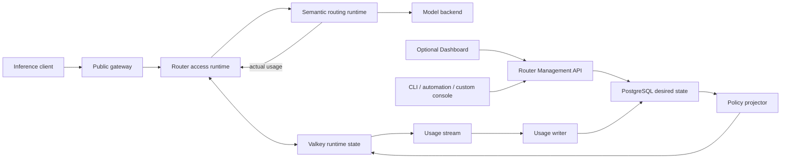

> **Status:** Proposal · **Created:** 2026-08-22

Normative appendices: [resources](./router-native-access-control-contracts), [Model runtime](./router-native-access-control-model-runtime), [quota runtime](./router-native-access-control-quota-runtime), [Management API](./router-native-access-control-management-api), [authorization](./router-native-access-control-authorization), and [deployment](./router-native-access-control-deployment).

## Problem

Inference access is a Router responsibility. Because clients call it without the Dashboard, authentication, visibility, quota, and accounting cannot depend on a Dashboard process.

The current Dashboard backend owns proxy, key checks, quota, and authoritative tables. That creates four structural problems:

- bypassing the Dashboard bypasses the policy boundary;
- Dashboard availability becomes inference availability;
- multiple Router replicas do not share one authoritative enforcement state; and
- another console or automation client cannot manage the same product contract
  without depending on Dashboard internals.

The design must support at least 10,000 API keys with independent model visibility and quota. That state must not expand into Router YAML, gateway routes, xDS, ConfigMaps, or one custom resource per key, which would couple every mutation to configuration distribution and reloads.

## Decision summary

This proposal makes the following decisions:

1. Semantic Router owns the public inference access boundary and the versioned
   Management API.
2. PostgreSQL is the authoritative desired-state store for identities, keys,
   policies, Models, Recipes, Entrypoints, usage, and audit.
3. Valkey or Redis is the applied runtime store for credential projections,
   compiled policies and routing snapshots, global counters, settlement idempotency,
   and the durable usage-ingestion stream.
4. The Dashboard is an optional Management API client. It never registers or
   proxies public inference routes and never reads access-control tables directly.
5. Managed mode uses PostgreSQL as its only desired-state authority; Router YAML and
   Kubernetes resources contain infrastructure bootstrap only. Standalone mode may
   use one local routing manifest compiled by the same validator/snapshot compiler,
   but exposes no dynamic routing or access Management mutations.
6. API-key authentication, model discovery, invocation authorization, and quota
   admission use the same compiled effective policy.
7. Request counts are admitted before inference. Token quotas use authoritative
   response usage only: the current request may cross a token limit, and the next
   request is blocked.
8. An Entrypoint is the callable Mixture-of-Models. Model assignment belongs to an
   Entrypoint action; there is no separate ModelPool, Mixture, or model-bindings
   resource API.
9. Default standalone Docker requires neither PostgreSQL nor Valkey. Managed mode
   requires both stores even if API-key enforcement is off, and enabling access
   requires managed mode. Kubernetes uses the same modes and semantics.
10. This is a replacement architecture. Existing Dashboard-owned enforcement and
    old static rate-limit provider shapes are removed after one explicit data
    migration; they are not retained as compatibility paths.

## Goals

- Enforce API-key authentication and authorization on every public inference path.
- Keep `GET /v1/models`, invocation, Playground, and direct-model testing consistent.
- Make key disable, expiry, grant reduction, and quota reduction globally effective
  across Router replicas without configuration reloads.
- Support reusable policies and a distinct policy per key without request-time SQL
  joins.
- Support exact rolling RPM, actual-token and actual-cost quotas, daily windows, and
  concurrency through one extensible rule model.
- Preserve complete per-request accounting for streaming, non-streaming, and
  multi-dispatch Mixture-of-Models execution.
- Expose stable OpenAPI contracts so the Dashboard, CLI, automation, and independent
  consoles have equal management capability.
- Keep the Docker deployment small while preserving a direct path to stateless
  Kubernetes scale-out.
- Make failure and consistency semantics visible in APIs, health endpoints, and the
  Dashboard.

## Non-goals

- Storing inference API keys in static Router configuration or Kubernetes objects.
- Making the Dashboard an inference proxy, policy engine, or source of truth.
- Using inference credentials as management credentials.
- Conflating inference credentials with the separately encrypted
  ProviderCredentials used by the Router to call model backends.
- Choosing or scheduling a physical model replica; access grants target logical
  Router resources.
- Treating the analytics ledger as the source of live quota remaining.
- Providing an in-memory or SQLite enforcement mode with different quota semantics.
- Hiding approximate rate-limit algorithms behind labels that imply exact windows.

## Product and trust boundaries

The following diagram is managed mode. Standalone omits Dashboard, Management,
PostgreSQL, Valkey, projector, and writers and loads one locally compiled routing
snapshot before serving.



| Component | Owns | Must not own |
| --- | --- | --- |
| Public gateway | Listener, transport filtering, access-service calls, and forwarding | API-key records, policy compilation, quota state, or usage truth |
| Router access runtime | Credential verification, trusted principal context, grants, admission, settlement, and global quota decisions | Browser sessions or Dashboard presentation state |
| Router routing runtime | Entrypoint resolution, signals, projections, decisions, algorithms, plugins, and backend dispatch | Management identity authentication or mutable policy storage |
| Router Management API | Versioned CRUD, effective-policy evaluation, policy publication, usage queries, and audit | Public inference proxying |
| PostgreSQL | Authoritative identities, routing resources, policies, revisions, ledger, rollups, and audit | Per-request hot-path reads |
| Valkey/Redis | Applied credential/policy projections, compiled routing snapshots, global counters, idempotency, and ingestion stream | Long-term analytics or the only copy of desired state |
| Dashboard | Product UX over the Management and inference APIs | Direct database access or a required data-plane hop |

One Router image can expose the ExtProc gRPC service, internal authentication and
quota gRPC services, Management HTTP, health, and metrics. When managed access is
enabled, every ingress adapter executes access authentication, authorization, and
quota admission before semantic ExtProc. After verification, the Router removes the
inference `Authorization` header; backend dispatch injects a separate
ProviderCredential. No access-enabled adapter may bypass the shared `AccessRuntime`.
Standalone and managed routing-only modes do not start `AccessRuntime`; their public
discovery and invocation paths still share the same Entrypoint resolver and active
routing snapshot.

### Two identity planes

Management identity and inference identity are intentionally different:

- A **ManagementPrincipal** authenticates to the Management API through OIDC,
  mTLS, or a service account. Its ManagementRole controls administrative actions.
- A Router **User** consumes model service. It may belong to teams and own API keys.
- A Dashboard account is one possible login UX for a ManagementPrincipal. It may be
  linked to one Router User, but the link is explicit rather than inferred from an
  email address.
- An **InferenceAPIKey** authenticates only to public inference APIs unless an
  explicit, separately issued management credential says otherwise.

This keeps Dashboard roles, Management roles, Team roles, and routing roles from
sharing an ambiguous `role` field.

## Terminology

| Term | Meaning |
| --- | --- |
| `Namespace` | The top-level isolation boundary for management, policies, routing resources, and analytics. |
| `DashboardAccount` | Optional browser-login identity and session UX; never an inference principal or Router authority by itself. |
| `ManagementPrincipal` | An actor authorized to call Management APIs. |
| `ManagementRole` | A permission preset scoped through a Management role binding. |
| `ServiceAccount` | A non-human ManagementPrincipal used by automation. |
| `User` | A model-service consumer identity owned by the Router control plane. |
| `Team` | A collection of Users with defaults and optionally shared hard caps. |
| `TeamMembership` | A User's membership and TeamRole in one Team. |
| `TeamRole` | Membership authority inside one Team; independent of ManagementRole. |
| `RoutingRole` | A typed routing-context value derived from Router-owned subject state; it grants no Management capability. |
| `InferenceAPIKey` | A stable logical key resource used for ownership, policy, usage, and URLs. |
| `APIKeyCredentialVersion` | One secret version for an InferenceAPIKey; rotation creates another version. |
| `DelegatedInferenceSession` | A short-lived session linking a Management session, User, and permitted logical key. |
| `DelegatedInferenceCredential` | The non-revealable Bearer secret issued for one DelegatedInferenceSession. |
| `AccessPolicy` | A reusable set of explicit discover/invoke grants. The Dashboard may label it **Access Group**. |
| `RateLimitPolicy` | A reusable ordered set of quota rules. The Dashboard may label it **Budget**. |
| `AccessPolicyBinding` | Attaches an AccessPolicy to a key, User, or Team; it owns no quota counter. |
| `RateLimitBinding` | Attaches a RateLimitPolicy to a key, User, or Team and owns its counters. |
| `ModelGrant` | Permission on a stable Entrypoint or Model identifier. |
| `QuotaCounter` | Live enforcement state in Valkey. |
| `UsageEvent` | An immutable accounting fact persisted in the analytics ledger. |
| `ProviderCredential` | A secret used by the Router to call a backend; never an inference key. |
| `TenantContext` | Router-issued trusted request identity and policy context. |

The existing routing `authz` signal remains a signal. It may consume a verified
TenantContext as a routing fact, but it does not authenticate API keys or authorize
models.

## Routing resource boundary

This section defines the proposed v0.4 contract. The implemented v0.3 contract
remains documented separately until this proposal ships, after which v0.4 replaces it
without a runtime compatibility branch.

Only three persistent routing concepts are needed:

- **Model**: a logical model with one or more physical backend references.
- **Recipe**: reusable signals, projections, decisions, algorithms, and plugins.
- **Entrypoint**: a callable virtual model whose rule selects a Recipe and assigns
  Models to that Recipe's stable decision IDs.

An Entrypoint is the product's Mixture-of-Models. A model pool is only the derived
union of Models in the Entrypoint's assignments and is never a stored resource.
Every resource and Recipe decision has an immutable UID plus a mutable human-facing
name. References and grants use UIDs; YAML import must persist or deterministically
assign them before publication.

```yaml
models:
  - id: mdl_fast
    name: local/fast
  - id: mdl_balanced
    name: local/balanced
  - id: mdl_frontier
    name: remote/frontier
  - id: mdl_vision
    name: local/vision

recipes:
  - id: rcp_balance
    name: balance
    decisions:
      - {id: dec_simple, name: Simple}
      - {id: dec_medium, name: Medium}
      - {id: dec_complex, name: Complex}
      - {id: dec_agentic, name: Agentic}
      - {id: dec_omni, name: Omni}

entrypoints:
  - id: ep_blend
    name: blend
    model_names:
      - vllm-sr/blend
    rules:
      - id: rule_default
        name: default
        matches: []
        action:
          recipe_id: rcp_balance
          assignments:
            dec_simple:
              - model_id: mdl_fast
            dec_medium:
              - model_id: mdl_balanced
            dec_complex:
              - model_id: mdl_frontier
                use_reasoning: true
            dec_agentic:
              - model_id: mdl_frontier
            dec_omni:
              - model_id: mdl_vision
```

The UI may hide a sole `default` rule. A decision that requires several Models has
several ordered assignment entries. Decision display names may change; assignments
reference stable decision IDs.

In managed mode, PostgreSQL owns Model, Recipe, and Entrypoint desired state. Draft
Models and Recipes can be edited independently, but they do not enter the data plane.
Publishing an Entrypoint validates the complete referenced chain, compiles a
content-addressed routing snapshot, stages it in Valkey, and atomically advances the
namespace routing pointer only after every active Router replica can load it. Only
resources reachable from a published Entrypoint enter that snapshot.

In managed mode, YAML is an authoring/import manifest for the Management API, not a
second runtime source of truth. `vllm-sr routing import -f ...` creates or updates
desired resources with the same ETags, validation, outbox, and publication gates as
any custom console. Built-in Recipes are versioned artifacts installed through that
same path.

Standalone mode has no PostgreSQL, Valkey, dynamic access control, or routing
Management mutations. One local manifest is its sole routing authority and is
compiled into the identical immutable snapshot shape before readiness. Switching
between modes is an explicit export/import and restart, never live dual authority or
a runtime fallback.

Entrypoint-local rules can select a different Recipe or assignment set from trusted
claims without adding another resource layer:

```yaml
entrypoints:
  - id: ep_blend
    name: blend
    model_names: [vllm-sr/blend]
    rules:
      - id: rule_premium
        name: premium
        matches:
          - claim:
              name: routing_tier
              exact: premium
        action:
          recipe_id: rcp_balance
          assignments:
            dec_simple: [{model_id: mdl_fast}]
            dec_medium: [{model_id: mdl_balanced}]
            dec_complex: [{model_id: mdl_frontier, use_reasoning: true}]
            dec_agentic: [{model_id: mdl_frontier}]
            dec_omni: [{model_id: mdl_vision}]
      - id: rule_default
        name: default
        matches: []
        action:
          recipe_id: rcp_balance
          assignments:
            dec_simple: [{model_id: mdl_fast}]
            dec_medium: [{model_id: mdl_balanced}]
            dec_complex: [{model_id: mdl_balanced}]
            dec_agentic: [{model_id: mdl_balanced}]
            dec_omni: [{model_id: mdl_vision}]
```

Entrypoint matching and access authorization remain separate:

- AccessPolicy decides whether the caller may discover or invoke the Entrypoint.
- The Entrypoint resolver then selects one Recipe and assignment set from the trusted
  TenantContext and normalized inference path.
- Entrypoint rules never contain API keys, Users, Teams, quota, or another global
  grant table.

Routing claims have one authoritative source. In managed-access mode, a namespace
defines a bounded typed claim schema, and the Management API stores values against a
Key, User, or Team subject. Effective values resolve field by field at Key, then User,
then context Team; a Team-owned key resolves Key then owner Team. The policy projector
validates and compiles those values into the key's active Valkey projection, and AuthN
copies only that compiled set into the signed, request-bound TenantContext. Client
headers, request bodies, model names, Dashboard sessions, and provider responses can
never set or override them. A value controls routing only and never implies model
access or Management authority.

The initial schema permits at most 16 namespaced string, boolean, or bounded-integer
claims and exact comparisons. `routing_tier: premium` is an ordinary schema-validated
value, not a hard-coded header. Claim-schema or subject-value changes use their own
Management permission, revision, audit, and key-policy publication fan-out. Managed
routing-only and standalone modes have no authenticated subject source, so they reject
claim matchers at publication and use path rules or distinct Entrypoints instead.

The initial matcher surface is intentionally small: exact trusted-claim match, exact
path, and segment-aware path prefix. Raw client identity headers, query parameters,
regular expressions, arbitrary request bodies, and general expression languages are
not matchers. Matchers inside one rule are ANDed. More exact identity predicates
outrank fewer predicates, exact path outranks prefix, and a longer prefix outranks a
shorter prefix. Equally specific rules with different actions are rejected at
publication, so list order never changes routing.

The compiled resolver returns `matched`, `claimed_no_match`, `unclaimed`, or
`ambiguous`. A claimed Entrypoint with no matching rule returns the same
nondisclosing `404` as a forbidden or nonexistent model; it never falls through to
a default Recipe or concrete Model. Ambiguity fails publication and fails closed if
encountered at runtime.

The access layer grants `discover` and `invoke` on the Entrypoint UID. It does not
duplicate or mutate assignments. Recipe and Entrypoint CRUD remain separate in the
[Management API contract](./router-native-access-control-management-api).
`resolve` is a permission-checked dry run over path and, in managed access, an optional
subject context. A subject is required only for claim rules. Managed routing-only
evaluates path/default rules without a subject; standalone has no Management resolve.
Overrides are separately authorized simulations. The response reports outcome,
Recipe, assignments, and explanation without invocation. When access is enabled,
`GET /v1/models` first
applies AccessPolicy, then includes only Entrypoints whose resolver is visible for the
caller and optional `for_path`; invocation uses that same resolver. When access is
disabled, discovery exposes only published aliases from the active snapshot and
invocation uses the same resolver without credential policy. There is no
`/model-bindings`, `/model-pools`, or `/mixtures` API.

## Canonical resource and API contracts

The normative resource relationships, PostgreSQL schema, credential lifecycle,
policy inheritance, counter ownership, and Valkey projection live in the
[resource contract appendix](./router-native-access-control-contracts). Management
identity exchange, delegated inference, exact endpoints, and response rules live in
the [Management API appendix](./router-native-access-control-management-api).
Permissions, exact role presets, scope containment, and operation authorization live
in the [Management authorization appendix](./router-native-access-control-authorization).
In
particular:

- one logical InferenceAPIKey owns independently rotatable credential versions;
- Access selects Key, then User, then context-Team policy;
- quota selects one inherited allocation and additionally enforces explicit shared
  hard caps;
- reusable policy definitions never imply shared counters;
- counter identity is `binding_id + rule_id`;
- model grants use explicit stable Entrypoint or Model IDs; and
- the OpenAPI contract, not Dashboard internals, is the management product surface.

## Data-plane request flow

The following flow applies when managed access is enabled. Standalone has no
inference identity or quota resources and begins from its already compiled routing
snapshot.

1. The public gateway removes client-supplied identity and policy headers.
2. Router AuthN identifies an API-key or delegated-session credential by its public
   prefix, loads the corresponding Valkey projection, verifies HMAC in constant
   time, and checks credential/session, key, User, Team, membership, expiry, and deny
   barriers.
3. Router AuthZ loads the compiled revision and resolves the requested resource with
   the same evaluator used for discovery.
4. The Router creates a typed TenantContext containing only the admission ID,
   namespace, key, User, Team, compiled effective routing context, and policy revision.
   When it crosses a process boundary it is signed, audience-bound, and
   may start work only within a short window. Accepted work keeps an in-process
   principal for the request lifetime; the context is not reusable authentication.
5. Quota admission atomically checks every applicable rule and consumes known
   request/concurrency units.
6. Semantic routing resolves the Entrypoint rule, Recipe, and assignments, then
   journals each bounded dispatch intent before invoking the allowed backend path.
7. The dispatch journal and request-scoped ledger aggregate authoritative input and
   output usage across every backend dispatch made by the Recipe.
8. On terminal response, settlement atomically applies actual token usage, records
   idempotency, and appends the UsageEvent to the stream.
9. Response metadata identifies the limiting rule and whether the values are the
   admission snapshot or terminal settlement. Live detail remains in the Management
   API.

Invalid credentials return `401`. Valid credentials without resource access receive
the nondisclosing `404`. An enforced quota returns `429` with a bounded `Retry-After`.
An unavailable required runtime store returns `503`, not `429`.

## Global quota algorithms

Admission is one Valkey Function or Lua operation:

1. load the effective binding IDs and ordered rules;
2. remove expired rolling-window entries;
3. check every enforced request, token, calendar, concurrency, and hard-cap rule;
4. return a denial without consuming any counter if any rule fails;
5. consume RPM and concurrency only after every check succeeds; and
6. return the limiting rule's `limit`, `used`, `remaining`, and `reset_at`.

`sliding_log` provides exact "the last 60 seconds" semantics. Requests use a sorted
set of admitted request IDs. Token rules use timestamped settlement IDs with token
amounts and a running total maintained atomically while expired members are removed.

`token_bucket` or GCRA provides an explicit O(1) alternative for very high request
rates only. `calendar_window` handles day or month allocations with a named timezone.
The API and UI always show the selected algorithm and reset semantics.

Every HTTP attempt receives a Router-generated `admission_id`. Internal retries of
the same admission and request digest do not consume RPM twice; a conflicting reuse
is rejected and audited. A client `Idempotency-Key` avoids a second charge only when
the Router can return the stored terminal response without another dispatch;
otherwise a new HTTP attempt gets a new admission and is charged. A quota-denied
request consumes nothing. Once dispatched, an upstream failure consumes one request.
`Retry-After` reflects the latest reset among rules that denied admission.

All window timestamps come from Valkey server time, never a Router Pod or client
clock. Concurrency and pending accounting use an admission lease stored in a sorted
set by deadline. Long requests heartbeat the lease. Admission and settlement scripts
scan opportunistically, while a reaper atomically turns an expired, unsettled lease
into a persistent `unknown` fence. A lease never disappears by TTL alone.

## Actual-token accounting

Token limits never reserve a prompt estimate before inference:

```text
before request: check only already settled token usage
after response: settle authoritative provider-reported usage
crossing request: allowed to finish
next request: denied with 429 while the rule remains over limit
```

Actual-only overshoot equals the real token total of every admitted but unsettled
request. It has a calculable upper bound only when both `max_concurrency` and an
enforced per-request maximum charge for the corresponding metric exist. Output quota
needs a generated-token cap; input quota also needs request-body, model-context, and
multimodal-input bounds plus a bound on internal dispatch count; total quota needs all
of them. The Recipe validator must prove those bounds for a limited Entrypoint.
Strict zero-overshoot token admission would require an estimate or reservation and is
not claimed.

The Router requests usage from every streaming provider, normalizes provider wire
formats, and counts all internal Recipe dispatches. A multi-model external request
consumes RPM once and token quota once using the sum of its dispatch ledger. The
ledger pins Model pricing revisions and keeps per-dispatch token/cost breakdowns.

Settlement uses the Router-generated admission ID:

- the same admission ID and the same canonical usage is an idempotent success;
- the same admission ID with different usage is rejected and raises an accounting
  alert; and
- the first settlement updates every token counter, writes a settlement marker, and
  appends one request-level UsageEvent atomically.

Streaming settlement occurs before the terminal stream marker is committed. Client
disconnect does not cancel bounded upstream usage collection. Non-streaming,
streaming, and looper execution all pass through the same finalizer.

Pre-stream headers contain only admission-time limit/remaining/reset and declare
`x-ratelimit-snapshot: admission`; they exclude that response's tokens. Non-streaming
headers may carry terminal values after settlement. Streaming returns them in an
opt-in final event/trailer when supported, else via admission ID in quota/request detail.

The default `input_tokens`, `output_tokens`, and `total_tokens` meters count the
sum of authoritative backend usage across the dispatch ledger, so every routed model
token is charged exactly once. Optional `served_input_tokens`,
`served_output_tokens`, and `served_total_tokens` meter the canonical public
request/response separately; `cost` prices actual backend billing buckets.
A cache hit is known zero for backend tokens and may
settle stored canonical served usage when a served-token rule exists. A failure
proven to occur before inference is known zero. A normal backend response is known
actual. A partial generation, disconnect, or cache record without the usage required
by an applicable rule is unknown.

Every provider and short-circuit adapter emits one explicit usage state:
`known_zero`, `known_actual`, or `unknown`; absence of a wire field is never
interpreted implicitly. A backend that cannot produce valid authoritative usage is
not eligible for an enforced token-limited public Entrypoint. Unknown usage affecting
an `enforce` rule marks the lease unknown, fences those bindings, and makes subsequent
requests for that scope fail with `503` until reconciliation. Shadow-only unknown is
recorded as incomplete but never changes admission or availability. No estimated
value is silently mixed into an actual counter.

## Usage and audit pipeline

The same settlement operation performs:

```text
counter updates + settled marker + XADD usage-stream
```

Router usage workers consume with a consumer group and batch PostgreSQL writes. A
compact settlement table supplies global request-id idempotency while time-partitioned
event tables retain analytics. A stream item is acknowledged only after both records
commit. This is at-least-once delivery with exactly-once logical persistence.

Quota counters and the analytics ledger have different purposes:

- quota APIs read the live counter engine, never reconstruct `remaining` from usage;
- Usage pages query immutable events and verified rollups;
- audit records management actions, reveal, authentication anomalies, policy
  publication, and accounting faults; and
- optional request/response payload logging is a separate retention-controlled
  facility. Quota correctness never depends on payload logs or log scraping.

Raw usage tables are time-partitioned. One-minute rollups retain high-resolution
short-range charts; hourly and daily rollups serve long ranges. Queries select a
grain from the requested time range, return the grain in the response, and use
cursor pagination for raw logs. This keeps hundreds of Users and multi-terabyte token
totals usable without scanning raw history. An analytical sink or object archive can
be added later without changing enforcement.

## Desired-to-applied consistency

Every Management API mutation follows a revisioned outbox protocol:

1. validate the request and its `If-Match` revision;
2. in one PostgreSQL transaction, mutate desired state, increment the namespace and
   affected-resource revision, append an audit event, and append `policy_outbox`;
3. a projector claims outbox rows, compiles effective key policies or a complete
   routing snapshot, and atomically writes Valkey projections with
   compare-by-revision;
4. update the applied watermark only after all projection writes succeed; and
5. return the desired and applied revision in the mutation response.

Permission expansion, key creation, and quota expansion become usable only after the
new revision is applied. The API may wait for a bounded interval and return `200`
when applied, or return `202` with `state: pending` and an operation URL.

Restrictive mutations require a deny barrier:

1. commit a pending restrictive mutation and outbox record;
2. install the affected namespace, credential, key, User, Team, membership, grant,
   binding, or rule deny barrier in Valkey;
3. project the reduced policy;
4. activate and finalize the publication operation; and
5. remove the barrier only after the applied watermark reaches that revision.

The Management API does not report restrictive success until the barrier exists. If
Valkey is unavailable, the mutation remains pending or fails; it never claims global
enforcement. Reconciliation is idempotent and removes stale conservative barriers
only after proving the desired revision.

Projectors stage immutable per-key policy blobs and pending pointers. Each expansion
references a publication ID that remains inactive until every affected key is staged;
one shared publication gate then makes the complete expansion visible. Restrictions
install deny barriers before staging and retain them through activation. Active
pointers always select one complete old or new blob.

Outbox rows are ordered per aggregate and applied with revision compare-and-set.
Parallel workers may stage independent aggregates, but a contiguous namespace
watermark advances across a lower operation only when it is successfully applied,
superseded by a later fully applied revision, or explicitly rolled back in
PostgreSQL by a new applied revision. A merely `failed` operation blocks the
watermark and cannot release a deny barrier. Overlapping operations serialize
through their aggregate revision. Operation status, per-key applied revision,
publication state, and the contiguous watermark are distinct. PostgreSQL can rebuild
policy projections, but live quota state follows the separate recovery contract and
never becomes ready from a policy watermark alone.

Routing publication has its own contiguous watermark, replica acknowledgements, and
active snapshot pointer. An access expansion that grants a new or changed Entrypoint
waits for routing activation first. A routing restriction or deletion installs
resource deny barriers before the old snapshot can disappear. At activation, any
active replica that did not acknowledge the staged snapshot is forced out of
readiness; a new replica becomes ready only after loading the active snapshot. No
replica may observe an access grant whose referenced routing object is absent.

## Bootstrap, deployment, and recovery contract

The normative Router configuration, Docker-first stack, Kubernetes topology,
readiness, failure behavior, persistence guarantees, and Valkey catastrophic-loss
procedure live in the
[deployment appendix](./router-native-access-control-deployment). Standalone
deployments add no stores. Managed deployments use PostgreSQL and a shared highly
available single-writer Valkey; API-key access requires managed mode. Dashboard and
observability remain optional.

## Security properties

- The public gateway strips spoofable principal, Team, grant, quota, and revision
  headers before the Router creates trusted context.
- TenantContext is signed, short lived, request bound, and accepted only from the
  internal listener path.
- Inference Authorization, TenantContext, principal, Team, grant, and quota metadata
  are removed before backend dispatch; only a separate ProviderCredential is added.
- API-key HMAC pepper, reveal KEK, TenantContext signing key, provider credentials,
  and Management credentials have separate secret material and rotation lifecycles.
- Key lookup uses a public `kid`; authentication compares HMAC in constant time.
- Raw key reveal is optional, independently authorized, non-cacheable, and audited.
- Revocation and restrictive policy changes use deny barriers and fail closed.
- Management list and analytics queries are scope-filtered by the server, not only by
  Dashboard navigation.
- Access policy publication validates every Entrypoint, Model, decision ID, and quota
  partition before making a revision usable.
- Audit and telemetry redact Authorization, secrets, ciphertext, database URLs, and
  internal signed context.
- Public inference and private Management listeners have distinct exposure and
  authentication policies.

## Scale model

Ten thousand keys are a routine control-plane size:

- credential lookup is one indexed `kid` read from Valkey;
- compiled policies avoid request-time PostgreSQL joins;
- 2-4 KiB per compiled key is tens of MiB before datastore overhead;
- policy definitions are reusable while binding-owned counters prevent accidental
  sharing;
- list APIs use keyset pagination and bounded filters;
- usage writes are streamed and batched, not synchronous per-request SQL writes;
- raw usage is partitioned and charts use verified rollups; and
- key or policy mutations never modify gateway configuration or restart the Router.

Request rate, not key count, sets the Valkey capacity requirement. Operators size
Valkey from peak admissions, settlements, rolling-window cardinality, and the maximum
PostgreSQL outage backlog. Exact sliding logs consume memory proportional to events
inside the window; very high-rate policies should use an explicitly selected O(1)
algorithm when exact event history is not required.

## Deliberate tradeoffs and risks

- Actual-only token accounting permits concurrent in-flight overshoot; only the
  combination of concurrency and per-request generation caps gives a calculable
  upper bound, never a prepaid ceiling.
- Exact rolling windows consume memory proportional to events in the active window.
- The first production contract requires a highly available single-writer Valkey;
  arbitrary cross-slot clustered admission is not claimed.
- Revealable credentials increase the consequence of KEK or privileged-account
  compromise and therefore remain separately configurable and authorized.
- A Team or User policy edit can fan out to thousands of compiled key projections;
  batch throughput, lag, and deny barriers are product metrics.
- Stream persistence settings define a real durability/latency tradeoff.
- A terminal streaming settlement failure cannot retract content already delivered;
  the unknown fence prevents that ambiguity from spreading to later requests.
- Live quota and asynchronous analytics intentionally have different freshness; APIs
  expose `asOf`, applied revision, rollup freshness, and ingestion lag.
- Request logs may be sampled and retained briefly, but usage facts cannot be sampled.
- Per-key metric labels are forbidden; high-cardinality detail belongs in bounded
  Management queries over usage and audit stores.

## Migration and removal

This proposal does not add another layer beside the current Dashboard gateway. The
implementation migration is explicit:

1. Introduce Router-owned PostgreSQL schema, Valkey runtime contracts, Management
   OpenAPI, access modules, and routing snapshot compiler.
2. Add a one-time migration tool that reads current access Users, Teams,
   memberships, keys, Access Groups, Budgets, usage, and audit; writes the new
   normalized resources; re-encrypts revealable secrets; and verifies counts and
   effective-policy samples.
3. Translate Access Groups to AccessPolicies and Budgets to RateLimitPolicies. Fixed
   RPM/TPM/daily columns become rules. Existing model patterns are resolved once to
   explicit stable grants; unresolved selectors block migration.
4. Drain inference, wait for the longest old rolling request window, and require zero
   in-flight requests. Rebuild calendar token counters from durable usage by the new
   binding identity. If evidence is incomplete, require an audited cutover reset;
   never pretend the old `budget_id` counter can be losslessly split.
5. Import Models, Recipes, and Entrypoints into PostgreSQL; publish one validated
   routing snapshot, policy projections, reconstructed quota state, and a new runtime
   epoch before switching traffic. Runtime YAML is not retained as another authority.
6. Move every access-control and routing resource defined by this proposal to the
   single `/management/v1` OpenAPI in one versioned cutover. Existing unrelated
   Management-listener APIs retain their documented versions until separate
   proposals move them. Remove old `/api/v1/access-control/**`, `/self/**`, and any
   duplicate access or routing aliases for this scope.
7. Reconfigure the Dashboard to use only generated Management clients and the public
   inference listener. Logged-in Playground uses a short-lived delegated inference
   credential bound to the selected logical key; it has no proxy or quota exception.
8. Remove Dashboard registrations and proxy handlers for `/v1/models`,
   `/v1/chat/completions`, and `/api/playground/v1/**`.
9. Remove `dashboard/backend/accesscontrol/**`, Dashboard access middleware branches,
   direct model-user provisioning, old API clients, migrations, `ACCESS_CONTROL_*`
   settings, and secret ownership. No Dashboard package imports the Router access
   store or service.
10. Replace static `authz.providers` and `ratelimit.providers` enforcement with the
   single `global.services.access` contract. Rename backend secret injection to
   provider credentials. Keep the routing `authz` signal only as a consumer of
   trusted context. Remove process-local quota state, header-selected subjects, and
   best-effort or no-op token reporting.
11. Remove `global.services.authz.identity/providers`; move backend secrets to
    `ProviderCredential` resources referenced by backend bindings. No caller header
    may select or carry a provider secret.
12. Replace Entrypoint `model_bindings` with `rules[].action.assignments` across YAML,
    canonical config, schemas, DSL AST/parser/decompiler, managed Recipe documents,
    APIs, tests, and Dashboard forms. Remove any model-binding, model-pool, or mixture
    endpoint or projection.
13. Replace Dashboard-session trust with the standard Management identity exchange
    and principal-to-User link before enabling self-service.
14. Delete the migration tool and old schema only after backup retention and
    production receipts confirm the new contract. Runtime compatibility code is not
    retained.

Migration runs with public inference drained or in a bounded maintenance window. It
emits a non-secret report containing source/target counts, invalid resources,
policy-equivalence samples, credential verification samples, and usage totals.

## Validation matrix

| Area | Required validation |
| --- | --- |
| Credential lifecycle | Create, reveal permission, overlap rotation, expiry, disable, enable, renew, delete, concurrent revoke, and secret redaction. |
| Ownership | User-owned, Team-owned, context Team, membership removal, disabled owner, and one-of validation. |
| Model policy | Authenticated discovery, unauthenticated denial, Entrypoint invoke, forbidden/nonexistent nondisclosure, direct Model pinning, and candidate-model escape prevention. |
| Inheritance | Key override, User override, Team inheritance, override removal, shared counter ownership, and cumulative hard cap. |
| RPM | More than 12 requests in an exact rolling minute, boundary timestamps, concurrent admission, and idempotent retry. |
| Tokens | Actual input/output/total usage, crossing request allowed, next request denied, reset, overshoot bound only with concurrency plus generation caps, and unknown-usage reconciliation. |
| Execution shapes | Managed/standalone Model digest parity; defaults/bounds and Dashboard Advanced round-trip; only proven-pre-inference retry, no retry after a visible byte, total request/stream timeout; four exclusive billing buckets, cache inheritance, explicit zero/unpriced state, pinned historical price revision, cost crossing/unknown/completeness; and non-streaming, streaming, disconnect, fusion, workflow, and looper accounting. |
| Consistency | Staged expansion gate, restrictive deny barrier, routing snapshot acknowledgements, access/routing dependency order, contiguous watermarks, failed-operation blocking, overlapping mutations, lost projector, duplicate outbox delivery, policy-only rebuild, and stale revision conflict. |
| Replicas | Identical result from every Router replica with no sticky session and no local cache dependence. |
| Usage | Counter/ledger agreement, duplicate stream delivery, PostgreSQL outage backlog, rollup reconciliation, retention, and cursor pagination. |
| Docker | Standalone manifest with no stores, managed routing with access off, managed access, embedded/external stores, migration ordering, secret files, restart persistence, and optional Dashboard absence. |
| Kubernetes | Standalone manifest, managed HPA scale, routing revision rollout, Pod loss, migration Job, NetworkPolicy, Management isolation, store failover, projector contention, and PDB behavior. |
| Management RBAC | Every permission and subject scope at API level, including self-service and forbidden cross-Team queries. |
| Management identity | OIDC and local-issuer exchange, nonce replay, audience, expiry, principal linking, broker actor chain, invitation onboarding, session disable, and service accounts. |
| Delegated inference | Playground session creation/revocation, current-policy resolution, direct Model grant, counter sharing, usage attribution, and invalidation after key/User/Team/session disable. |
| Migration | Counts, policy equivalence, credential verification, quota cutover, usage totals, rollback backup, and proof that all old Dashboard access routes, packages, config, and proxies are absent. |

Performance gates use realistic policy cardinality: 10,000 keys, independent compiled
policies, hundreds of Users, multiple Team-shared counters, exact and O(1) rules, and
concurrent Router replicas. The benchmark reports p50/p95/p99 admission latency,
Valkey operations, memory per key and rolling event, projector throughput, usage lag,
and behavior during store failover.

## Acceptance criteria

- Every public inference endpoint rejects missing credentials when access is enabled.
- Dashboard removal or outage has no effect on inference authentication, discovery,
  invocation, quota, or accounting.
- `/v1/models` and invocation demonstrably use the same policy evaluator.
- A restrictive mutation is globally enforced before the API reports success.
- Exact RPM, actual-token, and actual-cost receipts match the live quota endpoint under
  concurrency and across replicas.
- Streaming and every internal Mixture-of-Models dispatch are accounted once without
  estimates or silent zero usage.
- A custom console can implement the complete product lifecycle using published
  Management OpenAPI only.
- A Dashboard cookie has no Router authority until a valid identity exchange, and
  Playground uses a short-lived delegated credential against the public inference
  listener with no proxy, shared key, or quota exception.
- Standalone `vllm-sr serve` adds no PostgreSQL or Valkey dependency; managed mode
  always declares both stores and access-enabled mode cannot start without them.
- Access-enabled Docker and Kubernetes use one semantic implementation.
- No API key, User, policy, usage event, or audit event is represented in Router YAML,
  gateway routes, xDS, ConfigMaps, or per-resource Kubernetes custom resources.
- No Dashboard-owned inference proxy or runtime compatibility branch remains.
- No Dashboard package imports a Router access store/service, and no old access API,
  model-binding field, header-selected identity, or process-local limiter remains.

## Related documentation

- [Unified Configuration Contract v0.3](./unified-config-contract-v0-3) documents the
  currently implemented routing configuration that v0.4 will replace.
- [API server](../api/apiserver) documents the existing Management listener surface.
- [Security hardening](../installation/security-hardening) defines baseline secret,
  listener, and production deployment practices.
- [Docker installation](../installation/docker) and
  [Kubernetes operator installation](../installation/k8s/operator) provide the
  current deployment entry points that this proposal extends.

## Open questions

- What default raw usage, request-log, and audit retention periods should ship for
  Docker and Kubernetes profiles?
- At what measured request rate should the product recommend `token_bucket` over exact
  `sliding_log`?
- Should revealable credentials be enabled by default or require an explicit operator
  choice at first deployment?
- What maximum usage-stream backlog gives the best default balance between a
  PostgreSQL outage window and fail-closed accounting?
