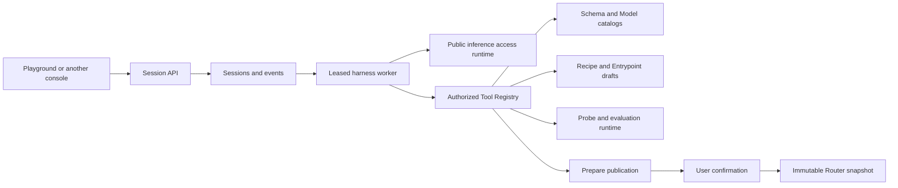

> **Status:** Proposal appendix · **Created:** 2026-08-23

This appendix is normative for the Playground harness and Builder experience in
[Router-Native Access Control and Quota Accounting](./router-native-access-control).
The Dashboard is an optional client. Session state, authorization, inference, tools,
evaluation, and publication are Router services that another console may use through
the same versioned APIs.

## Product contract

Playground has two explicit modes over one session kernel:

- **Chat** calls an authorized Model or Mixture-of-Models and may use the approved
  general-purpose tool set.
- **Builder** turns a natural-language routing goal into a validated Recipe and
  Entrypoint, tests it, and asks for one explicit confirmation before publishing.

Every conversation is one durable session. Chat and Builder share the same turn,
event, cancellation, checkpoint, tool, and inference loop. A mode selects a bounded
capability policy; it does not select another Agent implementation. Every model step
is a standard streaming OpenAI-compatible `/v1/chat/completions` request through the
ordinary public inference listener. Final usage and safe routing/request metadata are
recorded on the completed model step. Only Builder receives routing mutation tools
and the publication approval contract.

Builder lives in the Playground composer menu and uses authenticated Router Agent
sessions, the canonical Recipe store, and the public inference path. Users choose an
authorized connected Model or Mixture-of-Models as the Agent's reasoning target,
describe the workload, and keep one durable conversation while the Agent inspects
current Router capabilities, edits a draft, runs probes and evals, and prepares a
publication.

The visible experience is intentionally small: a conversation, a target selector,
quiet progress rows, the current draft summary, and one final review. System
complexity remains behind typed tools and durable execution.

## Architecture



The harness worker is part of the Router control plane when session services
are enabled. Docker does not require an extra Agent container. Kubernetes may
run workers in the Router Management deployment or in a separately scaled
deployment using the same binary, queue, lease,
and authorization contract. PostgreSQL owns the durable queue, lease, monotonic fence,
event sequence, checkpoint, and cancellation flag. Valkey may accelerate wakeups,
cancellation fan-out, and resumable streams, but never becomes a second lease authority.
Dashboard failure does not interrupt a running turn.

Every harness model call traverses the ordinary public inference runtime with a
short-lived delegated credential. It receives the same Model visibility, RPM/TPM,
token and cost quotas, request logs, actual usage settlement, and Team/User scoping as
a direct API request. The Agent cannot invoke a hidden backend or use a Dashboard
credential as an inference key.

Agent bootstrap names that front door explicitly:

```yaml
global:
  services:
    agent:
      public_inference_endpoint: https://inference.example.com/v1/chat/completions
```

The value is operator-owned process configuration and must resolve to the ordinary
public Envoy listener. It is not routing desired state, cannot be supplied by a Tool
Source or Dashboard request, and is never inferred from a physical backend address.
Missing or ambiguous endpoints fail Agent startup validation.

## Resources

### Mode policy

Chat and Builder each resolve one Router-owned mode policy:

```yaml
mode: builder
minimum_target_capabilities: [text, tools, streaming]
skills: [recipe-designer]
tool_policy:
  allow:
    [
      router.catalog.*,
      router.skills.read,
      router.recipe.*,
      router.entrypoint.prepare,
      router.publish.prepare,
    ]
approval: required
```

A user selects the exact authorized Model or Entrypoint when starting a session. The
policy may require capabilities such as tools, images, or streaming and pins skill
revisions, tool policy, maximum turn duration, maximum tool steps, context budget,
and approval policy. It never embeds connection information or a Provider credential.
Mode policies are an internal safety mechanism, not a collection of user-created
Agents or a first-class Dashboard resource.

### Skill

A Skill is a versioned, trusted instruction bundle with a short name, description,
and full instructions loaded only when selected. Built-in skills are immutable and
shipped with the Router. Namespace skills are text-and-schema assets, never arbitrary
server-side executables. Each revision is content-addressed, size-bounded, audited,
and may declare required tools and minimum capabilities.

The model receives only the available skill names and descriptions initially. The
full skill is loaded through `router.skills.read` when needed. This keeps the stable
prompt small and allows Router capabilities to evolve without rebuilding a giant
prompt.

### Tool and Tool Source

A Tool has a stable name, description, JSON Schema input/output, required Management
permission, read/write classification, timeout, and idempotency behavior. Tool
definitions come from one immutable registry revision per Agent turn.

Tool Sources are:

- Router-native application services;
- reviewed built-in integrations; and
- namespace-managed remote tool connections.

The Dashboard exposes **vLLM-SR Agent** as the unified settings surface for Skills,
Tools, and tool connections. A remote connection is one Tool Source, not another
Agent. Its URL, transport, authentication reference, egress
policy, health, and discovered tool revision are managed by the Router. Secrets use
the Router credential-vault contract and never enter Agent context, tool arguments,
Dashboard storage, or logs.

Remote Tool Sources are an explicit trust boundary. A discovered tool receives a
stable source-qualified name and an immutable discovery digest. New or changed
remote tools remain unavailable until an authorized operator approves that exact
digest; a profile wildcard cannot silently grant a newly discovered write or execute
tool. Schemas compile locally with bounded size and depth, no network resolution,
and no remote references. Descriptions and results are treated as untrusted data,
not instructions, and cannot modify the turn's permissions, target, approval state,
or registry revision.

The remote transport supports bounded HTTPS streaming only. It validates scheme,
host, resolved addresses, ports, redirects, and DNS changes against the Tool Source
egress policy on every connection. Private and link-local addresses are denied by
default. Credentials are resolved at execution time, injected after serialization,
and redacted from errors and observability. There is no Router-side shell or stdio
transport for namespace-managed sources.

### Session, Turn, Event, and Artifact

An `AgentSession` binds namespace, actor, effective subject, one selected eligible
API key, exact execution target, mode-policy revision, mode, and current working
Recipe/Entrypoint references. `POST /agent-sessions` requires that key ID; the Router
rechecks ownership, Team context, target discovery/invocation, and delegation
authority in the same transaction that creates the short-lived delegated inference
identity. The key therefore drives catalog visibility, inference authorization,
quota, usage, and logs for the whole session. Every Session view returns the
credential-free key ID so a resumed client presents the same effective catalog; it
never returns the delegated credential. Closing the session revokes that credential.
The session survives browser, Dashboard, and Router replica restarts.

An `AgentTurn` is one user instruction and has `queued`, `running`, `waiting_approval`,
`completed`, `failed`, or `cancelled` state. Only one worker lease generation may
append model/tool output for a running turn. Duplicate create requests with the same
idempotency key return the existing turn.

`AgentEvent` is append-only and ordered by a per-session sequence. Event types cover
user input, assistant semantic deltas, tool request, tool result, progress, context
checkpoint, approval request, approval result, cancellation, and terminal state.
Secrets, raw credentials, hidden reasoning, and unrestricted upstream error bodies
are never events.

Large probe/eval results are bounded `AgentArtifact` values in PostgreSQL with digest,
media type, safe preview, retention, and authorization metadata. No object store is a
required dependency. A future artifact backend may implement the same interface
without changing sessions or public APIs.

## Stable prompt and dynamic context

The stable system prompt contains only:

- the Agent's role and user-visible objective;
- the draft → validate → probe/eval → review workflow;
- the rule that Router state and schemas must be inspected rather than guessed;
- tool safety, authorization, and error-recovery behavior;
- a ban on secret collection or disclosure; and
- the requirement that publication needs explicit user confirmation.

Everything that changes at runtime is a tool result:

- installed Signals, Projections, Decisions, Algorithms, and Plugins;
- their current JSON Schemas, constraints, examples, and compatibility metadata;
- connected Models and visible capabilities;
- built-in Recipe examples and revisions;
- current draft, compiler diagnostics, topology, probe results, and eval results; and
- installed Skills and Tools.

Dynamic catalogs are paginated and revisioned. A turn pins the catalog revision that
produced its plan; any write against a changed revision receives a typed conflict and
the Agent must refresh. There is no hard-coded list of Signal types or Provider
products in the prompt or Dashboard.

The component catalog is projected directly from the Router's authoritative
authoring types. Directory pages carry only names and concise descriptions; an exact
kind-and-name lookup returns one bounded JSON Schema. The
projection deliberately removes compiler-owned IDs, physical Model selection,
connection fields, credentials, backend URLs, filesystem paths, and runtime-only
state. Adding a component without an explicit safe authoring projection fails Router
startup instead of publishing an incomplete or overly broad schema.

## Router-native Builder tools

The initial tool family is deliberately small:

| Tool                        | Purpose                                                                           | Class   |
| --------------------------- | --------------------------------------------------------------------------------- | ------- |
| `router.catalog.describe`   | Read current component schemas and compatibility constraints                      | Read    |
| `router.skills.read`        | Load one authorized Skill at the exact revision pinned by the session mode policy | Read    |
| `router.models.list`        | List authorized connected Models and semantic ModelCards                          | Read    |
| `router.recipes.examples`   | Read relevant built-in examples without credentials or assignments                | Read    |
| `router.recipe.get`         | Read the selected draft and ETag                                                  | Read    |
| `router.recipe.prepare`     | Create a Recipe draft or update one exact draft revision                          | Write   |
| `router.recipe.validate`    | Compile and return structured diagnostics and topology                            | Read    |
| `router.recipe.probe`       | Run bounded multilingual, modality, and boundary probes                           | Execute |
| `router.recipe.evaluate`    | Run an authorized evaluation suite and store an artifact                          | Execute |
| `router.entrypoint.prepare` | Create or update an Entrypoint draft with explicit Model assignments              | Write   |
| `router.publish.prepare`    | Return the exact diff, diagnostics, revisions, and digest requiring approval      | Write   |

There is intentionally no model-callable `router.publish.commit` tool. After the
Agent reaches `waiting_approval`, the UI renders the exact plan and the human invokes
the ordinary Management publication endpoint. That endpoint reauthorizes the user,
requires the plan digest and current ETags, rejects expired or changed plans, and
publishes exactly what was reviewed. The Agent cannot interpret an affirmative chat
message as authorization.

`router.skills.read` cannot browse arbitrary revisions. It resolves only a Skill
reference already pinned by the session mode policy, verifies its digest, and returns a
bounded instruction document. This preserves progressive disclosure without turning
the stable prompt into a copy of every installed Skill.

Tools call application services directly under the turn's typed authorization
context; they do not bypass policy through loopback HTTP. The same operations remain
available as versioned Management APIs so another console or Agent harness can build
the identical workflow.

## Draft and publication lifecycle

Recipe authoring remains model-free. A draft contains Signals, Projections,
Decisions, Algorithms, and Plugins. The Agent may create those resources only inside
the selected Recipe draft, using current schemas and optimistic concurrency.

An Entrypoint draft names the Recipe revision and assigns one or more connected
Models to each Decision, including weights, priority fallback, and capability checks.
It becomes callable only when:

1. the Recipe compiles into at least one complete path;
2. every reachable Decision has valid Model assignments;
3. required modality, tools, reasoning, context, protocol, retry, and pricing
   capabilities are satisfied;
4. required probes pass;
5. configured evaluation gates pass;
6. the publication plan still matches all pinned revisions; and
7. an authorized human confirms the immutable plan.

Partial drafts stay in PostgreSQL and never enter Router YAML, Valkey projections,
Envoy configuration, or an active snapshot. Publishing uses the same transactional
outbox and rollout acknowledgement as every Management mutation.

## Durable execution and context continuity

The worker claims a turn with a short lease and monotonically increasing fencing
token. It checkpoints after each model output boundary and tool result. A replacement
worker may resume only from the latest committed sequence and cannot append with an
old fence. Tool executions use deterministic invocation IDs; an idempotent tool
replays its stored result, while a non-idempotent unknown outcome pauses for review
rather than executing twice.

Clients consume typed events over SSE and resume with the last sequence number.
Disconnecting the browser does not cancel a turn. Explicit cancellation is
idempotent, propagates to the in-flight inference/tool context, and writes one terminal
event. Heartbeats do not extend configured turn or tool deadlines.

When context approaches the pinned target limit, the worker creates a versioned
checkpoint containing a bounded summary, unresolved goals, current draft references,
tool result references, decisions made, and provenance to retained events. The
original events remain durable until retention expires. A new turn loads the latest
checkpoint plus subsequent events and verifies referenced resource revisions. Silent
loss of an unresolved approval, failed tool, current ETag, or user constraint is a
context-continuity error, not permission to start over.

## Management API

All routes use the proposal's `/management/v1` media type, opaque cursors, ETags,
idempotency keys, typed permissions, and namespace scope:

```text
GET|POST        /management/v1/agent-skills
GET|PATCH|DELETE /management/v1/agent-skills/{skill}
GET              /management/v1/agent-tools
GET|POST          /management/v1/agent-tool-credentials
GET|PATCH|DELETE  /management/v1/agent-tool-credentials/{credential}
POST              /management/v1/agent-tool-credentials/{credential}:rotate
GET|POST          /management/v1/agent-tool-sources
GET|PATCH|DELETE  /management/v1/agent-tool-sources/{source}
POST              /management/v1/agent-tool-sources/{source}:test
POST              /management/v1/agent-tool-sources/{source}:approve
GET|POST           /management/v1/agent-sessions
GET|PATCH|DELETE   /management/v1/agent-sessions/{session}
GET                /management/v1/agent-sessions/{session}/turns
POST               /management/v1/agent-sessions/{session}/turns
GET                /management/v1/agent-sessions/{session}/events
POST               /management/v1/agent-sessions/{session}/turns/{turn}:cancel
GET                /management/v1/agent-artifacts/{artifact}
GET                /management/v1/agent-artifacts/{artifact}/content
POST               /management/v1/publication-plans/{plan}:commit
```

Event streaming supports `Last-Event-ID` and an `afterSequence` sequence. Listing endpoints
are keyset-paginated and server-filtered. Mutation responses return current ETags.
The OpenAPI artifact is generated from the Router contract and the Dashboard uses the
generated client; Dashboard handlers do not mirror or reshape Agent resources.
Artifact detail returns only bounded metadata and `safePreview`. Raw retained bytes
are available from the separately authorized, no-store `/content` operation and are
never prefetched by transcript clients.

Permissions remain composable rather than inventing one super-role:

- `agent.read`, `agent.use`, and `agent.manage`;
- `tool.read`, `tool.invoke`, and `tool.manage`;
- `routing.read`, `routing.manage`, `evaluation.run`, and `routing.publish`; and
- ordinary scoped inference and Usage permissions.

Tool invocation checks both `tool.invoke` and the tool's underlying permission.
Read-only users may chat and inspect their own sessions when granted, but cannot
obtain Builder mutation tools. Team-scoped users see only
their effective Models, evals, usage, and artifacts.

## Dashboard experience

The Playground `+` menu adds **Builder**. Entering it preserves the current account
and session but starts a Builder session with a visible Agent target selector. The
selector groups Mixture-of-Models first and, for authorized operators, Single Models
after a restrained divider. Unavailable targets explain the missing permission or
capability without leaking hidden Model names.

The conversation sidebar is compact, collapsible, searchable, and ordered by recent
activity. It shows title, mode, and time only; destructive actions appear in a small
context menu. The main surface retains generous whitespace and one clear composer.
Tool activity uses monochrome status rows with one subtle theme accent for the active
step. Completed rows collapse to a concise verb and result; errors remain actionable.
There are no saturated per-tool colors, pulsing ornament, nested page frames, or raw
JSON unless the user opens details.

The final review shows Recipe topology, assignments, changed resources, probe/eval
results, and any warnings in one consistent modal. **Publish** is enabled only when
the plan is ready and the current user has `routing.publish`. After commit, the new
Mixture-of-Models appears through the ordinary authorized `/v1/models` discovery
path; Builder does not patch local UI state to pretend activation succeeded.

The **vLLM-SR Agent** settings page uses the same page banner, tables, centered
detail modals, fields, buttons, pagination, keyboard behavior, and icon system as the
rest of the Dashboard. Skills, Tools, and Connections are the only tabs. Internal
mode policy and protocol terminology are not exposed as product navigation.

## Failure semantics

- A missing target, revoked grant, exhausted quota, or disabled key stops before the
  next model call and exposes a concise recoverable status.
- A catalog or draft ETag conflict refreshes state and asks the Agent to reconcile;
  it never overwrites another editor.
- A tool timeout records a typed result and follows the profile's bounded retry rule;
  write tools are not retried without proven idempotency.
- Worker loss resumes from the last committed event under a new fence.
- Valkey notification loss falls back to PostgreSQL polling; delegated inference still
  fails closed when the shared access/quota runtime is unavailable.
- Publication rollout failure leaves the prior snapshot active and the reviewed plan
  failed; it never reports the candidate as callable.
- A client refresh or Dashboard deployment cannot lose a running turn or approval.

## Required conformance

CI uses deterministic model and tool fixtures to cover authorization, schemas,
idempotency, lease fencing, resume cursors, cancellation, compaction, ETag conflicts,
tool failures, quota settlement, publication confirmation, and model discovery.
Browser tests cover keyboard navigation, responsive layout, sidebar state, target
visibility, restrained tool events, review, and reconnect without duplicate output.

The remote acceptance scenario uses an authorized GLM-class reasoning Model as the
Builder target and must:

1. start a Builder session in Playground;
2. discover the live component schemas, built-in examples, and connected Models;
3. create and iteratively tune a model-free Recipe from natural language;
4. assign compatible Models through an Entrypoint;
5. run multilingual, tool-use, routing-boundary, and image probes plus configured
   evaluation gates;
6. survive at least one browser reconnect and one Router worker restart;
7. present an immutable publication review and wait for explicit confirmation;
8. publish through the Management API;
9. discover the new Mixture-of-Models in Playground and authorized `/v1/models`; and
10. call it through streaming and non-streaming public APIs with correct logs, usage,
    cost, and quota settlement.

Production rollout requires that scenario to pass entirely through versioned
Management and public inference APIs, auditable credential delegation, and the atomic
publication transaction.

## Deliberate simplicity

Users see Skills, Tools, conversations, and one Builder workflow. Internally
every client shares one session log, one lease protocol, one Tool Registry, one
delegated inference path, one Recipe store, and one publication transaction. Human
confirmation owns publication, and the public inference runtime owns quota settlement.
