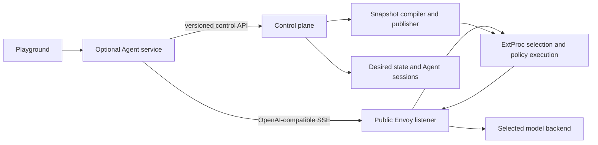

> **Status:** Proposal appendix · **Created:** 2026-08-23

This appendix is normative for Playground Chat and Builder in
[Access Control and Quota Accounting](./router-native-access-control). The Agent is an
optional control-plane application. It is not a Router feature, ExtProc phase, Envoy
filter, or Router Management API family.

## Decision

Playground has two modes over one small Agent kernel:

- **Chat** streams a normal conversation and may use the approved general-purpose
  tool set.
- **Builder** adds routing-authoring tools, probes, evaluation, and an explicit review
  before publication.

Every conversation is one session. A mode changes the available instructions and
tools; it does not create another Agent type or persistent Agent profile. The product
does not expose an Agent fleet, Agent templates, or a second routing abstraction.

The Agent service is optional and belongs beside the reference control plane. Every
model step is a standard streaming OpenAI-compatible request to the public Envoy
listener. Every routing read or mutation is a versioned control-plane API call. The
Agent never imports Router runtime packages, opens Router databases, invokes a
physical backend, or publishes a data-plane snapshot itself.

Removing Dashboard and Agent components leaves public inference, authentication,
authorization, quota, routing, streaming, and usage accounting intact. A custom
console may implement its own Agent or omit one completely.

## Product boundary



| Component | Owns | Must not own |
| --- | --- | --- |
| Browser | Conversation UX, target choice, event rendering, approval interaction | Tool secrets, policy evaluation, direct backend access |
| Agent service | Session loop, context, tool execution, SSE events, artifacts, Builder draft coordination | Inference routing, API-key enforcement, Router snapshots, Envoy clusters |
| Control plane | Dashboard identity, Agent authorization, tools and Skills, routing desired state, validation, evaluation jobs, publication | Public inference proxying or request-time enforcement |
| Envoy | Public HTTP lifecycle, streaming, transport policy, upstream dispatch, health, retries and timeouts allowed by the compiled plan | User/Team/key CRUD, semantic selection, Agent sessions |
| ExtProc | Entrypoint resolution, semantic selection, compiled API-key/authz/quota execution, request and response accounting evidence | Agent loop, tool execution, product directory, policy authoring or publication |

The Agent may be linked into the Dashboard backend binary for the smallest Docker
experience or run as a separately scaled worker. That packaging choice does not move
its API or state into the Router. `vllm-sr serve` without the optional control-plane
stack starts no Agent worker and requires no Agent database tables.

## One kernel, two modes

The kernel owns only these mechanics:

1. load one authorized session and its bounded transcript;
2. assemble the stable mode instruction plus dynamic capability context;
3. call the chosen authorized Model or Entrypoint through `/v1/chat/completions` with
   `stream: true`;
4. validate and execute an approved tool call;
5. append typed events and continue until a final answer, explicit approval, cancel,
   or bounded limit; and
6. persist the terminal model usage and public response metadata returned by Envoy.

Chat and Builder share turn ordering, cancellation, context compaction, model calling,
tool-call validation, and event streaming. Builder only enables additional tools and
the draft/publication state machine. There is no hidden direct model client and no
mode-specific wire protocol.

The initial limits are deliberately small and explicit: one active turn per session,
a bounded number of model/tool steps per turn, a total turn deadline, a maximum tool
result size, and a bounded transcript projection. Long-running evaluation becomes a
control-plane job referenced by the session rather than keeping an HTTP request open.

## Standard inference contract

The Agent's inference client implements the public OpenAI-compatible contract:

```http
POST /v1/chat/completions
Authorization: Bearer <short-lived delegated inference credential>
Content-Type: application/json
Accept: text/event-stream
```

The request contains the user-selected authorized Model or Entrypoint, `stream: true`,
messages, and the current allowed tool schemas. The client consumes normal OpenAI SSE
chunks and the terminal usage record. Safe `x-vsr-*` response metadata may be attached
to the completed model step for Playground reveal. The Agent must not depend on an
internal Router response shape.

The delegated credential is minted by the control plane for the current Dashboard
member and selected inference identity. It is audience-bound, short-lived,
non-revealable, and resolves to the same key/User/Team policy and counters as a direct
API request. The Agent receives no broad service credential and has no quota bypass.

Consequently Chat and Builder calls appear in ordinary request logs, usage, cost,
rate-limit state, Team views, and API-key views. A direct API call and an Agent model
step have identical data-plane enforcement.

## Control-plane tools

Tools are adapters over public control-plane contracts or explicitly configured
external services. They are not Go calls into Router internals.

The built-in Builder set is intentionally narrow:

- `catalog.describe` returns current Signal, Projection, Decision, Algorithm, Plugin,
  Model, Recipe, and Entrypoint schemas from the control-plane catalog;
- `routing.read` reads authorized routing resources;
- `draft.validate` validates an isolated Recipe and Entrypoint draft without changing
  active state;
- `draft.probe` sends bounded examples through a control-plane evaluation job that
  ultimately uses the public inference path;
- `draft.evaluate` runs a named evaluation suite and returns a durable result ID;
- `publication.prepare` freezes the exact draft, dependencies, validation evidence,
  and expected base revisions into an immutable plan; and
- `publication.commit` applies only the exact approved plan through the control-plane
  API.

Read tools return typed, bounded results. Mutation tools require the same capability
the human API operation requires. Tool handlers propagate the session principal and
an idempotency key; they do not hold an administrator token. Every mutation and
publication remains visible in control-plane audit.

External Tool Sources use a connector interface owned by the optional Agent service.
Credential values are encrypted in the control-plane secret store, never returned to
the browser or placed in prompts, events, artifacts, logs, or Router snapshots.
Network egress follows an operator-owned allowlist and revalidates DNS and redirects.

## Skills and dynamic context

A Skill is versioned control-plane content containing instructions, optional examples,
and references to allowed Tool names. Skills do not contain executable code or secret
values. A session pins the revisions it uses so a running turn is reproducible.

The stable system instruction explains the two modes, safety limits, tool-call rules,
and publication approval boundary. Dynamic facts stay out of that prompt and come
from catalog/read tools:

- installed Signal, Projection, Decision, Algorithm, and Plugin schemas;
- connected Models and their public semantic metadata;
- built-in and user Recipes;
- authorized Entrypoints and current revisions; and
- evaluation suites available to the current namespace.

This keeps additions discoverable without rebuilding Dashboard prose or Router code.
The Agent cannot infer authority from a catalog result; every subsequent operation is
authorized independently by the control plane.

## Session and event model

The optional Agent service owns these resources in its control-plane schema:

- `AgentSession`: namespace, owner principal, mode, selected target, status, pinned
  Skill revisions, created/updated timestamps, and optimistic revision;
- `AgentTurn`: ordered user input, state, cancellation flag, deadline, failure, and
  idempotency key;
- `AgentEvent`: monotonic session sequence and a typed bounded payload;
- `AgentCheckpoint`: internal loop state needed to resume a leased turn; and
- `AgentArtifact`: immutable draft, validation, probe, evaluation, or publication
  evidence referenced by digest.

There is no `AgentProfile` resource. Product defaults are application configuration;
per-session choices are fields on `AgentSession`; reusable behavior is a Skill.

PostgreSQL is the durable source for sessions, turns, events, checkpoints, artifacts,
leases, and cancellation. Valkey may provide wakeups and resumable event fan-out, but
it is not lease authority and is optional for a single-replica Agent service. A worker
claims a turn with a lease and monotonic fence. Side effects use stable invocation IDs
so replacement workers cannot duplicate a publication or external mutation.

## Agent service API

Agent resources use their own optional service namespace, not Router Management:

```text
GET|POST          /agent/v1/sessions
GET|PATCH|DELETE  /agent/v1/sessions/{session}
GET               /agent/v1/sessions/{session}/turns
POST              /agent/v1/sessions/{session}/turns
POST              /agent/v1/sessions/{session}/turns/{turn}:cancel
GET               /agent/v1/sessions/{session}/events
GET|POST           /agent/v1/skills
GET|PATCH|DELETE   /agent/v1/skills/{skill}
GET                /agent/v1/tools
GET|POST           /agent/v1/tool-sources
GET|PATCH|DELETE   /agent/v1/tool-sources/{source}
POST               /agent/v1/tool-sources/{source}:test
POST               /agent/v1/tool-sources/{source}:approve
GET|POST           /agent/v1/tool-credentials
PATCH|DELETE       /agent/v1/tool-credentials/{credential}
POST               /agent/v1/tool-credentials/{credential}:rotate
GET                /agent/v1/artifacts/{artifact}
GET                /agent/v1/artifacts/{artifact}/content
```

The Dashboard backend may mount this API under `/api/agent/v1` for same-origin browser
access. That is an HTTP boundary, not a proxy to Router Management. The generated
Agent client is produced from a separate Agent OpenAPI document. Router Management
OpenAPI contains no Agent schema or route.

Lists use opaque keyset cursors and bounded page sizes. Writes use `If-Match` and an
idempotency key. Session event resume uses `afterSequence`; retention gaps return a
typed reset requirement. Browser authentication is resolved by the control plane and
converted to the exact Agent capability set before handlers run.

## Builder publication lifecycle

Builder never edits the live Router configuration while the user is chatting:

```text
conversation
  -> isolated draft
  -> validation
  -> bounded probes/evaluation
  -> immutable publication plan
  -> explicit human review
  -> control-plane commit
  -> signed routing snapshot
  -> ExtProc acknowledgement
```

`publication.prepare` stores the canonical draft, dependency revisions, evidence,
expected active revisions, digest, expiry, and human-readable diff. The UI asks for
confirmation only after preparation. `publication.commit` requires the exact digest
and expected revisions. Any stale dependency or expired plan returns conflict and
requires preparation again. The Agent cannot approve on the user's behalf.

After commit, the control plane compiles and publishes the next immutable routing
snapshot through the ordinary projection channel. ExtProc validates and atomically
activates it. The Agent receives an operation result; it never contacts a serving
replica or writes a runtime store directly.

## Deployment

The default Docker composition may place the Agent API and worker inside the
Dashboard backend process to avoid another required container. It still uses a
separate package boundary, route namespace, OpenAPI document, and dependency graph.
Disabling Playground Agent features prevents the worker and Agent schema migration
from starting.

Kubernetes may scale the Agent API and worker independently when needed. They share
the control-plane PostgreSQL database and optional queue/wakeup service, but have no
access to Router process memory or data-plane signing secrets. Network policy permits:

- browser to Agent API through the control-plane ingress;
- Agent to public Envoy inference;
- Agent to the private control-plane API;
- Agent worker to configured Tool Source egress; and
- no Agent connection to ExtProc private projection or status listeners.

Router and Envoy readiness never depends on Agent health. Agent readiness depends on
its database, exact control-plane API version, and ability to reach the public
inference listener when a turn is executed.

## Failure semantics

- Agent or Dashboard outage does not affect direct inference.
- Control-plane outage pauses Builder reads, mutations, and publication; Chat may
  continue only if delegated credential minting and the selected session state remain
  available.
- Envoy or ExtProc outage fails a model step exactly like a direct API request; the
  Agent records the bounded public error and does not fall back to a backend URL.
- A lost browser connection does not cancel a durable turn. Reconnect resumes from an
  event sequence.
- A worker loss expires its lease; another worker resumes from the fenced checkpoint.
- Unknown tool completion is not retried automatically unless the tool declares a
  durable idempotency contract.
- Publication conflict never mutates active routing state.
- A missing terminal usage record is handled by the data-plane unknown-usage policy,
  not interpreted as zero by the Agent.

## Required conformance

The implementation is complete only when all of the following hold:

- the Router binary and Router Management OpenAPI contain no Agent sessions, Skills,
  Tools, Tool Sources, credentials, artifacts, workers, or publication endpoints;
- Router packages do not import Agent packages and Agent packages do not import
  Router runtime or Router Management implementation packages;
- Chat and Builder both stream standard OpenAI-compatible SSE through Envoy and expose
  terminal usage and safe routing metadata;
- a direct API request and an Agent model step enforce the same API-key visibility,
  quota, logs, usage, and cost accounting;
- Builder uses only versioned control-plane APIs and cannot mutate an active Recipe or
  Entrypoint before explicit publication confirmation;
- reconnect, cancel, worker replacement, stale publication, and idempotent retry are
  covered end to end;
- the Agent service can be omitted from Docker and Kubernetes with no Router config
  change and no inference behavior change; and
- an independently implemented console can call the public inference API and
  control-plane API without linking Dashboard or Agent code.

## Deliberate simplicity

The Dashboard is not intended to replace a full local coding agent. It provides one
polished conversation surface and one guided Builder mode. Advanced repository work,
long research loops, and custom automation remain better served by external agents
using published vLLM-SR Skills and APIs. This boundary keeps the core data plane
small, predictable, and independently deployable.
