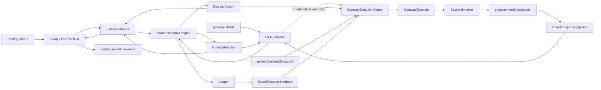

> **Status:** Proposal - **Created:** 2026-08-31 - **Revised:** 2026-09-01

## Summary

Add a separate, experimental Go inference gateway - and **do not add a second
semantic orchestration**.

The first step is extracting the Envoy-independent request and response
orchestration from `pkg/extproc` into a transport-neutral
`semanticruntime.Engine`. The existing ExtProc service and the new HTTP
gateway both become adapters of that one engine:

- the ExtProc adapter keeps handling Envoy protobuf, stream phases, and
  mutation responses;
- the HTTP adapter handles public HTTP, SSE, client cancellation, and HTTP
  error mapping;
- the shared engine handles access, quota, plugins, signals, projections,
  decisions, algorithms, logical model selection, Looper, and response
  semantics;
- a `GatewayExecutor` owns only the standalone path's physical backend
  execution;
- the existing Envoy + ExtProc deployment, ports, protocols, defaults, and
  external behavior stay unchanged.

The standalone gateway ships as its own binary, process, image, bootstrap,
and opt-in deployment. It does not call ExtProc gRPC and does not construct
Envoy messages.

This is not a `--gateway` mode inside the existing binary, not HTTP calls to
a local ExtProc, and not a copy of the ExtProc orchestration.

## Problem

Semantic Router currently takes public inference traffic through Envoy
ExtProc. That deployment correctly separates semantic model selection from
upstream transport, but extending it into a standalone gateway naively
creates two problems:

1. Reusing `pkg/extproc` drags Envoy protobuf, mutation responses, and
   stream callbacks into a public HTTP server - transport-specific types
   become the shared API.
2. A new HTTP listener calling a local ExtProc keeps an unnecessary process
   protocol, duplicates request lifecycle state, and forces the gateway to
   rebuild Envoy's mutation/stream behavior.

A third problem decides the architecture: the semantic phase ordering still
lives concentrated in `pkg/extproc`'s `req_filter_*`, `processor_*`, and
`RequestContext`. Several leaf packages (`protocolcodec`, `llmprotocol`, `looper`) are
already transport-neutral, and more of the request path becomes neutral as
related in-flight work lands - but there is no complete transport-neutral
orchestration boundary today. A standalone gateway that only re-assembles the leaf packages
creates a second orchestration. Tests can detect drift between two
implementations; they cannot eliminate the duplication. Extracting the
shared engine is therefore a precondition of the gateway, not a follow-up.

Two response paths also exist today and must be unified inside the gateway:
the ExtProc path rebuilds response semantics for plugins, cache, memory,
replay, metrics, and settlement, and `pkg/looper/client.go` performs
provider-response handling for Looper calls. Neither is a complete
transport-neutral decoder today; running both double-decodes, and running
only one could bypass response-side semantic policy. The shared response
pipeline resolves this: provider bytes decode exactly once, semantic policy
runs on the neutral object, and client encoding happens last. A dedicated
`pkg/backendinvoker` - the single authority for attempts, credentials, and
terminal evidence - is an explicit P0 extraction/creation target from these
existing paths, not an existing component.

Finally, a Service placed in front of the gateway can load-balance gateway
replicas, but cannot pick the physical backend for a request whose logical
model is already selected. Even as an experiment, the gateway must own an
explicit physical traffic layer - it cannot forward everything to one shared
upstream and claim the traffic contract is verified.

## Goals

- Serve public inference in one Go process, without Envoy or ExtProc gRPC.
- Extract one transport-neutral Semantic Engine shared by the ExtProc and
  HTTP adapters.
- Reuse the current classifiers, algorithms, plugins, protocol codec, and
  Looper implementations; treat access, quota, credential, egress, and
  settlement as P1 target contracts defined on the shared engine, not as
  existing components.
- Strictly separate semantic logical model selection from physical backend
  selection.
- Keep the current Envoy + ExtProc deployment, generated configuration,
  defaults, topology, and observable behavior unchanged; internal delegation
  to the shared engine is allowed.
- Support OpenAI Chat Completions, OpenAI Responses, and Anthropic Messages
  through the same neutral protocol contract.
- Define correct buffered, streaming, cancellation, retry, fallback, and
  terminal settlement behavior.
- Validate production-grade traffic control, governance, observability, and
  security contracts without declaring production-readiness.
- Run Looper model calls in-process through a typed executor inside the
  current request lifecycle, never against the gateway's own listeners.
- Prove Docker deployment first, then add a separate Kubernetes experiment.
- Keep the control plane replaceable and out of the synchronous request
  path.

## Non-goals

- Do not replace vLLM, the vLLM Production Stack, Kubernetes, or any serving
  platform's replica lifecycle.
- Do not move product CRUD, PostgreSQL desired state, dashboards, or agent
  state into the gateway.
- Do not make the gateway a durable worker registry or a second routing
  source of truth.
- Do not duplicate request/response semantic orchestration for the gateway.
- Do not copy another gateway's endpoint names, state replication, CLI flag
  surface, or extension ABI.
- No HTTP status-code retry or cross-model fallback without known-zero
  transport evidence.
- Do not embed the public gateway listener in the existing ExtProc binary.
- The engine extraction must not change the current ExtProc Looper
  transport, deployment topology, or public behavior.
- Do not describe the gateway as production-ready before G0 explicitly
  decides support level and defaults.
- Do not rewrite the data plane in Rust before benchmarks isolate a bounded
  Go bottleneck.

## Architecture decisions

1. **Experimental isolation.** The gateway owns its own binary, listener,
   readiness, lifecycle, image, bootstrap schema, and opt-in deployment.
   Current defaults do not change; ExtProc never depends on the
   experimental gateway.
2. **One shared engine.** `semanticruntime` owns the transport-neutral
   orchestration; both adapters call it. The engine imports no `extproc`,
   no Envoy, no HTTP writer.
3. **Two-level routing.** The semantic runtime selects a logical model
   revision; the gateway traffic layer then selects the physical backend for
   that model.
4. **One composed scope per request.** Semantic publication,
   BackendSnapshot, CredentialPublication, identity, deadline, quota lease,
   and settlement stay fixed from `Begin` to terminal state.
5. **One neutral codec pass.** Provider bytes decode once into a neutral
   response/event; semantic response policy runs on that object; client
   wire encoding happens last.
6. **Evidence-based execution.** Retry, fallback, usage, and cost use
   durable attempt evidence; missing evidence means unknown, never zero.
7. **Explicit capability failure.** When a recipe requires an endpoint,
   codec, plugin, stream, retry, or executor capability that is not
   available, publication fails - behavior is never silently skipped
   because the adapter differs.
8. **No duplicated semantic authority.** Semantic publication, access,
   and quota identity keep their current owners and data flow; the only new
   control loop manages the physical BackendSnapshot.
9. **Docker before Kubernetes.** P0 builds its evidence in Docker; P1 adds
   Kubernetes discovery/deployment.
10. **Completion is not support.** Only G0 can change defaults or the
    gateway's production support status.

## Target architecture



### Deployment shapes

| Shape | Status | Public transport | Semantic execution | Physical backend traffic |
| --- | --- | --- | --- | --- |
| Envoy + ExtProc | current default, externally unchanged | Envoy | shared engine + ExtProc adapter | Envoy or the currently installed transport adapter |
| Standalone gateway | opt-in experiment | `vllm-sr-gateway` HTTP server | same shared engine + HTTP adapter | GatewayExecutor + BackendInvoker |
| External gateway | possible future | external gateway | typed adapter of the shared engine | external gateway, must declare capabilities |

### Component ownership

| Component | Sole responsibility | Not responsible for |
| --- | --- | --- |
| `semanticruntime.Engine` | neutral request phases, semantic decisions, logical model, Looper, response phases, terminal state | Envoy protobuf, HTTP writers, backend addresses, connections |
| ExtProc adapter | mapping Envoy messages to neutral inputs/actions, keeping the current phase and mutation contract | a second semantic orchestration, gateway transport, physical backend choice |
| HTTP adapter | public endpoints, trusted ingress metadata, HTTP status/header/body, SSE flush, client disconnect | semantic selection, credential lookup, retry decisions |
| Dispatch compiler | ordered logical model revisions, timeout/retry/fallback authority, semantic revision/request identity | physical addresses, live health, plaintext credentials |
| `GatewayExecutor` / ExecutionScope | fixing backend/credential/deadline at request start, admission, physical plan assembly, invoking BackendInvoker | semantic model choice, attempt lifecycle, product desired state |
| Backend directory | one immutable BackendSnapshot revision: capabilities, weights, health overlay | semantic publication, durable product CRUD |
| `BackendInvoker` | backend picker, per-backend permits, credential pinning, physical attempts, safe retry/fallback, protocol translation, attempt journal, upstream cancellation | entrypoint/decision computation, re-reading active revision pointers |
| `ModelExecutor` | Looper child calls with pinned scope, per-call admission/evidence, neutral results | public listener re-entry, caller re-auth, a second semantic decision |
| Response pipeline | neutral response/event policy, cache, memory, replay, usage, terminal settlement | re-parsing public bytes, controlling backend selection |

`GatewayExecutor` is the single entry point for physical execution. There is
no second "traffic manager" overlapping `BackendInvoker`: admission,
queues, health, and pickers may be small components, but attempt lifecycle,
retry, fallback, credentials, and response terminal authority stay with
`BackendInvoker`.

## Recommended technology stack

| Concern | Choice | Reason |
| --- | --- | --- |
| Language | the repository's current Go module | direct reuse of protocol, semantic, access, quota, credential, egress, attempt, and settlement contracts; no FFI, no second implementation |
| Inbound server | standard `net/http` with explicit `http.Server` limits; HTTP/2 when TLS is enabled | mature cancellation, streaming, connection lifecycle, pprof; no other proxy engine before evidence demands one |
| Streaming | neutral event decoder/encoder + SSE writer with bounded buffers/backpressure | event policy and client wire output in one lifecycle |
| Outbound transport | a backend invoker over guarded `net/http.Transport` pools per backend security domain | preserves known-zero, credential pinning, TLS/mTLS, SSRF, and cancellation contracts |
| Configuration | `yaml.v3` strict decode, canonical validation, redacted effective config, immutable compiled structs | unknown fields fail before the listener starts; matches existing config habits |
| Concurrency | `context`, `errgroup`, component supervisor, typed leases, `atomic.Pointer` for immutable snapshots | explicit cancellation, failure policy, drain, and revision swap |
| CLI | small stdlib `flag.FlagSet` subcommands, wrappable by the Python product CLI | small experimental surface, no new CLI framework |
| Metrics | existing Prometheus client | reuses registry and naming conventions |
| Tracing | existing OpenTelemetry SDK + W3C propagation | spans across adapter, semantic, Looper, and upstream |
| Logging | existing structured Zap facade with mandatory redaction | one privacy rule, no new logging stack |
| Testing | Go unit/race/fuzz, fake clock/RNG, `httptest`, Docker E2E, then Kubernetes E2E | from pure contracts to cancellation, streams, churn, and deployment behavior |

The core gateway imports no Traefik and inherits no provider dependency
surface. Kubernetes client dependencies arrive only in P1, isolated inside
the candidate-source adapter.

## Shared Semantic Engine

### Engine and session

The engine exposes request-scoped sessions and imports or exposes no ExtProc
processor methods. Both adapters call this API; concrete Go types may
evolve, but the shape holds:

```go
type Engine interface {
    Begin(context.Context, Ingress) (*Session, error)
}

type Session interface {
    Prepare(context.Context) (Action, error)
    ResponseProcessor() responsepipeline.Processor
    Abort(context.Context, error) error
    Close() error
}
```

`Ingress` carries only bounded trusted transport metadata, the source wire
format, an opaque authenticated identity (raw credentials are consumed at
the adapter, before `Begin`), request bytes or a decoded neutral request,
and the request-scoped `ModelExecutor` capability the adapter binds. It
never carries Envoy types, HTTP writers, backend addresses, or provider
secrets.

`Action` is a closed union:

- `ImmediateAction` - auth rejection, quota rejection, cache hit, fast
  response, protocol error, or completed orchestration;
- `DispatchAction` - the mutated neutral request, the source envelope, and
  a validated logical `DispatchPlan`.

Looper is not a third adapter action. The engine performs bounded
multi-calls through the session-bound `ModelExecutor`, then returns a normal
action, so phase ordering never sinks into an adapter.

The session owns the request-scoped state currently mixed into
`RequestContext`, internally split into protocol state, semantic state,
access/dispatch state, and response state. Adapters see only actions,
metadata, and terminal methods.

### Configuration-generation resolution

Each request pins its composed execution scope in this order:

1. The adapter consumes the caller credential and produces an opaque
   authenticated identity.
2. The standalone HTTP composition creates a `GatewayExecutionScope`
   pinning BackendSnapshot, CredentialPublication, an absolute deadline,
   and request identity; the ExtProc adapter binds the existing controlled
   HTTP ModelExecutor instead.
3. `Engine.Begin` validates the active semantic publication identity.
4. The exact namespace, quota partition, publication epoch/revision, and
   routing digest are captured.
5. The session carries only the opaque authentication result, the immutable
   semantic scope, and the neutral ModelExecutor handle.
6. Every scope lease is held until terminal settlement and response body
   close.

File-based routing goes through the same session API to pin the startup
publication. Semantic publication or BackendSnapshot hot reload affects new
requests only - never in-flight sessions, retries, fallbacks, or Looper
child calls.

### Logical and physical plans

The transport-neutral `dispatchplan` package defines logical plans
containing:

- semantic publication and request identity;
- the selected decision identity;
- ordered logical model revisions and route keys;
- source/backend wire formats;
- one whole-request/stream timeout;
- bounded same-model retry authority;
- bounded priority-fallback authority;
- required attempt/terminal evidence.

Logical plans never contain backend addresses, provider secrets, cluster
names, or live health values.

`gatewaycontract` handles serialization/signing/replay protection of logical
plans only at real adapter boundaries. The existing ExtProc encoding is
unchanged during the experiment; the standalone gateway passes validated
plans in memory - never Base64-encoding its own plans into headers,
removing them, and decoding again.

The standalone `GatewayExecutor` combines the logical plan with the pinned
BackendSnapshot and CredentialPublication into a physical plan chain, never
following a newer active pointer.
Admission, health, and pickers only narrow the candidate set; they cannot
add models or backends beyond the publication. `BackendInvoker` remains the
single authority for attempts, retries, fallback, credentials, and terminal
evidence.

### Response pipeline

Both adapters use one neutral response pipeline:

```text
provider bytes
  -> provider codec decoder
  -> neutral Response / Event
  -> semantic response processor
  -> client codec encoder
  -> public bytes
```

The session implements buffered, event, terminal, and abort hooks. The
ExtProc adapter maps Envoy response phases onto these hooks; the standalone
path calls them directly from BackendInvoker. Buffered mutations complete
before client encoding; streaming event mutations run before each event is
encoded; terminal settlement consumes the same codec engine's terminal and
never re-parses public bytes.

Response capabilities are explicitly classified:

| Class | Meaning |
| --- | --- |
| `request_safe` | runs before dispatch; independent of response delivery |
| `stream_event_safe` | observes or mutates one neutral event before it is client-visible |
| `terminal_observer` | accounting, cache, memory, replay, or telemetry after completion; cannot recall sent bytes |
| `buffer_required` | must see the full response; streaming recipes must reject publication or explicitly choose buffered delivery |

A buffered-only hallucination/jailbreak mutation must not be described as
streaming protection unless a reviewed event-safe implementation exists.

## Package layout and dependency rules

The layout below is the target design. Packages that do not exist yet are
created by the P0 tasks that need them; nothing here renames or moves
existing packages outside `pkg/extproc`'s progressive delegation.

| Package | Direction of responsibility |
| --- | --- |
| `pkg/semanticruntime` | engine, sessions, neutral request phases, semantic response phases, per-generation runtime isolation |
| `pkg/dispatchplan` | logical plan types, validation, request digests, compilers, adapter capability requirements |
| `pkg/gatewaycontract` | cross-process encoding, signing, replay protection, header/filter-state limits |
| `pkg/responsepipeline` | minimal neutral response/event contract shared by semantic runtime and BackendInvoker |
| `pkg/gatewayserver` | public/admin `net/http` listeners, endpoint adapters, SSE writer, readiness, drain |
| `pkg/gatewayexecutor` | standalone admission, fixed execution scope, physical plan assembly, BackendInvoker invocation |
| `pkg/backenddirectory` | immutable BackendSnapshot, BackendSource, capability index, health overlay |
| `pkg/trafficcontrol` | composable admission, queues, pickers, active/passive health, circuit breaking, load feedback; owns no attempts |
| `pkg/backendinvoker` | attempt lifecycle, credential pinning, safe retry/fallback, codec, journal, cancellation (extracted from the current invocation path as part of P0) |
| `pkg/backendegress` | allowlist, DNS pinning, SSRF protection, TLS transport, redirect policy (extracted alongside the invoker) |
| `pkg/looper` | outbound port supports injected HTTP or in-process `ModelExecutor`; algorithms stay neutral |
| `pkg/extproc` | keeps the Envoy adapter and mutation contract; semantic orchestration progressively delegates to `semanticruntime` |
| `cmd/gateway` | component assembly and startup for the experimental process only |

Dependency rules:

- `semanticruntime` imports no `extproc`, `gatewayserver`, Envoy, or
  backend transport.
- `gatewayserver` may import `semanticruntime`; the reverse is forbidden.
- `extproc` may import `semanticruntime` and `responsepipeline`; never
  `gatewayserver`, `gatewayexecutor`, or `trafficcontrol`.
- Gateway packages import no `extproc` or Envoy.
- `dispatchplan` imports no adapter or backend implementation.
- the BackendInvoker consumes neutral response hooks only; it never
  receives an ExtProc session.
- The public adapter parses no ProviderCredential and constructs no backend
  address.
- `gatewayexecutor` assembles physical plans but delegates attempt
  lifecycle to the BackendInvoker.
- Process assembly stays in `cmd/gateway`; shared factories remain
  transport-neutral.

These rules are enforced by dependency tests, not review vigilance.

## Configuration and the BackendSnapshot control loop

### Static and dynamic configuration

The bootstrap owns process-level content: listeners, TLS, BackendSource,
traffic safety ceilings, observability exporters, admin policy, and shutdown
timeouts. The existing runtime publication keeps owning tenants, entrypoints,
recipes, models, credential references, quotas, and semantic policy. The CLI
covers only a few operational parameters.

```go
type BackendSnapshotCandidate struct {
    Source     string
    Revision   string
    ObservedAt time.Time
    Backends   []BackendDefinition
}

type BackendSource interface {
    Run(context.Context, chan<- BackendSnapshotCandidate) error
}
```

BackendSources send complete snapshots; incremental mutation of an active
map is not allowed. P0 supports strict file/static sources and guarded DNS;
Kubernetes arrives in P1. The control loop keeps the newest candidate per
source, performs bounded latest-wins coalescing, and records drops,
staleness, and reconnects.

### Compile, warm-up, and activation

Each BackendSnapshot candidate passes, in order:

1. schema validation and canonical normalization;
2. deterministic backend identity, reference resolution, conflict
   detection;
3. capability, route-key, credential binding, security domain, and protocol
   compatibility checks;
4. compiling the backend directory, picker inputs, and traffic safety
   policy;
5. DNS pinning and necessary connection warm-up;
6. canonical digest computation (identical candidates are skipped);
7. constructing the immutable `BackendSnapshot`;
8. atomically switching the active pointer and recording desired/applied
   status;
9. closing the old snapshot once its request leases drain to zero.

A failed required backend never activates a partial snapshot;
last-known-good is retained with a structured reason. Source loss does not
empty the active snapshot; readiness degrades per staleness policy while
the verified snapshot keeps serving.

Semantic publication replication, activation, and status keep their
current owners and data flow. The new control loop never compiles recipes,
signals, plugins, or tenant policy.

### Component supervisor

Every long-lived component declares a failure policy:

- `fatal`: listener, semantic publication replica, BackendSnapshot
  controller - the process exits in order;
- `restartable`: backoff/jitter restarts, escalating to degraded/fatal when
  the budget is exhausted;
- `degraded`: safe serving continues with an explicit readiness/diagnostic
  reason.

Panic recovery never only logs. Every goroutine has an owner, a context,
and a shutdown order.

## Request lifecycle

### Buffered request and response

1. The HTTP adapter establishes the request ID, deadline, and cancellation,
   and validates method, content type, and header/body limits.
2. The authenticator consumes the caller credential and produces an opaque
   identity; the raw bearer never enters the session.
3. The HTTP composition creates the `GatewayExecutionScope`, pinning the
   BackendSnapshot, CredentialPublication, and absolute deadline.
4. `Engine.Begin` pins the semantic publication; the neutral codec decodes
   the request exactly once.
5. The engine runs request plugins, signals, projections, decisions,
   algorithms, access/quota, and logical model selection.
6. Cache hits, policy rejections, and fast responses produce
   `ImmediateAction`, mapped directly by the HTTP adapter.
7. `DispatchAction` goes to the same `GatewayExecutionScope`;
   GatewayExecutor takes request-level admission/queue leases and combines
   the logical plan with the pinned snapshot into a physical `PlanChain`.
8. BackendInvoker picks a backend through the PlanChain picker, takes
   per-backend attempt leases, resolves credential/security domains, and
   owns the physical attempt, safe retry/fallback, and journal/evidence.
9. The provider response decodes exactly once, passes through the session's
   neutral response pipeline, and encodes into the client format.
10. One terminal path completes usage/cost/quota/replay/cache/memory/metrics
    settlement and releases every lease.

The ExtProc path runs the same steps 4-6, mapping actions back to the
existing Envoy mutation contract; Envoy keeps owning upstream transport. It
creates no `GatewayExecutionScope` and imports no gateway package.

### Streaming response

1. Headers commit only after the upstream succeeds and the client status is
   confirmed.
2. Each provider event becomes a neutral event first, runs
   `stream_event_safe` policy, then encodes and flushes.
3. The SSE writer uses bounded buffers and respects downstream
   backpressure and client cancellation.
4. Once response headers or a client-visible byte is sent, no retry that
   could double-bill.
5. `[DONE]`, provider terminal events, EOF, protocol errors, timeouts, and
   disconnects all map to one terminal.
6. `terminal_observer` plugins run after the delivery outcome is known;
   unprovable usage is recorded as unknown with the quota fence held.
7. `buffer_required` recipes never silently switch streaming to buffered
   after activation.

### Looper multi-model calls

The gateway Looper never self-curls and never re-enters the public or admin
listener:

```text
parent session
  -> Looper algorithm
  -> GatewayModelExecutor
  -> pinned GatewayExecutionScope
  -> GatewayExecutor
  -> BackendInvoker
  -> neutral child result
  -> Looper algorithm
  -> parent response processor
```

`GatewayModelExecutor` inherits the parent request's semantic publication,
BackendSnapshot, CredentialPublication, identity, allowed model set,
deadline, cancellation, quota partition, and accounting scope. Each child
call has its own dispatch/attempt ID, admission, and evidence. The outer
request plugin runs once; plugins declared `per_model_call` run per call;
the final response plugin runs once.

Maximum call count, parallelism, recursion depth, token, cost, and time
budgets must be configured; exhausting any budget fails closed. P0 supports
bounded buffered child calls only; recipes requiring unsupported streaming
orchestration fail at activation. The ExtProc composition keeps the existing
controlled HTTP executor; the gateway composition binds
`GatewayModelExecutor`. Both use the same engine phase ordering; ExtProc's
external Looper behavior is unchanged.

### Abort and terminal state

Client disconnect, queue timeout, upstream timeout, plugin rejection,
panic, drain, and process shutdown all call one idempotent terminal path.
The terminal releases semantic publication, BackendSnapshot, quota, queue,
backend, credential, body, and stream leases; records attempt/usage
evidence; and guarantees exactly-once settlement.

## Retry and fallback invariants

- One absolute deadline per request; retry/fallback never refreshes budget.
- Only `known-zero` evidence - proof the request was never accepted or
  billed by a backend - authorizes a retry.
- After the request body is written, response headers received, or a
  client-visible byte sent, retry is forbidden by default.
- Same-model retry selects only among eligible backends of the same model,
  within the logical plan's authority and retry budget.
- Cross-model fallback advances only along priority tiers fixed in the
  publication; the candidate set never grows dynamically.
- Timeouts and connection resets are unknown outcomes by default; they are
  never assumed to be zero-usage.
- Every attempt has a unique ID, start/end times, selected backend,
  evidence, and terminal classification.
- Settlement executes exactly once for success, failure, cancellation,
  partial streams, and unknown usage.

## Traffic control

### Backend directory

The directory is the immutable backend set of one BackendSnapshot revision.
Each backend carries a logical model binding, protocol capability, address
reference, security domain, credential reference, weight, zone, and static
metadata. Live health/load/circuit state is a separate atomic overlay that
can only mark candidates ineligible - it never modifies semantic
publication or the snapshot.

### Backend pickers

- P0: random, round robin, weighted round robin, deterministic affinity,
  and power-of-two-choices (P2C on active requests + EWMA latency/load with
  freshness and fallback for every signal).
- P1: consistent/prefix/bounded-load hashing, trusted sticky keys,
  cache-aware scheduling, outlier ejection, adaptive concurrency.
- Every policy is capability-gated; topology changes, empty candidate sets,
  stale signals, and extreme weights have deterministic tests.

### Admission and queues

Admission layers: process, tenant, entrypoint/model, provider, backend.
Global tenant quota and cross-replica admission are P1, defined on the
publication/quota/settlement contracts that land after P0; the
process-local queue is transient capacity protection, never durable quota
truth. P0 reuses the current local gateways in `pkg/authz`, `pkg/ratelimit`,
and `pkg/admission` where they exist.

Queues are bounded, fair, deadline-aware, and cancellation-safe. Permits
are typed leases; waiter cancellation, handoff failure, and panic all
return them. Overload returns a stable, observable public error that does
not leak internal capacities.

### Health, circuit breaking, and outliers

- Active health uses bounded timeouts and jitter; it never sends billable
  requests to public model paths.
- Passive health consumes only classified transport/protocol outcomes;
  policy rejections never count as backend failures.
- Circuit breaking uses rolling windows, minimum samples, open intervals,
  and bounded half-open probes.
- P1 outliers require statistical thresholds, ejection budgets, TTLs, and
  minimum-available-backend protection.
- Health, circuit, and outlier state are narrowing-only; they never bypass
  the semantic plan or credential bindings.

## Service governance

### Sources of truth and reload

The control plane/database owns desired state; the gateway consumes only
immutable publications. Admin APIs can drain, quarantine, and inspect - they
cannot add models, modify tenant policy, or become worker CRUD sources of
truth.

Semantic configuration keeps its current replication and activation
owners. Physical backend configuration flows through the
BackendSnapshot controller (full snapshot, deterministic compile, warm-up,
atomic activation, request pinning, last-known-good). Both control loops
emit revision, digest, source revision, compile latency, warnings, and
failure reasons; neither compiles the other's data. Rollback reactivates a
previously verified revision - it never reverse-mutates active objects.

### Readiness and drain

Liveness only proves the process event loop is alive. Readiness requires
the listener, an active semantic publication, an active BackendSnapshot,
required credentials/stores, backend eligibility, and source-freshness
policy. Public `/ready` returns a coarse status only; detailed reasons stay
on authenticated admin/metrics surfaces.

Drain order: stop admission, reject new long tasks, wait for queues and
in-flight requests, close idle connections, cancel remaining
upstreams/streams within budget, run unknown-safe settlement, release
semantic/backend scopes, then close exporters and listeners.

### Multi-replica

Gateway replicas share the immutable semantic publication, BackendSnapshot
source, credential authority, quota/usage authority, and control-plane
status. Health/load/circuit state may remain process-local narrowing state.
Local state divergence must be observable and must never become
cross-replica policy truth. P1 validates rollout, disruption, autoscaling,
stale watches, backend churn, and long streams.

## Observability

Every chain carries, from P0: `request_id`, `semantic_revision`,
`backend_snapshot_revision`, `namespace`, `entrypoint_id`, `decision_id`,
`logical_model_revision`, `dispatch_id`, `attempt_id`, and Looper
`parent_request_id`/`call_id`. High-cardinality tenant/model/backend
identifiers go to bounded labels, trace attributes, or redacted logs - never
unbounded metric labels.

### Metrics

- HTTP requests, responses, in-flight, durations, body/stream outcomes;
- semantic signal/decision/selection latency and reasons;
- queue wait/depth/rejections/cancellations and permit-leak guards;
- backend eligibility, active requests, picker decisions, health, circuit,
  outlier state;
- attempts, retries, fallbacks, known-zero vs unknown classifications;
- stream TTFT, TPOT, event counts, disconnects, incomplete terminals;
- usage tokens, costs, quota admission/settlement;
- semantic publication and BackendSnapshot source/compile/activation/
  staleness/last-known-good telemetry;
- Looper calls, depth, fan-out, budgets, partial failures.

### Tracing

W3C trace context. Span hierarchy: ingress, semantic, decision, Looper,
dispatch, queue, attempt, codec, response policy, settlement. Trace header
propagation to providers is governed by provider header policy and never
leaks caller credentials or internal plans.

### Logs and privacy

Logs are structured with reason codes. Prompts, responses, bearer tokens,
provider secrets, reversible credential IDs, and full backend URLs are never
logged by default. Content diagnostics require an explicit privacy policy
with sampling, redaction, and audit.

## Security

### Ingress, identity, and authorization

- P0 authenticatees against the existing `pkg/authz` chain; a
  publication-defined access runtime (per-tenant entrypoint grants and
  token identity) is P1, not an existing component.
- JWT/OIDC is only an additional authenticator that maps onto the same
  tenant/grant/quota model - never a second authorization engine.
- Authorization runs per entrypoint or concrete model before semantic
  execution; entrypoint grants authorize only their immutable action.
- Caller credentials are consumed before dispatch and are never used as
  provider credentials.
- Public, metrics, and admin listeners have separate exposure/auth
  policies; admin is private and authenticated by default.

### Transport, credentials, and egress

- The data listener supports TLS 1.2+; explicit configuration may delegate
  termination to the platform.
- Every backend has its own CA, SNI, optional mTLS identity, and connection
  pool; security domains never leak across backends.
- ProviderCredentials are pinned to the same publication/backend binding as
  the plan; plaintext exists only while constructing an attempt, is
  redacted in logs/errors, and is zeroed when possible.
- Egress validates scheme/host/port/CIDR, resolves and pins DNS before
  dialing; loopback, metadata endpoints, private rebinding, and redirect
  escapes fail closed by default.
- Request/response headers use allowlists; hop-by-hop, identity, cookie,
  internal route, credential, and provider-secret headers are stripped.

### Limits and extension

Header count/bytes, request body, buffered response, SSE frame/event,
diagnostics, queue, timeout, and connection limits all have ceilings. CORS
stays off unless an origin is explicitly allowed.

The extension model is build-time typed Go plugins. Runtime-loaded WASM is
out of scope; a future need requires its own use case, threat model,
signing/digest, capability, resource, and secret-access policy.

## Public endpoints

| Endpoint | Priority | Contract |
| --- | --- | --- |
| `POST /v1/chat/completions` | P0 | OpenAI Chat neutral codec, buffered and SSE |
| `POST /v1/responses` | P0 | OpenAI Responses neutral codec, buffered and streaming create |
| `POST /v1/messages` | P0 | Anthropic Messages neutral codec, buffered and streaming |
| `GET /v1/models` | P0 | access-scoped logical model/entrypoint discovery |
| `GET /health`, `GET /ready` | P0 | liveness and coarse readiness without sensitive diagnostics |
| `POST /v1/completions` | P1 | legacy endpoint only after a neutral codec and conformance matrix exist |
| Embeddings, rerank, classify | P1 | explicit neutral operations, not borrowed chat channels |
| Tokenize/detokenize/parser | P1 | bounded typed utilities; public exposure needs separate authorization |
| Stateful responses/conversations | optional P1 | reuse the Response API/control-plane store; the gateway adds no store |

Metrics, diagnostics, drain, backend state, effective config, and profiling
never live on the public listener.

## Configuration

The experimental binary uses a standalone YAML-first bootstrap; no
`gateway` mode is added to the current `semantic-router` configuration.
Runtime publication manages tenant semantic/model policy; the bootstrap
manages listeners, discovery, observability, and local protection; the CLI
covers only narrow operational values.

```yaml
api_version: vllm.ai/v1alpha1
kind: ExperimentalGateway
experimental: true
semantic_config: /etc/vllm-sr/config.yaml
gateway:
  data_listener:
    address: 0.0.0.0:8080
    tls: null
  admin_listener:
    address: 127.0.0.1:8081
  traffic:
    policy: power_of_two
    max_concurrency: 1024
    queue:
      capacity: 512
      timeout: 30s
    circuit_breaker:
      minimum_samples: 20
      failure_ratio: "0.50"
      open_interval: 30s
      half_open_probes: 1
  discovery:
    static: true
    dns: true
    kubernetes: false
  observability:
    metrics_address: 127.0.0.1:9090
  security:
    ingress_authentication: native
    backend_egress_policy: /etc/vllm-sr/backend-egress-policy.yaml
```

Secrets reference only file, environment, or projected encrypted sources -
never plain CLI flags, never effective-config output. Defaults, files,
approved env vars, and narrow CLI overrides have one documented precedence.
Unknown fields or a missing `experimental: true` fail startup.

## CLI

```bash
vllm-sr-gateway serve --config /etc/vllm-sr-gateway/gateway.yaml
vllm-sr-gateway config validate --config /etc/vllm-sr-gateway/gateway.yaml
vllm-sr-gateway config print-effective --config /etc/vllm-sr-gateway/gateway.yaml --redact
vllm-sr-gateway status --admin-address http://127.0.0.1:8081
vllm-sr-gateway backends list --admin-address http://127.0.0.1:8081
vllm-sr-gateway routes list --admin-address http://127.0.0.1:8081
vllm-sr-gateway drain --admin-address http://127.0.0.1:8081 --timeout 2m
vllm-sr-gateway version
```

The Python product CLI may add an explicit experimental wrapper (for
example `vllm-sr experimental-gateway serve`) that starts the separate
binary. It does not change `vllm-sr serve` and does not turn the current
`semantic-router` command into a multi-mode server.

## Deployment evolution

### P0: Docker experiment

- A separate experimental image and opt-in Compose profile are published.
- Without the profile, the current local stack, image, service names,
  ports, and startup commands are unchanged.
- Semantic config is mounted read-only; the gateway uses its own bootstrap.
- Static/control-plane publication and DNS backend discovery are used
  first.
- Until P0-C passes, direct traffic is accepted only in development or
  explicitly isolated environments.

### P1: Kubernetes experiment

- After Docker lifecycle acceptance: a separate Deployment, Service,
  ServiceAccount, NetworkPolicy, and default-off Helm values.
- Namespace-scoped informer/EndpointSlice with least-privilege RBAC, or an
  operator-projected snapshot.
- Discovery events never enter the request path; everything flows through
  the BackendSnapshot controller's compile and atomic activation.
- Multi-replica drain, disruption, rollout, stale watches, API loss, and
  last-known-good are validated.
- No public CRD before the bootstrap/runtime contract stabilizes.

### G0: graduation gate

Completing P0/P1 does not make the gateway production-ready. Maintainers
review semantic parity, failure injection, security, Docker/Kubernetes
operations, load/long-stream behavior, migration/rollback, and ownership.
The shared engine has already converged in P0-A; G0 decides only whether to
support the gateway, whether defaults change, and at what support level.

## Capability and priority matrix

Priorities: P0-A contract/isolation, P0-B Docker vertical slice, P0-C
hardening, P1 Kubernetes and general expansion, G0 a separate decision, P2
workload-specific. Deferred means no commitment yet.

### API and runtime

| Capability | Target behavior and owner | Priority |
| --- | --- | --- |
| Multi-model HTTP gateway | gateway resolves entrypoints and logical models, then selects physical backends | P0 |
| Chat, Responses, Messages, Models | three built-in neutral codecs on the gateway | P0 |
| Remote provider-compatible backends | BackendInvoker pins codec, credentials, egress, security domains | P0 |
| Looper multi-model calls | in-process GatewayModelExecutor; no HTTP to self | P0 |
| Legacy Completions, embeddings, rerank, classify | new neutral operation contracts | P1 |
| Tokenize/detokenize/reasoning/tool parsers | shared typed utilities; exposure needs authorization and limits | P1 |
| Stateful responses/conversations | optional facade; store authority stays with the Response API/control plane | optional P1 |
| Model/backend lifecycle | replaceable control plane publishes immutable revisions | P1 |
| Kubernetes discovery | adapter reconciles data into immutable backend snapshots | P1 |
| Backend gRPC | only with a confirmed native worker protocol and real consumers | deferred |
| Local stack/worker co-launch | Python CLI orchestrates the separate process | P1 |
| Agent/MCP loops | optional agent service integrates via public inference and control-plane contracts | P1 |
| Prefill/decode | serving adapter with stable transport and billing contracts | P2 |
| Runtime-native tokenizer/parser | bounded optimization only when a backend protocol truly needs it | P2 |

### Traffic control

| Capability | Target behavior | Priority |
| --- | --- | --- |
| Buffered/SSE inference | three P0 protocols, cancellation, backpressure | P0 |
| Random/round-robin/weighted | backend selection policies | P0 |
| Power-of-two load strategy | active requests + EWMA load | P0 |
| Local concurrency and queues | process/model/provider/backend limits with bounded fair queues | P0 |
| Global tenant quota | publication-defined request/token/cost/concurrency admission and settlement (P1 contracts) | P1 |
| Safe retry | known-zero only, single deadline, durable attempt evidence | P0 |
| Cross-model fallback | published priority tiers, known-zero transitions only | P0 |
| Circuit breaking | rolling window, bounded half-open probes, passive feedback | P0 |
| Active/passive health | active probes plus classified outcomes | P0 |
| Sticky/manual routing | trusted keys with deterministic affinity | P1 |
| Consistent/prefix/bounded-load hashing | capability-gated with topology-change tests | P1 |
| Cache-aware scheduling | explicit cache state, bounded index, load escape | P1 |
| Outlier ejection / adaptive concurrency | statistical ejection, retry budgets, adaptive limits | P1 |
| Canary / shadow traffic | published rollouts with privacy-safe shadowing | P2 |
| Prefill/decode traffic | serving adapter capability | P2 |
| Hedging | only after provider idempotency and billing correctness are proven | deferred |

### Service governance

| Capability | Target behavior | Priority |
| --- | --- | --- |
| Immutable model/backend directory | publication-pinned definitions with atomic health overlay | P0 |
| Static/DNS discovery | validated snapshots with guarded resolution | P0 |
| Reload/rollback | warm-up, validation, atomic activation, in-flight generation pinning | P0 |
| Liveness/readiness/degraded | public-safe health states plus privileged diagnostics | P0 |
| Graceful drain | stop admission, wait, bounded cancel, unknown-safe settlement | P0 |
| Config validation / redacted effective config | offline validation and secret-safe inspection | P0 |
| Kubernetes discovery | watch/reconcile into immutable snapshots | P1 |
| Operational isolation | audited, TTL-bounded, candidate-narrowing only | P1 |
| Canary releases | publication-defined traffic subsets with rollback | P1 |
| xDS/operator integration | adapter-specific projections | P2 |
| Gateway CRDT authority | never for policy, quota, credentials, or publication truth | not planned |

### Observability

| Capability | Target behavior | Priority |
| --- | --- | --- |
| Structured access/component logs | content redaction, reason codes, correlated chains | P0 |
| Prometheus | HTTP, semantic, queue, traffic, health, attempts, streams, usage, cost | P0 |
| OpenTelemetry | W3C plus semantic/dispatch/attempt spans | P0 |
| TTFT/TPOT/stream outcomes | computed for every supported streaming codec | P0 |
| Attempt/fallback visibility | dispatch/attempt IDs, known-zero vs unknown, backends | P0 |
| Semantic/backend revision and readiness telemetry | both activation loops, staleness, source/dependency reasons | P0 |
| Cardinality governance | bounded labels; unbounded IDs only in logs/traces | P0 |
| Exemplars/SLO consumption rates | reviewed recording rules and dashboards | P1 |
| Privileged routing explanations | redacted semantic and traffic evidence | P1 |

### Security

| Capability | Target behavior | Priority |
| --- | --- | --- |
| Native API keys / delegated auth | authenticate against the existing `pkg/authz` chain; publication-defined access runtime is P1 | P0 |
| Entrypoint/model authorization | one immutable grant/tenant contract across both adapters | P0 |
| Request/token/cost/concurrency quotas | process-local admission reusing `pkg/authz`/`pkg/ratelimit`/`pkg/admission`; shared durable settlement is P1 | P0 |
| Ingress TLS | TLS 1.2+, explicitly delegable to platform termination | P0 |
| Per-backend TLS/mTLS | separate CA, SNI, client identity, connection pools | P0 |
| ProviderCredential isolation | publication-pinned bindings, validation, rotation, no caller passthrough | P0 |
| Egress/SSRF | allowlists, DNS pinning, private/metadata denial, redirect blocking | P0 |
| Header stripping | allowlists at ingress and provider boundaries | P0 |
| Admin isolation/audit | separate listener, auth, reason-coded audit | P0 |
| Body/header/time/queue limits | bounded, validated, publicly safe errors | P0 |
| JWT/OIDC federation | maps onto the same tenant/grant runtime | P1 |
| Vault/KMS | credential projection plus KEK lifecycle adapter | P1 |
| WAF/PII/DLP | explicit pre-dispatch policy with redacted telemetry | P1 |

## Compatibility and migration order

1. Freeze current behavior: golden fixtures for ExtProc decisions,
   mutations, immediate responses, Looper, buffered/streaming, replay, and
   settlement, plus external artifact snapshots (binary, config, image,
   ports, generated files).
2. Define the neutral contracts - `Engine`, `Session`, `Action`,
   `ResponsePipeline`, request-scoped `ModelExecutor` - importing no
   ExtProc/Envoy/HTTP/backend transport.
3. Extract request orchestration phase by phase from `req_filter_*`,
   `processor_*`, and `RequestContext`; the ExtProc adapter delegates at
   every step and runs the golden parity gate immediately.
4. Extract neutral response, terminal, abort, and settlement orchestration;
   the ExtProc response phase delegates to the same pipeline while keeping
   the Envoy mutation contract.
5. Make Looper depend only on the injected ModelExecutor; the ExtProc
   composition binds the existing controlled HTTP implementation with
   unchanged external behavior.
6. Close dependency, parity, panic/cancellation, and current-path E2E
   gates. No public listener before this point.
7. Add the BackendSnapshot controller, GatewayExecutor, and
   `GatewayModelExecutor`, reusing BackendInvoker as the single physical
   attempt authority.
8. Add the standalone HTTP adapter, strict bootstrap, separate
   binary/image, and Docker-only opt-in deployment.
9. Complete Docker traffic/failure/observability/security hardening, then
   the Kubernetes experiment; G0 decides support level and defaults last.

The migration never changes Envoy config, ExtProc gRPC/wire behavior, the
`semantic-router` command, the default Docker stack, default Helm values,
or the ExtProc Looper transport. The standalone listener always keeps its
own binary, image, config, service name, and port.

## Landing plan

The proposal is validated in phases; each phase must be fully proven before
the next begins. No phase introduces a public listener, default change, or
production behavior change on its own.

### Phase framing

| Phase | Purpose | Public listener | Exit |
| --- | --- | --- | --- |
| P0-A | extract the one shared engine, protect the current path | no | ExtProc delegates to the shared engine with proven equivalence; no second orchestration exists |
| P0-B | standalone Docker vertical slice | explicit experiment only | gatewayserver/HTTP, Looper, and the BackendInvoker work end to end in Docker |
| P0-C | data-plane protection required for production | isolated environments only | traffic, failure, security, and observability evidence complete |
| P1 | Kubernetes and general expansion | default-off | multi-replica and lifecycle validated |
| G0 | support decision | by review | reject, keep experimental, or an explicit support level |

P0-A (the shared-engine extraction) is the critical path and the
dominant schedule driver; the gateway's standalone value lands only in
P0-B. If P0-A's convergence cost grows out of control, P0-B does not start.

- The engine-first ordering is the proposal's core commitment, not an
  implementation detail.

### P0-A - shared engine and current-path equivalence

First, characterize current behavior with transport-neutral golden fixtures
(auth, entrypoint, signals/projections, decisions, algorithms, logical
model, mutation, immediate response, cache/replay, buffered/streaming,
Looper, abort, panic, settlement) and snapshot external artifacts (CLI
help, generated Envoy config, entrypoints, ports, defaults). Then define the
minimal neutral contract (`Engine`, `Session`, `Ingress`, closed
`Action` union, response pipeline, request-scoped `ModelExecutor`, terminal
reason/evidence) and extract request and response orchestration from
`req_filter_*`/`processor_*`/`RequestContext` in small steps, with the
ExtProc adapter delegating at every step and no compat copy. For scale:
that orchestration spans ~77 implementation files (15,150 lines) across
`req_filter_*`/`processor_*`, plus a 171-field `RequestContext` that
splits into protocol, semantic, access/dispatch, and response state;
extraction proceeds in small serial PRs because they share one ExtProc
hotspot. Looper becomes
dependent only on the injected `ModelExecutor`. Exit: the ExtProc adapter
really delegates, golden fixtures replay stably, and current external
behavior is unchanged. P0-B does not start otherwise.

Golden fixtures pin deterministic fake inference outputs, so parity gates
prove orchestration equivalence (phase ordering, mutations, settlement) and
stay bit-stable across platforms; real classifier artifacts remain with the
existing classifier suites and a non-gating nightly, and never gate
extraction PRs. Fixtures also freeze current streaming behavior: today's
buffer-only response-side filters run at finalization and are classified
`terminal_observer`; activation-time rejection applies only to recipes
requiring `buffer_required` body mutation, of which none exist today.

### P0-B - standalone Docker vertical slice

Build the BackendSnapshot control loop (strict static/file P0 sources,
atomic activation, last-known-good). Build `GatewayExecutionScope` +
`GatewayExecutor` (pin snapshot, credentials, deadline, request identity;
admission; physical plan; invoke the BackendInvoker). Build the in-process
gateway Looper (`GatewayModelExecutor`), the HTTP adapter with the three
P0 protocols and SSE lifecycle, and the standalone config/CLI/binary/image
(strict YAML, redacted effective config, separate `vllm-sr-gateway` binary,
opt-in experimental image). Exit: the gateway completes end-to-end inference
through an opt-in Compose profile without Envoy/ExtProc gRPC; with the
profile off, the local stack matches the P0-A snapshot.

### P0-C - traffic and runtime hardening

Admission and bounded queues; pickers, health, and circuit breakers;
evidence-based retry/fallback with exactly-once settlement; security
boundaries (ingress TLS, admin isolation, per-backend mTLS/CA, egress
allowlist, DNS pinning, SSRF/redirect protection, limits); observability
(redacted logs, Prometheus, OTel, TTFT/TPOT, attempt/snapshot telemetry);
and the P0 evidence pack (failure injection, negative security, churn,
1,000 models, 10,000 credentials, concurrent load, race/fuzz, performance
baseline). Exit: correct and isolated, still labeled experimental; no
capability marked supported without evidence.

### P1, G0, and beyond

P1 adds the default-off Kubernetes deployment and the watch/operator
BackendSource, multi-replica validation, and capability-gated extensions.
A G0 evidence review consolidates P0/P1 results; maintainers choose reject,
continued experiment, or an explicit support level. The shared engine is
not a G0 option - it converged in P0-A. P2 evaluates prefill/decode, xDS,
and benchmark-proven isolated Rust hotspots; backend gRPC stays deferred
until a stable native worker protocol exists.

### Execution notes

- P0-A touches shared ExtProc hotspots and proceeds in small serial
  steps; in P0-B the Looper and the HTTP adapter can proceed in parallel
  once the execution-scope contract is stable; P0-C security and
  observability proceed in parallel.
- Each PR keeps a single primary responsibility, leaves the tree building
  and lint-clean, and passes the relevant fixtures; every extraction step
  is self-consistent and releasable - there is no merged "half-extracted"
  state, and a phase is reverted only if it cannot be extracted without an
  observable behavior change (recorded as explicit tech debt). Extraction
  PRs prefer extracting small components over growing the original hotspot
  files.
- Distributed quota and cost settlement are P1, defined on the
  publication/settlement contracts that land after P0 and optionally backed
  by Valkey; P0 keeps settlement local to the process rather than shipping
  a second, divergent settlement implementation.
- The immediate next step is characterization fixtures and the
  external-invariant gate - not listeners, Docker, Kubernetes, or new
  traffic algorithms.

## Invariants

- Semantic selection produces a logical model, never a socket.
- GatewayExecutor resolves and narrows backend candidates only within the
  published logical plan.
- One request pins its semantic publication and BackendSnapshot exactly
  once.
- Provider responses decode exactly once; response semantics never
  re-parse public bytes.
- No retry or fallback without known-zero evidence.
- Looper never repeats outer authentication or top-level semantic
  selection.
- No PostgreSQL or other durable store in the synchronous request path.
- Completing P0/P1 does not change production defaults; G0 alone decides
  support status.

## Relationship to existing proposals

- [Production Stack Integration](./production-stack-integration): the
  boundary stands - the gateway process owns transport and physical backend
  traffic; the engine owns entrypoints, signals, decisions, logical model
  selection, and recipe-scoped plugins. The shared engine makes the split
  concrete: semantic selection is transport-neutral; only the gateway
  composition owns sockets.
- [Multi-Protocol Adapter Architecture](./multi-protocol-adaptor): both
  adapters consume the same neutral codecs; no second protocol layer.

## Acceptance criteria

### Isolation

- `semanticruntime`, `dispatchplan`, and `responsepipeline` import no
  ExtProc, Envoy, HTTP writer, or physical backend.
- The ExtProc adapter depends only on the shared engine/response pipeline -
  never on `gatewayserver`, `gatewayexecutor`, `backenddirectory`, or
  `trafficcontrol`; gateway packages import no `pkg/extproc`/Envoy.
- Current CLI help, generated Envoy config, container graph, ports, image
  entrypoints, Helm defaults, and fixtures are unchanged.
- Without explicit opt-in, normal builds and starts do not build, start,
  expose, or configure the experimental process.
- No public gateway listener before the shared-engine parity gate passes;
  current ExtProc unit/E2E/compatibility gates keep passing at every
  extraction step.

### Semantic consistency

- The same neutral fixture produces the same decision, logical model,
  mutated request, immediate response, warnings, cache behavior, replay,
  and settlement on both adapters.
- Every client/backend codec pair passes the buffered/streaming matrix.
- Recipe activation fails when a required adapter/plugin capability is
  missing.
- Both adapters use one engine phase ordering; request/response/settlement
  orchestration is never duplicated.

### Looper

- `GatewayModelExecutor` never requests the data/admin listener and never
  uses internal route headers.
- Gateway child calls pin the parent semantic publication, BackendSnapshot,
  CredentialPublication, identity, and deadline, with a unique
  dispatch/attempt journal.
- Per-call admission, usage, cost, cancellation, partial failure, and final
  settlement are exact.
- Call/parallel/depth/token/cost/time limits fail closed; unsupported
  Looper streaming activation fails.
- Current ExtProc Looper tests and HTTP behavior are unchanged.

### Lifecycle and failure

- Client disconnect cancels queue waits and upstreams and closes every
  lease.
- No retry after a request write, response header, or client-visible byte.
- Retry/fallback keeps one deadline and exact evidence across replica
  loss/recovery.
- Missing or conflicting usage is unknown, with the quota fence held.
- Cache hits, fast responses, backend errors, plugin rejections, panics,
  drain timeouts, and incomplete streams all settle exactly once.

### Traffic, scale, and deployment

- LB distribution, health thresholds, circuit transitions, half-open
  concurrency, queue fairness, and overload behavior pass deterministic
  tests.
- P0 load covers 1,000 models, 10,000 credentials, high-concurrency
  buffered traffic, long SSE, backend churn, and replica restarts.
- Metrics/traces keep labels bounded under high-cardinality IDs.
- Docker profile enable/disable, restart, health, config failure, churn,
  and drain pass first.
- P1 then validates Kubernetes staleness, reconnect, RBAC denial, rollout,
  disruption, multi-replica drain, and last-known-good.

### Security

- Caller/internal/provider credentials never cross boundaries and never
  appear in logs, traces, metrics, errors, or client responses.
- Cross-namespace access, stale semantic/backend revisions, credential
  binding violations, DNS rebinding, redirects, private egress, header
  smuggling, oversized inputs, and unauthorized admin access all fail
  closed.
- Per-backend TLS/mTLS domains never reuse another provider's credentials
  or trust configuration.

### Capability honesty

- The capability matrix is honored: no capability is claimed that is not
  implemented and tested.

## Design notes

### Why re-assembly was rejected up front

The most direct implementation - the gateway imports the router packages
and calls the buffered pipeline entry where it lives today, inside
`pkg/extproc` - was considered and rejected during design: the shared entry
still returns Envoy response types, pulls the ExtProc binary's dependency
surface (including model-binding artifacts) into the gateway image, and
leaves the orchestration in a package the gateway must not own. The
extraction is the root-cause fix.

### Streaming

SSE events decode once into neutral events, run `stream_event_safe` policy,
encode, and flush; response headers commit only after the upstream status
is known. Once a client-visible byte is sent, no retry that could
double-bill. Recipes requiring `buffer_required` response plugins reject
streaming activation instead of silently buffering.

### Rejected alternatives

- **`--gateway` mode in the existing binary**: makes the routing process
  accept public HTTP and own upstream dispatch - precisely the transport
  work the production-stack contract assigns to the gateway. Public
  listeners, long SSE, health loops, and drain have their own failure,
  readiness, and security domains.
- **HTTP-to-ExtProc loopback**: keeps an unnecessary process protocol,
  duplicates request lifecycle state, and forces the gateway to rebuild
  Envoy's mutation/streaming behavior - two cancellation and error
  lifecycles instead of one.
- **Gateway importing `pkg/extproc`**: Envoy protobuf types and mutation
  responses become the shared API, and the ExtProc hotspot keeps growing
  (see Design notes).
- **Rust for the first version**: the correctness contracts (codec, access,
  quota, credentials, egress, attempts, settlement, plugins) are evolving
  in Go; cross-FFI or duplicated correctness outweighs unproven
  performance gains. Rust is re-evaluated only for benchmark-isolated
  hotspots.

## Risks and mitigations

| Risk | Mitigation |
| --- | --- |
| The experiment accidentally changes the current path | dependency, artifact, CLI, image, topology, and E2E isolation gates land before any gateway code |
| Engine extraction regresses ExtProc behavior | phase-by-phase extraction; every step delegates immediately and runs the golden/E2E parity gate |
| Response semantics fork | BackendInvoker calls the session's neutral processor in one codec pass |
| Scope creep | P0 splits into isolation, vertical slice, and hardening stop gates |
| Looper bypasses policy or double-bills | inherited parent scope, per-call journals, explicit plugin/admission/settlement phases |
| Discovery storms create partial state | full snapshots, latest-wins, deterministic compile, atomic activation, last-known-good |
| Replica-local health disagrees | observable and narrowing-only; authoritative state stays in publication/store |
| Streaming plugins over-promise | capability classes with activation-time failure |
| Traffic policy harms billing | retry/fallback obeys known-zero evidence and the attempt journal |
| The runtime becomes a service locator | constructor-injected narrow dependencies, unexported session state, dependency tests |

## Stop conditions

- The shared engine cannot be extracted without changing ExtProc's external
  behavior: stop before P0-B and resolve the contract first.
- The same fixture produces different semantic actions or terminal outcomes
  on the two adapters: no exception lists to paper over it.
- A request can cross semantic publication, BackendSnapshot, or
  CredentialPublication revisions: do not enter concurrency testing.
- A second physical retry/fallback/attempt authority appears outside
  BackendInvoker: return to design.
- Looper needs self-curl, re-authentication, or a second semantic decision:
  return to design.
- A streaming plugin cannot declare a safe capability: reject the
  recipe/combination rather than silently not executing it.
- Retry or cross-model fallback is requested without known-zero evidence:
  keep it disabled.
- P0 evidence shows a Go hotspot without isolation: profile and optimize
  first; do not rewrite the data plane in Rust.

## References

- [Multi-Protocol Adapter Architecture](./multi-protocol-adaptor) - neutral
  protocol model reused by both adapters.
- [Production Stack Integration](./production-stack-integration) - the
  responsibility boundary the standalone gateway preserves.
- Epic [#1138](https://github.com/vllm-project/semantic-router/issues/1138) -
  adapter contract requirements.
