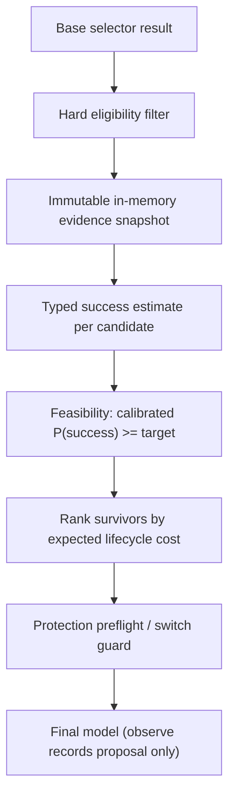

> **Status:** Proposal · **Created:** 2026-09-04 · **Epic:** [#2238](https://github.com/vllm-project/semantic-router/issues/2238) · **Parent:** [#3412](https://github.com/vllm-project/semantic-router/issues/3412)

## Problem

Current Router Learning supports bounded `routing_sampling` with per-model outcome
evidence, uncertainty-aware sampling, cost and reliability adjustments, protection
rules, and observe/apply modes. That strategy produces a **relative ranking** from
Beta-posterior quality evidence. It does not expose a calibrated
`P(success | request, candidate)` contract or treat a required success probability
as a **hard feasibility boundary**.

The online experience model initializes sparse quality evidence with
`QualitySeed=0.5` and `SeedWeight=2`. That prior is useful for exploration but is
**not** a calibrated success probability and must not be reported as one unless an
accepted calibration artifact proves otherwise.

Similarity-based selectors likewise do not provide calibrated task-success estimates.
Deployments that want to express **"meet this quality target at the lowest expected
end-to-end cost"** instead of tuning an opaque weighted score therefore lack a
first-class Router Learning strategy.

The target must remain recipe-owned, auditable, and subordinate to capability,
safety, authorization, residency, context, and budget constraints already enforced
before adaptation runs.

## Proposal

Add a request-time Router Learning strategy — working name `success_constrained` —
that:

1. applies **hard eligibility** before estimation or ranking;
2. snapshots bounded in-memory Router Learning experience **immutably** at request
   start;
3. produces a **typed success estimate** for every hard-eligible candidate;
4. filters to candidates whose calibrated `P(success)` meets a recipe-owned target
   with sufficient coverage;
5. selects the survivor with the **lowest expected lifecycle cost** using
   deterministic tie-breaking;
6. records compact diagnostics and detailed Router Replay evidence;
7. starts in **observe mode** and does not introduce synchronous durable reads.

This document settles ownership, contract fields, phased delivery, and PR boundaries
for maintainer review. Implementation PRs follow contract agreement; they do not
precede it.

## Relationship to existing Router Learning

[Router Learning](./router-learning-memory-and-adaptations) already runs after the
matched decision and base selector:

```text
matched decision and base selector
  -> protection preflight
  -> adaptation proposal
  -> protection switch guard
  -> final model
  -> replay and outcome updates
```

`success_constrained` is a **new adaptation strategy** registered alongside
`routing_sampling`. Protection keeps final authority on exploration and model
switches. The semantic decision, candidate-set boundary, and decision-level bypass
semantics remain unchanged.



## Ownership boundary

| Layer | Owns | Does not own |
| --- | --- | --- |
| **Recipe / decision** | Success outcome identity, target probability, coverage requirement, cost model, fallback behavior, optional capability ladder | Calibration training, evidence materialization, benchmark protocol |
| **Estimator ([#3480](https://github.com/vllm-project/semantic-router/issues/3480))** | Typed per-candidate estimate over an immutable snapshot; hierarchical scope lookup; conservative insufficient/unsupported results | Model selection, apply-mode promotion |
| **Selection strategy ([#3412](https://github.com/vllm-project/semantic-router/issues/3412))** | Feasibility filter and lifecycle-cost ranking after estimation | Hard constraints, protection overrides, calibration artifact production |
| **Evidence materialization ([#2240](https://github.com/vllm-project/semantic-router/issues/2240))** | Durable experience snapshots and import paths | Request-path synchronous reads |
| **Policy calibration ([#2341](https://github.com/vllm-project/semantic-router/issues/2341))** | Offline calibration artifacts and promotion gates | Request-path learning or target mutation |
| **Evaluation ([#2346](https://github.com/vllm-project/semantic-router/issues/2346))** | Shared benchmark protocol and graduation evidence | Production apply-mode enablement by itself |

Contract alignment issues [#2239](https://github.com/vllm-project/semantic-router/issues/2239) and
[#2241](https://github.com/vllm-project/semantic-router/issues/2241) coordinate shared surfaces
but do not block the first in-memory observe-only increment.

## Success outcome identity

Each recipe (or decision override) declares a versioned **success outcome**
identity:

| Field | Purpose |
| --- | --- |
| **Outcome kind** | Whether success represents request, turn, session, or task completion |
| **Provenance** | Which outcome sources are trusted for this recipe (for example replay-linked labels, operator verdicts, verifier hooks) |
| **Target probability** | Minimum calibrated `P(success)` required for feasibility |
| **Min coverage** | Minimum calibration coverage required before a probability may act as a hard gate |
| **Stale-after** | Maximum evidence age before estimates downgrade to `stale` |

The outcome identity is recipe-owned and auditable. The request path never silently
learns or promotes a production target.

## Typed success estimate

Every hard-eligible candidate receives either a calibrated estimate or an explicit
unsupported/insufficient result. Illustrative shape:

```yaml
success_estimate:
  candidate_model: qwen3-32b
  status: calibrated            # calibrated | insufficient_evidence | unsupported | stale | conflict
  probability: 0.91             # present only when status == calibrated
  uncertainty: 0.06
  coverage: 0.82
  sample_count: 148
  evidence_scope: decision      # global | tier | decision | cohort
  freshness_seconds: 3600
  calibration_version: "2026-08-01T00:00:00Z"
  fallback_reason: ""           # populated when status != calibrated
```

### Conservative reporting rules

| Condition | Result |
| --- | --- |
| Default seed only (`QualitySeed`, `SeedWeight`, no calibrated artifact) | `insufficient_evidence` |
| Sparse cohort with no broader fallback | backoff to broader scope; if still sparse, `insufficient_evidence` |
| Missing calibration artifact | `unsupported` |
| Evidence older than `stale-after` | `stale` |
| Conflicting scopes after merge | `conflict` |
| Classifier confidence, complexity score, or similarity score alone | **never** treated as calibrated success probability |

Monotonic success assumptions are permitted **only** for an explicitly declared
ordered capability ladder. The strategy must never infer a total order across
arbitrary heterogeneous models.

## Immutable evidence snapshot

The first slice copies only the bounded in-process experience already available to
Router Learning at request start. The snapshot is taken **after hard eligibility**
and **before** estimation or ranking.

| Property | Requirement |
| --- | --- |
| Mutability | Immutable for the remainder of the request |
| Source | Current in-memory Router Learning experience only |
| Durable reads | None on the request path |
| Import | Local-snapshot import belongs to [#2240](https://github.com/vllm-project/semantic-router/issues/2240), not the first increment |

### Hierarchical lookup

Evidence lookup proceeds from specific to broad scopes:

1. versioned semantic cohort (when configured and sufficiently populated)
2. request type / decision
3. decision tier
4. global model experience

Sparse scopes **shrink or fall back** to broader evidence instead of producing false
certainty.

## Selection policy

Among hard-eligible candidates:

1. compute typed success estimate from the immutable snapshot;
2. keep candidates where `status == calibrated`, `probability >= target`, and
   `coverage >= min_coverage`;
3. rank survivors by **expected lifecycle cost** ascending;
4. break ties deterministically by candidate model name lexicographic order;
5. when no candidate qualifies, follow the recipe-owned fallback path and record
   why.

### Lifecycle cost model

Lifecycle cost is not list price alone. When signals are available, include:

| Component | Source |
| --- | --- |
| Input usage cost | Model catalog / effective input cost multipliers |
| Expected output usage | Historical outcome evidence where bounded |
| Expected retries or escalation | Failure and underpowered counts |
| Model-switch overhead | Protection switch-cost signals |
| Prompt-cache loss | Cache hit/write EWMA evidence from Router Learning |

Reuse bounded signals already collected for `routing_sampling` where they exist.
Document any component that remains unavailable in observe-only phase 1.

### Fallback behavior

When no candidate has sufficient calibrated evidence or meets the target, use an
explicit recipe-owned path:

| Fallback | Behavior |
| --- | --- |
| `keep_base` | Keep base selector result; record abstention reason |
| `configured_model` | Route to a named fallback model when eligible |
| `abstain` | Surface explicit abstention through diagnostics without widening candidates |

Fallback choice is recipe-owned and must appear in replay evidence.

## Configuration surface

Decision-local controls live under `routing.decisions[].adaptations`. Global
`global.router.learning.adaptation` may enable defaults only. Decision-local values
override globals with deterministic precedence.

Illustrative decision-local shape:

```yaml
routing:
  decisions:
    - name: complex_reasoning
      adaptations:
        mode: observe
        adaptation:
          strategy: success_constrained
          candidate_set: decision
          success:
            outcome: request_completion
            target_probability: 0.85
            min_coverage: 0.70
            stale_after_seconds: 86400
            cost_model:
              include_retries: true
              include_switch_overhead: true
              include_cache_loss: true
            fallback: keep_base
            capability_ladder: []   # optional ordered monotonic assumption
```

Existing recipes remain unchanged when the block is omitted. `routing_sampling`
continues as the default strategy.

## Diagnostics and replay

### Response headers

Keep response headers compact: method, action, scope, reason codes, and whether
observe mode recorded a proposal without changing the selected model.

### Router Replay

Detailed replay records, without raw prompt content by default:

- hard-eligible candidate set
- immutable snapshot identity (generation/time/version marker)
- per-candidate success estimate fields
- target, coverage requirement, and calibration identity
- expected lifecycle cost breakdown
- fallback reason when applicable
- base, proposed, and final model

Observe mode records the proposed decision **without changing** the selected model,
matching the existing `DecisionAdaptationModeObserve` contract.

## Phased delivery

Each phase is a separate implementation PR gated on maintainer review of the prior
phase.

| Phase | Issue | Deliverable | Mode |
| --- | --- | --- | --- |
| **0** | — | This proposal and GitHub alignment | Proposal only |
| **1** | [#3480](https://github.com/vllm-project/semantic-router/issues/3480) | Typed estimator, immutable snapshot, hierarchical lookup, observe diagnostics | Observe only; no selection change |
| **2** | [#3412](https://github.com/vllm-project/semantic-router/issues/3412) | `success_constrained` strategy, feasibility filter, lifecycle-cost ranking, fallback | Observe only |
| **3** | [#2240](https://github.com/vllm-project/semantic-router/issues/2240), [#2341](https://github.com/vllm-project/semantic-router/issues/2341), [#2346](https://github.com/vllm-project/semantic-router/issues/2346) | Materialized snapshots, calibration artifacts, benchmark graduation | Apply mode gate |

Phase 0 is proposal-only. Phase 3 apply mode must not treat uncalibrated estimates
as a hard success guarantee or introduce synchronous durable reads on the request
path.

## PR breakdown

| PR | Scope | Primary tests |
| --- | --- | --- |
| **PR 1** | Proposal doc (this change) | Docs lint / site build |
| **PR 2** | #3480 types, snapshot, lookup, observe wiring, replay fields | Seed-only, sparse cohort backoff, stale/missing calibration, concurrency |
| **PR 3** | #3412 observe-only strategy, cost ranking, fallback | No qualifying candidate, cost ties, explicit ladder, heterogeneous pool, hard-constraint conflicts |
| **PR 4** | Tutorial and config reference updates after contract agreement | Config validator and doc consistency |
| **PR 5** | Apply mode (later) | Only after #2240, #2341, and #2346 graduation |

## Code touchpoints

Implementation should extend existing seams rather than growing orchestration
hotspots:

| Area | Location |
| --- | --- |
| Strategy registry | `src/semantic-router/pkg/extproc/router_learning_strategy.go` |
| Adaptation pipeline | `src/semantic-router/pkg/extproc/router_learning_adaptation.go` |
| In-memory experience | `src/semantic-router/pkg/extproc/router_learning_runtime.go` |
| Config and validation | `src/semantic-router/pkg/config/learning_config.go`, `validator_learning.go` |
| Replay diagnostics | `src/semantic-router/pkg/extproc/router_learning_replay.go` |

## Evaluation

Phase 2 observe-only evaluation compares proposed vs base selection on replay fixtures
before any apply-mode gate:

- solve rate under the declared success outcome
- cost per successful task and total cost
- latency, call count, cache effects, and switch rate
- calibration error, coverage, and uncertainty where artifacts exist
- request-path latency, allocation, and state-cardinality bounds

Graduation to apply mode follows the shared benchmark protocol in
[#2346](https://github.com/vllm-project/semantic-router/issues/2346).

## Scope and non-goals

This proposal covers:

- typed success estimates and immutable in-memory snapshots;
- observe-only success-constrained selection over that snapshot;
- recipe-owned targets, cost models, and fallback behavior;
- replay and metrics surfaces for auditability.

It does **not**:

- train the complexity classifier or another Router Model;
- replace post-generation verification, multi-model collaboration, or session-switch
  policy;
- override hard constraints, protection rules, explicit decision bypass, or
  configured candidate sets;
- silently learn a production target or mutate recipe configuration on the request
  path;
- require raw prompts, responses, tool arguments, or tool results in persisted
  learning evidence;
- introduce synchronous durable reads on the request path in the first increment.

## Resolved design choices

| Question | Decision |
| --- | --- |
| Default strategy | `routing_sampling` remains default; `success_constrained` is opt-in |
| Calibrated gate | Only `status == calibrated` estimates may satisfy the success target |
| Seed evidence | Reported as `insufficient_evidence`, not calibrated probability |
| Snapshot source | In-memory Router Learning experience only in phases 1–2 |
| Tie-breaking | Lexicographic candidate model name ascending |
| Monotonic assumptions | Only via explicit `capability_ladder`; never inferred |
| Apply mode | Blocked until materialization, calibration, and benchmark graduation |

## Open questions

- Exact YAML field names and validator precedence for decision-local `success` blocks.
- Minimum cohort population thresholds for each evidence scope.
- Which lifecycle-cost components are available in phase 2 versus deferred.
- Replay redaction rules for calibration artifact identifiers in user-visible traces.
- Relationship between success outcome kind and existing outcome verdict taxonomy
  (`good_fit`, `underpowered`, `overprovisioned`, `failed`).

## References

- [Feature #3412: Add calibrated success-constrained model selection](https://github.com/vllm-project/semantic-router/issues/3412)
- [Feature #3480: Define typed success estimates and immutable evidence snapshots](https://github.com/vllm-project/semantic-router/issues/3480)
- [Epic #2238: Optimize routing recipes through an offline-to-online lifecycle](https://github.com/vllm-project/semantic-router/issues/2238)
- [Feature #2240: Build Router Learning experience materialization](https://github.com/vllm-project/semantic-router/issues/2240)
- [Feature #2341: Add adaptive thresholding and policy calibration](https://github.com/vllm-project/semantic-router/issues/2341)
- [Research #2346: Compare Router Learning algorithms under a shared benchmark protocol](https://github.com/vllm-project/semantic-router/issues/2346)
- [Router Learning (implemented contract)](./router-learning-memory-and-adaptations)
- [Adaptation tutorial](../tutorials/learning/adaptations)
- [Unified Config Contract v0.3](./unified-config-contract-v0-3)
