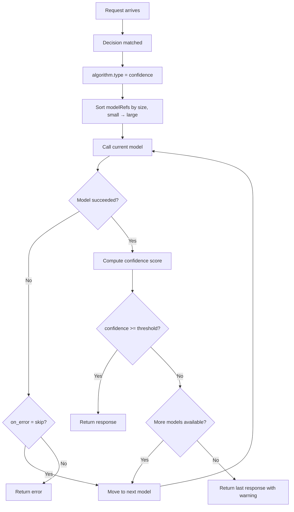

# Confidence

## Overview

`confidence` is a **looper** algorithm that escalates across candidate models until confidence is high enough. It tries smaller/cheaper models first and only escalates to larger models when the response confidence is below a configured threshold.

It aligns to `config/algorithm/looper/confidence.yaml`.

## Key Advantages

- Supports small-to-large escalation instead of a fixed winner.
- Makes stopping conditions explicit and configurable.
- Multiple confidence evaluation methods: `avg_logprob`, `margin`, `hybrid`, `self_verify`, `automix_entailment`.
- Lets one route trade extra latency for higher confidence only when needed.

## Algorithm Principle

The confidence algorithm evaluates model responses using either token-level logprobs or external verification:

1. **Generate**: Call the current model (starting with the smallest).
2. **Evaluate Confidence**:
   - `avg_logprob`: Average log probability across all output tokens. Higher (closer to 0) = more confident.
   - `margin`: Average margin between top-1 and top-2 logprobs per token. Higher = more confident.
   - `hybrid`: Weighted combination of both methods.
   - `self_verify`: Prompt the same model to grade its own answer (returns a JSON `{confidence, reason}`).
   - `automix_entailment`: Delegate verification to an external few-shot entailment server, per arXiv:2310.12963 §3.2. Confidence is `verified_samples / total_samples`.
3. **Decide**:
   - Confidence >= threshold → return response.
   - Confidence < threshold → escalate to next model.
   - On error → skip or fail (configurable).

## Execution Flow



## What Problem Does It Solve?

Some routes should try cheaper candidates first and only pay for escalation when the current answer is not confident enough. `confidence` makes that sequential escalate-on-low-confidence policy explicit in router config instead of burying it in application code.

## When to Use

- A route should escalate across several candidate models.
- Confidence should decide whether to continue to the next model.
- The route should stop as soon as one response is good enough.
- You want to minimize cost by trying cheaper models first.

## Known Limitations

- Each escalation adds latency (sequential model calls).
- Confidence thresholds may need tuning per route type.
- Logprob-based confidence may not always correlate with factual correctness.
- `hybrid` method requires tuning `hybrid_weights` for optimal performance.
- `automix_entailment` requires running a separate verification server (see [`automix_verifier.py`](https://github.com/vllm-project/semantic-router/blob/main/src/training/model_selection/rl_model_selection/automix_verifier.py)) and adds one HTTP round-trip per model call.

## Configuration

```yaml
algorithm:
  type: confidence
  confidence:
    confidence_method: hybrid        # avg_logprob, margin, hybrid, self_verify, automix_entailment
    threshold: 0.72                  # Escalation threshold (method-dependent)
    escalation_order: small_to_large # Escalation direction
    cost_quality_tradeoff: 0.3       # Cost vs quality balance
    token_filter: stop               # Token filtering for confidence
    on_error: skip                   # skip or fail
    hybrid_weights:
      logprob_weight: 0.5            # Weight for avg_logprob in hybrid
      margin_weight: 0.5             # Weight for margin in hybrid
    # Required when confidence_method = automix_entailment
    verifier_server_url: ""          # AutoMix entailment verifier HTTP URL
    verifier_timeout_seconds: 0      # 0 = default (60s)
```

### Parameters

| Parameter | Type | Default | Description |
|-----------|------|---------|-------------|
| `confidence_method` | string | `avg_logprob` | Evaluation method: `avg_logprob`, `margin`, `hybrid`, `self_verify`, or `automix_entailment` |
| `threshold` | float | method-dependent | Escalation threshold (negative for logprob, positive for margin/self_verify/automix_entailment) |
| `escalation_order` | string | `small_to_large` | Escalation direction |
| `cost_quality_tradeoff` | float | `0.3` | Cost vs. quality balance (0–1) |
| `token_filter` | string | — | Token filtering strategy for confidence |
| `on_error` | string | `skip` | Behavior on model call failure: `skip` or `fail` |
| `hybrid_weights.logprob_weight` | float | `0.5` | Weight for avg_logprob in hybrid mode |
| `hybrid_weights.margin_weight` | float | `0.5` | Weight for margin in hybrid mode |
| `verifier_server_url` | string | — | Required when `confidence_method = automix_entailment`. URL of the AutoMix entailment verifier (see [`automix_verifier.py`](https://github.com/vllm-project/semantic-router/blob/main/src/training/model_selection/rl_model_selection/automix_verifier.py)). |
| `verifier_timeout_seconds` | int | `60` | HTTP timeout for verifier calls when `confidence_method = automix_entailment`. |

### `self_verify` vs `automix_entailment`

Both implement the AutoMix paper's cascade idea but differ in how the verification signal is produced:

| Aspect | `self_verify` | `automix_entailment` |
|---|---|---|
| Verifier | The same generation model | A separate few-shot entailment model on its own HTTP server |
| Per-request cost | 1 extra prompt to the generation model | 1 HTTP round-trip; `k` sampled completions in the verifier |
| Faithfulness to arXiv:2310.12963 | Loose (prompt-graded JSON) | Strict (paper §3.2 entailment) |
| Extra infra | None | Requires running [`automix_verifier.py`](https://github.com/vllm-project/semantic-router/blob/main/src/training/model_selection/rl_model_selection/automix_verifier.py) |
| When to pick | Single-deployment setups; no extra server | Production routes where verifier model can be smaller/specialized |
