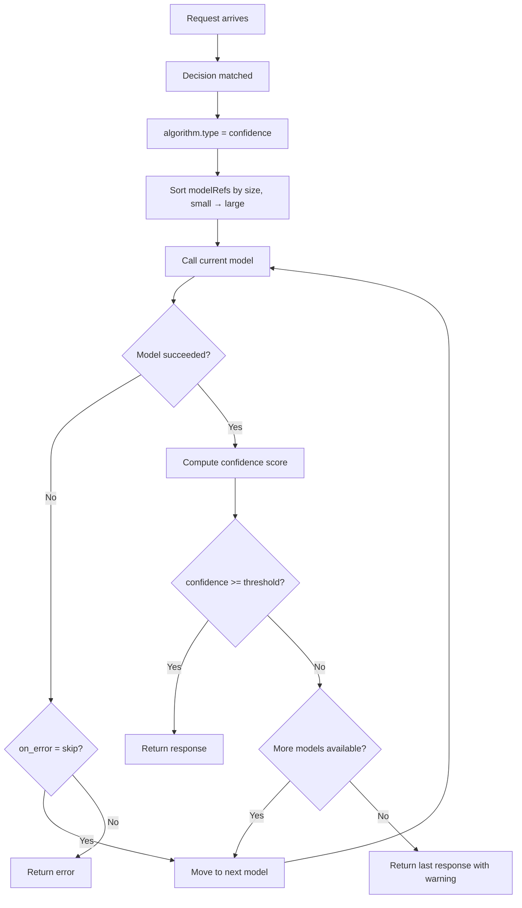

# Confidence

## Overview

`confidence` is a **looper** algorithm that escalates across candidate models until confidence is high enough. It tries smaller/cheaper models first and only escalates to larger models when the response confidence is below a configured threshold.

It aligns to `config/algorithm/looper/confidence.yaml`.

## Key Advantages

- Supports small-to-large escalation instead of a fixed winner.
- Makes stopping conditions explicit and configurable.
- Multiple confidence evaluation methods: `avg_logprob`, `margin`, `hybrid`.
- Lets one route trade extra latency for higher confidence only when needed.

## Algorithm Principle

The confidence algorithm evaluates model responses using token-level logprobs:

1. **Generate**: Call the current model (starting with the smallest).
2. **Evaluate Confidence**:
   - `avg_logprob`: Average log probability across all output tokens. Higher (closer to 0) = more confident.
   - `margin`: Average margin between top-1 and top-2 logprobs per token. Higher = more confident.
   - `hybrid`: Weighted combination of both methods.
3. **Decide**:
   - Confidence >= threshold → return response.
   - Confidence < threshold → escalate to next model.
   - On error → skip or fail (configurable).

## Execution Flow



## When to Use

- A route should escalate across several candidate models.
- Confidence should decide whether to continue to the next model.
- The route should stop as soon as one response is good enough.
- You want to minimize cost by trying cheaper models first.

## Known Limitations

- Each escalation adds latency (sequential model calls).
- Confidence thresholds may need tuning per route type.
- Logprob-based confidence may not always correlate with factual correctness.
- `hybrid` method requires tuning `hybrid_weights` for optimal performance.

## Configuration

```yaml
algorithm:
  type: confidence
  confidence:
    confidence_method: hybrid        # avg_logprob, margin, or hybrid
    threshold: 0.72                  # Escalation threshold (method-dependent)
    escalation_order: small_to_large # Escalation direction
    cost_quality_tradeoff: 0.3       # Cost vs quality balance
    token_filter: stop               # Token filtering for confidence
    on_error: skip                   # skip or fail
    hybrid_weights:
      logprob_weight: 0.5            # Weight for avg_logprob in hybrid
      margin_weight: 0.5             # Weight for margin in hybrid
```

### Parameters

| Parameter | Type | Default | Description |
|-----------|------|---------|-------------|
| `confidence_method` | string | `avg_logprob` | Evaluation method: `avg_logprob`, `margin`, or `hybrid` |
| `threshold` | float | method-dependent | Escalation threshold (negative for logprob, positive for margin) |
| `escalation_order` | string | `small_to_large` | Escalation direction |
| `cost_quality_tradeoff` | float | `0.3` | Cost vs. quality balance (0–1) |
| `token_filter` | string | — | Token filtering strategy for confidence |
| `on_error` | string | `skip` | Behavior on model call failure: `skip` or `fail` |
| `hybrid_weights.logprob_weight` | float | `0.5` | Weight for avg_logprob in hybrid mode |
| `hybrid_weights.margin_weight` | float | `0.5` | Weight for margin in hybrid mode |
