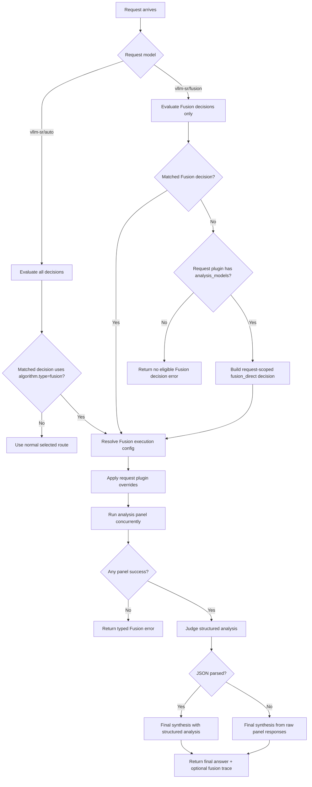

# Fusion

## Overview

`fusion` is a **looper** algorithm for multi-model deliberation. It fans a prompt out to an analysis panel, asks a judge model for structured analysis, and then asks the judge/calling model to produce the final answer.

It aligns to `config/algorithm/looper/fusion.yaml`.

The same runtime also supports a direct Fusion model slug through `global.integrations.looper.fusion.model_names`. The built-in default is `vllm-sr/fusion`; add `openrouter/fusion` there only when you intentionally want an OpenRouter-compatible alias. Direct Fusion is still signal-driven: vLLM-SR evaluates the request against Fusion-capable decisions and then executes the matched decision's judge and panel policy.

## Key Advantages

- Runs analysis models concurrently instead of choosing only one model.
- Produces structured judge analysis before final synthesis.
- Keeps Fusion policy inside vLLM-SR decisions: `vllm-sr/auto` can choose any route, while `vllm-sr/fusion` intelligently chooses among Fusion routes only.
- Lets clients override the judge and analysis panel per request with `plugins[].id = fusion`.
- Degrades on partial panel failures while preserving failed model metadata.

## Algorithm Principle

Fusion executes a three-stage flow:

1. **Panel**: dispatch the original request to the configured analysis models in parallel.
2. **Judge analysis**: ask the judge model for structured JSON covering consensus, contradictions, partial coverage, unique insights, and blind spots.
3. **Final synthesis**: ask the judge/calling model to write the user-facing answer using the panel responses and structured analysis.

## Execution Flow



## What Problem Does It Solve?

Some prompts benefit from multiple independent attempts and a judge pass rather than a single route decision. `fusion` makes that orchestration a router-owned policy, so clients can use it through the same chat completions endpoint. Unlike a fixed provider-side Fusion endpoint, `vllm-sr/fusion` first uses vLLM-SR signals and decision priority to pick the right Fusion route for the request.

## When to Use

- You want a panel of models to inspect the same prompt.
- Contradictions or blind spots matter more than lowest latency.
- A route should return one final answer but retain panel evidence for debugging.
- Clients need an OpenRouter-style request override for panel composition.

## Known Limitations

- Fusion costs multiple model calls per request.
- Streaming is emitted after panel and judge phases complete.
- The first implementation does not include OpenRouter web search/fetch parity.
- Final quality depends on the configured judge/calling model.

## Configuration

Decision-level Fusion:

```yaml
algorithm:
  type: fusion
  fusion:
    model: qwen3-32b
    analysis_models:
      - qwen3-8b
      - qwen3-32b
    max_concurrent: 2
    max_completion_tokens: 512
    temperature: 0.2
    include_analysis: true
    include_intermediate_responses: true
    on_error: skip
    judge_prompt_version: fusion-v1
```

Automatic routing aliases:

```yaml
global:
  router:
    auto_model_names:
      - vllm-sr/auto
      - auto
      - MoM
```

`vllm-sr/auto` evaluates all decisions. If the matched decision uses `algorithm.type=fusion`, the request enters Fusion; otherwise it follows the matched non-Fusion route.

Direct Fusion slug registration:

```yaml
global:
  integrations:
    looper:
      endpoint: http://localhost:8899/v1/chat/completions
      fusion:
        model_names:
          - vllm-sr/fusion
```

`global.integrations.looper.fusion` only registers direct request model names. It does not own route policy, a default route, judge selection, panel selection, concurrency, templates, or error handling.

The judge model, analysis panel, concurrency, templates, and error policy belong under `routing.decisions[].algorithm.fusion`. Direct slug calls evaluate only Fusion-capable decisions, so `vllm-sr/fusion` cannot silently fall back to a normal single-model route. Request-level `plugins[].id = fusion` can still override the decision panel for one call; if no Fusion decision matched, a plugin override with `analysis_models` can provide a request-only panel.

To expose an OpenRouter-compatible alias, opt in explicitly:

```yaml
global:
  integrations:
    looper:
      fusion:
        model_names:
          - vllm-sr/fusion
          - openrouter/fusion
```

Request-level override:

```json
{
  "model": "vllm-sr/fusion",
  "messages": [{"role": "user", "content": "..."}],
  "plugins": [{
    "id": "fusion",
    "model": "qwen3-32b",
    "analysis_models": ["qwen3-8b", "qwen3-32b"]
  }]
}
```

### Parameters

| Parameter | Type | Default | Description |
|-----------|------|---------|-------------|
| `model_names` | list[string] | `["vllm-sr/fusion"]` | Direct request model slugs that trigger Fusion execution |
| `model` | string | first analysis model | Judge/calling model used for analysis and final synthesis |
| `analysis_models` | list[string] | `modelRefs` | Panel models for parallel analysis |
| `max_concurrent` | int | panel size | Maximum concurrent panel calls |
| `max_completion_tokens` | int | request default | Max completion tokens applied to Fusion subrequests |
| `temperature` | float | request default | Temperature applied to Fusion subrequests |
| `include_analysis` | bool | `true` | Include structured judge analysis in the response trace |
| `include_intermediate_responses` | bool | `true` | Include raw panel responses in the response trace |
| `on_error` | string | `skip` | `skip` partial panel failures or `fail` on the first panel error |
| `analysis_template` | string | built-in | Custom judge analysis prompt with `{{original}}` and `{{responses}}` |
| `synthesis_template` | string | built-in | Custom final prompt with `{{original}}`, `{{responses}}`, and `{{analysis}}` |
| `judge_prompt_version` | string | `fusion-v1` | Version marker included in Fusion response trace |
